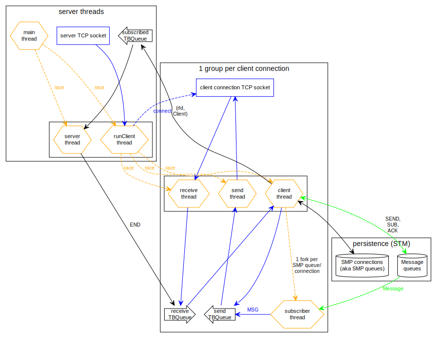
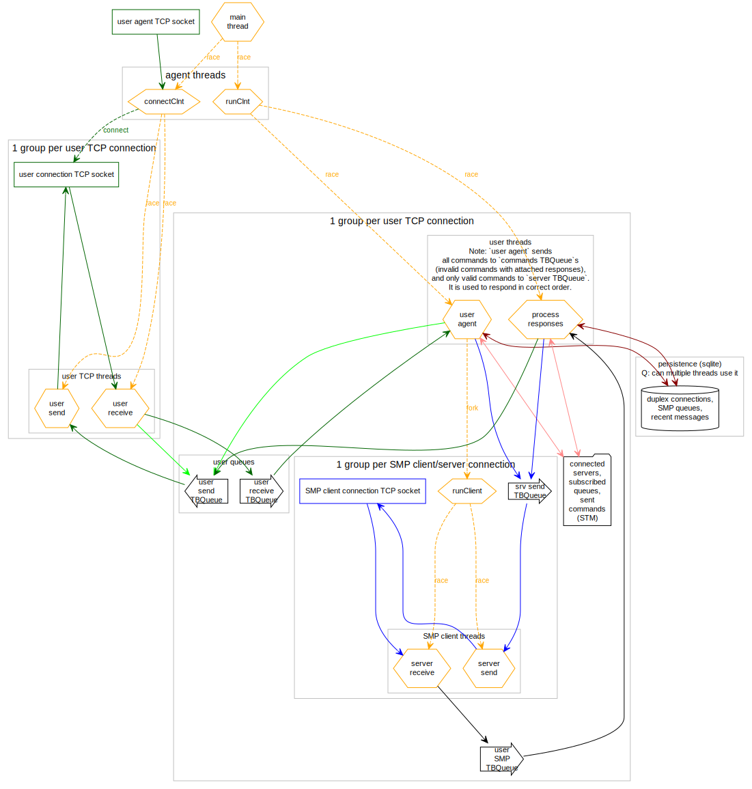

# SimpleXMQ

[](https://github.com/simplex-chat/simplexmq/actions?query=workflow%3Abuild)
[](https://github.com/simplex-chat/simplexmq/releases)

📢 SimpleXMQ v1 is released - with many security, privacy and efficiency improvements, new functionality - see [release notes](https://github.com/simplex-chat/simplexmq/releases/tag/v1.0.0).

**Please note**: v1 is not backwards compatible, but it has the version negotiation built into all protocol layers for forwards compatibility of this version and backwards compatibility of the future versions, that will be backwards compatible for at least two versions back.

If you have a server deployed please deploy a new server to a new host and retire the previous version once it is no longer used.

## Message broker for unidirectional (simplex) queues

SimpleXMQ is a message broker for managing message queues and sending messages over public network. It consists of SMP server, SMP client library and SMP agent that implement [SMP protocol](./protocol/simplex-messaging.md) for client-server communication and [SMP agent protocol](./protocol/agent-protocol.md) to manage duplex connections via simplex queues on multiple SMP servers.

SMP protocol is inspired by [Redis serialization protocol](https://redis.io/topics/protocol), but it is much simpler - it currently has only 10 client commands and 8 server responses.

SimpleXMQ is implemented in Haskell - it benefits from robust software transactional memory (STM) and concurrency primitives that Haskell provides.

## SimpleXMQ roadmap

- SimpleX service protocol and application template - to enable users building services and chat bots that work over SimpleX protocol stack. The first such service will be a notification service for a mobile app.
- SMP queue redundancy and rotation in SMP agent connections.
- SMP agents synchronization to share connections and messages between multiple agents (it would allow using multiple devices for [simplex-chat](https://github.com/simplex-chat/simplex-chat)).

## Components

### SMP server

[SMP server](./apps/smp-server/Main.hs) can be run on any Linux distribution, including low power/low memory devices. OpenSSL library is required for initialization.

To initialize the server use `smp-server init -n <fqdn>` (or `smp-server init --ip <ip>` for IP based address) command - it will generate keys and certificates for TLS transport. The fingerprint of offline certificate is used as part of the server address to protect client/server connection against man-in-the-middle attacks: `smp://<fingerprint>@<hostname>[:5223]`.

SMP server uses in-memory persistence with an optional append-only log of created queues that allows to re-start the server without losing the connections. This log is compacted on every server restart, permanently removing suspended and removed queues.

To enable store log, initialize server using `smp-server -l` command, or modify `smp-server.ini` created during initialization (uncomment `enable: on` option in the store log section). Use `smp-server --help` for other usage tips.

Starting from version 2.3.0, when store log is enabled, the server would also enable saving undelivered messages on exit and restoring them on start. This can be disabled via a separate setting `restore_messages` in `smp-server.ini` file. Saving messages would only work if the server is stopped with SIGINT signal (keyboard interrupt), if it is stopped with SIGTERM signal the messages would not be saved.

> **Please note:** On initialization SMP server creates a chain of two certificates: a self-signed CA certificate ("offline") and a server certificate used for TLS handshake ("online"). **You should store CA certificate private key securely and delete it from the server. If server TLS credential is compromised this key can be used to sign a new one, keeping the same server identity and established connections.** CA private key location by default is `/etc/opt/simplex/ca.key`.

SMP server implements [SMP protocol](./protocol/simplex-messaging.md).

#### Running SMP server on MacOS

SMP server requires OpenSSL library for initialization. On MacOS OpenSSL library may be replaced with LibreSSL, which doesn't support required algorithms. Before initializing SMP server verify you have OpenSSL installed:

```sh
openssl version
```

If it says "LibreSSL", please install original OpenSSL:

```sh
brew update
brew install openssl
echo 'PATH="/opt/homebrew/opt/openssl@3/bin:$PATH"' >> ~/.zprofile # or follow whatever instructions brew suggests
. ~/.zprofile # or restart your terminal to start a new session
```

Now `openssl version` should be saying "OpenSSL". You can now run `smp-server init` to initialize your SMP server.

### SMP client library

[SMP client](./src/Simplex/Messaging/Client.hs) is a Haskell library to connect to SMP servers that allows to:

- execute commands with a functional API.
- receive messages and other notifications via STM queue.
- automatically send keep-alive commands.

### SMP agent

[SMP agent library](./src/Simplex/Messaging/Agent.hs) can be used to run SMP agent as part of another application and to communicate with the agent via STM queues, without serializing and parsing commands and responses.

Haskell type [ACommand](./src/Simplex/Messaging/Agent/Protocol.hs) represents SMP agent protocol to communicate via STM queues.

See [simplex-chat](https://github.com/simplex-chat/simplex-chat) terminal UI for the example of integrating SMP agent into another application.

[SMP agent executable](./apps/smp-agent/Main.hs) can be used to run a standalone SMP agent process that implements plaintext [SMP agent protocol](./protocol/agent-protocol.md) via TCP port 5224, so it can be used via telnet. It can be deployed in private networks to share access to the connections between multiple applications and services.

## Using SMP server and SMP agent

You can either run your own SMP server locally or deploy using [Linode StackScript](https://cloud.linode.com/stackscripts/748014), or try local SMP agent with the deployed servers:

`smp://u2dS9sG8nMNURyZwqASV4yROM28Er0luVTx5X1CsMrU=@smp4.simplex.im`

`smp://hpq7_4gGJiilmz5Rf-CswuU5kZGkm_zOIooSw6yALRg=@smp5.simplex.im`

`smp://PQUV2eL0t7OStZOoAsPEV2QYWt4-xilbakvGUGOItUo=@smp6.simplex.im`

It's the easiest to try SMP agent via a prototype [simplex-chat](https://github.com/simplex-chat/simplex-chat) terminal UI.

## Deploy SMP/XFTP servers on Linux

You can run your SMP/XFTP server as a Linux process, optionally using a service manager for booting and restarts.

Notice that `smp-server` and `xftp-server` requires `openssl` as run-time dependency (it is used to generate server certificates during initialization). Install it with your packet manager:

```sh
# For Ubuntu
apt update && apt install openssl
```

### Install binaries

#### Using Docker

On Linux, you can deploy smp and xftp server using Docker. This will download image from [Docker Hub](https://hub.docker.com/r/simplexchat).

1. Create directories for persistent Docker configuration:

   ```sh
   mkdir -p $HOME/simplex/{xftp,smp}/{config,logs} && mkdir -p $HOME/simplex/xftp/files
   ```

2. Run your Docker container.

   - `smp-server`
   
     You must change **your_ip_or_domain**. `-e "pass=password"` is optional variable to password-protect your `smp` server:
     ```sh
     docker run -d \
         -e "ADDR=your_ip_or_domain" \
         -e "PASS=password" \
         -p 5223:5223 \
         -v $HOME/simplex/smp/config:/etc/opt/simplex:z \
         -v $HOME/simplex/smp/logs:/var/opt/simplex:z \
         simplexchat/smp-server:latest
     ```

   - `xftp-server`
   
     You must change **your_ip_or_domain** and **maximum_storage**.
     ```sh
     docker run -d \
         -e "ADDR=your_ip_or_domain" \
         -e "QUOTA=maximum_storage" \
         -p 443:443 \
         -v $HOME/simplex/xftp/config:/etc/opt/simplex-xftp:z \
         -v $HOME/simplex/xftp/logs:/var/opt/simplex-xftp:z \
         -v $HOME/simplex/xftp/files:/srv/xftp:z \
         simplexchat/xftp-server:latest
     ```

#### Using installation script

**Please note** that currently, only Ubuntu distribution is supported.

You can install and setup servers automatically using our script:

```sh
curl --proto '=https' --tlsv1.2 -sSf https://raw.githubusercontent.com/simplex-chat/simplexmq/stable/install.sh -o simplex-server-install.sh \
&& if echo 'b8cf2be103f21f9461d9a500bcd3db06ab7d01d68871b07f4bd245195cbead1d simplex-server-install.sh' | sha256sum -c; then chmod +x ./simplex-server-install.sh && ./simplex-server-install.sh; rm ./simplex-server-install.sh; else echo "SHA-256 checksum is incorrect!" && rm ./simplex-server-install.sh; fi
```

### Build from source

#### Using Docker

> **Please note:** to build the app use source code from [stable branch](https://github.com/simplex-chat/simplexmq/tree/stable).

On Linux, you can build smp server using Docker.

1. Build your images:

   ```sh
   git clone https://github.com/simplex-chat/simplexmq
   cd simplexmq
   git checkout stable
   DOCKER_BUILDKIT=1 docker build -t local/smp-server --build-arg APP="smp-server" --build-arg APP_PORT="5223" . # For xmp-server
   DOCKER_BUILDKIT=1 docker build -t local/xftp-server --build-arg APP="xftp-server" --build-arg APP_PORT="443" . # For xftp-server
   ```

2. Create directories for persistent Docker configuration:

   ```sh
   mkdir -p $HOME/simplex/{xftp,smp}/{config,logs} && mkdir -p $HOME/simplex/xftp/files
   ```

3. Run your Docker container.

   - `smp-server`
   
     You must change **your_ip_or_domain**. `-e "pass=password"` is optional variable to password-protect your `smp` server:
     ```sh
     docker run -d \
         -e "ADDR=your_ip_or_domain" \
         -e "PASS=password" \
         -p 5223:5223 \
         -v $HOME/simplex/smp/config:/etc/opt/simplex:z \
         -v $HOME/simplex/smp/logs:/var/opt/simplex:z \
         simplexchat/smp-server:latest
     ```

   - `xftp-server`
   
     You must change **your_ip_or_domain** and **maximum_storage**.
     ```sh
     docker run -d \
         -e "ADDR=your_ip_or_domain" \
         -e "QUOTA=maximum_storage" \
         -p 443:443 \
         -v $HOME/simplex/xftp/config:/etc/opt/simplex-xftp:z \
         -v $HOME/simplex/xftp/logs:/var/opt/simplex-xftp:z \
         -v $HOME/simplex/xftp/files:/srv/xftp:z \
         simplexchat/xftp-server:latest
     ```

#### Using your distribution

1. Install [Haskell GHCup](https://www.haskell.org/ghcup/), GHC 8.10.7 and cabal:

   ```sh
   curl --proto '=https' --tlsv1.2 -sSf https://get-ghcup.haskell.org | sh
   ghcup install ghc 8.10.7
   ghcup install cabal
   ghcup set ghc 8.10.7
   ghcup set cabal
   ```

2. Build the project:

   ```sh
   git clone https://github.com/simplex-chat/simplexmq
   cd simplexmq
   git checkout stable
   # On Ubuntu. Depending on your distribution, use your package manager to determine package names.
   apt-get update && apt-get install -y build-essential libgmp3-dev zlib1g-dev
   cabal update
   cabal install
   ```

- Initialize SMP server with `smp-server init [-l] -n <fqdn>` or `smp-server init [-l] --ip <ip>` - depending on how you initialize it, either FQDN or IP will be used for server's address.

- Run `smp-server start` to start SMP server, or you can configure a service manager to run it as a service.

- Optionally, `smp-server` can be setup for having an onion address in `tor` network. See: [`scripts/tor`](./scripts/tor/). In this case, the server address can have both public and onion hostname pointing to the same server, to allow two people connect when only one of them is using Tor. The server address would be: `smp://<fingerprint>@<public_hostname>,<onion_hostname>`

See [this section](#smp-server) for more information. Run `smp-server -h` and `smp-server init -h` for explanation of commands and options.

[](https://cloud.linode.com/stackscripts/748014)

## Deploy SMP server on Linode

\* You can use free credit Linode offers when [creating a new account](https://www.linode.com/) to deploy an SMP server.

Deployment on Linode is performed via StackScripts, which serve as recipes for Linode instances, also called Linodes. To deploy SMP server on Linode:

- Create a Linode account or login with an already existing one.
- Open [SMP server StackScript](https://cloud.linode.com/stackscripts/748014) and click "Deploy New Linode".
- You can optionally configure the following parameters:
  - SMP Server store log flag for queue persistence on server restart, recommended.
  - [Linode API token](https://www.linode.com/docs/guides/getting-started-with-the-linode-api#get-an-access-token) to attach server address etc. as tags to Linode and to add A record to your 2nd level domain (e.g. `example.com` [domain should be created](https://cloud.linode.com/domains/create) in your account prior to deployment). The API token access scopes:
    - read/write for "linodes"
    - read/write for "domains"
  - Domain name to use instead of Linode IP address, e.g. `smp1.example.com`.
- Choose the region and plan, Shared CPU Nanode with 1Gb is sufficient.
- Provide ssh key to be able to connect to your Linode via ssh. If you haven't provided a Linode API token this step is required to login to your Linode and get the server's fingerprint either from the welcome message or from the file `/etc/opt/simplex/fingerprint` after server starts. See [Linode's guide on ssh](https://www.linode.com/docs/guides/use-public-key-authentication-with-ssh/) .
- Deploy your Linode. After it starts wait for SMP server to start and for tags to appear (if a Linode API token was provided). It may take up to 5 minutes depending on the connection speed on the Linode. Connecting Linode IP address to provided domain name may take some additional time.
- Get `address` and `fingerprint` either from Linode tags (click on a tag and copy it's value from the browser search panel) or via ssh.
- Great, your own SMP server is ready! If you provided FQDN use `smp://<fingerprint>@<fqdn>` as SMP server address in the client, otherwise use `smp://<fingerprint>@<ip_address>`.

Please submit an [issue](https://github.com/simplex-chat/simplexmq/issues) if any problems occur.

[](https://marketplace.digitalocean.com/apps/simplex-server)

## Deploy SMP server on DigitalOcean

> 🚧 DigitalOcean snapshot is currently not up to date, it will soon be updated 🏗️

\* When creating a DigitalOcean account you can use [this link](https://try.digitalocean.com/freetrialoffer/) to get free credit. (You would still be required either to provide your credit card details or make a confirmation pre-payment with PayPal)

To deploy SMP server use [SimpleX Server 1-click app](https://marketplace.digitalocean.com/apps/simplex-server) from DigitalOcean marketplace:

- Create a DigitalOcean account or login with an already existing one.
- Click 'Create SimpleX server Droplet' button.
- Choose the region and plan according to your requirements (Basic plan should be sufficient).
- Finalize Droplet creation.
- Open "Console" on your Droplet management page to get SMP server fingerprint - either from the welcome message or from `/etc/opt/simplex/fingerprint`. Alternatively you can manually SSH to created Droplet, see [DigitalOcean instruction](https://docs.digitalocean.com/products/droplets/how-to/connect-with-ssh/).
- Great, your own SMP server is ready! Use `smp://<fingerprint>@<ip_address>` as SMP server address in the client.

Please submit an [issue](https://github.com/simplex-chat/simplexmq/issues) if any problems occur.

> **Please note:** SMP server uses server address as a Common Name for server certificate generated during initialization. If you would like your server address to be FQDN instead of IP address, you can log in to your Droplet and run the commands below to re-initialize the server. Alternatively you can use [Linode StackScript](https://cloud.linode.com/stackscripts/748014) which allows this parameterization.

```sh
smp-server delete
smp-server init [-l] -n <fqdn>
```

## SMP server design



## SMP agent design



## License

[AGPL v3](./LICENSE)
