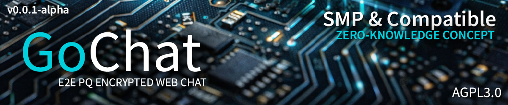

<p align="center">
  
</p>

<h1 align="center">GoChat</h1>

<p align="center">
  <strong>The world's first browser-native encrypted support messenger using the SimpleX Messaging Protocol.</strong><br>
  No app install. No registration. No user IDs. End-to-end encrypted from the first message.
</p>

<p align="center">
  <a href="LICENSE"></a>
  <a href="#status"></a>
  <a href="#upstream"></a>
  <a href="https://github.com/saschadaemgen/SimpleGo"></a>
  <a href="docs/PROTOCOL.md"></a>
</p>

---

GoChat is an experimental browser-native support messenger built on top of [SimpleXMQ](https://github.com/simplex-chat/simplexmq) by [SimpleX Chat](https://simplex.chat/). It is a sub-project of [SimpleGo](https://github.com/saschadaemgen/SimpleGo) - the world's first native C implementation of the SimpleX Messaging Protocol for encrypted communication on dedicated hardware.

Based on the `ep/smp-web-spike` branch by [@epoberezkin](https://github.com/epoberezkin) (SimpleX founder), which introduces browser-native SMP protocol support via WebSocket.

**No browser-native SMP client exists anywhere** - not from SimpleX, not from the community, not from any third party. No open-source support chat tool (Chatwoot, Rocket.Chat, Crisp, Intercom) offers E2E encryption on the customer-facing widget. GoChat aims to be first on both counts.

---

## What we're building

A support chat that lives directly on the SimpleGo website. Visitors open a chat panel in the browser and talk to our support team through the SimpleX protocol - the same protocol that powers SimpleGo's hardware encryption stack.

```
Website visitor (browser)           SMP Relay Server            Support team
        |                                 |                          |
        |--- WebSocket (wss://443) ------>|                          |
        |    E2E encrypted message        |--- SMP queue relay ----->|
        |                                 |                          |  (SimpleX App)
        |<-- WebSocket (wss://443) -------|<-- SMP queue relay ------|
        |    E2E encrypted reply          |                          |
```

The relay server sees only encrypted blobs in anonymous queues. No user IDs, no metadata, no way to link sender and receiver.

---

## Why this approach

| Traditional support chat | GoChat web messenger |
|:-------------------------|:---------------------|
| User creates account | No account needed |
| Chat provider reads messages | End-to-end encrypted, nobody can read |
| Provider stores chat history | History only on user's device |
| Single provider dependency | Self-hosted relay, no lock-in |
| User tracked across sessions | No user identifiers of any kind |
| No existing tool has widget E2E | **First E2E encrypted support widget** |

---

## Security model

GoChat is transparent about both its strengths and the inherent limitations of browser-based encryption.

**Strengths:**
- E2E encryption using audited libraries (@noble/curves - 6 security audits, used by Proton Mail and MetaMask)
- X25519/Ed25519 natively supported in all major browsers since 2025
- Crypto operations isolated in a dedicated Web Worker
- Strict Content Security Policy (no eval, no inline scripts)
- Subresource Integrity on all external scripts
- Minimal dependencies to reduce supply chain attack surface

**Honest limitations:**
- The server delivers the code - unlike native apps, a compromised web server could serve modified code. We mitigate with reproducible builds and SRI hashes.
- XSS is the existential threat to browser E2E encryption. The Matrix "Nebuchadnezzar" vulnerabilities (2022) demonstrated this attack class in practice.
- SMP's self-signed certificate model doesn't work in browsers. We use Let's Encrypt for TLS while SMP's own DH encryption layer provides security independent of the CA chain.

Full security analysis: [docs/RESEARCH.md](docs/RESEARCH.md)

---

## Architecture

```
+---------------------------------------------------------------+
|                      BROWSER CLIENT                           |
|    Chat UI  /  Message Store  /  Encrypted Key Storage        |
+---------------------------------------------------------------+
|                      WEB WORKER                               |
|    Crypto Operations (isolated from main thread XSS)          |
+---------------------------------------------------------------+
|                      SHARED WORKER                            |
|    WebSocket Pool  /  Reconnection  /  Message Queue          |
+---------------------------------------------------------------+
|                      GoChat LIBRARY                           |
|    SMP Commands  /  E2E Encryption  /  @noble/curves          |
+---------------------------------------------------------------+
|                      SMP RELAY SERVER                         |
|    Queue Management  /  WebSocket + TLS on port 443           |
+---------------------------------------------------------------+
|                      SIMPLEX APP                              |
|         Support team (Desktop / Mobile / SimpleGo HW)         |
+---------------------------------------------------------------+
```

### Multi-user support

Each website visitor connects via a permanent SimpleX contact address and receives their own isolated queue pair. The support team sees each visitor as a separate contact. 10, 50, or 100 concurrent conversations - the SMP server handles queue isolation natively.

---

## What exists vs. what we build

### Done (from upstream spike + xftp-web)

| Component | Source | Description |
|:----------|:-------|:------------|
| SMP server WebSocket support | PR #1738 | Browser WebSocket and native TLS on same port via SNI |
| Binary encoding/decoding | xftp-web | Full SMP wire format in TypeScript |
| Crypto stack | xftp-web | X25519 DH, NaCl secretbox, SHA-256, identity verification |
| HTTP/2 transport + handshake | xftp-web | Server connection with retry and reconnect |
| LGET/LNK commands | smp-web spike | Link retrieval for connection setup |
| Transmission framing | xftp-web | Block encoding/decoding with session auth |

### To do (our work)

| Component | Task IDs | Description |
|:----------|:---------|:------------|
| WebSocket transport client | WS-1 to WS-4 | Browser-side WebSocket client + SharedWorker pool |
| SMP commands | CMD-1 to CMD-5 | NEW, SUB, SEND, MSG, ACK, KEY, DEL |
| Connection flow | CONN-1 to CONN-4 | Contact address parsing, queue pair setup, state machine |
| E2E encryption | E2E-1 to E2E-3 | NaCl box MVP via @noble/ciphers, key storage, later Double Ratchet |
| Security hardening | SEC-1 to SEC-5 | CSP, SRI, Web Worker isolation, TLS strategy |
| Chat UI | UI-1 to UI-8 | Intercom-level panel, animations, encryption badge, accessibility |
| Deployment | OPS-1 to OPS-3 | SMP server, TLS, contact address, monitoring |

Full task breakdown: [docs/PROTOCOL.md](docs/PROTOCOL.md)

---

## Season-based development

We develop in seasons - each with a clear goal, defined scope, and a protocol document recording successes, failures, and learnings. Code is written by Claude Code, directed and reviewed by Sascha, planned by Prinzessin Mausi.

| Season | Focus | Status |
|:-------|:------|:-------|
| **S1** | Planning, documentation, and research | Current |
| **S2** | WebSocket transport client | Upcoming |
| **S3** | SMP commands | Planned |
| **S4** | Connection flow (browser to SimpleX app) | Planned |
| **S5** | End-to-end encryption (@noble/curves) | Planned |
| **S6** | Chat UI (Intercom-level design) | Planned |
| **S7** | SimpleGo website integration | Planned |
| **S8** | Production hardening + security review | Planned |

**Critical path:** S1 - S2 - S3 - S4 - S7 - S8  
**Parallel track:** S5 (encryption) and S6 (UI) can run alongside S4

Full season plan: [docs/seasons/SEASON-PLAN.md](docs/seasons/SEASON-PLAN.md)

---

## Repository structure

```
GoChat/
+-- .github/assets/                 # Banner and images
+-- smp-web/                        # SMP browser client (spike + our work)
|   +-- src/
|       +-- index.ts                # Re-exports encoding primitives
|       +-- protocol.ts             # SMP transmission encode/decode, LGET/LNK
+-- xftp-web/                       # Shared infrastructure (upstream)
|   +-- src/
|       +-- client.ts               # HTTP/2 transport, handshake, retry
|       +-- protocol/               # Encoding, transmission, handshake
|       +-- crypto/                 # X25519, NaCl, SHA-256, identity
+-- protocol/                       # SMP protocol specification (upstream reference)
+-- docs/
|   +-- PROTOCOL.md                 # Main technical protocol document
|   +-- RESEARCH.md                 # Browser crypto, security, and design research
|   +-- seasons/
|       +-- SEASON-PLAN.md          # Season overview and workflow
|       +-- SEASON-01-planning.md   # Season 1 learnings
+-- LICENSE                         # AGPL-3.0
+-- README.md
```

---

## Getting started

**Clone and switch to the working branch:**

```powershell
git clone https://github.com/saschadaemgen/GoChat.git
cd GoChat
git checkout feat/simplego-support-chat
```

**Explore the spike:**

```powershell
cat smp-web/src/protocol.ts         # SMP protocol in TypeScript
cat smp-web/src/index.ts            # Shared encoding primitives
cat xftp-web/src/client.ts          # Transport reference implementation
```

---

## Upstream

This repository is a fork of [simplex-chat/simplexmq](https://github.com/simplex-chat/simplexmq) (AGPL-3.0).

| | |
|:--|:--|
| Upstream repository | [simplex-chat/simplexmq](https://github.com/simplex-chat/simplexmq) |
| Base branch | `ep/smp-web-spike` |
| Key upstream PR | [#1738 - WebSocket on SMP server port](https://github.com/simplex-chat/simplexmq/pull/1738) |
| Upstream license | AGPL-3.0 |
| SimpleX website | [simplex.chat](https://simplex.chat/) |

We intend to contribute our WebSocket transport client and SMP command implementations back to the upstream project.

---

## SimpleGo ecosystem

| Project | Description | Repository |
|:--------|:------------|:-----------|
| **SimpleGo** | Native C implementation of SimpleX protocol on ESP32-S3 hardware | [SimpleGo](https://github.com/saschadaemgen/SimpleGo) |
| **GoRelay** | Self-hosted SimpleX relay server infrastructure | GoRelay |
| **GoChat** | Browser-native encrypted web support messenger (this project) | [GoChat](https://github.com/saschadaemgen/GoChat) |

---

## Status

Season 1 (planning, documentation, and research) is nearing completion. No functional chat code yet - first working code expected in Season 2.

| Component | Status |
|:----------|:-------|
| Technical protocol document | Done |
| Repository fork and branch setup | Done |
| Season plan and workflow | Done |
| Deep research (security, design, crypto) | Done |
| WebSocket transport client | Season 2 |
| SMP command implementation | Season 3 |
| Browser-to-app connection | Season 4 |
| End-to-end encryption | Season 5 |
| Chat UI (Intercom-level) | Season 6 |
| Website integration | Season 7 |
| Production deployment + security review | Season 8 |

---

## Documentation

| Resource | Link |
|:---------|:-----|
| Technical protocol | [docs/PROTOCOL.md](docs/PROTOCOL.md) |
| Research findings | [docs/RESEARCH.md](docs/RESEARCH.md) |
| Season plan | [docs/seasons/SEASON-PLAN.md](docs/seasons/SEASON-PLAN.md) |
| SimpleGo main project | [github.com/saschadaemgen/SimpleGo](https://github.com/saschadaemgen/SimpleGo) |
| SimpleGo documentation | [wiki.simplego.dev](https://wiki.simplego.dev) |
| SimpleX Chat | [simplex.chat](https://simplex.chat/) |
| SimpleX protocol specification | [SMP protocol](https://github.com/simplex-chat/simplexmq/blob/stable/protocol/simplex-messaging.md) |

---

## Commit convention

All commits follow [Conventional Commits](https://www.conventionalcommits.org/) format:

```
type(scope): description
```

| Type | Usage |
|:-----|:------|
| `feat` | New feature or functionality |
| `fix` | Bug fix |
| `docs` | Documentation changes |
| `chore` | Maintenance, cleanup, dependencies |
| `refactor` | Code restructuring without behavior change |
| `test` | Adding or updating tests |

Commits are made as granular as possible - each with its own descriptive title and professional commit message. Multiple files share a commit only when they are logically inseparable. Each season's protocol document lists all commits with hashes and descriptions.

---

## License

| Component | License |
|:----------|:--------|
| GoChat (this repository) | [AGPL-3.0](LICENSE) |
| Upstream SimpleXMQ | [AGPL-3.0](https://github.com/simplex-chat/simplexmq/blob/stable/LICENSE) |
| SimpleGo parent project | [AGPL-3.0](https://github.com/saschadaemgen/SimpleGo/blob/main/LICENSE) |

This project is a derivative work of SimpleXMQ by SimpleX Chat Ltd, licensed under AGPL-3.0. All modifications and additions are released under the same license. Source code for all server-side components is available in this repository as required by AGPL-3.0.

## Acknowledgments

[SimpleX Chat](https://simplex.chat/) (SimpleX Messaging Protocol and simplexmq reference implementation) - [Evgeny Poberezkin](https://github.com/epoberezkin) (smp-web spike and WebSocket server support) - [@noble/hashes](https://github.com/paulmillr/noble-hashes) (SHA-256, SHA-512 for browser crypto) - [@noble/curves](https://github.com/paulmillr/noble-curves) (Ed25519, X25519 for key exchange) - [@noble/ciphers](https://github.com/paulmillr/noble-ciphers) (XSalsa20-Poly1305, AES-256-GCM for encryption)

---

<p align="center">
  <i>GoChat is a sub-project of <a href="https://github.com/saschadaemgen/SimpleGo">SimpleGo</a> by IT and More Systems, Recklinghausen, Germany.</i><br>
  <i>Built on top of <a href="https://github.com/simplex-chat/simplexmq">SimpleXMQ</a> (AGPL-3.0) by <a href="https://simplex.chat/">SimpleX Chat</a>.</i><br>
  <i>Not affiliated with or endorsed by SimpleX Chat Ltd.</i>
</p>

<p align="center">
  <strong>GoChat - Encrypted support chat. No app, no account, no compromises.</strong>
</p>
