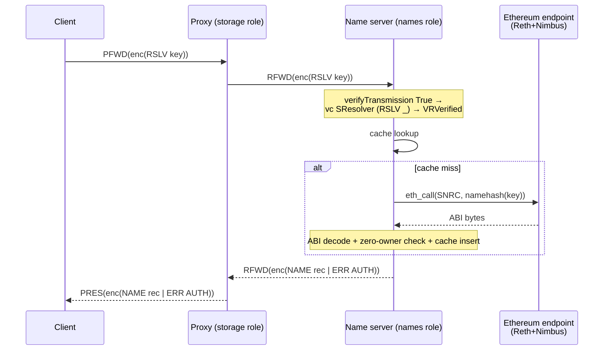
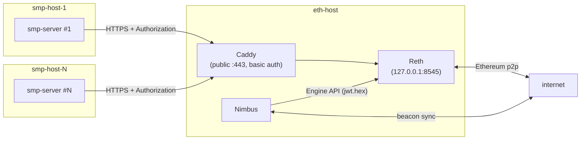

# Server: SMP support for public namespaces

> **⚠ Implementation diverged from this plan.** Six audit rounds reshaped the
> original design. **The shipped code differs in several load-bearing ways:**
>
> - **Wire format**: `NameRecord` is now JSON (aeson), not the custom binary
>   ABNF this plan documents. See `protocol/simplex-messaging.md` §Resolver
>   commands and `src/Simplex/Messaging/Protocol.hs` ToJSON/FromJSON instances.
> - **No cache**: the TTL + FIFO + byte-cap cache, in-flight coalescing,
>   `psqueues` dep, and `cache_*` INI keys are all gone. Every RSLV becomes
>   one `eth_call` bounded by `rpcMaxConcurrency` + `rpcTimeoutMs`. See
>   `src/Simplex/Messaging/Server/Names.hs`.
> - **No `allow_dangerous_colocation` flag**: the proxy co-location guard
>   was demoted to a startup `logWarn` (the flag was always-on because
>   `[PROXY]` has no enable toggle).
> - **Module shape**: `Names/Resolver.hs` was merged into `Names.hs`; only
>   `Names/Eth/RPC.hs` and `Names/Eth/SNRC.hs` remain as separate modules.
> - **Test list**: of the 15 specs listed below, ~7 shipped; the rest were
>   either superseded by the cache removal (CacheSpec) or deferred
>   (ForwardedRslvSpec, MockRpcSpec, StartupGuardSpec, UrlValidationSpec,
>   EipChecksumSpec).
>
> Sources of truth: `CHANGELOG.md` (release notes),
> `protocol/simplex-messaging.md` §Resolver commands (wire format),
> `src/Simplex/Messaging/Server/Names*.hs` (implementation). This file is
> retained as historical context; do not treat it as a specification.

Implementation plan for Part 2 of [RFC 2026-05-21-public-namespaces](https://github.com/simplex-chat/simplex-chat/blob/ep/namespace/docs/rfcs/2026-05-21-public-namespaces.md). Adds a forwarded-only `RSLV <lookup_key>` SMP command that returns `NAME <NameRecord>` read from the SNRC contract via a Reth+Nimbus JSON-RPC endpoint. Smp-server becomes name-capable by `[NAMES] enable: on`.

Out of scope: `Simplex.Messaging.Client` API, agent-side resolution flow, `ServerRoles.names` in the agent, default-router list, reverse resolution, multicoin/text records, state proofs.

## Architecture



RSLV is **forwarded-only** — direct RSLV is rejected `CMD PROHIBITED`. This preserves the RFC's two-server resolution: the name server sees the lookup key but never the client's IP, session, or identity.

## Protocol

Shared library: `src/Simplex/Messaging/Protocol.hs` and `src/Simplex/Messaging/Transport.hs`.

**Version.** `Transport.hs:226`: `namesSMPVersion = VersionSMP 20`. Bump `currentClientSMPRelayVersion`, `currentServerSMPRelayVersion`, `proxiedSMPRelayVersion` to 20. Pre-v20 binaries lack the `RSLV_` tag; v20 binaries with sessions negotiated at v < 20 reject `RSLV_` at the parameter parser. The proxied-version bump 18 → 20 is safe (v19's `RecipientService`/`NotifierService` aren't in the forwarded whitelist; v18's `BLOCKED info` is already version-branched at `Protocol.hs:1943`).

**Party kind.** Append `Resolver` to `Party` (line 335); add `SResolver` (line 349), `TestEquality` clause (line 361), `PartyI Resolver` (line 394). `queueParty SResolver = Nothing` (falls through line 412). `partyClientRole SResolver = Nothing`.

**`RSLV` command.**

```haskell
RSLV :: LookupKey -> Command Resolver
newtype LookupKey = LookupKey ByteString

instance Encoding LookupKey where
  smpEncode (LookupKey s) = smpEncode s
  smpP = do
    n <- lenP
    when (n > 64) $ fail "LookupKey too large"
    LookupKey <$> A.take n
```

Name-syntax validation is client-side per RFC; the server treats the key as opaque bytes. Tag `"RSLV"`, version guard inside `protocolP v (CT SResolver RSLV_)`: `| v >= namesSMPVersion -> Cmd SResolver . RSLV <$> _smpP`.

**Testnet/mainnet selector**: how the `#testnet:name` namespace appears in `LookupKey` bytes is determined by the SNRC contract (Part 1) — confirm with Part 1 before merging.

**`NAME` response.**

```haskell
NAME :: NameRecord -> BrokerMsg
```

Tag `"NAME"`. Symmetric version guards on encode (in `encodeProtocol v`) and decode (in `protocolP v NAME_`): `| v >= namesSMPVersion -> ...`. `NameRecord` has **no `Encoding` typeclass instance** — the typeclass cannot version-branch. Use top-level helpers `nameRecBytes :: VersionSMP -> NameRecord -> ByteString` and `parseNameRec :: VersionSMP -> Parser NameRecord`, mirroring the `IDS QIK` precedent at `Protocol.hs:1912–1979`.

**`NameRecord` schema and wire layout.**

```haskell
data NameRecord = NameRecord
  { nrDisplayName  :: Text                    -- ≤255 bytes UTF-8
  , nrOwner        :: NameOwner               -- 20 raw bytes
  , nrChannelLinks :: [NameLink]
  , nrContactLinks :: [NameLink]
  , nrAdminAddress :: Maybe Text
  , nrAdminEmail   :: Maybe Text
  , nrExpiry       :: Int64                   -- Unix seconds, ≥ 0
  , nrIsTest       :: Bool
  }

newtype NameOwner = NameOwner ByteString   -- bare ctor NOT exported; smart ctor enforces length 20
newtype NameLink  = NameLink  Text         -- bare ctor NOT exported; smart ctor enforces ≤1024 bytes

unNameOwner :: NameOwner -> ByteString
unNameOwner (NameOwner bs) = bs

unNameLink :: NameLink -> Text
unNameLink (NameLink t) = t
```

Field additions are gated by future SMP version bumps (matching the `IDS QIK` precedent at `Protocol.hs:1912–1979`) — no separate record-version field.

| Field | Encoding | Max bytes |
|---|---|---|
| `nrDisplayName` | 1-byte length prefix + UTF-8 | 1 + 255 |
| `nrOwner` | 20 raw bytes, no prefix | 20 |
| `nrChannelLinks`, `nrContactLinks` | 1-byte count + per-element (Word16 BE len + UTF-8); combined cap **8 entries** across both lists | 1 + Σ(2 + ≤1024) |
| `nrAdminAddress`, `nrAdminEmail` | `'0'` or `'1'` + (1-byte length + UTF-8 if `'1'`) | 1 + 1 + 255 |
| `nrExpiry` | two big-endian `Word32` | 8 |
| `nrIsTest` | `'T'` or `'F'` | 1 |

`Encoding NameLink` reads the Word16 length **before** `A.take` allocates — going through the existing `Large` wrapper allows up to 65 535 bytes per element. There is no `Encoding [a]` instance — use `smpEncodeList` / `smpListP` / a bounded variant:

```haskell
smpListPUpTo :: Encoding a => Int -> Parser [a]
smpListPUpTo cap = do
  n <- lenP
  when (n > cap) $ fail "list too long"
  A.count n smpP

parseNameRec _v = do
  nrDisplayName  <- smpP
  nrOwner        <- smpP
  nrChannelLinks <- smpListPUpTo 8
  nrContactLinks <- smpListPUpTo (8 - length nrChannelLinks)
  nrAdminAddress <- smpP
  nrAdminEmail   <- smpP
  nrExpiry       <- smpP
  when (nrExpiry < 0) $ fail "expiry must be non-negative"
  nrIsTest       <- smpP
  pure NameRecord{..}
```

Both list parsers fail at the count step before allocating; the second inherits the residual budget. Canonical encoding by construction: every primitive has exactly one valid byte form — two name servers reading the same SNRC state produce byte-identical responses.

**Wire-size budget.** `paddedProxiedTLength = 16226` is the plaintext input to `cbEncrypt` (`Server.hs:2117`); `pad` reserves 2 bytes → framed transmission ≤ 16 224 bytes. Combined-link cap 8 yields max payload ≈ 9 050 bytes — generous margin.

**Error semantics.** A single wire code: `ERR AUTH`. Per RFC, this collapses every failure (name not found, malformed key, names disabled, RPC unreachable, decode error, timeout). Resolver internally distinguishes the cause for stats only.

**Forwarded-only access.** Direct RSLV is rejected with `CMD PROHIBITED`. The shape of `THAuthServer` alone cannot discriminate direct from forwarded (`Transport.hs:852` sets `sessSecret' = Just _` for every v6+ direct client too). An explicit `forwarded :: Bool` flag is threaded through `verifyTransmission` (see below).

## Server changes

All edits in `src/Simplex/Messaging/Server.hs`.

**`forwarded :: Bool` plumbing.** Three signatures change:

- `verifyTransmission :: Bool -> ...` (line 1233) — direct path passes `False` (lines 1152–1153), forwarded path passes `True` (line 2129).
- `verifyLoadedQueue :: Bool -> ...` (line 1238) — receives the flag from `verifyTransmission` (lines 1235, 1240).
- `verifyQueueTransmission :: Bool -> ...` (line 1244) — receives and uses the flag.

New `vc` clauses inside `verifyQueueTransmission`:

```haskell
vc SResolver (RSLV _) | forwarded = VRVerified Nothing
                      | otherwise = VRFailed (CMD PROHIBITED)
vc SResolver _ = VRFailed (CMD PROHIBITED)   -- defensive catch-all
```

**Forwarded whitelist** (`Server.hs:2132`):

```haskell
Cmd SResolver (RSLV _) -> True
```

**`processCommand` branch** (alongside line 1481):

```haskell
Cmd SResolver (RSLV (LookupKey key)) -> do
  st <- asks (rslvStats . serverStats)
  incStat (rslvReqs st)
  asks namesEnv >>= \case
    Nothing -> incStat (rslvDisabled st)  $> response (corrId, NoEntity, ERR AUTH)
    Just nenv -> liftIO (resolveName nenv key) >>= \case
      Right rec     -> incStat (rslvSucc st)     $> response (corrId, NoEntity, NAME rec)
      Left NotFound -> incStat (rslvNotFound st) $> response (corrId, NoEntity, ERR AUTH)
      Left _        -> incStat (rslvEthErrs st)  $> response (corrId, NoEntity, ERR AUTH)
```

**Shutdown.** Add `closeNamesEnv :: NamesEnv -> IO ()` calling `closeManager`. Wire into `closeServer` (`Server.hs:247`):

```haskell
closeServer = do
  asks (smpAgent . proxyAgent) >>= liftIO . closeSMPClientAgent
  asks namesEnv >>= liftIO . mapM_ closeNamesEnv
```

In-flight `resolveName` calls during shutdown receive `ConnectionClosed` → `EthHttpErr` → masked-leader cleanup runs → waiters unblock with `ERR AUTH`.

**`incStat` relocation.** Defined at `Server.hs:2220`, currently unexported. Move to `Server/Stats.hs` (one-line transplant + export) so `Resolver.hs` can use it.

**Co-located proxy warning.** `newEnv` logs a startup warning whenever `allowSMPProxy = True` and `namesConfig = Just _`. RSLV is the first slow forwarded command; on a proxy host it can serialise other forwarded commands on the same proxy-relay session up to `rpcTimeoutMs` per cache miss. The warning is not a hard refusal because `[PROXY]` has no `enable: on/off` toggle — proxy is always on for every smp-server. `forkForwardedCmd` async dispatch is the longer-term fix, tracked as a follow-up; once the proxy role is gateable per-server, the warning can be tightened back to a refusal.

## Resolver subtree

New module tree at `src/Simplex/Messaging/Server/Names/`:

| Module | Contents |
|---|---|
| `Names.hs` | Façade — re-exports `NamesConfig`, `NamesEnv`, `ResolveError`, `resolveName`, `newNamesEnv`, `closeNamesEnv`. |
| `Names/Resolver.hs` | All types + cache + in-flight + `resolveName`. Helpers exported directly (no `.Internal` per codebase convention). **Test seam**: `NamesEnv` holds `ethCall` as a function value, so tests construct stubs via `newNamesEnvWith`. |
| `Names/Eth/RPC.hs` | `EthRpcEnv`; `ethCallReal` via `http-client` + `withResponse` + `brReadSome rpcMaxResponseBytes`. JSON-RPC error / HTTP error split. `rpcMaxConcurrency` semaphore. `Authorization` header from `rpcAuth`. |
| `Names/Eth/SNRC.hs` | `EthAddress`, Keccak-256 namehash via `crypton`'s `Crypto.Hash.Algorithms.Keccak_256` (mirroring `Crypto.hs:1023–1025` for SHA3), hand-rolled bounded Solidity ABI codec, `getRecord` with zero-owner detection. **Ethereum's Keccak ≠ NIST SHA3-256.** |

**ABI codec invariants**, enforced before any allocation: `offset + 32 ≤ buf.length`; `offset + 32 + length ≤ buf.length`; `offset ≥ headEnd` (no backward jumps); every length ≤ per-field cap; `string[]` outer length × 32 ≤ buf.length; recursion depth ≤ 2; `uint256 → Int64` rejects if any high 24 bytes non-zero; UTF-8 via `decodeUtf8'` returns `EthDecodeErr`.

**Zero-owner → `NotFound`**: ENS-style resolvers return zeroed records for non-existent names. After ABI decode, if `nrOwner == NameOwner (B.replicate 20 0)` return `Left NotFound`.

**Errors.**

```haskell
data ResolveError = NotFound | EthHttpErr | EthRpcErr { rpcCode :: Int, rpcMessage :: Text }
                  | EthDecodeErr | TimedOut
```

All collapse to `ERR AUTH`. `EthRpcErr` carries JSON-RPC `error` object — method-not-found (SNRC not deployed at `snrc_address`) is logged immediately on the first error after a recent success: `logError "NAMES: JSON-RPC error from endpoint — check snrc_address: <code> <message>"`. No automatic retry.

**Cache.** TTL + FIFO eviction. `TVar (OrdPSQ LookupKey Word64 NameRecord, Int)` — priority = monotonic-ns at insert; the `Int` is running byte count. `cacheLookup` is one STM transaction (read, expiry-check, expired-delete-with-byte-decrement). `cacheInsert` is one STM transaction: while `size > cacheMaxEntries` OR `bytes + sizeOf(rec) > cacheMaxBytes`, `minView` to drop oldest, then `insert`. Byte counter prevents `100 000 × 9 KB ≈ 900 MB` worst-case blow-up.

**Request coalescing** (async-exception safe via `E.mask`):

```haskell
resolveName env bs = do
  let k = LookupKey bs
  now <- getMonotonicTimeNSec
  atomically (cacheLookup env k now) >>= \case
    Just rec -> incStat (rslvCacheHits ...) $> Right rec
    Nothing  -> do
      incStat (rslvCacheMiss ...)
      ticket <- atomically $ TM.lookup k (inflight env) >>= \case
        Just mv -> pure (Waiter mv)
        Nothing -> newEmptyTMVar >>= \mv -> TM.insert k mv (inflight env) $> Leader mv
      case ticket of
        Waiter mv -> atomically (readTMVar mv)
        Leader mv -> E.mask $ \restore -> do
          r <- restore (fetchOnceTimed env bs)
                 `E.catch` \(e :: E.SomeException) -> pure (Left (mapEthErr e))
          atomically $ putTMVar mv r >> TM.delete k (inflight env)
          case r of Right rec -> atomically (cacheInsert env k now rec); Left _ -> pure ()
          pure r

fetchOnceTimed env bs =
  System.Timeout.timeout (rpcTimeoutMs (config env) * 1000) (fetchOnce env bs) >>= \case
    Just r  -> pure r
    Nothing -> pure (Left TimedOut)
```

`E.mask` ensures `putTMVar + TM.delete` runs even on async exception; `fetchOnceTimed` runs under `restore` so it remains interruptible. Waiters always see a value; the in-flight TMap entry is always removed.

`fetchOnce`, `mapEthErr`, `scrubUrl`, `cacheLookup`, `cacheInsert` are internal to `Resolver.hs`. `getMonotonicTimeNSec` from `GHC.Clock` — first monotonic-clock use in the codebase; clock-jump safe.

**STM contention.** Cache hits are read-only `readTVar` — STM scales. Cache writes under sustained miss traffic can retry; `CacheSpec` asserts < 5% retry at 4 readers + 1 writer @ 1k RPS. If observed higher, swap `TVar` for `IORef` + `atomicModifyIORef'`.

**Multicoin and text records** are not in `NameRecord`. If Part 1 contract returns them from `getRecord`, extend `NameRecord` and the wire-size budget. **Confirm with Part 1 author before implementing `Eth/SNRC.hs`.**

## Configuration

`ServerConfig` (`Env/STM.hs:142`) gains one field `namesConfig :: Maybe NamesConfig`. `Env` (`Env/STM.hs:261`) gains `namesEnv :: Maybe NamesEnv`. `newEnv` constructs it after `proxyAgent` (line 605) with the co-location guard.

```haskell
data NamesConfig = NamesConfig
  { ethereumEndpoint     :: Text          -- http(s), no userinfo, explicit port required
  , snrcAddress          :: NameOwner     -- 20 bytes
  , rpcAuth              :: Maybe RpcAuth -- required when https & non-loopback host
  , cacheSeconds         :: Int           -- 300
  , cacheMaxEntries      :: Int           -- 100000
  , cacheMaxBytes        :: Int           -- 67108864 (64 MB)
  , rpcTimeoutMs         :: Int           -- 3000
  , rpcMaxResponseBytes  :: Int           -- 262144 (256 KB)
  , rpcMaxConcurrency    :: Int           -- 8
  }

data RpcAuth = AuthBearer Text | AuthBasic Text Text
```

INI parsing in `Server/Main.hs`:

- `validateUrl` (using new `network-uri` dep): accepts only http(s), non-empty host, **explicit port** (rejects `http://localhost` defaulting to 80 while Reth is on 8545), no userinfo, no query/fragment. Rejects `https://...` without `rpc_auth` when host is non-loopback. On rejection: `logError` + `exitFailure`.
- `parseEthAddr`: accepts `0x[0-9a-fA-F]{40}` and the same without `0x`. Mixed-case → verify EIP-55 checksum and reject mismatch (catches typos).
- `parseRpcAuth`: reads optional `rpc_auth` key; format `bearer <token>` or `basic <user>:<pass>`.
- `scrubUrl`: strips userinfo from all log lines mentioning the endpoint, including inside `mapEthErr`.
- Transition-aware error logging: log immediately on first error after a recent success, then at most hourly while persisting + summary at every stats reset.

Default INI template (`Server/Main/Init.hs`, after `[PROXY]`):

```
[NAMES]
# Public-namespace resolution (SNRC on Ethereum).
# Requires an Ethereum JSON-RPC endpoint (Reth+Nimbus). See deployment guide.
# Cannot be combined with [PROXY] enable: on by default — see allow_dangerous_colocation.
# Restart required to change settings.
enable: off
# Same-host:
# ethereum_endpoint: http://127.0.0.1:8545
# Central Reth via Caddy:
# ethereum_endpoint: https://eth.simplex.chat:443
# rpc_auth: basic <username>:<password>
# snrc_address: 0x0000000000000000000000000000000000000000
# cache_seconds: 300
# cache_max_entries: 100000
# cache_max_bytes: 67108864
# rpc_timeout_ms: 3000
# rpc_max_response_bytes: 262144
# rpc_max_concurrency: 8
# allow_dangerous_colocation: off
```

Upgrade from a pre-v6.6 INI: missing `[NAMES]` section → disabled. No operator action required.

## Operator deployment

Two supported topologies. smp-server is agnostic — only `ethereum_endpoint` changes.

**Topology A (same-host)**: smp-server, Caddy (optional), Reth, Nimbus all on one box. `ethereum_endpoint: http://127.0.0.1:8545`.

**Topology B (central Reth, N smp-server hosts — recommended for fleets)**: one operator runs one eth host with Reth+Nimbus behind Caddy on public HTTPS. Each smp-server has its own credential.



Sharing one Reth across **multiple operators** is **not** supported — collapses the RFC's two-server resolution privacy.

**Reth + Nimbus**: Reth (execution layer) holds Ethereum state on ~260 GB pruned NVMe; Nimbus (consensus light client) follows beacon-chain headers. Paired via Engine API on `127.0.0.1:8551` with a shared `jwt.hex`. Recommended Reth flags:

```bash
reth node \
  --http.addr 127.0.0.1 \
  --http.api eth \                     # only eth namespace
  --rpc.gascap 50000000 \              # cap gas per eth_call
  --rpc.max-response-size 5242880 \    # 5 MB
  --http.corsdomain none \
  --authrpc.jwtsecret /opt/eth/jwt.hex \
  --authrpc.addr 127.0.0.1 --authrpc.port 8551
```

**Caddy + Let's Encrypt + Basic auth** (Topology B):

```caddy
eth.simplex.chat {
  basicauth {
    smp-server-1 $2a$14$<bcrypt-hash-1>
    smp-server-2 $2a$14$<bcrypt-hash-2>
  }
  log { format filter { wrap json; fields { request>headers>Authorization delete } } }
  reverse_proxy 127.0.0.1:8545
}
```

Caddy auto-fetches Let's Encrypt cert. Each smp-server has its own credential; revoking one = delete the line. `Authorization` stripped from access logs. Port 80 needed for the ACME HTTP-01 challenge (use TLS-ALPN-01 or DNS-01 to drop it). The threat being defended against is DoS (SNRC state is public); mTLS would be overkill. WireGuard/Tailscale are alternative network-layer approaches — both compatible with the plan.

**Capacity.** One Reth+Nimbus box handles a realistic operator fleet by 10–1000× margin. Per-smp-server peak RSLV ≈ 1700 RPS (pessimistic); cache hit rate ≥ 95% → ~85 RPS cache miss per smp-server; 10 smp-servers → ~850 RPS aggregate cache miss reaching Reth; Reth `eth_call` throughput on warm NVMe ≈ 1k–10k RPS. Sizing: 8 vCPU, 32 GB RAM, 1 TB NVMe is comfortable. Scale-out path: more Reth+Nimbus pairs, smp-servers round-robin or shard.

## Implementation

**Order**:

1. Protocol: party/SParty/PartyI, RSLV+tag, NAME+tag, NameRecord + helpers, version constants in `Transport.hs`.
2. `verifyTransmission`/`verifyLoadedQueue`/`verifyQueueTransmission` `forwarded :: Bool` flag + `vc SResolver` clauses.
3. Forwarded whitelist + `processCommand` branch + `incStat` move to `Stats.hs`.
4. Env plumbing: `Server/Env/STM.hs`, `Server/Main.hs` INI parse, `Server/Main/Init.hs` template.
5. Resolver subtree: `Eth/SNRC.hs` → `Eth/RPC.hs` → `Resolver.hs`.
6. `NameResolverStats` sub-record + CSV log + Prometheus `names =` block.
7. Replace stub in (3) with real `resolveName`.
8. Tests.
9. `protocol/simplex-messaging.md`: header version line 1 (`19 → 20`), sentence at line 86, version-history list (lines 93–105) v20 entry, TOC (lines 25–68) "Resolver commands" subsection, new section with ABNF + byte layout + error semantics, "Router security requirements" paragraph about names-role outbound HTTP, cross-ref `Transport.hs:226`.
10. `CHANGELOG.md`: v6.6 entry.

**Cabal** (`simplexmq.cabal`): bump `version: 6.6.0.0`. Add to `if !flag(client_library)` block: `http-client >=0.7 && <0.8`, `http-client-tls >=0.3 && <0.4`, `network-uri >=2.6 && <2.7`, `psqueues >=0.2.7 && <0.3`. Expose 4 new `Server.Names.*` modules in the same block. `crypton` already provides `Keccak_256`.

**Files changed**:

| File | Change |
|---|---|
| `Protocol.hs` | Resolver party + RSLV/NAME tags + version guards; `NameRecord` + newtypes + smart ctors; `nameRecBytes`/`parseNameRec`/`smpListPUpTo` helpers (no Encoding NameRecord instance); `LookupKey` parser-side cap |
| `Transport.hs` | `namesSMPVersion = 20`; bump current/proxied SMP versions |
| `Server.hs` | Thread `forwarded :: Bool`; `vc SResolver` clauses; whitelist (2132); Resolver branch in `processCommand` (1481); `closeServer` calls `closeNamesEnv`; CSV log (579–618); **remove** local `incStat` |
| `Server/Env/STM.hs` | `namesConfig` field; `namesEnv` field; `newEnv` constructs `NamesEnv` with co-location guard |
| `Server/Main.hs` | `[NAMES]` parse: `validateUrl`/`parseEthAddr`/`parseRpcAuth`; `scrubUrl` in logs |
| `Server/Main/Init.hs` | `[NAMES]` block in default INI |
| `Server/Stats.hs` | `incStat` moved here + exported; `NameResolverStats` sub-record + helpers; `rslvStats` field |
| `Server/Prometheus.hs` | `names =` metric block |
| `Server/Names.hs` (new) | Façade re-exports |
| `Server/Names/Resolver.hs` (new) | All resolver types + cache + coalescing + `fetchOnceTimed` + `newNamesEnv[With]` + `closeNamesEnv` |
| `Server/Names/Eth/RPC.hs` (new) | `EthRpcEnv`, `ethCallReal` with bounded body + concurrency semaphore + `Authorization` header |
| `Server/Names/Eth/SNRC.hs` (new) | `EthAddress`, Keccak namehash, bounded ABI (8 invariants), `getRecord` with zero-owner detection |
| `simplexmq.cabal` | Bump `6.6.0.0`; 4 new deps + 4 new modules in `if !flag(client_library)` block |
| `protocol/simplex-messaging.md` | Header version, version-history v20 entry, new "Resolver commands" section |
| `CHANGELOG.md` | v6.6 entry |

## Testing

`tests/SMPNamesTests/` registered in `tests/Test.hs:112–151`. Build only when `client_library = False`.

1. **ProtocolEncodingSpec** — `nameRecBytes` ↔ `parseNameRec` round-trip; oversized fields rejected at parse; combined-list cap 8 enforced; negative `nrExpiry` rejected; canonical encoding byte-stable.
2. **MaxSizeSpec** — max `NameRecord` encodes ≤ ~9 KB; `encodeTransmission v ≤ paddedProxiedTLength - 2`; `cbEncrypt` succeeds.
3. **CommandTagSpec** — `"RSLV"`/`"NAME"` parse; v < 20 sessions reject `RSLV_` at parameter parser.
4. **ForwardedGateSpec** — direct RSLV → `CMD PROHIBITED`; forwarded RSLV reaches handler.
5. **ForwardedRslvSpec** — RSLV wrapped in PFWD reaches the handler end-to-end. **Test infra cost**: first protocol-level PFWD test; budget for `runProxiedSmpCommand` helper performing `PRXY`/`PKEY`/`PFWD` manually.
6. **CacheSpec** — hit avoids RPC; TTL expiry forces re-fetch; bytes cap evicts before entries cap on large records; concurrent same-key callers issue one RPC; leader exception → all waiters get `Left _`, TMap entry removed; leader async-cancel → cleanup STM still runs.
7. **AbiSpec** — encode/decode against pinned fixtures (`tests/fixtures/snrc/`); QuickCheck fuzz on random buffers ≤ `rpcMaxResponseBytes` must never crash.
8. **NamehashSpec** — Keccak-256 reference vectors; assert Keccak ≠ SHA3-256.
9. **MockRpcSpec** — fake HTTP server; missing → `EthHttpErr`; slow → `TimedOut`; multi-GB body truncated → `EthDecodeErr`. `rpcAuth = AuthBasic` sends correct header.
10. **Uint256OverflowSpec** — `expiry > Int64.maxBound` → `EthDecodeErr`.
11. **ZeroOwnerSpec** — `owner = 0x000...000` → `NotFound`.
12. **StartupGuardSpec** — `allowSMPProxy + names.enable` aborts; `allow_dangerous_colocation = on` starts with warning.
13. **UrlValidationSpec** — userinfo/scheme/host/port edge cases; rejects `https://` without `rpc_auth` for non-loopback.
14. **EipChecksumSpec** — `parseEthAddr` accepts lower/upper; verifies mixed-case checksum; rejects typos.
15. **AbiBoundsSpec** — each of 8 ABI invariants triggers `EthDecodeErr` without crash/allocation blow-up.

Integration against real Reth+Nimbus mainnet deferred to ops.

## Threat model, scope, coordination

| Actor | Can | Cannot |
|---|---|---|
| Name server | See lookup-key bytes; see query timing; see Eth endpoint URL (operator-self) | See client IP/session; correlate clients across queries |
| Compromised Eth endpoint | Poison this server's cache for one TTL window; see every lookup key the server queries | Bypass two-server agreement (client-side, out of scope) |
| Adversarial client (high-rate unique keys) | Cache-thrash DoS; fill `Manager` connection pool up to `managerConnCount = 8` | Bypass `rpcMaxResponseBytes` or `fetchOnceTimed` |
| Adversarial proxy (slow inner RSLVs) | Block other forwarded commands on that proxy connection up to `rpcTimeoutMs` per miss | Affect other proxy connections |
| Operator with footgun config (https no auth, public Eth RPC) | (rejected at startup, or operator-acknowledged data leak) | — |

Mitigations: caching + coalescing + `rpcTimeoutMs` + `rpcMaxResponseBytes` + `rpcMaxConcurrency`; co-location refused at startup; URL validation; Caddy + auth in front of Reth; Reth's own gas/size caps. Timing side-channels (cache-hit vs miss latency) not mitigated — flagged for post-MVP. State proofs deferred to post-MVP per RFC.

**Cross-repo coordination.** The `simplex-chat` `ep/namespace` branch currently contains only the RFC commit — no agent-side wire-format code yet. This plan's wire format is validated only by simplexmq's own tests until a matching agent PR lands (structurally weak — encoder/decoder bugs are mutually consistent with themselves). Coordinate with the agent-side implementer **before merging** on: exact `NameRecord` field order and types; `LookupKey` namespace-prefix convention; error-code semantics; Part 1 SNRC contract `getRecord` ABI surface.
