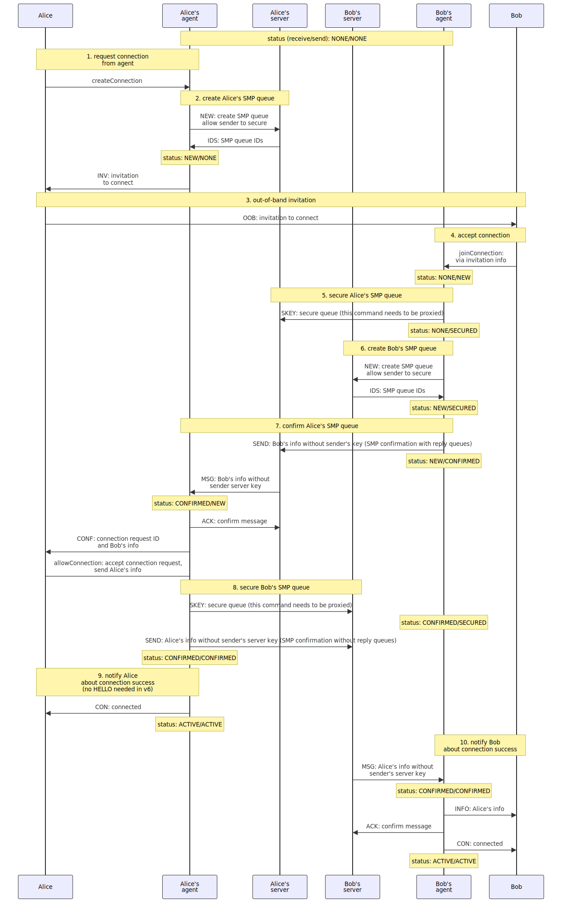

# SMP agent protocol - duplex communication over SMP protocol

## Table of contents

- [Abstract](#abstract)
- [SMP agent](#smp-agent)
- [SMP servers management](#smp-servers-management)
- [SMP agent protocol components](#smp-agent-protocol-components)
- [Duplex connection procedure](#duplex-connection-procedure)
- [Communication between SMP agents](#communication-between-smp-agents)
  - [Message syntax](#messages-between-smp-agents)
    - [HELLO message](#hello-message)
    - [REPLY message](#reply-message)
    - [MSG message](#msg-message)
    - [INV message](#inv-message)
    - [ACK message](#ack-message)
    - [NEW message](#new-message)
    - [DEL message](#del-message)
- [SMP agent commands](#smp-agent-commands)
  - [Client commands and server responses](#client-commands-and-server-responses)
    - [NEW command and INV response](#new-command-and-inv-response)
    - [JOIN command](#join-command)
    - [CONF notification and LET command](#conf-notification-and-let-command)
    - [REQ notification and ACPT command](#req-notification-and-acpt-command)
    - [INFO and CON notifications](#info-and-con-notifications)
    - [SUB command](#sub-command)
    - [SEND command and MID, SENT and MERR responses](#send-command-and-mid-sent-and-merr-responses)
    - [MSG notification](#msg-notification)
    - [END notification](#end-notification)
    - [OFF command](#off-command)
    - [DEL command](#del-command)
- [Connection request](#connection-request)

## Abstract

The purpose of SMP agent protocol is to define the syntax and the semantics of communications between the client and the agent that connects to [SMP](./simplex-messaging.md) servers.

It provides:
- protocol to create and manage bi-directional (duplex) connections between the users of SMP agents consisting of two (or more) separate unidirectional (simplex) SMP queues, abstracting away multiple steps required to establish bi-directional connections and any information about the servers location from the users of the agent protocol.
- management of E2E encryption between SMP agents, generating ephemeral asymmetric keys for each connection.
- SMP command authentication on SMP servers, generating ephemeral keys for each SMP queue.
- TCP/TLS transport handshake with SMP servers.
- validation of message integrity.

SMP agent protocol provides no encryption or security on the client side - it is assumed that the agent is executed in the trusted and secure environment, in one of three ways:
- via TCP network using secure connection.
- via local port (when the agent runs on the same device as a separate process).
- via agent library, when the agent logic is included directly into the client application - [SimpleX Chat for terminal](https://github.com/simplex-chat/simplex-chat) uses this approach.

## SMP agent

SMP agents communicate with each other via SMP servers using [simplex messaging protocol (SMP)](./simplex-messaging.md) according to the commands received from its users. This protocol is a middle layer in SimpleX protocols (above SMP protocol but below any application level protocol) - it is intended to be used by client-side applications that need secure asynchronous bi-directional communication channels ("connections").

The agent must have a persistent storage to manage the states of known connections and of the client-side information of SMP queues that each connection consists of, and also the buffer of the most recent sent and received messages. The number of the messages that should be stored is implementation specific, depending on the error management approach that the agent implements; at the very least the agent must store the hashes and IDs of the last received and sent messages.

## SMP servers management

SMP agent protocol commands do not contain the addresses of the SMP servers that the agent will use to create and use the connections (excluding the server address in queue URIs used in JOIN command). The list of the servers is a part of the agent configuration and can be dynamically changed by the agent implementation:
- by the client applications via any API that is outside of scope of this protocol.
- by the agents themselves based on availability and latency of the configured servers.

## SMP agent protocol components

SMP agent protocol has 3 main parts:

- the syntax and semantics of the messages that SMP agents exchange with each other in order to:
  - negotiate establishing unidirectional (simplex) encrypted queues on SMP servers.
  - exchange client messages and delivery notifications, providing sequential message IDs and message integrity (by including the hash of the previous message).
- the syntax and semantics of the commands that are sent by the agent clients to the agents. This protocol allows to create and manage multiple connections, each consisting of two or more SMP queues.
- the syntax and semantics of the message that the clients of SMP agents should send out-of-band (as pre-shared "invitation" including queue URIs) to protect [E2E encryption][1] from active attacks ([MITM attacks][2]).

## Duplex connection procedure



The procedure of establishing a duplex connection is explained on the example of Alice and Bob creating a bi-directional connection consisting of two unidirectional (simplex) queues, using SMP agents (A and B) to facilitate it, and two different SMP servers (which could be the same server). It is shown on the diagram above and has these steps:

1. Alice requests the new connection from the SMP agent A using SMP NEW command.
2. Agent A creates an SMP connection on the server (using [SMP protocol](./simplex-messaging.md)) and responds to Alice with the invitation that contains queue information and the encryption key Bob's agent B should use. The invitation format is described in [Connection request](#connection-request).
3. Alice sends the [connection request](#connection-request) to Bob via any secure channel (out-of-band message).
4. Bob sends `JOIN` command with the connection request as a parameter to agent B to accept the connection.
5. Establishing Alice's SMP queue (with SMP protocol commands):
  - Agent B sends an "SMP confirmation" with SMP SEND command to the SMP queue specified in the connection request - SMP confirmation is an unauthenticated message with an ephemeral key that will be used to authenticate Bob's commands to the queue, as described in SMP protocol, and Bob's info (profile, public key for E2E encryption, etc.). This message is encrypted using key passed in the connection request (or with the derived key, in which case public key for key derivation should be sent in clear text).
  - Agent A receives the SMP confirmation containing Bob's key and info as SMP MSG.
  - Agent A notifies Alice sending REQ notification with Bob's info.
  - Alice accepts connection request with ACPT command.
  - Agent A secures the queue with SMP KEY command.
  - Agent B tries sending authenticated SMP SEND command with agent `HELLO` message until it succeeds. Once it succeeds, Bob's agent "knows" the queue is secured.
6. Agent B creates a new SMP queue on the server.
7. Establish Bob's SMP queue:
  - Agent B sends `REPLY` message (SMP SEND command) with the connection request to this 2nd queue to Alice's agent (via the 1st queue) - this connection request SHOULD use "simplex" URI scheme.
  - Agent A, having received `REPLY` message, sends unauthenticated message (SMP SEND) to SMP queue with Alice agent's ephemeral key that will be used to authenticate Alice's commands to the queue, as described in SMP protocol, and Alice's info.
  - Bob's agent receives the key and Alice's information and secures the queue (SMP KEY).
  - Bob's agent sends the notification `INFO` with Alice's information to Bob.
  - Alice's agent keeps sending `HELLO` message until it succeeds.
8. Agents A and B notify Alice and Bob that connection is established.
  - Once sending `HELLO` succeeds, Alice's agent sends to Alice `CON` notification that confirms that now both parties can communicate.
  - Once Bob's agent receives `HELLO` from Alice's agent, it sends to Bob `CON` notification as well.

At this point the duplex connection between Alice and Bob is established, they can use `SEND` command to send messages. The diagram also shows how the connection status changes for both parties, where the first part is the status of the SMP queue to receive messages, and the second part - the status of the queue to send messages.

The most communication happens between the agents and servers, from the point of view of Alice and Bob there are 4 steps (not including notifications):

1. Alice requests a new connection with `NEW` command and receives the invitation.
2. Alice passes connection request out-of-band to Bob.
3. Bob accepts the connection with `JOIN` command with the connection request to his agent.
4. Alice accepts the connection with `ACPT` command.
5. Both parties receive `CON` notification once duplex connection is established.

Clients SHOULD support establishing duplex connection asynchronously (when parties are intermittently offline) by persisting intermediate states and resuming SMP queue subscriptions.

## Communication between SMP agents

To establish duplex connections and to send messages on behalf of their clients, SMP agents communicate via SMP servers.

Agents use SMP message client body (the part of the SMP message after header - see [SMP protocol](./simplex-messaging.md)) to transmit agent client messages and exchange messages between each other.

Each SMP message client body, once decrypted, contains 3 parts (one of them may include binary message body), as defined by `decryptedSmpMessageBody` syntax:

- `agentMsgHeader` - agent message header that contains sequential agent message ID for a particular SMP queue, agent timestamp (ISO8601) and the hash of the previous message.
- `agentMessage` - a command/message to the other SMP agent:
  - to establish the connection with two SMP queues (`helloMsg`, `replyQueueMsg`)
  - to send and to acknowledge user messages (`clientMsg`, `acknowledgeMsg`)
  - to manage SMP queue rotation (`newQueueMessage`, `deleteQueueMsg`)
  - to manage encryption key rotation (TODO)
- `msgPadding` - an optional message padding to make all SMP messages have constant size, to prevent servers from observing the actual message size. The only case the message padding can be absent is when the message has exactly the maximum size, in all other cases the message MUST be padded to a fixed size.

### Messages between SMP agents

Message syntax below uses [ABNF][3] with [case-sensitive strings extension][4].

```abnf
decryptedSmpMessageBody = agentMsgHeader CRLF agentMessage CRLF msgPadding
agentMsgHeader = agentMsgId SP previousMsgHash ; here `agentMsgId` is sequential ID set by the sending agent
agentMsgId = 1*DIGIT
previousMsgHash = encoded
encoded = <base64 encoded>

agentMessage = helloMsg / replyQueueMsg /
               clientMsg / invitationMsg /
               newQueueMessage / deleteQueueMsg 

msgPadding = *OCTET ; optional random bytes to get messages to the same size (as defined in SMP message size)

helloMsg = %s"H"

replyQueueMsg = %s"R" connectionRequest ; `connectionRequest` is defined below
; this message can only be sent by the second connection party

clientMsg = %s"M" clientMsgBody
clientMsgBody = *OCTET

; TODO remove and move to "public" header
invitationMsg = %s"INV" SP connReqInvitation SP connInfo
; `connReqInvitation` and `connInfo` are defined below

newQueueMsg = %s"N" queueURI
; this message can be sent by any party to add SMP queue to the connection.
; NOT SUPPORTED in the current implementation

deleteQueueMsg = %s"D" queueURI
; notification that the queue with passed URI will be deleted
; no need to notify the other party about suspending queue separately, as suspended and deleted queues are indistinguishable to the sender
; NOT SUPPORTED in the current implementation
```

#### HELLO message

This is the first message that both agents send after the respective SMP queue is secured by the receiving agent (see diagram). It MAY contain the public key that the recipient would use to verify messages signed by the sender.

Sending agent might need to retry sending HELLO message, as it would not have any other confirmation that the queue is secured other than the success of sending this message with the signed SMP SEND command.

#### REPLY message

This is the message that is sent by the agent that received an out-of-band connection request to pass the connection request for the reply SMP queues to the agent that originated the connection (see diagram).

#### MSG message

This is the agent envelope used to send client messages once the connection is established. Do not confuse it with the MSG response from SMP server to the agent and MSG response from SMP agent to the client that are sent in different contexts.

#### INV message

This message is sent to the SMP queue(s) in `connReqContact`, to establish a new connection via existing unsecured queue, that acts as a permanent connection link of a user.

#### ACK message

This message is sent to confirm the client message reception. It includes received message number, message hash and the reception status.

#### NEW message

This message is sent to add an additional SMP queue to the connection. Unlike REPLY message it can be sent at any time.

#### DEL message 

This message is sent to notify that the queue with passed URI will be deleted - having received this message, the receiving agent should no longer send messages to this queue. In case it was the last remaining send queue in the duplex connection, the agent MAY also delete the reply queue(s) in the connection.

## SMP agent commands

This part describes the transmissions between users and client-side SMP agents: commands that the users send to create and operate duplex connections and SMP agent responses and messages they deliver.

Commands syntax below is provided using [ABNF][3] with [case-sensitive strings extension][4].

Each transmission between the user and SMP agent must have this format/syntax:

```abnf
agentTransmission = [corrId] CRLF [connId] CRLF agentCommand

corrId = 1*(%x21-7F) ; any characters other than control/whitespace

connId = encoded

agentCommand = (userCmd / agentMsg) CRLF
userCmd = newCmd / joinCmd / letCmd / acceptCmd / subscribeCmd / sendCmd / acknowledgeCmd / suspendCmd / deleteCmd
agentMsg = invitation / confMsg / connReqMsg / connInfo / connected / unsubscribed / connDown / connUp / messageId / sent / messageError / message / received / ok / error

newCmd = %s"NEW" SP connectionMode [SP %s"NO_ACK"] ; response is `invitation` or `error`
; NO_ACK parameter currently not supported

connectionMode = %s"INV" / %s"CON"

invitation = %s"INV" SP connectionRequest ; `connectionRequest` is defined below

confMsg = %s"CONF" SP confirmationId SP msgBody
; msgBody here is any binary information identifying connection request

letCmd = %s"LET" SP confirmationId SP msgBody
; msgBody here is any binary information identifying connecting party

confirmationId = 1*DIGIT

connReqMsg = %s"REQ" SP invitationId SP msgBody
; msgBody here is any binary information identifying connection request

acceptCmd = %s"ACPT" SP invitationId SP msgBody
; msgBody here is any binary information identifying connecting party

invitationId = 1*DIGIT

connInfo = %s"INFO" SP msgBody
; msgBody here is any binary information identifying connecting party

connected = %s"CON"

subscribeCmd = %s"SUB" ; response is `ok` or `error`

unsubscribed = %s"END"
; when another agent (or another client of the same agent)
; subscribes to the same SMP queue on the server

connDown = %s"DOWN"
; lost connection (e.g. because of Internet connectivity or server is down)

connUp = %s"UP"
; restored connection

joinCmd = %s"JOIN" SP connectionRequest SP connInfo [SP %s"NO_REPLY"] [SP %s"NO_ACK"]
; `connectionRequest` and `connInfo` are defined below
; response is `connected` or `error`
; parameters NO_REPLY and NO_ACK are currently not supported

suspendCmd = %s"OFF" ; can be sent by either party, response `ok` or `error`

deleteCmd = %s"DEL" ; can be sent by either party, response `ok` or `error`

sendCmd = %s"SEND" SP msgBody
; send syntax is similar to that of SMP protocol, but it is wrapped in SMP message
msgBody = stringMsg | binaryMsg
stringMsg = ":" string ; until CRLF in the transmission
string = *(%x01-09 / %x0B-0C / %x0E-FF %) ; any characters other than NUL, CR and LF
binaryMsg = size CRLF msgBody CRLF ; the last CRLF is in addition to CRLF in the transmission
size = 1*DIGIT ; size in bytes
msgBody = *OCTET ; any content of specified size - safe for binary

messageId = %s"MID" SP agentMsgId

sent = %s"SENT" SP agentMsgId

messageError = %s"MERR" SP agentMsgId SP <errorType>

message = %s"MSG" SP msgIntegrity SP recipientMeta SP brokerMeta SP senderMeta SP binaryMsg
recipientMeta = %s"R=" agentMsgId "," agentTimestamp ; receiving agent message metadata 
brokerMeta = %s"B=" brokerMsgId "," brokerTimestamp ; broker (server) message metadata
senderMeta = %s"S=" agentMsgId ; sending agent message ID 
brokerMsgId = encoded
brokerTimestamp = <date-time>
msgIntegrity = ok / msgIntegrityError

msgIntegrityError = %s"ERR" SP msgIntegrityErrorType
msgIntegrityErrorType = skippedMsgErr / badMsgIdErr / badHashErr

skippedMsgErr = %s"NO_ID" SP missingFromMsgId SP missingToMsgId
badMsgIdErr = %s"ID" SP previousMsgId ; ID is lower than the previous
badHashErr = %s"HASH"

missingFromMsgId = agentMsgId
missingToMsgId = agentMsgId
previousMsgId = agentMsgId

acknowledgeCmd = %s"ACK" SP agentMsgId ; ID assigned by receiving agent (in MSG "R")

received = %s"RCVD" SP agentMsgId SP msgIntegrity
; ID assigned by sending agent (in SENT response)
; currently not implemented

msgStatus = ok | error

ok = %s"OK"

error = %s"ERR" SP <errorType>
```

### Client commands and server responses

#### NEW command and INV response

`NEW` command is used to create a connection and a connection request to be sent out-of-band to another protocol user (the joining party). It should be used by the client of the agent that initiates creating a duplex connection (the initiating party).

`INV` response is sent by the agent to the client of the initiating party.

`NEW` command has `connectionMode` parameter to define the connection mode - to be used to communicate with a single contact (invitation mode, `connectionMode` is `INV`) or to accept connection requests from anybody (contact mode, `connectionMode` is `CON`). The type of connection request is determined by `connectionMode` parameter.

#### JOIN command

It is used to create a connection and accept the connection request received out-of-band. It should be used by the client of the agent that accepts the connection (the joining party).

#### CONF notification and LET command

When the joining party uses `JOIN` command to accept connection invitation created with `NEW INV` command, the initiating party will receive `CONF` notification with some numeric identifier and an additional binary information, that can be used to identify the joining party or for any other purpose.

To continue with the connection the initiating party should use `LET` command.

#### REQ notification and ACPT command

When the joining party uses `JOIN` command to connect to the contact created with `NEW CON` command, the initiating party will receive `REQ` notification with some numeric identifier and an additional binary information, that can be used to identify the joining party or for any other purpose.

To continue with the connection the party that created the contact should use `ACPT` command.

#### INFO and CON notifications

After the initiating party proceeds with the connection using `ACPT` command, the joining party will receive `INFO` notification that can be used to identify the initiating party or for any other purpose.

Once the connection is established and ready to accept client messages, both agents will send `CON` notification to their clients.

#### SUB command

This command can be used by the client to resume receiving messages from the connection that was created in another TCP/client session. Agent response to this command can be `OK` or `ERR` in case connection does not exist (or can only be used to send connections - e.g. when the reply queue was not created).

#### SEND command and MID, SENT, RCVD and MERR responses

`SEND` command is used by the client to send messages.

`MID` response with the message ID (the sequential message number that includes both sent and received messages in the connection) is sent to the client to confirm that the message is accepted by the agent, before it is sent to the SMP server.

`SENT` notification is sent by the agent to confirm that the message was delivered to at least one of SMP servers. This notification contains the same message ID as `MID` notification. `SENT` notification, depending on network availability, can be sent at any time later, potentially in the next client session.

`RCVD` notification is sent by the agent when it receives `ACK` message from the receiving agent. This notification contains reception status, only one successful notification will be sent, and multiple error notifications will be sent in case `ACK` had error status.

In case of the failure to send the message for any other reason than network connection or message queue quota - e.g. authentication error (`ERR AUTH`) or syntax error (`ERR CMD error`), the agent will send to the client `MERR` notification with the message ID, and this message delivery will no longer be attempted to this SMP queue.

#### MSG notification

It is sent by the agent to the client when agent receives the message from the SMP server. It has message ID and timestamp from both the receiving and sending agents and from SMP server:
- recipient agent ID is intended to be used to refer to the message in the future.
- sender agent ID is intended to be used to identify any missed / skipped message(s)
- broker ID should be used to detect duplicate deliveries (it would happen if TCP connection is lost before the message is acknowledged by the agent - see [SMP protocol](./simplex-messaging.md))

#### END notification

It is sent by the agent to the client when agent receives SMP protocol `END` notification from SMP server. It indicates that another agent has subscribed to the same SMP queue on the server and the server terminated the subscription of the current agent.

#### DOWN and UP notifications

These notifications are sent when server or network connection is, respectively, `DOWN` or back `UP`.

All the subscriptions made in the current client session will be automatically resumed when `UP` notification is received.

#### OFF command

It is used to suspend the receiving SMP queue - sender will no longer be able to send the messages to the connection, but the recipient can retrieve the remaining messages. Agent response to this command can be `OK` or `ERR`. This command is irreversible.

#### DEL command

It is used to delete the connection and all messages in it, as well as the receiving SMP queue and all messages in it that were remaining on the server. Agent response to this command can be `OK` or `ERR`. This command is irreversible.

## Connection request

Connection request `connectionRequest` is generated by SMP agent in response to `newCmd` command (`"NEW"`), used by another party user with `joinCmd` command (`"JOIN"`), and then another connection request is sent by the agent in `replyQueueMsg` and used by the first party agent to connect to the reply queue (the second part of the process is invisible to the users).

Connection request syntax:

```
connectionRequest = connectionScheme "/" connReqType "#/?smp=" smpQueues "&e2e=" e2eEncryption
connReqType = %s"invitation" / %s"contact"
; this parameter has the same meaning as connectionMode in agent commands
; `NEW INV` creates `invitation` connection request, `NEW CON` - `contact`
connectionScheme = (%s"https://" clientAppServer) | %s"simplex:"
clientAppServer = hostname [ ":" port ]
; client app server, e.g. simplex.chat
e2eEncryption = encryptionScheme ":" publicKey
encryptionScheme = %s"rsa" ; end-to-end encryption and key exchange protocols,
                           ; the current hybrid encryption scheme (RSA-OAEP/AES-256-GCM-SHA256)
                           ; will be replaced with double ratchet protocol and DH key exchange.
publicKey = <base64url X509 SPKI key encoding>
smpQueues = smpQueue [ "," 1*smpQueue ] ; SMP queues for the connection
smpQueue = <URL-encoded queueURI defined in SMP protocol>
```

All parameters are passed via URI hash to avoid sending them to the server (in case "https" scheme is used) - they can be used by the client-side code and processed by the client application. Parameters `smp` and `e2e` can be present in any order, any unknown additional parameters SHOULD be ignored.

`clientAppServer` is not an SMP server - it is a server that shows the instruction on how to download the client app that will connect using this connection request. This server can also host a mobile or desktop app manifest so that this link is opened directly in the app if it is installed on the device.

"simplex" URI scheme in `connectionProtocol` can be used instead of client app server, to connect without creating any web traffic. Client apps MUST support this URI scheme.

See SMP protocol [out-of-band messages](./simplex-messaging.md#out-of-band-messages) for syntax of `queueURI`.

[1]: https://en.wikipedia.org/wiki/End-to-end_encryption
[2]: https://en.wikipedia.org/wiki/Man-in-the-middle_attack
[3]: https://tools.ietf.org/html/rfc5234
[4]: https://tools.ietf.org/html/rfc7405
