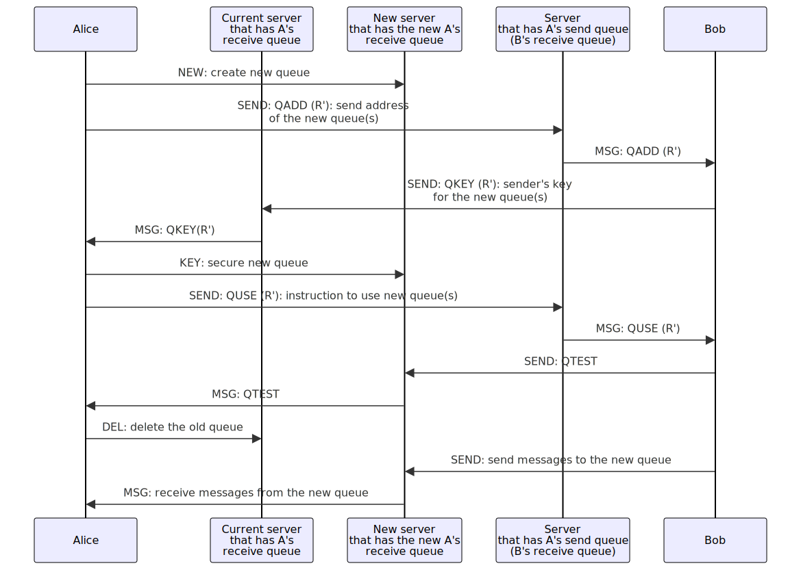
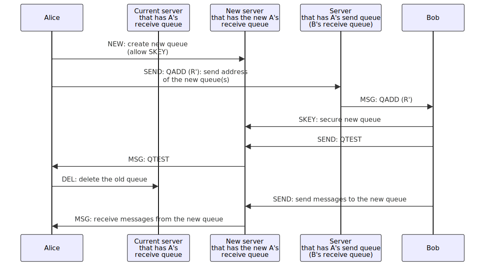

Version 5, 2024-06-22

# SMP agent protocol - duplex communication over SMP protocol

## Table of contents

- [Abstract](#abstract)
- [SMP agent](#smp-agent)
- [SMP servers management](#smp-servers-management)
- [SMP agent protocol components](#smp-agent-protocol-components)
- [Duplex connection procedure](#duplex-connection-procedure)
- [Contact addresses](#contact-addresses)
- [Communication between SMP agents](#communication-between-smp-agents)
  - [Message syntax](#messages-between-smp-agents)
    - [HELLO message](#hello-message)
    - [A_MSG message](#a_msg-message)
    - [A_RCVD message](#a_rcvd-message)
    - [EREADY message](#eready-message)
    - [A_QCONT message](#a_qcont-message)
    - [Rotating messaging queue](#rotating-messaging-queue)
- [End-to-end encryption](#end-to-end-encryption)
- [Connection link: 1-time invitation and contact address](#connection-link-1-time-invitation-and-contact-address)
- [Appendix A: SMP agent API](#smp-agent-api)
  - [API functions](#api-functions)
    - [Create conection](#create-conection)
    - [Join connection](#join-connection)
    - [Allow connection](#allow-connection)
    - [Accept and reject connection requests](#accept-and-reject-connection-requests)
    - [Send message](#send-message)
    - [Acknowledge received message](#acknowledge-received-message)
    - [Subscribe connection](#subscribe-connection)
    - [Get notification message](#get-notification-message)
    - [Rotate message queue to another server](#rotate-message-queue-to-another-server)
    - [Renegotiate e2e encryption](#renegotiate-e2e-encryption)
    - [Delete connection](#delete-connection)
    - [Suspend connection](#suspend-connection)
  - [API events](#api-events)

## Abstract

The purpose of SMP agent protocol is to define the syntax and the semantics of communications between the client and the agent that connects to [SMP](./simplex-messaging.md) servers.

It provides:
- API to create and manage bi-directional (duplex) connections between the users of SMP agents consisting of two (or more) separate unidirectional (simplex) SMP queues, abstracting away multiple steps required to establish bi-directional connections and any information about the servers location from the users of the agent protocol.
- management of E2E encryption between SMP agents, generating ephemeral asymmetric keys for each connection.
- SMP command authentication on SMP servers, generating ephemeral keys for each SMP queue.
- TCP/TLS transport handshake with SMP servers.
- validation of message integrity.

SMP agent API provides no security between the agent and the client - it is assumed that the agent is executed in the trusted and secure environment, via the agent library, when the agent logic is included directly into the client application - [SimpleX Chat for terminal](https://github.com/simplex-chat/simplex-chat) uses this approach.

## SMP agent

SMP agents communicate with each other via SMP servers using [simplex messaging protocol (SMP)](./simplex-messaging.md) according to the API calls used by the client applications. This protocol is a middle layer in SimpleX protocols (above SMP protocol but below any application level protocol) - it is intended to be used by client-side applications that need secure asynchronous bi-directional communication channels ("connections").

The agent must have a persistent storage to manage the states of known connections and of the client-side information of SMP queues that each connection consists of, and also the buffer of the most recent sent and received messages. The number of the messages that should be stored is implementation specific, depending on the error management approach that the agent implements; at the very least the agent must store the hashes and IDs of the last received and sent messages.

## SMP servers management

SMP agent API does not use the addresses of the SMP servers that the agent will use to create and use the connections (excluding the server address in queue URIs used in JOIN command). The list of the servers is a part of the agent configuration and can be dynamically changed by the agent implementation:
- by the client applications via any API that is outside of scope of this protocol.
- by the agents themselves based on availability and latency of the configured servers.

## SMP agent protocol components

SMP agent protocol has 4 main parts:

- the messages that SMP agents exchange with each other in order to:
  - negotiate establishing unidirectional (simplex) encrypted queues on SMP servers.
  - exchange client messages and delivery notifications, providing sequential message IDs and message integrity (by including the hash of the previous message).
- the functional API used by the client application with the agent. This API allows to create and manage multiple connections, each consisting of two or more SMP queues.
- events that the agent passes to the clients.
- the messages that the clients of SMP agents should send out-of-band (as pre-shared "invitation" including queue URIs) to protect [E2E encryption][1] from active attacks ([MITM attacks][2]).

## Duplex connection procedure


The procedure of establishing a duplex connection is explained on the example of Alice and Bob creating a bi-directional connection consisting of two unidirectional (simplex) queues, using SMP agents (A and B) to facilitate it, and two different SMP servers (which could be the same server). It is shown on the diagram above and has these steps:

1. Alice requests the new connection from the SMP agent A using agent `createConnection` api function.
2. Agent A creates an SMP queue on the server (using [SMP protocol](./simplex-messaging.md) `NEW` command) and responds to Alice with the invitation that contains queue information and the encryption keys Bob's agent B should use. The invitation format is described in [Connection link](connection-link-1-time-invitation-and-contact-address).
3. Alice sends the [connection link](#connection-link-1-time-invitation-and-contact-address) to Bob via any secure channel (out-of-band message) - as a link or as a QR code.
4. Bob uses agent `joinConnection` api function with the connection link as a parameter to agent B to accept the connection.
5. Agent B creates Bob's SMP reply queue with SMP server `NEW` command.
6. Agent B confirms the connection: sends an "SMP confirmation" with SMP server `SEND` command to the SMP queue specified in the connection link - SMP confirmation is an unauthenticated message with an ephemeral key that will be used to authenticate Bob's commands to the queue, as described in SMP protocol, and Bob's info (profile, public key for E2E encryption, and the connection link to this 2nd queue to Agent A - this connection link SHOULD use "simplex" URI scheme). This message is encrypted using key passed in the connection link (or with the derived shared secret, in which case public key for key derivation should be sent in clear text).
6. Alice confirms and continues the connection:
  - Agent A receives the SMP confirmation containing Bob's key, reply queue and info as SMP server `MSG`.
  - Agent A notifies Alice sending `CONF` notification with Bob's info.
  - Alice allows connection to continue with agent `allowConnection` api function.
  - Agent A secures the queue with SMP server `KEY` command.
  - Agent A sends SMP confirmation with ephemeral sender key, ephemeral public encryption key and profile (but without reply queue).
7. Agent B confirms the connection:
  - receives the confirmation.
  - sends the notification `INFO` with Alice's information to Bob.
  - secures SMP queue that it sent to Alice in the first confirmation with SMP `KEY` command .
  - sends `HELLO` message via SMP `SEND` command. This confirms that the reply queue is secured and also validates that Agent A secured the first SMP queue
8. Agent A notifies Alice.
  - receives `HELLO` message from Agent B.
  - sends `HELLO` message to Agent B via SMP `SEND` command.
  - sends `CON` notification to Alice, confirming that the connection is established.
9. Agent B notifies Bob.
  - Once Agent B receives `HELLO` from Agent A, it sends to Bob `CON` notification as well.

At this point the duplex connection between Alice and Bob is established, they can use `SEND` command to send messages. The diagram also shows how the connection status changes for both parties, where the first part is the status of the SMP queue to receive messages, and the second part - the status of the queue to send messages.

The most communication happens between the agents and servers, from the point of view of Alice and Bob there are 4 steps (not including notifications):

1. Alice requests a new connection with `createConnection` agent API function and receives the connection link.
2. Alice passes connection link out-of-band to Bob.
3. Bob accepts the connection with `joinConnection` agent API function with the connection link to his agent.
4. Alice accepts the connection with `ACPT` agent API function.
5. Both parties receive `CON` notification once duplex connection is established.

Clients SHOULD support establishing duplex connection asynchronously (when parties are intermittently offline) by persisting intermediate states and resuming SMP queue subscriptions.

## Fast duplex connection procedure

Previously described duplex connection procedure requires sending 4 messages creating a bad UX for the users - it requires waiting until each party in online before the messages can be sent.

It allows users validating connecting party profile before proceeding with the connection, but it turned out to be unnecessary UX step and is not used in the client applications.

It also protects against an attacker who compromised TLS and uses the sender queue ID sent to the recipient to secure the queue before the sender can. This attack is very hard, and this accepting its risk is better than worse UX. Future protocol versions could mitigate this attack by encrypting entity IDs.

Faster duplex connection process is possible with the `SKEY` command added in v9 of SMP protocol.


1. Alice requests the new connection from the SMP agent A using agent `createConnection` api function
2. Agent A creates an SMP queue on the server (using [SMP protocol](./simplex-messaging.md) `NEW` command with the flag allowing the sender to secure the queue) and responds to Alice with the invitation that contains queue information and the encryption keys Bob's agent B should use. The invitation format is described in [Connection link](connection-link-1-time-invitation-and-contact-address).
3. Alice sends the [connection link](connection-link-1-time-invitation-and-contact-address) to Bob via any secure channel (out-of-band message) - as a link or as a QR code. This link contains the flag that the queue can be secured by the sender.
4. Bob uses agent `joinConnection` api function with the connection link as a parameter to agent B to accept the connection.
5. Agent B secures Alice's queue with SMP command `SKEY` - this command can be proxied.
6. Agent B creates Bob's SMP reply queue with SMP server `NEW` command (with the flag allowing the sender to secure the queue).
7. Agent B confirms the connection: sends an "SMP confirmation" with SMP server `SEND` command to the SMP queue specified in the connection link - SMP confirmation is an unauthenticated message with an ephemeral key that will be used to authenticate Bob's commands to the queue, as described in SMP protocol, and Bob's info (profile, public key for E2E encryption, and the connection link to this 2nd queue to Agent A - this connection link SHOULD use "simplex" URI scheme). This message is encrypted using key passed in the connection link (or with the derived shared secret, in which case public key for key derivation should be sent in clear text).
8. Alice confirms the connection:
  - Agent A receives the SMP confirmation containing Bob's key, reply queue and info as SMP server `MSG`.
  - Agent A notifies Alice sending `CONF` notification with Bob's info (that indicates that Agent B already secured the queue).
  - Alice allows connection to continue with agent `allowConnection` api function.
  - Agent A secures Bob's queue with SMP command `SKEY`.
  - Agent A sends SMP confirmation with ephemeral public encryption key and profile (but without reply queue, and without sender key).
9. Agent A notifies Alice with `CON` notification.
10. Agent B notifies Bob about connection success:
  - receives confirmation message from Alice.
  - sends the notification `INFO` with Alice's information to Bob.
  - sends `CON` notification to Bob.

## Contact addresses

SMP agents support creating a special type of connection - a contact address - that allows to connect to multiple network users who can send connection requests by sending 1-time connection links to the message queue. 

This connection address uses a messaging queue on SMP server to receive invitations to connect - see `agentInvitation` message below. Once connection request is accepted, a new connection is created and the address itself is no longer used to send the messages - deleting this address does not disrupt the connections that were created via it.

## Communication between SMP agents

To establish duplex connections and to send messages on behalf of their clients, SMP agents communicate via SMP servers.

Agents use SMP message client body (the part of the SMP message after header - see [SMP protocol](./simplex-messaging.md)) to transmit agent client messages and exchange messages between each other.

These messages are encrypted with per-queue shared secret using NaCL crypto_box and can be of 4 types, as defined by `decryptedSMPClientMessage`:
- `agentConfirmation` - used when confirming SMP queues, contains connection information encrypted with double ratchet. This envelope can only contain `agentConnInfo` or `agentConnInfoReply` encrypted with double ratchet.
- `agentMsgEnvelope` - contains different agent messages encrypted with double ratchet, as defined in `agentMessage`.
- `agentInvitation` - sent to SMP queue that is used as contact address, does not use double ratchet.
- `agentRatchetKey` - used to re-negotiate double ratchet encryption - can contain additional information in `agentRatchetKey`.

```abnf
decryptedSMPClientMessage = agentConfirmation / agentMsgEnvelope / agentInvitation / agentRatchetKey
agentConfirmation = agentVersion %s"C" ("0" / "1" sndE2EEncryptionParams) encConnInfo
agentVersion = 2*2 OCTET
sndE2EEncryptionParams = TODO
encConnInfo = doubleRatchetEncryptedMessage

agentMsgEnvelope = agentVersion %s"M" encAgentMessage
encAgentMessage = doubleRatchetEncryptedMessage

agentInvitation = agentVersion %s"I" connReqLength connReq connInfo
connReqLength = 2*2 OCTET ; Word16

agentRatchetKey = agentVersion %s"R" rcvE2EEncryptionParams agentRatchetInfo
rcvE2EEncryptionParams = TODO

doubleRatchetEncryptedMessage = TODO
```

This syntax of decrypted SMP client message body is defined by `decryptedAgentMessage` below.

Decrypted SMP message client body can be one of 4 types:
- `agentConnInfo` - used by the initiating party when confirming reply queue - sent in `agentConfirmation` envelope.
- `agentConnInfoReply` - used by accepting party, includes reply queue(s) in the initial confirmation - sent in `agentConfirmation` envelope.
- `agentRatchetInfo` - used to pass additional information when renegotiating double ratchet encryption - sent in `agentRatchetKey` envelope.
- `agentMessage` - all other agent messages.

`agentMessage` contains these parts:
- `agentMsgHeader` - agent message header that contains sequential agent message ID for a particular SMP queue, agent timestamp (ISO8601) and the hash of the previous message.
- `aMessage` - a command/message to the other SMP agent:
  - to confirm the connection (`HELLO`).
  - to send and to confirm reception of user messages (`A_MSG`, `A_RCVD`).
  - to confirm that the new double ratchet encryption is agreed (`EREADY`).
  - to notify another party that it can continue sending messages after queue capacity was exceeded (`A_QCONT`).
  - to manage SMP queue rotation (`QADD`, `QKEY`, `QUSE`, `QTEST`).
- `msgPadding` - an optional message padding to make all SMP messages have constant size, to prevent servers from observing the actual message size. The only case the message padding can be absent is when the message has exactly the maximum size, in all other cases the message MUST be padded to a fixed size.

### Messages between SMP agents

Message syntax below uses [ABNF][3] with [case-sensitive strings extension][4].

```abnf
decryptedAgentMessage = agentConnInfo / agentConnInfoReply / agentRatchetInfo / agentMessage
agentConnInfo = %s"I" connInfo
connInfo = *OCTET
agentConnInfoReply = %s"D" smpQueues connInfo
agentRatchetInfo = %s"R" ratchetInfo

agentMessage = %s"M" agentMsgHeader aMessage msgPadding
agentMsgHeader = agentMsgId prevMsgHash
agentMsgId = 8*8 OCTET ; Int64
prevMsgHash = shortString

aMessage = HELLO / A_MSG / A_RCVD / EREADY / A_QCONT /
           QADD / QKEY / QUSE / QTEST

HELLO = %s"H"

A_MSG = %s"M" userMsgBody
userMsgBody = *OCTET

A_RCVD = %s"V" msgReceipt
msgReceipt = agentMsgId msgHash rcptLength rcptInfo

EREADY = %s"E" agentMsgId

A_QCONT = %s"QC" sndQueueAddr

QADD = %s"QA" sndQueues
sndQueues = length 1*(newQueueUri replacedSndQueue)
newQueueUri = clientVRange smpServer senderId dhPublicKey [sndSecure]
dhPublicKey = length x509encoded
sndSecure = "T"
replacedSndQueue = "0" / "1" sndQueueAddr

QKEY = %s"QK" sndQueueKeys
sndQueueKeys = length 1*(newQueueInfo senderKey)
newQueueInfo = version smpServer senderId dhPublicKey [sndSecure]
senderKey = length x509encoded

QUSE = %s"QU" sndQueuesReady
sndQueuesReady = length 1*(sndQueueAddr primary)
primary = %s"T" / %s"F"

QTEST = %s"QT" sndQueueAddrs
sndQueueAddrs = length 1*sndQueueAddr

sndQueueAddr = smpServer senderId
smpServer = hosts port keyHash
hosts = length 1*host
host = shortString
port = shortString
keyHash = shortString
senderId = shortString

clientVRange = version version
version = 2*2 OCTET

msgPadding = *OCTET
rcptLength = 2*2 OCTET
shortString = length *OCTET
length = 1*1 OCTET
```

#### HELLO message

This is the first message that both agents send after the respective SMP queue is secured by the receiving agent (see diagram).

This message is not used with [fast duplex connection](#fast-duplex-connection-procedure).

#### A_MSG message

This is the agent envelope used to send client messages once the connection is established. This is different from the MSG sent by SMP server to the agent and MSG event from SMP agent to the client that are sent in different contexts.

#### A_RCVD message

This message is sent to confirm the client message reception. It includes received message number and message hash.

#### EREADY message

This message is sent after re-negotiating a new double ratchet encryption with `agentRatchetKey`.

#### A_QCONT message

This message is sent to notify the sender client that it can continue sending the messages after queue capacity was exhausted.

### Rotating messaging queue

SMP agents SHOULD support 4 messages to rotate message reception to another messaging server:
`QADD`: add the new queue address(es) to the connection - sent by the client that initiates rotation.
`QKEY`: pass sender's key via existing connection (SMP confirmation message will not be used, to avoid the same "race" of the initial key exchange that would create the risk of intercepting the queue for the attacker) - sent by the client accepting the rotation
`QUSE`: instruct the sender to use the new queue with sender's queue ID as parameter. From this point some messages can be sent to both the new queue and the old queue.
`QTEST`: send test message to the new connection. Any other message can be sent if available to continue rotation, the absence of this message is not an error. Once this message is successfully sent the sender will stop using the old queue. Once this message (or any other message in the new queue) is received, the recipient will stop using the old queue and delete it.

**Queue rotation procedure**



`SKEY` command added in v9 of SMP protocol allows for faster queue rotation procedure.

**Fast queue rotation procedure**



## End-to-end encryption

Messages between SMP agents have two layers of e2e encryption:
- simple encryption agreed in SMP protocol with a fixed key agreed when the messaging queue is agreed by parties.
- post-quantum resistant augmented double ratchet algorithm (PQDR) specified in [this document](./pqdr.md).

The protocol supports adding and removing post-quantum KEM primitive to the key agreement in double ratchet:
- to support migration of pre-existing connections to PQDR.
- to be able to disable PQ key agreement.
- to be able to use invitation links and contact addresses without large PQ keys.

Possible scenarios below show the possible states of PQ key agreement, assuming that both clients support it.

Possible options for each stage are:
- no KEM encapsulation key was sent (No PQ key),
- only KEM encapsulation key was sent, but not ciphertext yet (PQ key sent),
- both KEM encapsulation key from one KEM agreement and ciphertext from the previous agreement were sent (PQ key + PQ ct sent).

`+` in the table means that this scenario is possible, and `-` - that it is not possible.

| Connection stage                                       | No PQ key        | PQ key sent      | PQ key + PQ ct sent |
|:------------------------------------------------------:|:----------------:|:----------------:|:-------------------:|
| invitation                                             |         +        |         +        |          -          |
| confirmation, in reply to: <br>no-pq inv <br>pq inv    | &nbsp;<br>+<br>+ | &nbsp;<br>+<br>- | &nbsp;<br>-<br>+    |
| 1st msg, in reply to: <br>no-pq conf <br>pq/pq+ct conf | &nbsp;<br>+<br>+ | &nbsp;<br>+<br>- | &nbsp;<br>-<br>+    |
| Nth msg, in reply to: <br>no-pq msg <br>pq/pq+ct msg   | &nbsp;<br>+<br>+ | &nbsp;<br>+<br>- | &nbsp;<br>-<br>+    |

These scenarios can be reduced to:
1. initial invitation optionally has PQ key, but must not have ciphertext.
2. all subsequent messages should be allowed without PQ key/ciphertext, but:
  - if the previous message had PQ key or PQ key with ciphertext, they must either have no PQ key, or have PQ key with ciphertext (PQ key without ciphertext is an error).
  - if the previous message had no PQ key, they must either have no PQ key, or have PQ key without ciphertext (PQ key with ciphertext is an error).

The rules for calculating the shared secret for received/sent messages are (assuming received message is valid according to the above rules):

|  sent msg > <br>V received msg | no-pq       | pq      | pq+ct           |
|:------------------------------:|:-----------:|:-------:|:---------------:|
| no-pq                          | DH / DH     | DH / DH | err             |
| pq (sent msg was NOT pq)       | DH / DH     | err     | DH / DH+KEM     |
| pq+ct (sent msg was NOT no-pq) | DH+KEM / DH | err     | DH+KEM / DH+KEM |

To summarize, the upgrade to DH+KEM secret happens in a sent message that has PQ key with ciphertext sent in reply to message with PQ key only (without ciphertext), and the downgrade to DH secret happens in the message that has no PQ key.

## Connection link: 1-time invitation and contact address

Connection links are generated by SMP agent in response to `createConnection` api call, used by another party user with `joinConnection` api, and then another connection link is sent by the agent in `agentConnInfoReply` and used by the first party agent to connect to the reply queue (the second part of the process is invisible to the users).

Connection link syntax:

```
connectionLink = connectionScheme "/" connLinkType "#/?smp=" smpQueues "&e2e=" e2eEncryption
connLinkType = %s"invitation" / %s"contact"
connectionScheme = (%s"https://" clientAppServer) | %s"simplex:"
clientAppServer = hostname [ ":" port ]
; client app server, e.g. simplex.chat
e2eEncryption = encryptionScheme ":" publicKey
encryptionScheme = %s"rsa" ; end-to-end encryption and key exchange protocols,
                           ; the current hybrid encryption scheme (RSA-OAEP/AES-256-GCM-SHA256)
                           ; will be replaced with double ratchet protocol and DH key exchange.
publicKey = <base64url X509 SPKI key encoding>
smpQueues = smpQueue [ "," 1*smpQueue ] ; SMP queues for the connection
smpQueue = <URL-encoded queueURI defined in SMP protocol>
```

All parameters are passed via URI hash to avoid sending them to the server (in case "https" scheme is used) - they can be used by the client-side code and processed by the client application. Parameters `smp` and `e2e` can be present in any order, any unknown additional parameters SHOULD be ignored.

`clientAppServer` is not an SMP server - it is a server that shows the instruction on how to download the client app that will connect using this connection link. This server can also host a mobile or desktop app manifest so that this link is opened directly in the app if it is installed on the device.

"simplex" URI scheme in `connectionProtocol` can be used instead of client app server, to connect without creating any web traffic. Client apps MUST support this URI scheme.

See SMP protocol [out-of-band messages](./simplex-messaging.md#out-of-band-messages) for syntax of `queueURI`.

## Appendix A: SMP agent API

The exact specification of agent library API and of the events that the agent sends to the client application is out of scope of the protocol specification.

The list of some of the API functions and events below is supported by the reference implementation, and they are likely to be required by the client applications.

### API functions

The list of APIs below is not exhaustive and provided for information only. Please consult the source code for more information.

#### Create conection

`createConnection` api is used to create a connection - it returns the connection link that should be sent out-of-band to another protocol user (the joining party). It should be used by the client of the agent that initiates creating a duplex connection (the initiating party).

This api is also used to create a contact address - a special connection that can be used by multiple people to connect to the user.

Some communication scenarios may require fault-tolerant mechanism of creating connections that retries on network failures and continue retrying after the client is restarted. Such asynchronous API would return its result via `INV` event once it succeeds.

#### Join connection

`joinConnection` is used to create a connection record and accept the connection invitation received out-of-band. It should be used by the client of the agent that accepts the connection (the joining party).

This api can also be required as asynchronous, in which case `OK` event will be dispatched to the client to indicate the success or `ERR` in case it permanently failed (e.g., in case connection was deleted by another party).

#### Allow connection

Once the client receives `CONF` event, it should use synchronous `allowConnection` api to proceed with the connection (both for the [standard](#duplex-connection-procedure) and for the [fast duplex procedure](#fast-duplex-connection-procedure)).

In case this API is used as asynchronous it will return its result via `OK` or `ERR` event.

#### Accept and reject connection requests

Connection requests are delivered to the client application via `REQ` event.

Client can `acceptContact` and `rejectContact`, with `OK` and `ERR` events in case of asynchronous calls.

#### Send message

`sendMessage` api is always asynchronous. The api call returns message ID, `SENT` event once the message is sent to the server, `MWARN` event in case of temporary delivery failure that can be resolved by the user (e.g., by connecting via Tor or by upgrading the client) and `MERR` in case of permanent delivery failure.

#### Acknowledge received message

Messages are delivered to the client application via `MSG` event.

Client application must always `ackMessage` to receive the next one - failure to call it in reference implementation will prevent the delivery of subsequent messages until the client reconnects to the server.

This api is also used to acknowledge message delivery to the sending party - that party client application will receive `RCVD` event.

#### Subscribe connection

`subscribeConnection` api is used by the client to resume receiving messages from the connection that was created in another TCP/client session.

#### Get notification message

`getNotificationMessage` is used by push notification subsystem of the client application to receive the message from a specific messaging queue mentioned in the notification. The client application would receive `MSG` and any other events from the agent, and then `MSGNTF` event once the message related to this notification is received.

#### Rotate message queue to another server

`switchConnection` api is used to rotate connection queues to another messaging server.

#### Renegotiate e2e encryption

`synchronizeRatchet` api is used to re-negotiate double ratchet encryption for the connection.

#### Delete connection

`deleteConnection` api is used to delete connection. In case of asynchronous call, the connection deletion will be confirmed with `DEL_RCVQ` and `DEL_CONN` events.

#### Suspend connection

`suspendConnection` api is used to prevent any further messages delivered to the connection without deleting it.

### API events

Agent API uses these events dispatch to notify client application about events related to the connections:
- `INV` - connection invitation or connection address URI after connection is created.
- `CONF` - confirmation that connection is accepted by another party. When the accepting party uses `joinConnection` api to accept connection invitation, the initiating party will receive `CONF` notification with some identifier and additional information from the accepting party (e.g., profile). To continue the connection the initiating party client should use `allowConnection` api.
- `REQ` - connection request is sent when another party uses `joinConnection` api with contact address. The client application can use `acceptContact` or `rejectContact` api.
- `INFO` - information from the party that initiated the connection with `createConnection` sent to the party accepting the connection with `joinConnection`.
- `CON` - notification that connection is established sent to both parties of the connection.
- `END` - notification that connection subscription is terminated when another client subscribed to the same messaging queue.  
- `DOWN` - notification that connection server is temporarily unavailable.
- `UP` - notification that the subscriptions made in the current client session are resumed after the server became available.
- `SWITCH` - notification about queue rotation process.
- `RSYNC` - notification about e2e encryption re-negotiation process.
- `SENT` - notification to confirm that the message was delivered to at least one of SMP servers. This notification contains the same message ID as returned to `sendMessage` api. `SENT` notification, depending on network availability, can be sent at any time later, potentially in the next client session.
- `MWARN` - temporary delivery failure that can be resolved by the user (e.g., by connecting via Tor or by upgrading the client).
- `MERR` - notification about permanent message delivery failure.
- `MERRS` - notification about permanent message delivery failure for multiple messages (e.g., when multiple messages expire).
- `MSG` - sent when agent receives the message from the SMP server.
- `MSGNTF` - sent after agent received and processed the message referenced in the push notification.
- `RCVD` - notification confirming message receipt by another party.
- `QCONT` - notification that the agent continued sending messages after queue capacity was exceeded and recipient received all messages.
- `DEL_RCVQ` - confirmation that message queue was deleted.
- `DEL_CONN` - confirmation that connection was deleted.
- `OK` - confirmation that asynchronous api call was successful.
- `ERR` - error of asynchronous api call or some other error event.

This list of events is not exhaustive and provided for information only. Please consult the source code for more information.

[1]: https://en.wikipedia.org/wiki/End-to-end_encryption
[2]: https://en.wikipedia.org/wiki/Man-in-the-middle_attack
[3]: https://tools.ietf.org/html/rfc5234
[4]: https://tools.ietf.org/html/rfc7405
