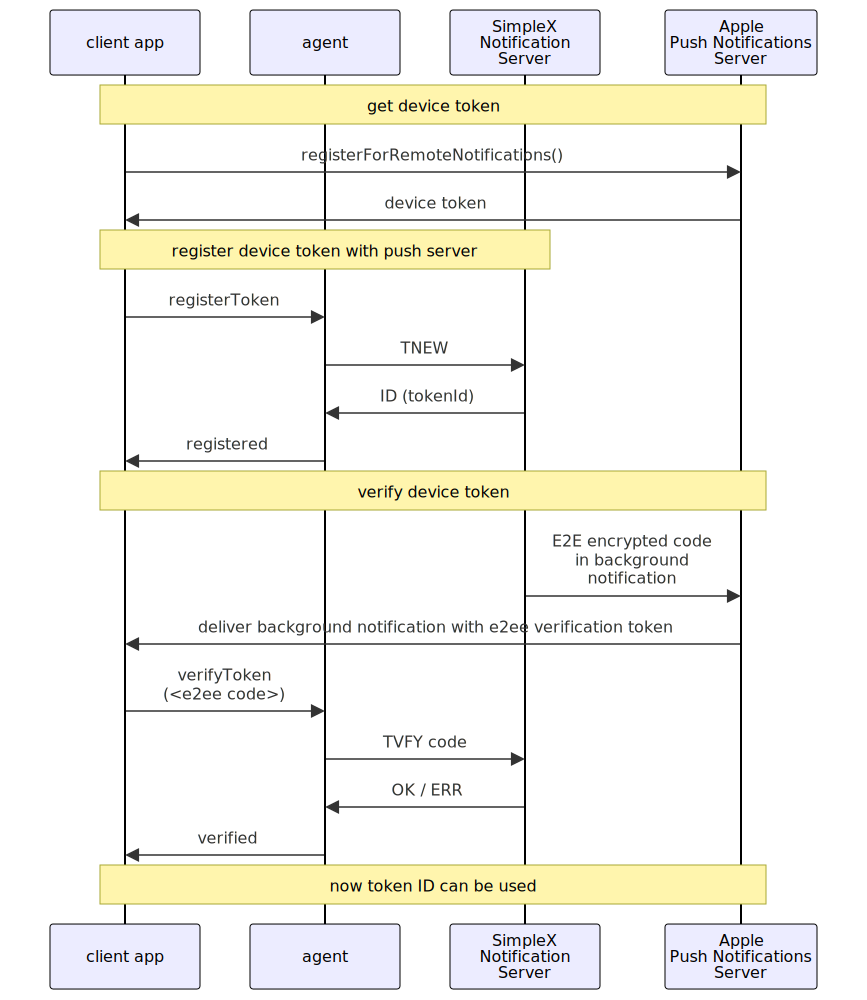
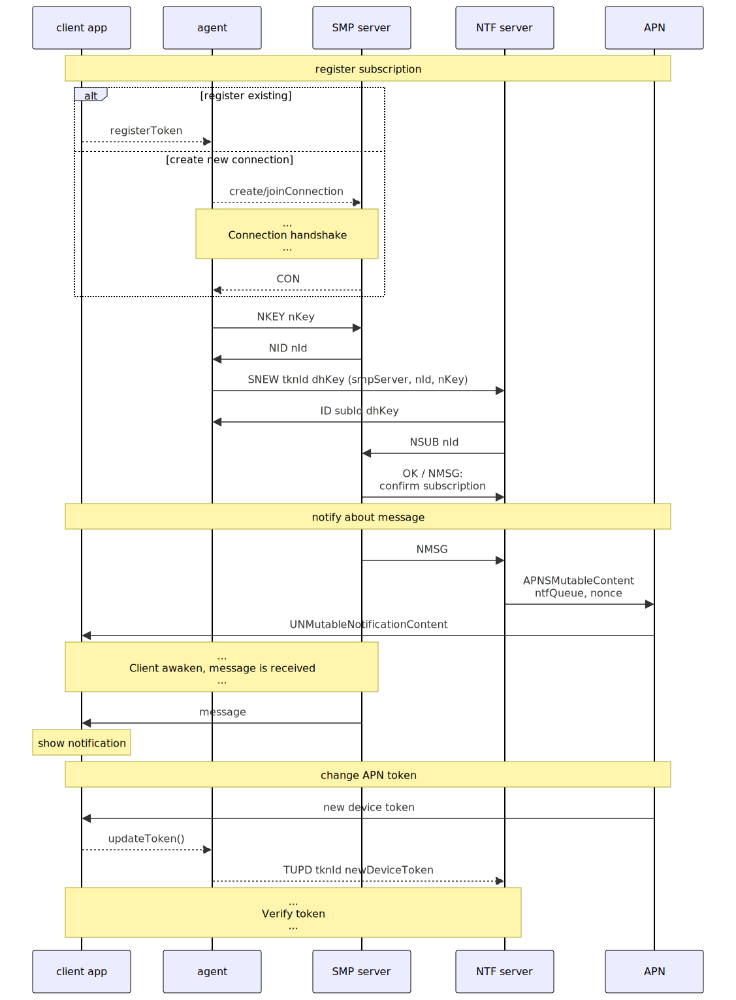

Version 1, 2024-06-22

# Overview of push notifications for SimpleX Messaging Servers

## Table of contents

- [Introduction](#introduction)
- [Participating servers](#participating-servers)
- [Register device token to receive push notifications](#register-device-token-to-receive-push-notifications)
- [Subscribe to connection notifications](#subscribe-to-connection-notifications)
- [SimpleX Notification Server protocol](#simplex-notification-server-protocol)
  - [Register new notification token](#register-new-notification-token)
  - [Verify notification token](#verify-notification-token)
  - [Check notification token status](#check-notification-token-status)
  - [Replace notification token](#replace-notification-token)
  - [Delete notification token](#delete-notification-token)
  - [Subscribe to periodic notifications](#subscribe-to-periodic-notifications)
  - [Create SMP message notification subscription](#create-smp-message-notification-subscription)
  - [Check notification subscription status](#check-notification-subscription-status)
  - [Delete notification subscription](#delete-notification-subscription)
  - [Error responses](#error-responses)
- [Threat model](#threat-model)

## Introduction

SimpleX Messaging servers already operate as push servers and deliver the messages to subscribed clients as soon as they are sent to the servers.

The reason for push notifications is to support instant message notifications on iOS that does not allow background services.

## Participating servers

The diagram below shows which servers participate in message notification delivery.

While push provider (e.g., APN) can learn how many notifications are delivered to the user, it cannot access message content, even encrypted, or any message metadata - the notifications are e2e encrypted between SimpleX Notification Server and the user's device.

```
  User's iOS device                Internet                           Servers
---------------------   .   ------------------------   .   -----------------------------
                        .                              .
                        .                              .       can be self-hosted now
+--------------+        .                              .         +----------------+
| SimpleX Chat |       -------------- TLS ---------------        | SimpleX        |
|    client    |------> SimpleX Messaging Protocol (SMP) ------> | Messaging      |
+--------------+       ----------------------------------        | Server         |
     ^    |             .                              .         +----------------+
     |    |             .                              .          . . .  |   . . .
     |    |             .                              .               | V |
     |    |             .                              .               |SMP| TLS
     |    |             .                              .               | | |               SimpleX
     |    |             .                              .          . . .  V   . . .      NTF Server
     |    |             .                              .       +----------------------------------+
     |    |             .                              .       | +---------------+                |
     |    |            -------------- TLS ---------------      | | SimpleX       | can be         | 
     |    |----------->   Notification Server Protocol  -----> | | Notifications | self-hosted    |
     |                 ----------------------------------      | | Subscriber    | in the future  |
     |                  .                              .       | +---------------+                |
     |                  .                              .       |         |                        |
     |                  .                              .       |         V                        |
     |                  .                              .       | +---------------+                |
     |                  .                              .       | | SimpleX       |                |
     |                  .                              .       | | Push          |                |
     |                  .                              .       | | Server        |                |
     |                  .                              .       | +---------------+                |
     |                  .                              .       +----------------------------------+
     |                  .                              .          . . .  |   . . .
     |                  .                              .               | V |
     |                  .                              .               |SMP| TLS
     |                  .                              .               | | |
     |                  .                              .          . . .  V   . . .
     |                 -------------- TLS ---------------       +-----------------+
     |-----------------       Notification delivery     <-------| Apple PN server |
                       ----------------------------------       +-----------------+
                        .                              .
```

## Register device token to receive push notifications

This diagram shows the process of registering a device to receive PUSH notifications via Apple Push Notification (APN) servers.



## Subscribe to connection notifications

This diagram shows the process of subscription to notifications, notification delivery and device token update.



## SimpleX Notification Server protocol

To manage notification subscriptions to SMP servers, SimpleX Notification Server provides an RPC protocol with a similar design to SimpleX Messaging Protocol server.

This protocol sends requests and responses in a fixed size blocks of 512 bytes over TLS, uses the same [syntax of protocol transmissions](./simplex-messaging.md#smp-transmission-and-transport-block-structure) as SMP protocol, and has the same transport [handshake syntax](./simplex-messaging.md#transport-handshake) (except the server certificate is not included in the handshake).

Protocol commands have this syntax:

```
ntfServerTransmission = 
ntfServerCmd = newTokenCmd / verifyTokenCmd / checkTokenCmd /
               replaceTokenCmd / deleteTokenCmd / cronCmd /
               newSubCmd / checkSubCmd / deleteSubCmd
```
### Register new notification token

This command should be used after the client app obtains a token from push notifications provider to register the token with the server.

Having received this command the server will deliver a test notification via the push provider to validate that the client has this token.

The command syntax:

```abnf
newTokenCmd = %s"TNEW" SP newToken
newToken = %s"T" deviceToken authPubKey clientDhPubKey
deviceToken = pushProvider tokenString
pushProvider = apnsDev / apnsProd / apnsNull
apnsDev = "AD" ; APNS token for development environment
apnsProd = "AP" ; APNS token for production environment
apnsNull = "AN" ; token that does not trigger any notification delivery - used for server testing
tokenString = shortString
authPubKey = length x509encoded ; Ed25519 key used to verify clients commands
clientDhPubKey = length x509encoded ; X25519 key to agree e2e encryption between the server and client
shortString = length *OCTET
length = 1*1 OCTET
```

The server response syntax:

```abnf
tokenIdResp = %s"IDTKN" SP entityId serverDhPubKey
entityId = shortString
serverDhPubKey = length x509encoded ; X25519 key to agree e2e encryption between the server and client
```

### Verify notification token

This command is used to verify the token after the device receives the test notification from the push provider.

The command syntax:

```abnf
verifyTokenCmd = %s"TVFY" SP regCode
regCode = shortString
```

The response to this command is `okResp` or `errorResp`

```abnf
okResp = %s"OK"
```

### Check notification token status

This command is used to check the token status:

```abnf
checkTokenCmd = %s"TCHK"
```

The response to this command:

```abnf
tokenStatusResp = %s"TKN" SP tokenStatus
tokenStatus = %s"NEW" / %s"REGISTERED" / %s"INVALID" / %s"CONFIRMED" / %s"ACTIVE" / %s"EXPIRED"
```

### Replace notification token

This command should be used when push provider issues a new notification token.

It happens when:
- the app data is migrated to another device.
- the app is re-installed on the same device.
- can happen periodically, at push provider discretion.

This command allows to replace the token without re-registering and re-subscribing all notification subscriptions.

Using this command triggers the same verification flow as registering a new token.

The command syntax:

```abnf
replaceTokenCmd = %s"TRPL" SP deviceToken
```

The response to this command is `okResp` or `errorResp`.

### Delete notification token

The command syntax:

```abnf
deleteTokenCmd = %s"TDEL"
```

The response to this command is `okResp` or `errorResp`.

After this command all message notification subscriptions will be removed and no more notifications will be sent.

### Subscribe to periodic notifications

This command enables or disables periodic notifications sent to the client device irrespective of message notifications.

This is useful for two reasons:
- it provides better privacy from notification server, as while the server learns the device token, it doesn't learn anything else about user communications.
- it allows to receive messages when notifications were dropped by push provider, e.g. while the device was offline, or lost by notification server, e.g. while it was restarting.

The command syntax:

```abnf
cronCmd = %s"TCRN" SP interval
interval = 2*2 OCTET ; Word16, minutes
```

The interval for periodic notifications is set in minutes, with the minimum of 20 minutes. The client should pass `0` to disable periodic notifications.

### Create SMP message notification subscription

This command makes notification server subscribe to message notifications from SMP server and to deliver them to push provider:

```abnf
newSubCmd = %s"SNEW" newSub
newSub = %s "S" tokenId smpServer notifierId notifierKey
tokenId = shortString ; returned in response to `TNEW` command
smpServer = smpServer = hosts port fingerprint
hosts = length 1*host
host = shortString
port = shortString
fingerprint = shortString
notifierId = shortString ; returned by SMP server in response to `NKEY` SMP command
notifierKey = length x509encoded ; private key used to authorize requests to subscribe to message notifications
```

The response syntax:

```abnf
subIdResp = %s"IDSUB" SP entityId
```

### Check notification subscription status

This command syntax:

```abnf
checkSubCmd = %s"SCHK"
```

The response:

```abnf
subStatusResp = %s"SUB" SP subStatus
subStatus = %s"NEW" / %s"PENDING" / ; e.g., after SMP server disconnect/timeout while ntf server is retrying to connect
            %s"ACTIVE" / %s"INACTIVE" / %s"END" / ; if another server subscribed to notifications
            %s"AUTH" / subErrStatus
subErrStatus = %s"ERR" SP shortString
```

### Delete notification subscription

The command syntax:

```abnf
deleteSubCmd = %s"SDEL"
```

The response to this command is `okResp` or `errorResp`.

After this command no more message notifications will be sent from this queue.

### Error responses

All commands can return error response:

```abnf
errorResp = %s"ERR" SP errorType
```

Where `errorType` has the same syntax as in [SimpleX Messaging Protocol](./simplex-messaging.md#error-responses)

## Threat Model

This threat model compliments SimpleX Messaging Protocol [threat model](./overview-tjr.md#threat-model)

#### A passive adversary able to monitor the traffic of one user

*can:*

 - identify that and a user is using SimpleX push notifications.

*cannot:*

 - determine which servers a user subscribed to the notifications from.

#### A passive adversary able to monitor a set of senders and recipients

 *can:*

 - perform more efficient traffic correlation attacks against senders and recipients and correlate senders and recipients within the monitored set, frustrated by the number of users on the servers.

#### SimpleX Messaging Protocol server

*can:*

- learn which messages trigger push notifications.

- learn IP address of SimpleX notification servers used by the user.

- drop message notifications.

- spam a user with invalid notifications.

*cannot:*

- learn user device token for push notifications.

- learn which queues belong to the same users with any additional efficiency compared with not using push notifications.

#### SimpleX Notification Server subscribed to message notifications

*can:*

- learn a user device token.

- learn how many messaging queues and servers a user receives messages from.

- learn how many message notifications are delivered to the user from each queue.

- undetectably drop notifications.

- spam a user with background notifications.

*cannot:*

- learn queue addresses for receiving or sending messages.

- learn the contents or type of messages (not even encrypted).

- learn anything about messages sent without notification flag.

- spam a user with visible notifications (provided the client app can filter push notifications).

- add, duplicate, or corrupt individual messages that will be shown to the user.

#### SimpleX Notification Server subscribed ONLY to periodic notifications

*can:*

- learn a user device token.

- drop periodic notifications.

- spam a user with background notifications.

*cannot:*

- learn how many messaging queues and servers a user receives messages from.

- learn how many message notifications are delivered to the user from each queue.

- learn queue addresses for receiving or sending messages.

- learn the contents or type of messages (not even encrypted).

- learn anything about messages sent without notification flag.

- spam a user with visible notifications (provided the client app can filter push notifications).

- add, duplicate, or corrupt individual messages that will be shown to the user.

#### A user’s contact

*cannot:*

- determine if a user uses push notifications or not.

#### Push notification provider (e.g., APN)

*can:*

- learn that a user uses SimpleX app.

- learn how many notifications are delivered to user's device.

- drop notifications (in fact, APN coalesces notifications delivered while user's device is offline, delivering only the last one).

*cannot:*

- learn which SimpleX Messaging Protocol servers are used by a user (notifications are e2e encrypted).

- learn which or how many messaging queues a user receives notifications from.

- learn the contents or type of messages (not even encrypted, notifications only contain encrypted metadata).

#### An attacker with Internet access

*cannot:*

- register notification token not present on attacker's device.

- enumerate tokens or subscriptions on a SimpleX Notification Server.
