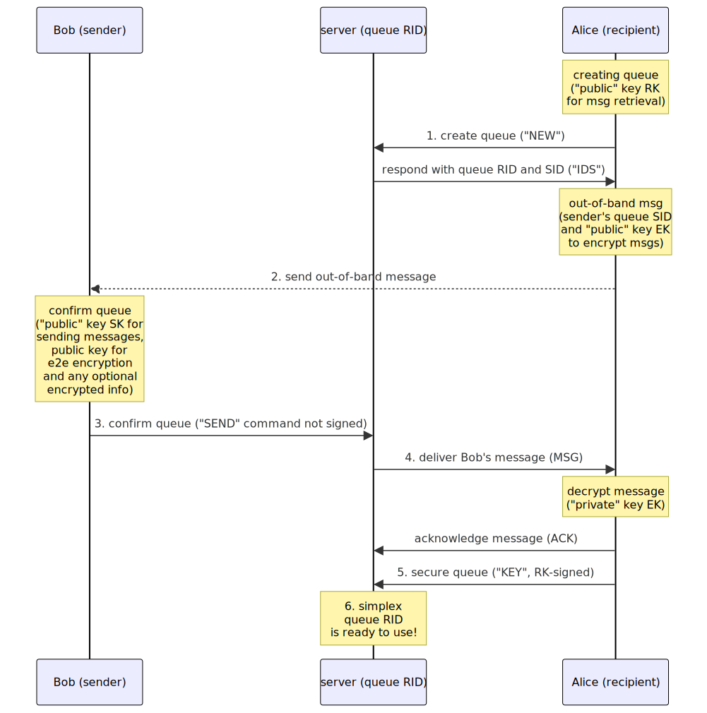

# Simplex Messaging Protocol (SMP)

## Table of contents

- [Abstract](#abstract)
- [Introduction](#introduction)
- [SMP Model](#smp-model)
- [Out-of-band messages](#out-of-band-messages)
- [Simplex queue](#simplex-queue)
- [SMP queue URI](#smp-queue-uri)
- [SMP procedure](#smp-procedure)
- [SMP qualities and features](#smp-qualities-and-features)
- [Cryptographic algorithms](#cryptographic-algorithms)
- [Simplex queue IDs](#simplex-queue-ids)
- [Server security requirements](#server-security-requirements)
- [Message delivery notifications](#message-delivery-notifications)
- [SMP Transmission structure](#smp-transmission-structure)
- [SMP commands](#smp-commands)
  - [Correlating responses with commands](#correlating-responses-with-commands)
  - [Command authentication](#command-authentication)
  - [Keep-alive command](#keep-alive-command)
  - [Recipient commands](#recipient-commands)
    - [Create queue command](#create-queue-command)
    - [Subscribe to queue](#subscribe-to-queue)
    - [Secure queue command](#secure-queue-command)
    - [Enable notifications command](#enable-notifications-command)
    - [Acknowledge message delivery](#acknowledge-message-delivery)
    - [Suspend queue](#suspend-queue)
    - [Delete queue](#delete-queue)
  - [Sender commands](#sender-commands)
    - [Send message](#send-message)
  - [Notifier commands](#notifier-commands)
    - [Subscribe to queue notifications](#subscribe-to-queue-notifications)
  - [Server messages](#server-messages)
    - [Queue IDs response](#queue-ids-response)
    - [Deliver queue message](#deliver-queue-message)
    - [Notifier queue ID response](#notifier-queue-id-response)
    - [Deliver message notification](#deliver-message-notification)
    - [Subscription END notification](#subscription-end-notification)
    - [Error responses](#error-responses)
    - [OK response](#ok-response)
- [Appendices](#appendices)
  - [Appendix A. Transport connection with the SMP server](#appendix-a)

## Abstract

Simplex Messaging Protocol is a transport agnostic client-server protocol for asynchronous distributed secure unidirectional message transmission via persistent simplex message queues.

It's designed with the focus on communication security and integrity, under the assumption that any part of the message transmission network can be compromised.

It is designed as a low level protocol for other application protocols to solve the problem of secure and private message transmission, making [MITM attack][1] very difficult at any part of the message transmission system.

## Introduction

The objective of Simplex Messaging Protocol (SMP) is to facilitate the secure and private unidirectional transfer of messages from senders to recipients via persistent simplex queues managed by the message broker (server).

SMP is independent of any particular transmission system and requires only a reliable ordered data stream channel. While this document describes transport over TCP, other transports are also possible.

The protocol describes the set of commands that recipients and senders can exchange with SMP servers to create and to operate unidirectional "queues" (a data abstraction identifying one of many communication channels managed by the server) and to send messages from the sender to the recipient via the SMP server.

More complex communication scenarios can be designed using multiple queues - for example, a duplex communication channel can be made of 2 simplex queues.

The protocol is designed with the focus on privacy and security, to some extent deprioritizing reliability by requiring that SMP servers only store messages until they are acknowledged by the recipients and, in any case, for a limited period of time. For communication scenarios requiring more reliable transmission the users should use several SMP servers to pass each message and implement some additional protocol to ensure that messages are not removed, inserted or changed - this is out of scope of this document.

SMP does not use any form of participants' identities and provides [E2EE][2] without the possibility of [MITM attack][1] relying on two pre-requisites:

- the users can establish a secure encrypted transport connection with the SMP server. [Appendix A](#appendix-a) describes SMP transport protocol of such connection over TCP, but any other transport connection protocol can be used.

- the recipient can pass a single message to the sender via a pre-existing secure and private communication channel (out-of-band message) - the information in this message is used to encrypt messages and to establish connection with SMP server.

## SMP Model

The SMP model has three communication participants: the recipient, the message broker (SMP server) that is chosen and, possibly, controlled by the recipient, and the sender.

SMP server manages multiple "simplex queues" - data records on the server that identify communication channels from the senders to the recipients. The same communicating party that is the sender in one queue, can be the recipient in another - without exposing this fact to the server.

The queue record consists of 2 unique random IDs generated by the server, one for the recipient and another for the sender, and 2 keys to authenticate the recipient and the sender respectively, provided by the client. The users of SMP protocol must use a unique key for each queue, to avoid the possibility of aggregating and analyzing their queues in case SMP server is compromised.

Creating and using the queue requires sending commands to the SMP server from the recipient and the sender - they are described in detail in [SMP commands](#smp-commands) section.

## Out-of-band messages

The out-of-band message with the queue information is sent via some trusted alternative channel from the recipient to the sender. This message is used to share one or several [queue URIs](#smp-queue-uri) that parties can use to establish the initial connection, the encryption scheme and, it can include the public key(s) for end-to-end encryption.

The approach to out-of-band message passing and their syntax should be defined in application-level protocols.

## Simplex queue

The simplex queue is the main unit of SMP protocol. It is used by:

- Sender of the queue (who received out-of-band message) to send messages to the server using sender's queue ID, signed by sender's key.

- Recipient of the queue (who created the queue and sent out-of-band message) will use it to retrieve messages from the server, signing the commands by the recipient key.

- Participant identities are not shared with the server - new unique keys and queue IDs are used for each queue.

This simplex queue can serve as a building block for more complex communication network. For example, two (or more, for redundancy) simplex queues can be used to create a duplex communication channel. Higher level primitives that are only known to system participants in their client applications can be created as well - e.g., contacts, conversations, groups and broadcasts. Simplex messaging servers only have the information about the low-level simplex queues. In this way a high level of privacy and security of the communication is provided. Application level primitives are not in scope of this protocol.

This approach is based on the concept of [unidirectional networks][4] that are used for applications with high level of information security.

Access to each queue is controlled with unique (not shared with other queues) asymmetric key pairs, separate for the sender and the recipient. The sender and the receiver have private keys, and the server has associated public keys to authenticate participants' commands by verifying cryptographic signatures.

The messages sent over the queue are encrypted and decrypted using another key pair that was shared via out-of-band message - the recipient has the private key and the sender has the associated public key.

**Simplex queue diagram:**


Queue is defined by recipient ID `RID` and sender ID `SID`, unique for the server. Sender key (`SK`) is used by the server to verify sender's commands (identified by `SID`) to send messages. Recipient key (`RK`) is used by the server to verify recipient's commands (identified by `RID`) to retrieve messages.

The protocol uses different IDs for sender and recipient in order to provide an additional privacy by preventing the correlation of senders and recipients commands sent over the network - in case the encrypted transport is compromised, it would still be difficult to correlate senders and recipients without access to the queue records on the server.

## SMP queue URI

The SMP queue URIs MUST include server identity, queue hostname, an optional port, sender queue ID and the public key that the clients must use to verify responses. Server identity is used to establish secure connection protected from MITM attack with SMP server (see [Appendix A](#appendix-a) for SMP transport protocol).

The [ABNF][8] syntax of the queue URI is:

```abnf
queueURI = %s"smp://" smpServer "/" queueId "#" recipientDhPublicKey
smpServer = serverIdentity "@" srvHost [":" port]
srvHost = <hostname> ; RFC1123, RFC5891
port = 1*DIGIT
serverIdentity = base64url
queueId = base64url
base64url = <base64url encoded binary> ; RFC4648, section 5
recipientDhPublicKey = dhPublicKey
dhPublicKey = encryptionScheme ":" x509UrlEncoded
; the recipient's key for DH exchange to derive the secret
; that the sender will use to encrypt delivered messages

encryptionScheme = %s"x25519"
; x25519 scheme means [NaCl crypto_box][16] encryption scheme (curve25519xsalsa20poly1305).

x509UrlEncoded = <base64url X509 key encoding>
```

`hostname` can be IP address or domain name, as defined in RFC 1123, section 2.1.

`port` is optional, the default TCP port for SMP protocol is 5223.

`serverIdentity` is a required hash of the server certificate SPKI block (without line breaks, header and footer) used by the client to validate server certificate during transport handshake (see [Appendix A](#appendix-a))

## SMP procedure

The SMP procedure of creating a simplex queue on SMP server is explained using participants Alice (the recipient) who wants to receive messages from Bob (the sender).

To create and start using a simplex queue Alice and Bob follow these steps:

1. Alice creates a simplex queue on the server:

    1. Decides which SMP server to use (can be the same or different server that Alice uses for other queues) and opens secure encrypted transport connection to the chosen SMP server (see [Appendix A](#appendix-a)).

    2. Generates a new random public/private key pair (encryption key - `EK`) that she did not use before for Bob to encrypt the messages.

    3. Generates another new random public/private key pair (recipient key - `RK`) that she did not use before for her to sign commands and to decrypt the transmissions received from the server.

    4. Sends `"NEW"` command to the server to create a simplex queue (see `create` in [Create queue command](#create-queue-command)). This command contains previously generated unique "public" key `RK` that will be used to verify the following commands related to the same queue signed by its private counterpart, for example to subscribe to the messages received to this queue or to update the queue, e.g. by setting the key required to send the messages (initially Alice creates the queue that accepts unsigned messages, so anybody could send the message via this queue if they knew the queue sender's ID and server address).

    5. The server sends `"IDS"` response with queue IDs (`queueIds`):

        - Recipient ID `RID` for Alice to manage the queue and to receive the messages.

        - Sender ID `SID` for Bob to send messages to the queue.

2. Alice sends an out-of-band message to Bob via the alternative channel that both Alice and Bob trust (see [protocol abstract](#simplex-messaging-protocol-abstract)). The message must include:

    - Unique "public" key (`EK`) that Bob must use to encrypt messages.

    - SMP server hostname and information to open secure encrypted transport connection (see [Appendix A](#appendix-a)).

    - Sender queue ID `SID` for Bob to use.

3. Bob, having received the out-of-band message from Alice, connects to the queue:

    1. Generates a new random public/private key pair (sender key - `SK`) that he did not use before for him to sign messages sent to Alice's server.

    2. Prepares the confirmation message for Alice to secure the queue. This message includes:

        - Previously generated "public" key `SK` that will be used by Alice's server to authenticate Bob's messages, once the queue is secured.

        - Optionally, any additional information (application specific, e.g. Bob's profile name and details).

    3. Encrypts the confirmation body with the "public" key `EK` (that Alice provided via the out-of-band message).

    4. Sends the encrypted message to the server with queue ID `SID` (see `send` in [Send message](#send-message)). This initial message to the queue must not be signed - signed messages will be rejected until Alice secures the queue (below).

4. Alice receives Bob's message from the server using recipient queue ID `RID` (possibly, via the same transport connection she already has opened - see `message` in [Deliver queue message](#deliver-queue-message)):

    1. She decrypts received message with "private" key `EK`.

    2. Even though anybody could have sent the message to the queue with ID `SID` before it is secured (e.g. if communication is compromised), Alice would ignore all messages until the decryption succeeds (i.e. the result contains the expected message format). Optionally, in the client application, she also may identify Bob using the information provided, but it is out of scope of SMP protocol.

5. Alice secures the queue `RID` with `"KEY"` command so only Bob can send messages to it (see [Secure queue command](#secure-queue-command)):

    1. She sends the `KEY` command with `RID` signed with "private" key `RK` to update the queue to only accept requests signed by "private" key `SK` provided by Bob. This command contains unique "public" key `SK` previously generated by Bob.

    2. From this moment the server will accept only signed commands to `SID`, so only Bob will be able to send messages to the queue `SID` (corresponding to `RID` that Alice has).

    3. Once queue is secured, Alice deletes `SID` and `SK` - even if Alice's client is compromised in the future, the attacker would not be able to send messages pretending to be Bob.

6. The simplex queue `RID` is now ready to be used.

This flow is shown on the sequence diagram below.

**Creating simplex queue from Bob to Alice:**



Bob now can securely send messages to Alice:

1. Bob sends the message:

    1. He encrypts the message to Alice with "public" key `EK` (provided by Alice, only known to Bob, used only for one simplex queue).

    2. He signs `"SEND"` command to the server queue `SID` using the "private" key `SK` (that only he knows, used only for this queue).

    3. He sends the command to the server (see `send` in [Send message](#send-message)), that the server will authenticate using the "public" key `SK` (that Alice earlier provided to the server).

2. Alice receives the message(s):

    1. She signs `"SUB"` command to the server to subscribe to the queue `RID` with the "private" key `RK` (see `subscribe` in [Subscribe to queue](#subscribe-to-queue)).

    2. The server, having authenticated Alice's command with the "public" key `RK` that she provided, delivers Bob's message(s) (see `message` in [Deliver queue message](#deliver-queue-message)).

    3. She decrypts Bob's message(s) with the "private" key `EK` (that only she has).

    4. She acknowledges the message reception to the server with `"ACK"` so that the server can delete the message and deliver the next messages.

This flow is show on sequence diagram below.

**Sending messages from Bob to Alice via simplex queue:**


**Simplex queue operation:**


Sequence diagram does not show E2E encryption - server knows nothing about encryption between the sender and the receiver.

A higher level protocol application protocol should define the semantics that allow to use two simplex queues (or two sets of queues for redundancy) for the bi-directional or any other communication scenarios.

The SMP is intentionally unidirectional - it provides no answer to how Bob will know that the transmission succeeded, and whether Alice received any messages. There may be a scenario when Alice wants to securely receive the messages from Bob, but she does not want Bob to have any proof that she received any messages - this low-level protocol can be used in this scenario, as all Bob knows as a fact is that he was able to send one unsigned message to the server that Alice provided, and now he can only send messages signed with the key `SK` that he sent to the server - it does not prove that any message was received by Alice.

For practical purposes of bi-directional conversation, now that Bob can securely send encrypted messages to Alice, Bob can create the second simplex queue that will allow Alice to send messages to Bob in the same way, sending the second queue details via the first queue. If both Alice and Bob have their respective unique "public" keys (Alice's and Bob's `EK`s of two separate queues), or pass additional keys to sign the messages, the conversation can be both encrypted and signed.

The established queues can also be used to change the encryption keys providing [forward secrecy][5], or to negotiate using other SMP queue(s).

This protocol also can be used for off-the-record messaging, as Alice and Bob can use multiple queues between them and only information they pass to each other allows proving their identity, so if they want to share anything off-the-record they can initiate a new queue without linking it to any other information they exchanged. As a result, this protocol provides better anonymity and better protection from [MITM][1] than [OTR][6] protocol.

## SMP qualities and features

Simplex Messaging Protocol:

- Defines only message-passing protocol:

  - Transport agnostic - the protocol does not define how clients connect to the servers. It can be implemented over any ordered data stream channel: TCP connection, HTTP with long polling, websockets, etc.

  - Not semantic - the protocol does not assign any meaning to queues and messages. While on the application level the queues and messages can have different meaning (e.g., for messages: text or image chat message, message acknowledgement, participant profile information, status updates, changing "public" key to encrypt messages, changing servers, etc.), on SMP protocol level all the messages are binary and their meaning can only be interpreted by client applications and not by the servers - this interpretation is out of scope of this protocol.

- Client-server architecture:

  - Multiple servers, that can be deployed by the system users, can be used to send and retrieve messages.

  - Servers do not communicate with each other and do not "know" about other servers.

  - Clients only communicate with servers (excluding the initial out-of-band message), so the message passing is asynchronous.

  - For each queue, the message recipient defines the server through which the sender should send messages.

  - While multiple servers and multiple queues can be used to pass each message, it is in scope of application level protocol(s), and out of scope of this protocol.

  - Servers store messages only until they are retrieved by the recipients, and in any case, for a limited time.

  - Servers are required to NOT store any message history or delivery log, but even if the server is compromised, it does not allow to decrypt the messages or to determine the list of queues established by any participant - this information is only stored on client devices.

- The only element provided by SMP servers is simplex queues:

  - Each queue is created and managed by the queue recipient.

  - Asymmetric encryption is used to sign and verify the requests to send and receive the messages.

  - One unique "public" key is used by the servers to authenticate requests to send the messages into the queue, and another unique "public" key - to retrieve the messages from the queue. "Unique" here means that each "public" key is used only for one queue and is not used for any other context - effectively, this key is not public and does not represent any participant identity.

  - Both recipient and sender "public" keys are provided to the server by the queue recipient. "Public" key `RK` is provided when the queue is created, public key `SK` is provided when the queue is secured.

  - The "public" keys known to the server and used to authenticate commands from the participants are unrelated to the keys used to encrypt and decrypt the messages - the latter keys are also unique per each queue but they are only known to participants, not to the servers.

  - Messaging graph can be asymmetric: Bob's ability to send messages to Alice does not automatically lead to the Alice's ability to send messages to Bob.

## Cryptographic algorithms

Simplex messaging clients and servers must cryptographically sign commands, responses and messages for the following operations:

- With the recipient's key `RK` (server to verify):
  - create the queue (`NEW`)
  - subscribe to queue (`SUB`)
  - secure the queue (`KEY`)
  - enable queue notifications (`NKEY`)
  - acknowledge received messages (`ACK`)
  - suspend the queue (`OFF`)
  - delete the queue (`DEL`)
- With the sender's key `SK` (server to verify):
  - send messages (`SEND`)
- With the optional notifier's key:
  - subscribe to message notifications (`NSUB`)
- With the server's key (for recipient and sender to verify)
  - queue IDs response (`IDS`)
  - notifier queue ID response (`NID`)
  - delivered messages (`MSG`)
  - `OK` and `ERR` responses (excluding error responses not related to a queue)

To sign/verify transmissions clients and servers MUST use Ed25519 or Ed448 algorithm defined in [RFC8709][15].

To encrypt/decrypt message bodies delivered to the recipients, servers/clients MUST use x25519 or x448 algorithm defined in [RFC8709][15] to derive the shared secret (TODO encryption scheme).

Clients MUST encrypt message bodies sent via SMP servers - the protocol for this end-to-end encryption should be chosen by the clients using SMP protocol.

The reasons to use these algorithms:

- Faster operation than RSA algorithms.
- DH key exchange provides forward secrecy.

Future versions of the protocol may allow different cryptographic algorithms.

## Simplex queue IDs

Simplex messaging servers MUST generate 2 different IDs for each new queue - for the recipient (that created the queue) and for the sender. It is REQUIRED that:

- These IDs are different and unique within the server.
- Based on random bytes generated with cryptographically strong pseudo-random number generator.

## Server security requirements

Simplex messaging server implementations MUST NOT create, store or send to any other servers:

- Logs of the client commands and transport connections in the production environment.

- History of deleted queues, retrieved or acknowledged messages (deleted queues MAY be stored temporarily as part of the queue persistence implementation).

- Snapshots of the database they use to store queues and messages (instead simplex messaging clients must manage redundancy by using more than one simplex messaging server). In-memory persistence is recommended.

- Any other information that may compromise privacy or [forward secrecy][4] of communication between clients using simplex messaging servers.

## Message delivery notifications

Supporting message delivery while the client mobile app is not running requires sending push notifications with the device token. All alternative mechanisms for background message delivery are unreliable, particularly on iOS platform. Obviously, supporting push notification delivery by simply subscribing to messages would reduce meta-data privacy as it allows to see all queues that a given device uses.

To protect the privacy of the recipients, there are several commands in SMP protocol that allow enabling and subscribing to message notifications from SMP queues, using separate set of "notifier keys" and via separate queue IDs - as long as SMP server is not compromised, these notifier queue IDs cannot be correlated with recipient or sender queue IDs.

The clients can optionally instruct a dedicated push notification server to subscribe to notifications and deliver push notifications to the device, which can then retrieve the messages in the background and send local notifications to the user - this is out of scope of SMP protocol. The commands that SMP protocol provides to allow it:

- `enableNotifications` (`"NKEY"`) with `notifierId` (`"NID"`) response - see [Enable notifications command](#enable-notifications-command).
- `subscribeNotifications` (`"NSUB"`) - see [Subscribe to queue notifications](#subscribe-to-queue-notifications).
- `messageNotification` (`"NMSG"`) - see [Deliver message notification](#deliver-message-notification).

## SMP Transmission structure

Each transport block (SMP transmission) has a fixed size of 16384 bytes for traffic uniformity.

Some parts of SMP transmission are padded to a fixed size; this padding is uniformly added as a word16 encoded in network byte order - see `paddedString` syntax.

In places where some part of the transmission should be padded, the syntax for `paddedNotation` is used:

```
paddedString = originalLength string pad
originalLength = 2*2 OCTET
pad = N*N"#" ; where N = paddedLength - originalLength - 2

paddedNotation = <padded(string, paddedLength)>
; string - un-padded string
; paddedLength - required length after padding, including 2 bytes for originalLength
```

Each transmission between the client and the server must have this format/syntax:

```
paddedTransmission = <padded(transmission), 16384>
transmission = [signature] SP signed
signed = sessionIdentifier SP [corrId] SP [queueId] SP smpCommand
; corrId is required in client commands and server responses,
; it is empty in server notifications.
corrId = 1*32(%x21-7F) ; any characters other than control/whitespace
queueId = encoded ; max 32 bytes when decoded (24 bytes is used),
; empty queue ID is used with "create" command and in some server responses
signature = encoded
; empty signature can be used with "send" before the queue is secured with secure command
; signature is always empty with "ping" and "serverMsg"
encoded = <base64 encoded binary>
```

`base64` encoding should be used with padding, as defined in section 4 of [RFC 4648][9]

## SMP commands

Commands syntax below is provided using [ABNF][8] with [case-sensitive strings extension][8a].

```abnf
smpCommand = ping / recipientCmd / send / subscribeNotifications / serverMsg
recipientCmd = create / subscribe / secure / enableNotifications /
               acknowledge / suspend / delete
serverMsg = queueIds / message / notifierId / messageNotification /
            unsubscribed / ok / error
```

The syntax of specific commands and responses is defined below.

### Correlating responses with commands

The server should send `queueIds`, `error` and `ok` responses in the same order within each queue ID as the commands received in the transport connection, so that they can be correlated by the clients. To simplify correlation of commands and responses, the server must use the same `corrId` in the response as in the command sent by the client.

If the transport connection is closed before some responses are sent, these responses should be discarded.

### Command authentication

SMP servers must authenticate all transmissions (excluding `ping` and initial `send` commands) by verifying the client signatures. Command signature should be generated by applying the algorithm specified for the queue to the `signed` block of the transmission, using the key associated with the queue ID (recipient's, sender's or notifier's, depending on which queue ID is used).

### Keep-alive command

To keep the transport connection alive and to generate noise traffic the clients should use `ping` command to which the server responds with `ok` response. This command should be sent unsigned and without queue ID.

```abnf
ping = %s"PING"
```

This command is always send unsigned.

### Recipient commands

Sending any of the commands in this section (other than `create`, that is sent without queue ID) is only allowed with recipient's ID (`RID`). If sender's ID is used the server must respond with `"ERR AUTH"` response (see [Error responses](#error-responses)).

#### Create queue command

This command is sent by the recipient to the SMP server to create a new queue. The syntax is:

```abnf
create = %s"NEW" SP recipientSignaturePublicKey SP recipientDhPublicKey
recipientSignaturePublicKey = signaturePublicKey
; the recipient's public key to verify commands for this queue

signaturePublicKey = signatureScheme ":" x509encoded
signatureScheme = %s"rsa" | %s"ed25519" | %s"ed448"
; "rsa" means deprecated RSA-PSS signature scheme,
; it must not be used for the new queues.

recipientDhPublicKey = dhPublicKey
dhPublicKey = encryptionScheme ":" x509encoded
; the recipient's key for DH exchange to derive the secret
; that the server will use to encrypt delivered message bodies

encryptionScheme = %s"x25519"
; x25519 scheme means [NaCl crypto_box][16] encryption scheme (curve25519xsalsa20poly1305).

x509encoded = <base64 X509 key encoding>
```

If the queue is created successfully, the server must send `queueIds` response with the recipient's and sender's queue IDs and public keys to sign all responses and messages and to encrypt delivered message bodies:

```abnf
queueIds = %s"IDS" SP recipientId SP senderId SP srvDhPublicKey
serverDhPublicKey = dhPublicKey
; the server's key for DH exchange to derive the secret
; that the server will use to encrypt delivered message bodies to the recipient
recipientId = encoded
senderId = encoded
```

Once the queue is created, the recipient gets automatically subscribed to receive the messages from that queue, until the transport connection is closed. The `subscribe` command is needed only to start receiving the messages from the existing queue when the new transport connection is opened.

`NEW` transmission MUST be signed using the private part of the `recipientSignaturePublicKey` – this verifies that the client has the private key that will be used to sign subsequent commands for this queue.

`IDS` response transmission MUST be sent with empty queue ID (the third part of the transmission).

#### Subscribe to queue

When the simplex queue was not created in the current transport connection, the recipient must use this command to start receiving messages from it:

```abnf
subscribe = %s"SUB"
```

If subscription is successful the server must respond with the first available message or with `ok` response if no messages are available. The recipient will continue receiving the messages from this queue until the transport connection is closed or until another transport connection subscribes to the same simplex queue - in this case the first subscription should be cancelled and [subscription END notification](#subscription-end-notification) delivered.

The first message will be delivered either immediately or as soon as it is available; to receive the following message the recipient must acknowledge the reception of the message (see [Acknowledge message delivery](#acknowledge-message-delivery)).

This transmission and its response MUST be signed.

#### Secure queue command

This command is sent by the recipient to the server to add sender's key to the queue:

```abnf
secure = %s"KEY" SP senderSignaturePublicKey
senderSignaturePublicKey = signaturePublicKey
; the sender's key to verify SEND commands for this queue
```

`senderKey` is received from the sender as part of the first message - see [Send Message](#send-message) command.

Once the queue is secured only signed messages can be sent to it.

#### Enable notifications command

This command is sent by the recipient to the server to add notifier's key to the queue, to allow push notifications server to receive notifications when the message arrives, via a separate queue ID, without receiving message content.

```abnf
enableNotifications = %s"NKEY" SP notifierKey
notifierKey = signatureScheme ":" x509encoded ; the notifier's public key public key to verify NSUB command for this queue
```

The server will respond with `notifierId` response if notifications were enabled and the notifier's key was successfully added to the queue:

```abnf
notifierId = %s"NID" SP notifierId
recipientId = encoded
```

This response is sent with the recipient's queue ID (the third part of the transmission).

To receive the message notifications, `subscribeNotifications` command ("NSUB") must be sent signed with the notifier's key.

#### Acknowledge message delivery

The recipient should send the acknowledgement of message delivery once the message was stored in the client, to notify the server that the message should be deleted:

```abnf
acknowledge = %s"ACK"
```

Even if acknowledgement is not sent by the recipient, the server should limit the time of message storage, whether it was delivered to the recipient or not.

Having received the acknowledgement, SMP server should immediately delete the message and then send the next available message or respond with `ok` if there are no more messages available in this simplex queue.

#### Suspend queue

The recipient can suspend a queue prior to deleting it to make sure that no messages are lost:

```abnf
suspend = %s"OFF"
```

The server must respond with `"ERR AUTH"` to any messages sent after the queue was suspended (see [Error responses](#error-responses)).

The server must respond `ok` to this command if it was successful.

This command can be sent multiple times (in case transport connection was interrupted and the response was not delivered), the server should still respond `ok` even if the queue is already suspended.

There is no command to resume the queue. Servers must delete suspended queues that were not deleted after some period of time.

#### Delete queue

The recipient can delete the queue, whether it was suspended or not.

All undelivered messages must be deleted as soon as this command is received, before the response is sent.

```abnf
delete = %s"DEL"
```

### Sender commands

Currently SMP defines only one command that can be used by senders - `send` message. This command must be used with sender's ID, if recipient's ID is used the server must respond with `"ERR AUTH"` response (see [Error responses](#error-responses)).

#### Send message

This command is sent to the server by the sender both to confirm the queue after the sender received out-of-band message from the recipient and to send messages after the queue is secured:

```abnf
send = %s"SEND" SP smpEncMessage
smpEncMessage = smpPubHeader sentMsgBody ; message up to 15968 bytes
smpPubHeader = smpClientVersion encodedLenKey
smpClientVersion = word16
encodedLenKey = keyLen x509binary
keyLen = word16
x509binary = <binary X509 key encoding>
sentMsgBody = 15842*15842 OCTET
; E2E-encrypted smpMessage padded to 15842 bytes before encryption
word16 = 2*2 OCTET
```

The first message is sent to confirm the queue - it should contain sender's server key (see decrypted message syntax below) - this first message must be sent without signature.

Once the queue is secured (see [Secure queue command](#secure-queue-command)), the following send commands must be sent with the signature.

The server must respond with `"ERR AUTH"` response in the following cases:

- the queue does not exist or is suspended
- the queue is secured but the transmission does NOT have a signature
- the queue is NOT secured but the transmission has a signature

Until the queue is secured, the server should accept any number of unsigned messages - it both enables the legitimate sender to resend the confirmation in case of failure and also allows the simplex messaging client to ignore any confirmation messages that may be sent by the attackers (assuming they could have intercepted the queue ID in the server response, but do not have a correct encryption key passed to sender in out-of-band message).

The body should be encrypted with the recipient's "public" key (`EK`); once decrypted it must have this format:

```abnf
sentMsgBody = <encrypted padded(smpMessage, 15842)>
smpMessage = smpPrivHeader clientMsg
smpPrivHeader = emptyHeader / smpConfirmationHeader
emptyHeader = " "
smpConfirmationHeader = %s"K" senderKey
senderKey = encodedLenKey ; the sender's public key to sign SEND commands for this queue
clientBody = *OCTET ; up to 15784 in case of emptyHeader
```

`clientHeader` in the initial unsigned message is used to transmit sender's server key and can be used in the future revisions of SMP protocol for other purposes.

SMP transmission structure for sent messages:

```
------- transmission (= 16384 bytes)
    2 | originalLength
 398- | signature SP sessionId SP corrId SP queueId SP %s"SEND" SP
      ....... SMPEncMessage (= 15968 bytes)
       126- | publicMessageHeader
         24 | nonce for SMPMessage
            ------- SMPMessage (E2E encrypted, = 15842 bytes)
                2 | originalLength
              16- | privateMsgHeader
                  .......
                        | client message (<= 15784 bytes)
                  .......
               0+ | E2E encrypted pad
            ------- E2E encrypted end
         16 | auth tag for SMPMessage
      ....... SMPEncMessage end
  16+ | transmission pad
------- transmission end
```

SMP transmission structure for received messages:

```
------- transmission (= 16384 bytes)
    2 | originalLength
 398- | signature SP sessionId SP corrId SP queueId SP %s"MSG" SP msgId SP timestamp SP
      ------- serverEncryptedMsg (= 15986 bytes)
          2 | originalLength
            ....... SMPEncMessage (= 15968 bytes)
             126- | publicMessageHeader
               24 | nonce for SMPMessage
                  ------- SMPMessage (E2E encrypted, = 15842 bytes)
                      2 | originalLength
                    16- | privateMsgHeader
                        ....... client message (<= 15784 bytes) -- TODO move to agent protocol
                          16- | agentPublicHeader
                              ....... E2E double-ratchet encrypted (<= 15768)
                                 96 | double-ratchet header
                                 16 | double-ratchet header auth tag
                                 24 | double-ratchet header iv
                                    ------- encrypted agent message (= 15616 bytes)
                                        2 | originalLength
                                 122 (90) | agentHeader
                                        4 | %s"MSG" SP
                                          .......
                                                | application message (<= 15488 bytes)
                                          .......
                                       0+ | encrypted agent message pad
                                    ------- encrypted agent message end
                                 16 | auth tag (IV generated from chain ratchet)
                              ....... E2E double-ratchet encrypted end
                              |
                        ....... client message end
                     0+ | SMPMessage pad
                  ------- SMPMessage end
               16 | auth tag for SMPMessage
            ....... SMPEncMessage end
         16 | auth tag (msgId is used as nonce)
         0+ | serverEncryptedMsg pad
      ------- serverEncryptedMsg end
   0+ | transmission pad
------- transmission end
```

### Notifier commands

#### Subscribe to queue notifications

The push notifications server (notifier) must use this command to start receiving message notifications from the queue:

```abnf
subscribeNotifications = %s"NSUB"
```

If subscription is successful the server must respond with `ok` response if no messages are available. The notifier will be receiving the message notifications from this queue until the transport connection is closed or until another transport connection subscribes to notifications from the same simplex queue - in this case the first subscription should be cancelled and [subscription END notification](#subscription-end-notification) delivered.

The first message notification will be delivered either immediately or as soon as the message is available.

### Server messages

#### Queue IDs response

Server must respond with this message when the new queue is created.

See its syntax in [Create queue command](#create-queue-command)

#### Deliver queue message

The server must deliver messages to all subscribed simplex queues on the currently open transport connection. The syntax for the message delivery is:

```abnf
message = %s"MSG" SP msgId SP timestamp SP encryptedMsgBody
encryptedMsgBody = <encrypt paddedSentMsgBody> ; server-encrypted padded sent msgBody
paddedSentMsgBody = <padded(sentMsgBody, maxMessageLength + 2)> ; maxMessageLength = 15968
msgId = encoded
timestamp = <date-time defined in RFC3339>
```

`msgId` - unique message ID generated by the server based on cryptographically strong random bytes. It should be used by the clients to detect messages that were delivered more than once (in case the transport connection was interrupted and the server did not receive the message delivery acknowledgement).

`timestamp` - the UTC time when the server received the message from the sender, must be in date-time format defined by [RFC 3339][10]

When server delivers the messages to the recipient, message body should be encrypted with the secret derived from DH exchange using the keys passed during the queue creation and returned with `queueIds` response.

This is done to prevent the possibility of correlation of incoming and outgoing traffic of SMP server inside transport protocol.

#### Notifier queue ID response

Server must respond with this message when queue notifications are enabled.

See its syntax in [Enable notifications command](#enable-notifications-command)

#### Deliver message notification

The server must deliver message notifications to all simplex queues that were subscribed with `subscribeNotifications` command ("NSUB") on the currently open transport connection. The syntax for the message notification delivery is:

```abnf
messageNotification = %s"NMSG"
```

Message notification does not contain any message data or meta-data, it only notifies that the message is available.

#### Subscription END notification

When another transport connection is subscribed to the same simplex queue, the server should unsubscribe and to send the notification to the previously subscribed transport connection:

```abnf
unsubscribed = %s"END"
```

No further messages should be delivered to unsubscribed transport connection.

#### Error responses

- incorrect block format, encoding or signature size (`BLOCK`).
- command errors (`CMD`):
  - error parsing command (`SYNTAX`)
  - prohibited command (`PROHIBITED`) - any server response sent from client or `ACK` sent without active subscription or without message delivery.
  - transmission has no required signature or queue ID (`NO_AUTH`)
  - transmission has unexpected credentials (`HAS_AUTH`)
  - transmission has no required queue ID (`NO_QUEUE`)
- authentication error (`AUTH`) - incorrect signature, unknown (or suspended) queue, sender's ID is used in place of recipient's and vice versa, and some other cases (see [Send message](#send-message) command).
- message queue quota exceeded error (`QUOTA`) - too many messages were sent to the message queue. Further messages can only be sent after the recipient retrieves the messages.
- incorrect message body size (`SIZE`).
- internal server error (`INTERNAL`).

The syntax for error responses:

```abnf
error = %s"ERR" SP errorType
errorType = %s"BLOCK" / %s"CMD" SP cmdError / %s"AUTH" / %s"SIZE" /%s"INTERNAL"
cmdError = %s"SYNTAX" / %s"PROHIBITED" / %s"NO_AUTH" / %s"HAS_AUTH" / %s"NO_QUEUE"
```

Server implementations must aim to respond within the same time for each command in all cases when `"ERR AUTH"` response is required to prevent timing attacks (e.g., the server should perform signature verification even when the queue does not exist on the server or the signature of different size is sent, using any RSA key with the same size as the signature size).

### OK response

When the command is successfully executed by the server, it should respond with OK response:

```abnf
ok = %s"OK"
```

## Appendices

### Appendix A.

**SMP transport protocol.**

Both the recipient and the sender can use TCP or some other, possibly higher level, transport protocol to communicate with the server. The default TCP port for SMP server is 5223.

For scenarios when meta-data privacy is critical, it is recommended that clients:
- communicating over Tor network,
- establish a separate connection for each SMP queue,
- send noise traffic (using PING command).

In addition to that, the servers can be deployed as Tor onion services.

The transport protocol should provide the following:
- server authentication (by matching server certificate hash with `serverIdentity`),
- forward secrecy (by encrypting the traffic using ephemeral keys agreed during transport handshake),
- integrity (preventing data modification by the attacker without detection),
- unique channel binding (`sessionIdentifier`) to include in the signed part of SMP transmissions.

By default, the client and server communicate using [TLS 1.3 protocol][13] restricted to:
- TLS_CHACHA20_POLY1305_SHA256 cipher suite (for better performance on mobile devices),
- ed25519 and ed448 EdDSA algorithms for signatures,
- x25519 and x448 ECDHE groups for key exchange.
- servers must send only one self-signed certificate in the handshake, clients must abort the connection in case more than one certificate is sent.
- server and client TLS configuration should not allow resuming the sessions.

During TLS handshake the client must validate that the hash of the server certificate SPKI block is equal to the `serverIdentity` the client received as part of SMP server address; if the server identity does not match the client must abort the connection.

Once TLS handshake is complete, client and server will exchange blocks of fixed size (16384 bytes).

The first block sent by the client should be `clientHello` and the server should respond with `serverHello`:

```abnf
clientHello = SP smpVersion SP reserved pad
serverHello = sessionIdentifier SP smpVersion SP reserved pad
sessionIdentifier = <base64 encoded> ; unique session identifier derived from transport connection handshake
  ; it should be included in all SMP transmissions sent in this transport connection.

smpVersion = %s"SMP v" 1*DIGIT "." 1*DIGIT "." 1*DIGIT ; semver format, the version in this document is v0.5.0
reserved = <reserved for additional information>
pad = 1*OCTET
```

For TLS 1.3 transport client should assert that `sessionIdentifier` is equal to `tls-unique` channel binding defined in [RFC 5929][14] (TLS Finished message struct); we pass it in `serverHello` block to allow communication over some other transport protocol.

The communication party (client or server) that has the lower protocol version should assume that this version will be supported by another party, the party with the higher protocol version should abort the connection in case they cannot support the lower version.

[1]: https://en.wikipedia.org/wiki/Man-in-the-middle_attack
[2]: https://en.wikipedia.org/wiki/End-to-end_encryption
[3]: https://en.wikipedia.org/wiki/QR_code
[4]: https://en.wikipedia.org/wiki/Unidirectional_network
[5]: https://en.wikipedia.org/wiki/Forward_secrecy
[6]: https://en.wikipedia.org/wiki/Off-the-Record_Messaging
[8]: https://tools.ietf.org/html/rfc5234
[8a]: https://tools.ietf.org/html/rfc7405
[9]: https://tools.ietf.org/html/rfc4648#section-4
[10]: https://tools.ietf.org/html/rfc3339
[11]: https://tools.ietf.org/html/rfc5280
[12]: https://tools.ietf.org/html/rfc7714
[13]: https://datatracker.ietf.org/doc/html/rfc8446
[14]: https://datatracker.ietf.org/doc/html/rfc5929#section-3
[15]: https://www.rfc-editor.org/rfc/rfc8709.html
[16]: https://nacl.cr.yp.to/box.html