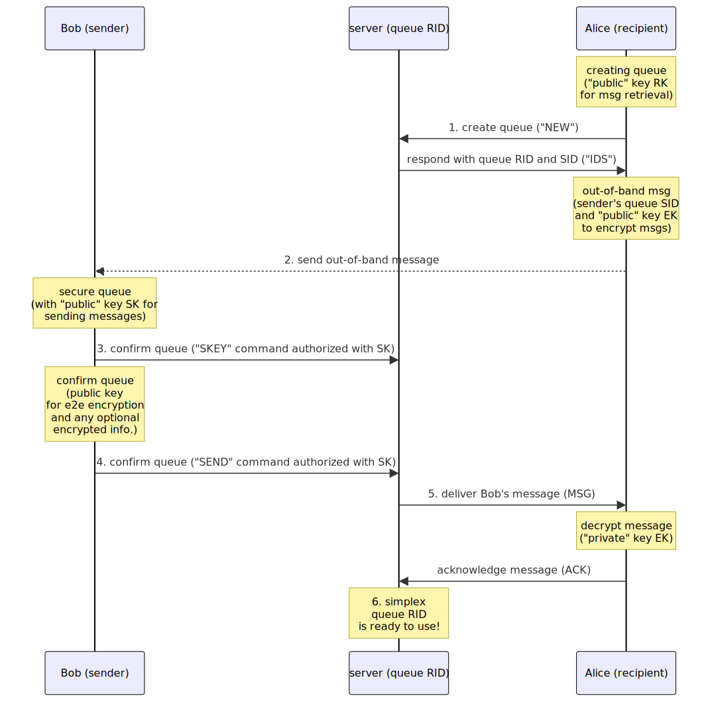

Version 9, 2024-06-22

# Simplex Messaging Protocol (SMP)

## Table of contents

- [Abstract](#abstract)
- [Introduction](#introduction)
- [SMP Model](#smp-model)
- [Out-of-band messages](#out-of-band-messages)
- [Simplex queue](#simplex-queue)
- [SMP queue URI](#smp-queue-uri)
- [SMP procedure](#smp-procedure)
- [Fast SMP procedure](#fast-smp-procedure)
- [SMP qualities and features](#smp-qualities-and-features)
- [Cryptographic algorithms](#cryptographic-algorithms)
- [Deniable client authentication scheme](#deniable-client-authentication-scheme)
- [Simplex queue IDs](#simplex-queue-ids)
- [Server security requirements](#server-security-requirements)
- [Message delivery notifications](#message-delivery-notifications)
- [SMP Transmission and transport block structure](#smp-transmission-and-transport-block-structure)
- [SMP commands](#smp-commands)
  - [Correlating responses with commands](#correlating-responses-with-commands)
  - [Command verification](#command-verification)
  - [Keep-alive command](#keep-alive-command)
  - [Recipient commands](#recipient-commands)
    - [Create queue command](#create-queue-command)
    - [Subscribe to queue](#subscribe-to-queue)
    - [Secure queue by recipient](#secure-queue-by-recipient)
    - [Enable notifications command](#enable-notifications-command)
    - [Disable notifications command](#disable-notifications-command)
    - [Get message command](#get-message-command)
    - [Acknowledge message delivery](#acknowledge-message-delivery)
    - [Suspend queue](#suspend-queue)
    - [Delete queue](#delete-queue)
    - [Get queue state](#get-queue-state)
  - [Sender commands](#sender-commands)
    - [Secure queue by sender](#secure-queue-by-sender)
    - [Send message](#send-message)
  - [Proxying sender commands](#proxying-sender-commands)
    - [Request proxied session](#request-proxied-session)
    - [Send command via proxy](#send-command-via-proxy)
    - [Forward command to destination server](#forward-command-to-destination-server)
  - [Notifier commands](#notifier-commands)
    - [Subscribe to queue notifications](#subscribe-to-queue-notifications)
  - [Server messages](#server-messages)
    - [Deliver queue message](#deliver-queue-message)
    - [Deliver message notification](#deliver-message-notification)
    - [Subscription END notification](#subscription-end-notification)
    - [Error responses](#error-responses)
    - [OK response](#ok-response)
- [Transport connection with the SMP server](#transport-connection-with-the-SMP-server)
  - [General transport protocol considerations](#general-transport-protocol-considerations)
  - [TLS transport encryption](#tls-transport-encryption)
  - [Server certificate](#server-certificate)
  - [ALPN to agree handshake version](#alpn-to-agree-handshake-version)
  - [Transport handshake](#transport-handshake)
  - [Additional transport privacy](#additional-transport-privacy)

## Abstract

Simplex Messaging Protocol is a transport agnostic client-server protocol for asynchronous distributed secure unidirectional message transmission via persistent simplex message queues.

It's designed with the focus on communication security and integrity, under the assumption that any part of the message transmission network can be compromised.

It is designed as a low level protocol for other application protocols to solve the problem of secure and private message transmission, making [MITM attack][1] very difficult at any part of the message transmission system.

This document describes SMP protocol versions 6 and 7, the previous versions are discontinued.

## Introduction

The objective of Simplex Messaging Protocol (SMP) is to facilitate the secure and private unidirectional transfer of messages from senders to recipients via persistent simplex queues managed by the message brokers (servers).

SMP is independent of any particular transmission system and requires only a reliable ordered data stream channel. While this document describes transport over TCP, other transports are also possible.

The protocol describes the set of commands that recipients and senders can exchange with SMP servers to create and to operate unidirectional "queues" (a data abstraction identifying one of many communication channels managed by the server) and to send messages from the sender to the recipient via the SMP server.

More complex communication scenarios can be designed using multiple queues - for example, a duplex communication channel can be made of 2 simplex queues.

The protocol is designed with the focus on privacy and security, to some extent deprioritizing reliability by requiring that SMP servers only store messages until they are acknowledged by the recipients and, in any case, for a limited period of time. For communication scenarios requiring more reliable transmission the users should use several SMP servers to pass each message and implement some additional protocol to ensure that messages are not removed, inserted or changed - this is out of scope of this document.

SMP does not use any form of participants' identities and provides [E2EE][2] without the possibility of [MITM attack][1] relying on two pre-requisites:

- the users can establish a secure encrypted transport connection with the SMP server. [Transport connection](#transport-connection-with-the-smp-server) section describes SMP transport protocol of such connection over TCP, but any other transport connection protocol can be used.

- the recipient can pass a single message to the sender via a pre-existing secure and private communication channel (out-of-band message) - the information in this message is used to encrypt messages and to establish connection with SMP server.

## SMP Model

The SMP model has three communication participants: the recipient, the message broker (SMP server) that is chosen and, possibly, controlled by the recipient, and the sender.

SMP server manages multiple "simplex queues" - data records on the server that identify communication channels from the senders to the recipients. The same communicating party that is the sender in one queue, can be the recipient in another - without exposing this fact to the server.

The queue record consists of 2 unique random IDs generated by the server, one for the recipient and another for the sender, and 2 keys to verify the recipient's and the sender's commands, provided by the clients. The users of SMP protocol must use a unique ephemeral keys for each queue, to prevent aggregating their queues by keys in case SMP server is compromised.

Creating and using the queue requires sending commands to the SMP server from the recipient and the sender - they are described in detail in [SMP commands](#smp-commands) section.

## Out-of-band messages

The out-of-band message with the queue information is sent via some trusted alternative channel from the recipient to the sender. This message is used to share one or several [queue URIs](#smp-queue-uri) that parties can use to establish the initial connection, the encryption scheme, including the public key(s) for end-to-end encryption.

The approach to out-of-band message passing and their syntax should be defined in application-level protocols.

## Simplex queue

The simplex queue is the main unit of SMP protocol. It is used by:

- Sender of the queue (who received out-of-band message) to send messages to the server using sender's queue ID, authorized by sender's key.

- Recipient of the queue (who created the queue and sent out-of-band message) will use it to retrieve messages from the server, authorizing the commands by the recipient key. Recipient decrypts the messages with the key negotiated during the creation of the queue.

- Participant identities are not shared with the server - new unique keys and queue IDs are used for each queue.

This simplex queue can serve as a building block for more complex communication network. For example, two (or more, for redundancy) simplex queues can be used to create a duplex communication channel. Higher level primitives that are only known to system participants in their client applications can be created as well - e.g., contacts, conversations, groups and broadcasts. Simplex messaging servers only have the information about the low-level simplex queues. In this way a high level of privacy and security of the communication is provided. Application level primitives are not in scope of this protocol.

This approach is based on the concept of [unidirectional networks][4] that are used for applications with high level of information security.

Access to each queue is controlled with unique (not shared with other queues) asymmetric key pairs, separate for the sender and the recipient. The sender and the receiver have private keys, and the server has associated public keys to authenticate participants' commands by verifying cryptographic authorizations.

The messages sent over the queue are end-to-end encrypted using the DH secret agreed via out-of-band message and SMP confirmation.

**Simplex queue diagram:**


Queue is defined by recipient ID `RID` and sender ID `SID`, unique for the server. Sender key (`SK`) is used by the server to verify sender's commands (identified by `SID`) to send messages. Recipient key (`RK`) is used by the server to verify recipient's commands (identified by `RID`) to retrieve messages.

The protocol uses different IDs for sender and recipient in order to provide an additional privacy by preventing the correlation of senders and recipients commands sent over the network - in case the encrypted transport is compromised, it would still be difficult to correlate senders and recipients without access to the queue records on the server.

## SMP queue URI

The SMP queue URIs MUST include server identity, queue hostname, an optional port, sender queue ID, and the recipient's public key to agree shared secret for e2e encryption, and an optional query string parameter `k=s` to indicate that the queue can be secured by the sender using `SKEY` command (see [Fast SMP procedure](#fast-smp-procedure) and [Secure queue by sender](#secure-queue-by-sender)). Server identity is used to establish secure connection protected from MITM attack with SMP server (see [Transport connection](#transport-connection-with-the-smp-server) for SMP transport protocol).

The [ABNF][8] syntax of the queue URI is:

```abnf
queueURI = %s"smp://" smpServer "/" queueId "#/?" versionParam keyParam [sndSecureParam]
smpServer = serverIdentity "@" srvHosts [":" port]
srvHosts = <hostname> ["," srvHosts] ; RFC1123, RFC5891
port = 1*DIGIT
serverIdentity = base64url
queueId = base64url
versionParam = %s"v=" versionRange
versionRange = 1*DIGIT / 1*DIGIT "-" 1*DIGIT
keyParam = %s"&dh=" recipientDhPublicKey
sndSecureParam = %s"&k=s"
base64url = <base64url encoded binary> ; RFC4648, section 5
recipientDhPublicKey = x509UrlEncoded
; the recipient's Curve25519 key for DH exchange to derive the secret
; that the sender will use to encrypt delivered messages
; using [NaCl crypto_box][16] encryption scheme (curve25519xsalsa20poly1305).

x509UrlEncoded = <base64url X509 key encoding>
```

`hostname` can be IP address or domain name, as defined in RFC 1123, section 2.1.

`port` is optional, the default TCP port for SMP protocol is 5223.

`serverIdentity` is a required hash of the server certificate SPKI block (without line breaks, header and footer) used by the client to validate server certificate during transport handshake (see [Transport connection](#transport-connection-with-the-smp-server))

## SMP procedure

The SMP procedure of creating a simplex queue on SMP server is explained using participants Alice (the recipient) who wants to receive messages from Bob (the sender).

To create and start using a simplex queue Alice and Bob follow these steps:

1. Alice creates a simplex queue on the server:

   1. Decides which SMP server to use (can be the same or different server that Alice uses for other queues) and opens secure encrypted transport connection to the chosen SMP server (see [Transport connection](#transport-connection-with-the-smp-server)).

   2. Generates a new random public/private key pair (encryption key - `EK`) that she did not use before to agree a shared secret with Bob to encrypt the messages.

   3. Generates another new random public/private key pair (recipient key - `RK`) that she did not use before for her to authorize commands to the server.

   4. Generates one more random key pair (recipient DH key - `RDHK`) to negotiate symmetric key that will be used by the server to encrypt message bodies delivered to Alice (to avoid shared cipher-text inside transport connection).

   5. Sends `"NEW"` command to the server to create a simplex queue (see `create` in [Create queue command](#create-queue-command)). This command contains previously generated unique "public" keys `RK` and `RDHK`. `RK` will be used by the server to verify the subsequent commands related to the same queue authorized by its private counterpart, for example to subscribe to the messages received to this queue or to update the queue, e.g. by setting the key required to send the messages (initially Alice creates the queue that accepts unauthorized messages, so anybody could send the message via this queue if they knew the queue sender's ID and server address).

   6. The server sends `IDS` response with queue IDs (`queueIds`):

      - Recipient ID `RID` for Alice to manage the queue and to receive the messages.

      - Sender ID `SID` for Bob to send messages to the queue.

      - Server public DH key (`SDHK`) to negotiate a shared secret for message body encryption, that Alice uses to derive a shared secret with the server `SS`.

2. Alice sends an out-of-band message to Bob via the alternative channel that both Alice and Bob trust (see [protocol abstract](#simplex-messaging-protocol-abstract)). The message must include [SMP queue URI](#smp-queue-uri) with:

   - Unique "public" key (`EK`) that Bob must use to agree a shared secret for E2E encryption.

   - SMP server hostname and information to open secure encrypted transport connection (see [Transport connection](#transport-connection-with-the-smp-server)).

   - Sender queue ID `SID` for Bob to use.

3. Bob, having received the out-of-band message from Alice, connects to the queue:

   1. Generates a new random public/private key pair (sender key - `SK`) that he did not use before for him to authorize messages sent to Alice's server and another key pair for e2e encryption agreement.

   2. Prepares the confirmation message for Alice to secure the queue. This message includes:

      - Previously generated "public" key `SK` that will be used by Alice's server to verify Bob's messages, once the queue is secured.

      - Public key to agree a shared secret with Alice for e2e encryption.

      - Optionally, any additional information (application specific, e.g. Bob's profile name and details).

   3. Encrypts the confirmation body with the shared secret agreed using public key `EK` (that Alice provided via the out-of-band message).

   4. Sends the encrypted message to the server with queue ID `SID` (see `send` in [Send message](#send-message)). This initial message to the queue must not be authorized - authorized messages will be rejected until Alice secures the queue (below).

4. Alice receives Bob's message from the server using recipient queue ID `RID` (possibly, via the same transport connection she already has opened - see `message` in [Deliver queue message](#deliver-queue-message)):

   1. She decrypts received message body using the secret `SS`.

   2. She decrypts received message with [key agreed with sender using] "private" key `EK`.

   3. Anybody can send the message to the queue with ID `SID` before it is secured (e.g. if communication is compromised), so it's a "race" to secure the queue. Optionally, in the client application, Alice may identify Bob using the information provided, but it is out of scope of SMP protocol.

5. Alice secures the queue `RID` with `"KEY"` command so only Bob can send messages to it (see [Secure queue command](#secure-queue-command)):

   1. She sends the `KEY` command with `RID` signed with "private" key `RK` to update the queue to only accept requests authorized by "private" key `SK` provided by Bob. This command contains unique "public" key `SK` previously generated by Bob.

   2. From this moment the server will accept only authorized commands to `SID`, so only Bob will be able to send messages to the queue `SID` (corresponding to `RID` that Alice has).

   3. Once queue is secured, Alice deletes `SID` and `SK` - even if Alice's client is compromised in the future, the attacker would not be able to send messages pretending to be Bob.

6. The simplex queue `RID` is now ready to be used.

This flow is shown on the sequence diagram below.

**Creating simplex queue from Bob to Alice:**


Bob now can securely send messages to Alice:

1. Bob sends the message:

   1. He encrypts the message to Alice with the agreed shared secret (using "public" key `EK` provided by Alice, only known to Bob, used only for one simplex queue).

   2. He authorizes `"SEND"` command to the server queue `SID` using the "private" key `SK` (that only he knows, used only for this queue).

   3. He sends the command to the server (see `send` in [Send message](#send-message)), that the server will verify using the "public" key `SK` (that Alice earlier received from Bob and provided to the server via `"KEY"` command).

2. Alice receives the message(s):

   1. She authorizes `"SUB"` command to the server to subscribe to the queue `RID` with the "private" key `RK` (see `subscribe` in [Subscribe to queue](#subscribe-to-queue)).

   2. The server, having verified Alice's command with the "public" key `RK` that she provided, delivers Bob's message(s) (see `message` in [Deliver queue message](#deliver-queue-message)).

   3. She decrypts Bob's message(s) with the shared secret agreed using "private" key `EK`.

   4. She acknowledges the message reception to the server with `"ACK"` so that the server can delete the message and deliver the next messages.

This flow is show on sequence diagram below.

**Sending messages from Bob to Alice via simplex queue:**


**Simplex queue operation:**


Sequence diagram does not show E2E encryption - server knows nothing about encryption between the sender and the receiver.

A higher level application protocol should define the semantics that allow to use two simplex queues (or two sets of queues for redundancy) for the bi-directional or any other communication scenarios.

The SMP is intentionally unidirectional - it provides no answer to how Bob will know that the transmission succeeded, and whether Alice received any messages. There may be a scenario when Alice wants to securely receive the messages from Bob, but she does not want Bob to have any proof that she received any messages - this low-level protocol can be used in this scenario, as all Bob knows as a fact is that he was able to send one unsigned message to the server that Alice provided, and now he can only send messages signed with the key `SK` that he sent to the server - it does not prove that any message was received by Alice.

For bi-directional conversation, now that Bob can securely send encrypted messages to Alice, Bob can create the second simplex queue that will allow Alice to send messages to Bob in the same way, sending the second queue details via the first queue. If both Alice and Bob have their respective unique "public" keys (Alice's and Bob's `EK`s of two separate queues), or pass additional keys to sign the messages, the conversation can be both encrypted and signed.

The established queues can also be used to change the encryption keys providing [forward secrecy][5], or to negotiate using other SMP queue(s).

This protocol also can be used for off-the-record messaging, as Alice and Bob can use multiple queues between them and only information they pass to each other allows proving their identity, so if they want to share anything off-the-record they can initiate a new queue without linking it to any other information they exchanged.

## Fast SMP procedure

V9 of SMP protocol added support for creating messaging queue in fewer steps, with the sender being able to send the messages without waiting for the recipient to be online to secure the key.

In step 1.5 of [SMP procedure](#smp-procedure) the client must use sndSecure parameter set to `T` (true) to allow sender securing the queue.

In step 2, the [SMP queue URI](#smp-queue-uri) should include parameter indicating that the sender can secure the queue.

In step 3.2, prior to sending the confirmation message Bob secures the queue using `SKEY` command. Confirmation message is now sent with sender authorization and Bob can continue sending the messages without Alice being online. This also allows faster negotiation of duplex connections.



## SMP qualities and features

Simplex Messaging Protocol:

- Defines only message-passing protocol:

  - Transport agnostic - the protocol does not define how clients connect to the servers. It can be implemented over any ordered data stream channel: TCP connection, HTTP with long polling, websockets, etc.

  - Not semantic - the protocol does not assign any meaning to queues and messages. While on the application level the queues and messages can have different meaning (e.g., for messages: text or image chat message, message acknowledgement, participant profile information, status updates, changing "public" key to encrypt messages, changing servers, etc.), on SMP protocol level all the messages are binary and their meaning can only be interpreted by client applications and not by the servers - this interpretation is out of scope of this protocol.

- Client-server architecture:

  - Multiple servers, that can be deployed by the system users, can be used to send and retrieve messages.

  - Servers do not communicate with each other, except when used as proxy to forward commands to another server, and do not "know" about other servers.

  - Clients only communicate with servers (excluding the initial out-of-band message), so the message passing is asynchronous.

  - For each queue, the message recipient defines the server through which the sender should send messages. To protect transport anonymity the sender can use their chosen server to forward commands to the server chosen by the recipient.

  - While multiple servers and multiple queues can be used to pass each message, it is in scope of application level protocol(s), and out of scope of this protocol.

  - Servers store messages only until they are retrieved by the recipients, and in any case, for a limited time.

  - Servers are required to NOT store any message history or delivery log, but even if the server is compromised, it does not allow to decrypt the messages or to determine the list of queues established by any participant - this information is only stored on client devices.

- The only element provided by SMP servers is simplex queues:

  - Each queue is created and managed by the queue recipient.

  - Asymmetric encryption is used to authorize and verify the requests to send and receive the messages.

  - One ephemeral public key is used by the servers to verify requests to send the messages into the queue, and another ephemeral public key - to verify requests to retrieve the messages from the queue. These ephemeral keys are used only for one queue, and are not used for any other context - this key does not represent any participant identity.

  - Both recipient and sender public keys are provided to the server by the queue recipient. "Public" key `RK` is provided when the queue is created, public key `SK` is provided when the queue is secured. V9 of SMP protocol allows senders to provide their key to the server directly or via proxy, to avoid waiting until the recipient is online to secure the queue.

  - The "public" keys known to the server and used to verify commands from the participants are unrelated to the keys used to encrypt and decrypt the messages - the latter keys are also unique per each queue but they are only known to participants, not to the servers.

  - Messaging graph can be asymmetric: Bob's ability to send messages to Alice does not automatically lead to the Alice's ability to send messages to Bob.

## Cryptographic algorithms

Simplex messaging clients must cryptographically authorize commands for the following operations:

- With the recipient's key `RK` (server to verify):
  - create the queue (`NEW`)
  - subscribe to queue (`SUB`)
  - secure the queue (`KEY`)
  - enable queue notifications (`NKEY`)
  - disable queue notifications (`NDEL`)
  - acknowledge received messages (`ACK`)
  - suspend the queue (`OFF`)
  - delete the queue (`DEL`)
- With the sender's key `SK` (server to verify):
  - secure queue (`SKEY`)
  - send messages (`SEND`)
- With the optional notifier's key:
  - subscribe to message notifications (`NSUB`)

To authorize/verify transmissions clients and servers MUST use either signature algorithm Ed25519 algorithm defined in [RFC8709][15] or [deniable authentication scheme](#deniable-client-authentication-scheme) based on NaCL crypto_box.

It is recommended that clients use signature algorithm for the recipient commands and deniable authentication scheme for sender commands (to have non-repudiation quality in the whole protocol stack).

To encrypt/decrypt message bodies delivered to the recipients, servers/clients MUST use NaCL crypto_box.

Clients MUST encrypt message bodies sent via SMP servers using use NaCL crypto_box.

## Deniable client authentication scheme

While e2e encryption algorithms used in the client applications have repudiation quality, which is the desirable default, using signature algorithm for command authorization has non-repudiation quality.

SMP protocol supports repudiable authenticators to authorize client commands. These authenticators use NaCl crypto_box that proves authentication and third party unforgeability and, unlike signature, provides repudiation guarantee. See [crypto_box docs](https://nacl.cr.yp.to/box.html).

When queue is created or secured, the recipient would provide a DH key (X25519) to the server (either their own or received from the sender, in case of KEY command), and the server would provide its own random X25519 key per session in the handshake header. The authenticator is computed in this way:

```abnf
transmission = authenticator authorized
authenticator = crypto_box(sha512(authorized), secret = dh(client long term queue key, server session key), nonce = correlation ID)
authorized = sessionIdentifier corrId queueId protocol_command ; same as the currently signed part of the transmission
```

## Simplex queue IDs

Simplex messaging servers MUST generate 2 different IDs for each new queue - for the recipient (that created the queue) and for the sender. It is REQUIRED that:

- These IDs are different and unique within the server.
- Based on random bytes generated with cryptographically strong pseudo-random number generator.

## Server security requirements

Simplex messaging server implementations MUST NOT create, store or send to any other servers:

- Logs of the client commands and transport connections in the production environment.

- History of deleted queues, retrieved or acknowledged messages (deleted queues MAY be stored temporarily as part of the queue persistence implementation).

- Snapshots of the database they use to store queues and messages (instead simplex messaging clients must manage redundancy by using more than one simplex messaging server). In-memory persistence is recommended.

- Any other information that may compromise privacy or [forward secrecy][4] of communication between clients using simplex messaging servers (the servers cannot compromise forward secrecy of any application layer protocol, such as double ratchet).

## Message delivery notifications

Supporting message delivery while the client mobile app is not running requires sending push notifications with the device token. All alternative mechanisms for background message delivery are unreliable, particularly on iOS platform.

To protect the privacy of the recipients, there are several commands in SMP protocol that allow enabling and subscribing to message notifications from SMP queues, using separate set of "notifier keys" and via separate queue IDs - as long as SMP server is not compromised, these notifier queue IDs cannot be correlated with recipient or sender queue IDs.

The clients can optionally instruct a dedicated push notification server to subscribe to notifications and deliver push notifications to the device, which can then retrieve the messages in the background and send local notifications to the user - this is out of scope of SMP protocol. The commands that SMP protocol provides to allow it:

- `enableNotifications` (`"NKEY"`) with `notifierId` (`"NID"`) response - see [Enable notifications command](#enable-notifications-command).
- `disableNotifications` (`"NDEL"`) - see [Disable notifications command](#disable-notifications-command).
- `subscribeNotifications` (`"NSUB"`) - see [Subscribe to queue notifications](#subscribe-to-queue-notifications).
- `messageNotification` (`"NMSG"`) - see [Deliver message notification](#deliver-message-notification).

[`SEND` command](#send-message) includes the notification flag to instruct SMP server whether to send the notification - this flag is forwarded to the recipient inside encrypted envelope, together with the timestamp and the message body, so even if TLS is compromised this flag cannot be used for traffic correlation.

## SMP Transmission and transport block structure

Each transport block has a fixed size of 16384 bytes for traffic uniformity.

Each block can contain multiple transmissions.
Some parts of SMP transmission are padded to a fixed size; the size of the unpadded string is prepended as a word16 encoded in network byte order - see `paddedString` syntax.

In places where some part of the transmission should be padded, the syntax for `paddedNotation` is used:

```abnf
paddedString = originalLength string pad
originalLength = 2*2 OCTET
pad = N*N"#" ; where N = paddedLength - originalLength - 2

paddedNotation = <padded(string, paddedLength)>
; string - un-padded string
; paddedLength - required length after padding, including 2 bytes for originalLength
```

Transport block for SMP transmission between the client and the server must have this syntax:

```abnf
paddedTransportBlock = <padded(transportBlock), 16384>
transportBlock = transmissionCount transmissions
transmissionCount = 1*1 OCTET ; equal or greater than 1
transmissions = transmissionLength transmission [transmissions]
transmissionLength = 2*2 OCTET ; word16 encoded in network byte order

transmission = authorization authorized
authorized = sessionIdentifier corrId entityId smpCommand
corrId = %x18 24*24 OCTET / %x0 ""
  ; corrId is required in client commands and server responses,
  ; it is empty (0-length) in server notifications.
  ; %x18 is 24 - the random correlation ID must be 24 bytes as it is used as a nonce for NaCL crypto_box in some contexts.
entityId = shortString ; queueId or proxySessionId
  ; empty entityId ID is used with "create" command and in some server responses
authorization = shortString ; signature or authenticator
  ; empty authorization can be used with "send" before the queue is secured with secure command
  ; authorization is always empty with "ping" and server responses
sessionIdentifier = "" ; 
sessionIdentifierForAuth = shortString 
  ; sessionIdentifierForAuth MUST be included in authorized transmission body.
  ; From v7 of SMP protocol but it is no longer used in the transmission to save space and fit more transmissions in the transport block.
shortString = length *OCTET ; length prefixed bytearray 0-255 bytes
length = 1*1 OCTET
```

## SMP commands

Commands syntax below is provided using [ABNF][8] with [case-sensitive strings extension][8a].

```abnf
smpCommand = ping / recipientCmd / senderCommand /
             proxyCommand / subscribeNotifications / serverMsg
recipientCmd = create / subscribe / rcvSecure /
               enableNotifications / disableNotifications / getMessage
               acknowledge / suspend / delete / getQueueInfo
senderCommand = send / sndSecure
proxyCommand = proxySession / proxyCommand / relayCommand
serverMsg = queueIds / message / notifierId / messageNotification /
            proxySessionKey / proxyResponse / relayResponse
            unsubscribed / queueInfo/ ok / error
```

The syntax of specific commands and responses is defined below.

### Correlating responses with commands

The server should send `queueIds`, `error` and `ok` responses in the same order within each queue ID as the commands received in the transport connection, so that they can be correlated by the clients. To simplify correlation of commands and responses, the server must use the same `corrId` in the response as in the command sent by the client.

If the transport connection is closed before some responses are sent, these responses should be discarded.

### Command verification

SMP servers must verify all transmissions (excluding `ping` and initial `send` commands) by verifying the client authorizations. Command authorization should be generated by applying the algorithm specified for the queue to the `signed` block of the transmission, using the key associated with the queue ID (recipient's, sender's or notifier's, depending on which queue ID is used).

### Keep-alive command

To keep the transport connection alive and to generate noise traffic the clients should use `ping` command to which the server responds with `ok` response. This command should be sent unsigned and without queue ID.

```abnf
ping = %s"PING"
```

This command is always send unsigned.

### Recipient commands

Sending any of the commands in this section (other than `create`, that is sent without queue ID) is only allowed with recipient's ID (`RID`). If sender's ID is used the server must respond with `"ERR AUTH"` response (see [Error responses](#error-responses)).

#### Create queue command

This command is sent by the recipient to the SMP server to create a new queue.

Servers SHOULD support basic auth with this command, to allow only server owners and trusted users to create queues on the destiation servers.

The syntax is:

```abnf
create = %s"NEW " recipientAuthPublicKey recipientDhPublicKey basicAuth subscribe sndSecure
recipientAuthPublicKey = length x509encoded
; the recipient's Ed25519 or X25519 public key to verify commands for this queue
recipientDhPublicKey = length x509encoded
; the recipient's Curve25519 key for DH exchange to derive the secret
; that the server will use to encrypt delivered message bodies
; using [NaCl crypto_box][16] encryption scheme (curve25519xsalsa20poly1305).
basicAuth = "0" / "1" shortString ; server password
subscribeMode = %s"S" / %s"C" ; S - create and subscribe, C - only create
sndSecure = %s"T" / %s"F" ; T - sender can secure the queue, from v9

x509encoded = <binary X509 key encoding>
length = 1*1 OCTET
```

If the queue is created successfully, the server must send `queueIds` response with the recipient's and sender's queue IDs and public key to encrypt delivered message bodies:

```abnf
queueIds = %s"IDS " recipientId senderId srvDhPublicKey sndSecure
serverDhPublicKey = length x509encoded
; the server's Curve25519 key for DH exchange to derive the secret
; that the server will use to encrypt delivered message bodies to the recipient
recipientId = shortString ; 16-24 bytes
senderId = shortString ; 16-24 bytes
```

Once the queue is created, depending on `subscribeMode` parameter of `NEW` command the recipient gets automatically subscribed to receive the messages from that queue, until the transport connection is closed. To start receiving the messages from the existing queue when the new transport connection is opened the client must use `subscribe` command.

`NEW` transmission MUST be authorized using the private part of the `recipientAuthPublicKey` – this verifies that the client has the private key that will be used to authorize subsequent commands for this queue.

`IDS` response transmission MUST be sent with empty queue ID (the third part of the transmission).

#### Subscribe to queue

When the simplex queue was not created in the current transport connection, the recipient must use this command to start receiving messages from it:

```abnf
subscribe = %s"SUB"
```

If subscription is successful the server must respond with the first available message or with `ok` response if no messages are available. The recipient will continue receiving the messages from this queue until the transport connection is closed or until another transport connection subscribes to the same simplex queue - in this case the first subscription should be cancelled and [subscription END notification](#subscription-end-notification) delivered.

The first message will be delivered either immediately or as soon as it is available; to receive the following message the recipient must acknowledge the reception of the message (see [Acknowledge message delivery](#acknowledge-message-delivery)).

This transmission and its response MUST be signed.

#### Secure queue by recipient

This command is only used until v8 of SMP protocol. V9 uses [SKEY](#secure-queue-by-sender).

This command is sent by the recipient to the server to add sender's key to the queue:

```abnf
rcvSecure = %s"KEY " senderAuthPublicKey
senderAuthPublicKey = length x509encoded
; the sender's Ed25519 or X25519 key to verify SEND commands for this queue
```

`senderKey` is received from the sender as part of the first message - see [Send Message](#send-message) command.

Once the queue is secured only authorized messages can be sent to it.

This command MUST be used in transmission with recipient queue ID.

#### Enable notifications command

This command is sent by the recipient to the server to add notifier's key to the queue, to allow push notifications server to receive notifications when the message arrives, via a separate queue ID, without receiving message content.

```abnf
enableNotifications = %s"NKEY " notifierKey recipientNotificationDhPublicKey
notifierKey = length x509encoded
; the notifier's Ed25519 or X25519 public key to verify NSUB command for this queue

recipientNotificationDhPublicKey = length x509encoded
; the recipient's Curve25519 key for DH exchange to derive the secret
; that the server will use to encrypt notification metadata (encryptedNMsgMeta in NMSG)
; using [NaCl crypto_box][16] encryption scheme (curve25519xsalsa20poly1305).
```

The server will respond with `notifierId` response if notifications were enabled and the notifier's key was successfully added to the queue:

```abnf
notifierId = %s"NID " notifierId srvNotificationDhPublicKey
notifierId = shortString ; 16-24 bytes
srvNotificationDhPublicKey = length x509encoded
; the server's Curve25519 key for DH exchange to derive the secret
; that the server will use to encrypt notification metadata to the recipient (encryptedNMsgMeta in NMSG)
```

This response is sent with the recipient's queue ID (the third part of the transmission).

To receive the message notifications, `subscribeNotifications` command ("NSUB") must be sent signed with the notifier's key.

#### Disable notifications command

This command is sent by the recipient to the server to remove notifier's credentials from the queue:

```abnf
disableNotifications = %s"NDEL"
```

The server must respond `ok` to this command if it was successful.

Once notifier's credentials are removed server will no longer send "NMSG" for this queue to notifier.

#### Get message command

The client can use this command to receive one message without subscribing to the queue. This command is used when processing push notifications.

The client MUST NOT use `SUB` and `GET` command on the same queue in the same transport connection - doing so would create an error.

```abnf
getMessage = %s"GET"
```

#### Acknowledge message delivery

The recipient should send the acknowledgement of message delivery once the message was stored in the client, to notify the server that the message should be deleted:

```abnf
acknowledge = %s"ACK" SP msgId
msgId = shortString
```

Client must send message ID to acknowledge a particular message - to prevent double acknowledgement (e.g., when command response times out) resulting in message being lost. If the message was not delivered or if the ID of the message does not match the last delivered message, the server SHOULD respond with `ERR NO_MSG` error.

The server should limit the time the message is stored, even if the message was not delivered or if acknowledgement is not sent by the recipient.

Having received the acknowledgement, SMP server should delete the message and then send the next available message or respond with `ok` if there are no more messages available in this simplex queue.

#### Suspend queue

The recipient can suspend a queue prior to deleting it to make sure that no messages are lost:

```abnf
suspend = %s"OFF"
```

The server must respond with `"ERR AUTH"` to any messages sent after the queue was suspended (see [Error responses](#error-responses)).

The server must respond `ok` to this command if it was successful.

This command can be sent multiple times (in case transport connection was interrupted and the response was not delivered), the server should still respond `ok` even if the queue is already suspended.

There is no command to resume the queue. Servers must delete suspended queues that were not deleted after some period of time.

#### Delete queue

The recipient can delete the queue, whether it was suspended or not.

All undelivered messages must be deleted as soon as this command is received, before the response is sent.

```abnf
delete = %s"DEL"
```

#### Get queue state

This command is used by the queue recipient to get the debugging information about the current state of the queue.

The response to that command is `INFO`.

```abnf
getQueueInfo = %s"QUE"
queueInfo = %s"INFO " info
info = <json encoded queue information>
```

The format of queue information is implementation specific, and is not part of the specification. For information, [JTD schema][17] for queue information returned by the reference implementation of SMP server is:

```json
{
  "properties": {
    "qiSnd": {"type": "boolean"},
    "qiNtf": {"type": "boolean"},
    "qiSize": {"type": "uint16"}
  },
  "optionalProperties": {
    "qiSub": {
      "properties": {
        "qSubThread": {"enum": ["noSub", "subPending", "subThread", "prohibitSub"]}
      },
      "optionalProperties": {
        "qDelivered": {"type": "string", "metadata": {"description": "message ID"}}
      }
    },
    "qiMsg": {
      "properties": {
        "msgId": {"type": "string"},
        "msgTs": {"type": "timestamp"},
        "msgType": {"enum": ["message", "quota"]}
      }
    }
  }
}
```

### Sender commands

Currently SMP defines only one command that can be used by senders - `send` message. This command must be used with sender's ID, if recipient's ID is used the server must respond with `"ERR AUTH"` response (see [Error responses](#error-responses)).

#### Secure queue by sender

This command is used from v8 of SMP protocol. V8 and earlier uses [KEY](#secure-queue-by-recipient).

This command is sent by the sender to the server to add sender's key to the queue:

```abnf
sndSecure = %s"SKEY " senderAuthPublicKey
senderAuthPublicKey = length x509encoded
; the sender's Ed25519 or X25519 key to verify SEND commands for this queue
```

Once the queue is secured only authorized messages can be sent to it.

This command MUST be used in transmission with sender queue ID.

#### Send message

This command is sent to the server by the sender both to confirm the queue after the sender received out-of-band message from the recipient and to send messages after the queue is secured:

```abnf
send = %s"SEND " msgFlags SP smpEncMessage
msgFlags = notificationFlag reserved
notificationFlag = %s"T" / %s"F"
smpEncMessage = smpEncClientMessage / smpEncConfirmation ; message up to 16064 bytes

smpEncClientMessage = smpPubHeaderNoKey msgNonce sentClientMsgBody ; message up to 16064 bytes
smpPubHeaderNoKey = smpClientVersion "0"
sentClientMsgBody = 16016*16016 OCTET

smpEncConfirmation = smpPubHeaderWithKey msgNonce sentConfirmationBody
smpPubHeaderWithKey = smpClientVersion "1" senderPublicDhKey
  ; sender's Curve25519 public key to agree DH secret for E2E encryption in this queue
  ; it is only sent in confirmation message
sentConfirmationBody = 15920*15920 OCTET ; E2E-encrypted smpClientMessage padded to 16016 bytes before encryption
senderPublicDhKey = length x509encoded

smpClientVersion = word16
x509encoded = <binary X509 key encoding>
msgNonce = 24*24 OCTET
word16 = 2*2 OCTET
```

The first message is sent to confirm the queue - it should contain sender's server key (see decrypted message syntax below) - this first message may be sent without authorization.

Once the queue is secured (see [Secure queue by sender](#secure-queue-by-sender)), the subsequent `SEND` commands must be sent with the authorization.

The server must respond with `"ERR AUTH"` response in the following cases:

- the queue does not exist or is suspended
- the queue is secured but the transmission does NOT have a authorization
- the queue is NOT secured but the transmission has a authorization

The server must respond with `"ERR QUOTA"` response when queue capacity is exceeded. The number of messages that the server can hold is defined by the server configuration. When sender reaches queue capacity the server will not accept any further messages until the recipient receives ALL messages from the queue. After the last message is delivered, the server will deliver an additional special message indicating that the queue capacity was reached. See [Deliver queue message](#deliver-queue-message)

Until the queue is secured, the server should accept any number of unsigned messages (up to queue  capacity) - it allows the sender to resend the confirmation in case of failure.

The body should be encrypted with the shared secret based on recipient's "public" key (`EK`); once decrypted it must have this format:

```abnf
sentClientMsgBody = <encrypted padded(smpClientMessage, 16016)>
smpClientMessage = emptyHeader clientMsgBody
emptyHeader = "_"
clientMsgBody = *OCTET ; up to 16016 - 2

sentConfirmationBody = <encrypted padded(smpConfirmation, 15920)>
smpConfirmation = smpConfirmationHeader confirmationBody
smpConfirmationHeader = emptyHeader / %s"K" senderKey
  ; emptyHeader is used when queue is already secured by sender
confirmationBody = *OCTET ; up to 15920 - 2
senderKey = length x509encoded
  ; the sender's Ed25519 or X25519 public key to authorize SEND commands for this queue
```

`clientHeader` in the initial unsigned message is used to transmit sender's server key and can be used in the future revisions of SMP protocol for other purposes.

SMP transmission structure for directly sent messages:

```
------- transmissions (= 16384 bytes)
    1 | transmission count (= 1)
    2 | originalLength
 299- | authorization sessionId corrId queueId %s"SEND" SP (1+114 + 1+32? + 1+24 + 1+24 + 4+1 = 203)
      ....... smpEncMessage (= 16064 bytes = 16384 - 320 bytes)
         8- | smpPubHeader (for messages it is only version and '0' to mean "no DH key" = 3 bytes)
         24 | nonce for smpClientMessage
         16 | auth tag for smpClientMessage
            ------- smpClientMessage (E2E encrypted, = 16016 bytes = 16064 - 48)
                2 | originalLength
               2- | smpPrivHeader
                  .......
                        | clientMsgBody (<= 16012 bytes = 16016 - 4)
                  .......
               0+ | smpClientMessage pad
            ------- smpClientMessage end
            |
         0+ | message pad
      ....... smpEncMessage end
  18+ | transmission pad
------- transmission end
```

SMP transmission structure for received messages:

```
------- transmissions (= 16384 bytes)
    1 | transmission count (= 1)
    2 | originalLength
 283- | authorization sessionId corrId queueId %s"MSG" SP msgId (1+114 + 1+32? + 1+24 + 1+24 + 3+1 + 1+24 = 227)
   16 | auth tag (msgId is used as nonce)
      ------- serverEncryptedMsg (= 16082 bytes = 16384 - 302 bytes)
          2 | originalLength
          8 | timestamp
         8- | message flags
            ....... smpEncMessage (= 16064 bytes = 16082 - 18 bytes)
               8- | smpPubHeader (empty header for the message)
               24 | nonce for smpClientMessage
               16 | auth tag for smpClientMessage
                  ------- smpClientMessage (E2E encrypted, = 16016 bytes = 16064 - 48 bytes)
                      2 | originalLength
                     2- | smpPrivHeader (empty header for the message)
                        ....... clientMsgBody (<= 16012 bytes = 16016 - 4)
                              -- TODO move internal structure (below) to agent protocol
                          20- | agentPublicHeader (the size is for user messages post handshake, without E2E X3DH keys - it is version and 'M' for the messages - 3 bytes in total)
                              ....... E2E double-ratchet encrypted (<= 15996 bytes = 16016 - 20)
                                  1 | encoded double ratchet header length (it is 123 now)
                                123 | encoded double ratchet header, including:
                                         2 | version
                                        16 | double-ratchet header iv
                                        16 | double-ratchet header auth tag
                                      1+88 | double-ratchet header (actual size is 69 bytes, the rest is reserved)
                                 16 | message auth tag (IV generated from chain ratchet)
                                    ------- encrypted agent message (= 15856 bytes = 15996 - 140)
                                        2 | originalLength
                                      64- | agentHeader (the actual size is 41 = 8 + 1+32)
                                        2 | %s"MM"
                                          .......
                                                | application message (<= 15788 bytes = 15856 - 68)
                                          .......
                                       0+ | encrypted agent message pad
                                    ------- encrypted agent message end
                                    |
                              ....... E2E double-ratchet encrypted end
                              |
                              -- TODO move internal structure (above) to agent protocol
                        ....... clientMsgBody end
                     0+ | smpClientMessage pad
                  ------- smpClientMessage end
                  |
            ....... smpEncMessage end
         0+ | serverEncryptedMsg pad
      ------- serverEncryptedMsg end
   0+ | transmission pad
------- transmission end
```

### Proxying sender commands

To protect transport (IP address and session) anonymity of the sender from the server chosen (and, potentially, controlled) by the recipient SMP v8 added support for proxying sender's command to the recipient's server via the server chosen by the sender.

Sequence diagram for sending the message and `SKEY` commands via SMP proxy:

```
-------------               -------------                     -------------              -------------
|  sending  |               |    SMP    |                     |    SMP    |              | receiving |
|  client   |               |   proxy   |                     |   server  |              |  client   |
-------------               -------------                     -------------              -------------
     |           `PRXY`           |                                 |                          |
     | -------------------------> |                                 |                          |
     |                            | ------------------------------> |                          |
     |                            |          SMP handshake          |                          |
     |                            | <------------------------------ |                          |
     |           `PKEY`           |                                 |                          |
     | <------------------------- |                                 |                          |
     |                            |                                 |                          |
     |        `PFWD` (s2r)        |                                 |                          |
     | -------------------------> |                                 |                          |
     |                            |           `RFWD` (p2r)          |                          |
     |                            | ------------------------------> |                          |
     |                            |           `RRES` (p2r)          |                          |
     |                            | <------------------------------ |                          |
     |        `PRES` (s2r)        |                                 |           `MSG`          |
     | <------------------------- |                                 | -----------------------> |
     |                            |                                 |           `ACK`          |
     |                            |                                 | <----------------------- |
     |                            |                                 |                          |
     |                            |                                 |                          |
```

1. The client requests (`PRXY` command) the chosen server to connect to the destination SMP server and receives (`PKEY` response) the session information, including server certificate and the session key signed by this certificate. To protect client session anonymity the proxy MUST re-use the same session with all clients that request connection with any given destination server.

2. The client encrypts the transmission (`SKEY` or `SEND`) to the destination server using the shared secret computed from per-command random key and server's session key and sends it to proxying server in `PFWD` command.

3. Proxy additionally encrypts the body to prevent correlation by ciphertext (in case TLS is compromised) and forwards it to proxy in `RFWD` command.

4. Proxy receives the double-encrypted response from the destination server, removes one encryption layer and forwards it to the client.

The diagram below shows the encryption layers for `PFWD`/`RFWD` commands and `RRES`/`PRES` responses:

- s2r - encryption between client and SMP relay, with relay key returned in relay handshake, with MITM by proxy mitigated by verifying the certificate fingerprint included in the relay address. This encryption prevents proxy server from observing commands and responses - proxy does not know how many different queues a connected client sends messages and commands to.
- e2e - end-to-end encryption per SMP queue, with additional client encryption inside it.
- p2r - additional encryption between proxy and SMP relay with the shared secret agreed in the handshake, to mitigate traffic correlation inside TLS.
- r2c - additional encryption between SMP relay and client to prevent traffic correlation inside TLS.

```
-----------------             -----------------  -- TLS --  -----------------             -----------------
|               |  -- TLS --  |               |  -- p2r --  |               |  -- TLS --  |               |
|               |  -- s2r --  |               |  -- s2r --  |               |  -- r2c --  |               |
|    sending    |  -- e2e --  |               |  -- e2e --  |               |  -- e2e --  |   receiving   |
|    client     |     MSG     |   SMP proxy   |     MSG     |   SMP server  |     MSG     |    client     |
|               |  -- e2e --  |               |  -- e2e --  |               |  -- e2e --  |               |
|               |  -- s2r --  |               |  -- s2r --  |               |  -- r2c --  |               |
|               |  -- TLS --  |               |  -- p2r --  |               |  -- TLS --  |               |
-----------------             -----------------  -- TLS --  -----------------             -----------------
```

SMP proxy is not another type of the server, it is a role that any SMP server can play when forwarding the commands.

#### Request proxied session

The sender uses this command to request the session with the destination proxy.

Servers SHOULD support basic auth with this command, to allow only server owners and trusted users to proxy commands to the destination servers.

```abnf
proxySession = %s"PRXY" SP smpServer basicAuth
smpServer = hosts port fingerprint
hosts = length 1*host
host = shortString
port = shortString
fingerprint = shortString
basicAuth = "0" / "1" shortString ; server password
```

```abnf
proxySessionKey = %s"PKEY" SP sessionId smpVersionRange certChain signedKey
sessionId = shortString
  ; Session ID (tlsunique) of the proxy with the destination server.
  ; This session ID should be used as entity ID in transmission with `PFWD` command
certChain = length 1*cert
cert = originalLength x509encoded
signedKey = originalLength x509encoded ; key signed with certificate
originalLength = 2*2 OCTET
```

When the client receives PKEY response it MUST validate that:
- the fingerprint of the received certificate matches fingerprint in the server address - it mitigates MITM attack by proxy.
- the server session key is correctly signed with the received certificate.

The proxy server may respond with error response in case the destination server is not available or in case it has an earlier version that does not support proxied commands.

#### Send command via proxy

Sender can send `SKEY` and `SEND` commands via proxy after obtaining the session ID with `PRXY` command (see [Request proxied session](#request-proxied-session)).

Transmission sent to proxy server should use session ID as entity ID and use a random correlation ID of 24 bytes as a nonce for crypto_box encryption of transmission to the destination server. The random ephemeral X25519 key to encrypt transmission should be unique per command, and it should be combined with the key sent by the server in the handshake header to proxy and to the client in `PKEY` command.

Encrypted transmission should use the received session ID from the connection between proxy server and destination server in the authorized body.

```abnf
proxyCommand = %s"PFWD" SP smpVersion commandKey <encrypted padded(transmission, 16242)>
smpVersion = 2*2 OCTET
commandKey = length x509encoded
```

The proxy server will forward the encrypted transmission in `RFWD` command (see below).

Having received the `RRES` response from the destination server, proxy server will forward `PRES` response to the client. `PRES` response should use the same correlation ID as `PFWD` command. The destination server will use this correlation ID increased by 1 as a nonce for encryption of the response.

```abnf
proxyResponse = %s"PRES" SP <encrypted padded(forwardedResponse, 16242)>
```

#### Forward command to destination server

Having received `PFWD` command from the client, the server should additionally encrypt it (without padding, as the received transmission is already encrypted by the client and padded to a fixed size) together with the correlation ID, sender command key, and protocol version, and forward it to the destination server as `RFWD` command:

Transmission forwarded to relay uses empty entity ID and its unique random correlation ID is used as a nonce to encrypt forwarded transmission. Correlation ID increased by 1 is used by the destination server as a nonce to encrypt responses.

```abnf
relayCommand = %s"RFWD" SP <encrypted(forwardedTransmission)>
forwardedTransmission = fwdCorrId fwdSmpVersion fwdCommandKey transmission
fwdCorrId = length 24*24 OCTET
  ; `fwdCorrId` - correlation ID used in `PFWD` command transmission - it is used as a nonce for client encryption,
  ; and `fwdCorrId + 1` is used as a nonce for the destination server response encryption.
fwdSmpVersion = 2*2 OCTET
fwdCommandKey = length x509encoded
transmission = *OCTET ; note that it is not prefixed with the length
```

The destination server having received this command decrypts both encryption layers (proxy and client), verifies client authorization as usual, processes it, and send the double encrypted `RRES` response to proxy.

The shared secret for encrypting transmission bodies between proxy server and destination server is agreed from proxy and destination server keys exchanged in handshake headers - proxy and server use the same shared secret during the session for the encryption between them.


```abnf
relayResponse = %s"RRES" SP <encrypted(responseTransmission)>
```

### Notifier commands

#### Subscribe to queue notifications

The push notifications server (notifier) must use this command to start receiving message notifications from the queue:

```abnf
subscribeNotifications = %s"NSUB"
```

If subscription is successful the server must respond with `ok` response if no messages are available. The notifier will be receiving the message notifications from this queue until the transport connection is closed or until another transport connection subscribes to notifications from the same simplex queue - in this case the first subscription should be cancelled and [subscription END notification](#subscription-end-notification) delivered.

The first message notification will be delivered either immediately or as soon as the message is available.

### Server messages

This section includes server events and generic command responses used for several commands.

The syntax for command-specific responses is shown together with the commands.

#### Deliver queue message

When server delivers the messages to the recipient, message body should be encrypted with the secret derived from DH exchange using the keys passed during the queue creation and returned with `queueIds` response.

This is done to prevent the possibility of correlation of incoming and outgoing traffic of SMP server inside transport protocol.

The server must deliver messages to all subscribed simplex queues on the currently open transport connection. The syntax for the message delivery is:

```abnf
message = %s"MSG" SP msgId encryptedRcvMsgBody
encryptedRcvMsgBody = <encrypt padded(rcvMsgBody, maxMessageLength + 2)>
  ; server-encrypted padded sent msgBody
  ; maxMessageLength = 16064
rcvMsgBody = timestamp msgFlags SP sentMsgBody / msgQuotaExceeded
msgQuotaExceeded = %s"QUOTA" SP timestamp
msgId = length 24*24OCTET
timestamp = 8*8OCTET
```

If the sender exceeded queue capacity the recipient will receive a special message indicating the quota was exceeded. This can be used in the higher level protocol to notify sender client that it can continue sending messages.

`msgId` - unique message ID generated by the server based on cryptographically strong random bytes. It should be used by the clients to detect messages that were delivered more than once (in case the transport connection was interrupted and the server did not receive the message delivery acknowledgement). Message ID is used as a nonce for server/recipient encryption of message bodies.

`timestamp` - system time when the server received the message from the sender as **a number of seconds** since Unix epoch (1970-01-01) encoded as 64-bit integer in network byte order. If a client system/language does not support 64-bit integers, until 2106 it is safe to simply skip the first 4 zero bytes and decode 32-bit unsigned integer (or as signed integer until 2038).

`sentMsgBody` - message sent by `SEND` command. See [Send message](#send-message).

#### Deliver message notification

The server must deliver message notifications to all simplex queues that were subscribed with `subscribeNotifications` command (`NSUB`) on the currently open transport connection. The syntax for the message notification delivery is:

```abnf
messageNotification = %s"NMSG " nmsgNonce encryptedNMsgMeta

encryptedNMsgMeta = <encrypted message metadata passed in notification>
; metadata E2E encrypted between server and recipient containing server's message ID and timestamp (allows extension),
; to be passed to the recipient by the notifier for them to decrypt
; with key negotiated in NKEY and NID commands using nmsgNonce

nmsgNonce = <nonce used in NaCl crypto_box encryption scheme>
; nonce used by the server for encryption of message metadata, to be passed to the recipient by the notifier
; for them to use in decryption of E2E encrypted metadata
```

Message notification does not contain any message data or non E2E encrypted metadata.

#### Subscription END notification

When another transport connection is subscribed to the same simplex queue, the server should unsubscribe and to send the notification to the previously subscribed transport connection:

```abnf
unsubscribed = %s"END"
```

No further messages should be delivered to unsubscribed transport connection.

#### Error responses

- incorrect block format, encoding or authorization size (`BLOCK`).
- missing or different session ID - tls-unique binding of TLS transport (`SESSION`)
- command errors (`CMD`):
  - unknown command (`UNKNOWN`).
  - error parsing command (`SYNTAX`).
  - prohibited command (`PROHIBITED`):
    - `ACK` sent without active subscription or without message delivery.
    - `GET` and `SUB` used in the same transport connection with the same queue.
  - transmission has no required authorization or queue ID (`NO_AUTH`)
  - transmission has unexpected credentials (`HAS_AUTH`)
  - transmission has no required queue ID (`NO_ENTITY`)
- proxy server errors (`PROXY`):
  - `PROTOCOL` - any error.
  - `BASIC_AUTH` - incorrect basic auth.
  - `NO_SESSION` - no destination server session with passed ID.
  - `BROKER` - destination server error:
    - `RESPONSE` - invalid server response (failed to parse).
    - `UNEXPECTED` - unexpected response.
    - `NETWORK` - network error.
    - `TIMEOUT` - command response timeout.
    - `HOST` - no compatible server host (e.g. onion when public is required, or vice versa)
    - `TRANSPORT` - handshake or other transport error:
      - `BLOCK` - error parsing transport block.
      - `VERSION` - incompatible client or server version.
      - `LARGE_MSG` - message too large.
      - `SESSION` - incorrect session ID.
      - `NO_AUTH` - absent server key - when the server did not provide a DH key to authorize commands for the queue that should be authorized with a DH key.
      - `HANDSHAKE` - transport handshake error:
        - `PARSE` - handshake syntax (parsing) error.
        - `IDENTITY` - incorrect server identity (certificate fingerprint does not match server address).
        - `BAD_AUTH` - incorrect or missing server credentials in handshake.
- authentication error (`AUTH`) - incorrect authorization, unknown (or suspended) queue, sender's ID is used in place of recipient's and vice versa, and some other cases (see [Send message](#send-message) command).
- message queue quota exceeded error (`QUOTA`) - too many messages were sent to the message queue. Further messages can only be sent after the recipient retrieves the messages.
- sent message is too large (> 16064) to be delivered (`LARGE_MSG`).
- internal server error (`INTERNAL`).

The syntax for error responses:

```abnf
error = %s"ERR " errorType
errorType = %s"BLOCK" / %s"SESSION" / %s"CMD" SP cmdError / %s"PROXY" proxyError /
            %s"AUTH" / %s"QUOTA" / %s"LARGE_MSG" / %s"INTERNAL"
cmdError = %s"SYNTAX" / %s"PROHIBITED" / %s"NO_AUTH" / %s"HAS_AUTH" / %s"NO_ENTITY"
proxyError = %s"PROTOCOL" SP errorType / %s"BROKER" SP brokerError /
             %s"BASIC_AUTH" / %s"NO_SESSION"
brokerError = %s"RESPONSE" SP shortString / %s"UNEXPECTED" SP shortString /
              %s"NETWORK" / %s"TIMEOUT" / %s"HOST" /
              %s"TRANSPORT" SP transportError
transportError = %s"BLOCK" / %s"VERSION" / %s"LARGE_MSG" / %s"SESSION" / %s"NO_AUTH" /
                 %s"HANDSHAKE" SP handshakeError
handshakeError = %s"PARSE" / %s"IDENTITY" / %s"BAD_AUTH"
```

Server implementations must aim to respond within the same time for each command in all cases when `"ERR AUTH"` response is required to prevent timing attacks (e.g., the server should verify authorization even when the queue does not exist on the server or the authorization of different type is sent, using any dummy key compatible with the used authorization).

### OK response

When the command is successfully executed by the server, it should respond with OK response:

```abnf
ok = %s"OK"
```

## Transport connection with the SMP server

### General transport protocol considerations

Both the recipient and the sender can use TCP or some other, possibly higher level, transport protocol to communicate with the server. The default TCP port for SMP server is 5223.

The transport protocol should provide the following:

- server authentication (by matching server certificate hash with `serverIdentity`),
- forward secrecy (by encrypting the traffic using ephemeral keys agreed during transport handshake),
- integrity (preventing data modification by the attacker without detection),
- unique channel binding (`sessionIdentifier`) to include in the signed part of SMP transmissions.

### TLS transport encryption

The client and server communicate using [TLS 1.3 protocol][13] restricted to:

- TLS_CHACHA20_POLY1305_SHA256 cipher suite (for better performance on mobile devices),
- ed25519 EdDSA algorithms for signatures,
- x25519 ECDHE groups for key exchange.
- servers must send the chain of 2, 3 or 4 self-signed certificates in the handshake (see [Server certificate](#server-certificate)), with the first (offline) certificate one signing the second (online) certificate. Offline certificate fingerprint is used as a server identity - it is a part of SMP server address.
- The clients must abort the connection in case a different number of certificates is sent.
- server and client TLS configuration should not allow resuming the sessions.

During TLS handshake the client must validate that the fingerprint of the online server certificate is equal to the `serverIdentity` the client received as part of SMP server address; if the server identity does not match the client must abort the connection.

### Server certificate

Servers use self-signed certificates that the clients validate by comparing the fingerprint of one of the certificates in the chain with the certificate fingerprint present in the server address.

Clients SHOULD support the chains of 2, 3 and 4 server certificates:

**2 certificates**:
1. offline server certificate:
   - its fingerprint is present in the server address.
   - its private key is not stored on the server.
2. online server certificate:
   - it must be signed by offline certificate.
   - its private key is stored on the server and is used in TLS session.

**3 certificates**:
1. offline server certificate - same as with 2 certificates.
2. online server certificate:
   - it must be signed by offline certificate.
   - its private key is stored on the server.
3. session certificate:
   - generated automatically on every server start and/or on schedule.
   - signed by online server certificate.
   - its private key is used in TLS session.

**4 certificates**:
0. offline operator identity certificate:
   - used for all servers operated by the same entity.
   - its private key is not stored on the server.
1. offline server certificate:
   - signed by offline operator certificate.
   - same as with 2 certificates.
2. online server certificate - same as with 3 certificates.
3. session certificate - same as with 3 certificates.

### ALPN to agree handshake version

Client and server use [ALPN extension][18] of TLS to agree handshake version.

Server SHOULD send `smp/1` protocol name and the client should confirm this name in order to use the current protocol version. This is added to allow support of older clients without breaking backward compatibility and to extend or modify handshake syntax.

If the client does not confirm this protocol name, the server would fall back to v6 of SMP protocol.

### Transport handshake

Once TLS handshake is complete, client and server will exchange blocks of fixed size (16384 bytes).

The first block sent by the server should be `paddedServerHello` and the client should respond with `paddedClientHello` - these blocks are used to agree SMP protocol version:

```abnf
paddedServerHello = <padded(serverHello, 16384)>
serverHello = smpVersionRange sessionIdentifier [serverCert signedServerKey] ignoredPart
smpVersionRange = minSmpVersion maxSmpVersion
minSmpVersion = smpVersion
maxSmpVersion = smpVersion
sessionIdentifier = shortString
; unique session identifier derived from transport connection handshake
; it should be included in authorized part of all SMP transmissions sent in this transport connection,
; but it must not be sent as part of the transmission in the current protocol version.
serverCert = originalLength x509encoded
signedServerKey = originalLength x509encoded ; signed by server certificate

paddedClientHello = <padded(clientHello, 16384)>
clientHello = smpVersion [clientKey] ignoredPart
; chosen SMP protocol version - it must be the maximum supported version
; within the range offered by the server
clientKey = length x509encoded

smpVersion = 2*2OCTET ; Word16 version number
originalLength = 2*2OCTET
ignoredPart = *OCTET
pad = *OCTET
```

`signedServerKey` is used to compute a shared secret to authorize client transmission - it is combined with the per-queue key that was used when the queue was created.

`clientKey` is used only by SMP proxy server when it connects to the destination server to agree shared secret for the additional encryption layer, end user clients do not use this key.

`ignoredPart` in handshake allows to add additional parameters in handshake without changing protocol version - the client and servers must ignore any extra bytes within the original block length.

For TLS transport client should assert that `sessionIdentifier` is equal to `tls-unique` channel binding defined in [RFC 5929][14] (TLS Finished message struct); we pass it in `serverHello` block to allow communication over some other transport protocol (possibly, with another channel binding).

### Additional transport privacy

For scenarios when meta-data privacy is critical, it is recommended that clients:

- communicating over Tor network,
- establish a separate connection for each SMP queue,
- send noise traffic (using PING command).

In addition to that, the servers can be deployed as Tor onion services.

[1]: https://en.wikipedia.org/wiki/Man-in-the-middle_attack
[2]: https://en.wikipedia.org/wiki/End-to-end_encryption
[3]: https://en.wikipedia.org/wiki/QR_code
[4]: https://en.wikipedia.org/wiki/Unidirectional_network
[5]: https://en.wikipedia.org/wiki/Forward_secrecy
[6]: https://en.wikipedia.org/wiki/Off-the-Record_Messaging
[8]: https://tools.ietf.org/html/rfc5234
[8a]: https://tools.ietf.org/html/rfc7405
[9]: https://tools.ietf.org/html/rfc4648#section-4
[10]: https://tools.ietf.org/html/rfc3339
[11]: https://tools.ietf.org/html/rfc5280
[12]: https://tools.ietf.org/html/rfc7714
[13]: https://datatracker.ietf.org/doc/html/rfc8446
[14]: https://datatracker.ietf.org/doc/html/rfc5929#section-3
[15]: https://www.rfc-editor.org/rfc/rfc8709.html
[16]: https://nacl.cr.yp.to/box.html
[17]: https://datatracker.ietf.org/doc/html/rfc8927
[18]: https://datatracker.ietf.org/doc/html/rfc7301
