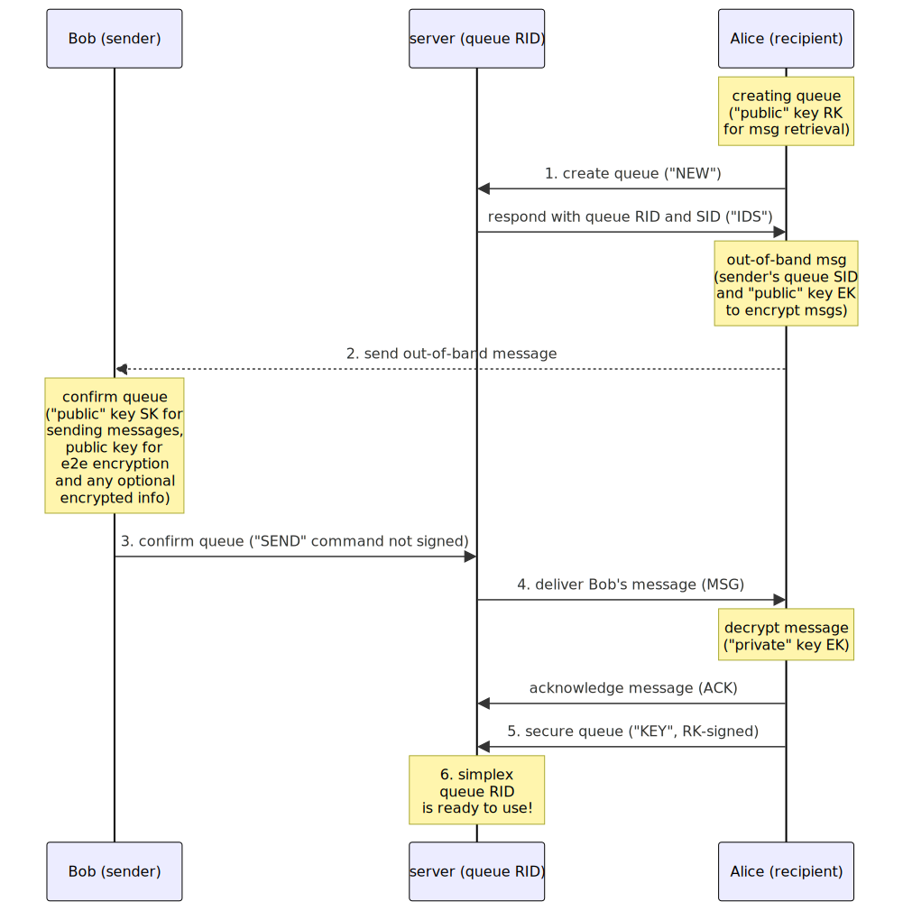
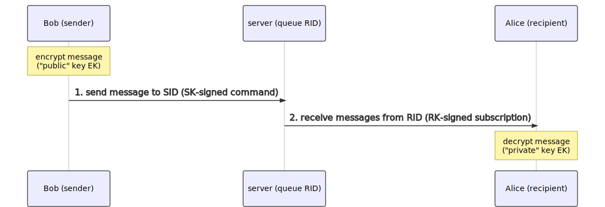
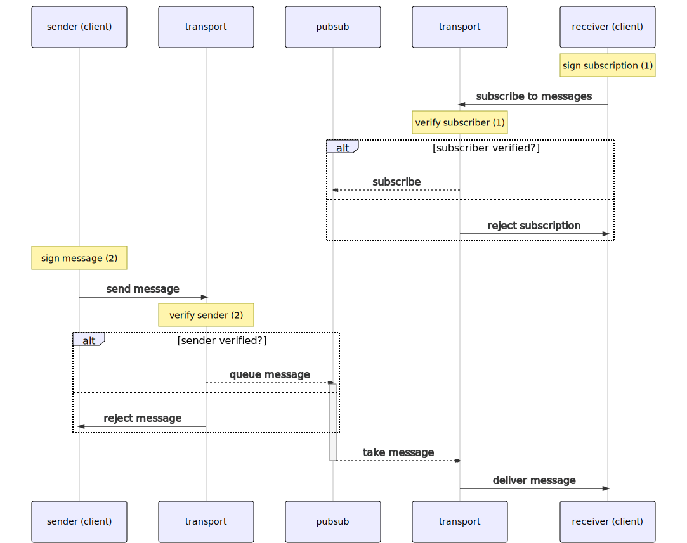
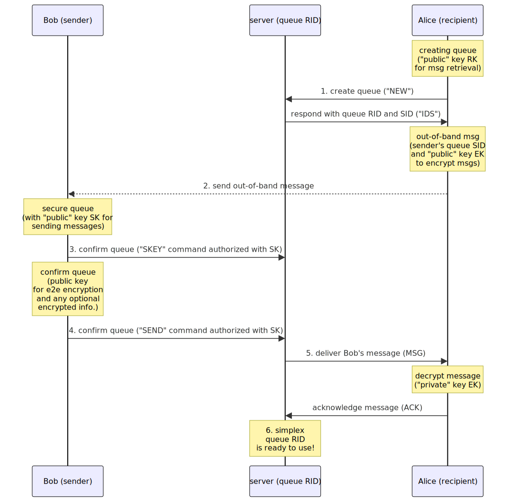

Version 19, 2025-01-24

# Simplex Messaging Protocol (SMP)

## Table of contents

- [Abstract](#abstract)
- [Introduction](#introduction)
- [SMP Model](#smp-model)
- [Out-of-band messages](#out-of-band-messages)
- [Simplex queue](#simplex-queue)
- [SMP queue URI](#smp-queue-uri)
- [SMP procedure](#smp-procedure)
- [Fast SMP procedure](#fast-smp-procedure)
- [SMP qualities and features](#smp-qualities-and-features)
- [Cryptographic algorithms](#cryptographic-algorithms)
- [Deniable client authentication scheme](#deniable-client-authentication-scheme)
- [Simplex queue IDs](#simplex-queue-ids)
- [Router security requirements](#router-security-requirements)
- [Message delivery notifications](#message-delivery-notifications)
- [Client services](#client-services)
  - [Service roles](#service-roles)
  - [Service certificates](#service-certificates)
  - [Service subscriptions](#service-subscriptions)
- [SMP Transmission and transport block structure](#smp-transmission-and-transport-block-structure)
- [SMP commands](#smp-commands)
  - [Correlating responses with commands](#correlating-responses-with-commands)
  - [Command verification](#command-verification)
  - [Keep-alive command](#keep-alive-command)
  - [Recipient commands](#recipient-commands)
    - [Create queue command](#create-queue-command)
    - [Subscribe to queue](#subscribe-to-queue)
    - [Subscribe to multiple queues](#subscribe-to-multiple-queues)
    - [Secure queue by recipient](#secure-queue-by-recipient)
    - [Set queue recipient keys](#set-queue-recipient-keys)
    - [Set short link](#set-short-link)
    - [Delete short link](#delete-short-link)
    - [Enable notifications command](#enable-notifications-command)
    - [Disable notifications command](#disable-notifications-command)
    - [Get message command](#get-message-command)
    - [Acknowledge message delivery](#acknowledge-message-delivery)
    - [Suspend queue](#suspend-queue)
    - [Delete queue](#delete-queue)
    - [Get queue state](#get-queue-state)
  - [Sender commands](#sender-commands)
    - [Secure queue by sender](#secure-queue-by-sender)
    - [Send message](#send-message)
  - [Proxying sender commands](#proxying-sender-commands)
    - [Request proxied session](#request-proxied-session)
    - [Send command via proxy](#send-command-via-proxy)
    - [Forward command to destination router](#forward-command-to-destination-router)
  - [Short link commands](#short-link-commands)
    - [Set link key](#set-link-key)
    - [Get link data](#get-link-data)
  - [Notifier commands](#notifier-commands)
    - [Subscribe to queue notifications](#subscribe-to-queue-notifications)
    - [Subscribe to multiple queue notifications](#subscribe-to-multiple-queue-notifications)
  - [Router messages](#router-messages)
    - [Link response](#link-response)
    - [Queue subscription response](#queue-subscription-response)
    - [Service subscription response](#service-subscription-response)
    - [All service messages received](#all-service-messages-received)
    - [Deliver queue message](#deliver-queue-message)
    - [Deliver message notification](#deliver-message-notification)
    - [Subscription END notification](#subscription-end-notification)
    - [Service subscription END notification](#service-subscription-end-notification)
    - [Queue deleted notification](#queue-deleted-notification)
    - [Error responses](#error-responses)
    - [OK response](#ok-response)
- [Transport connection with the SMP router](#transport-connection-with-the-SMP-router)
  - [General transport protocol considerations](#general-transport-protocol-considerations)
  - [TLS transport encryption](#tls-transport-encryption)
  - [Router certificate](#router-certificate)
  - [ALPN to agree handshake version](#alpn-to-agree-handshake-version)
  - [Transport handshake](#transport-handshake)
  - [Additional transport privacy](#additional-transport-privacy)

## Abstract

Simplex Messaging Protocol is a transport agnostic client-router protocol for asynchronous distributed secure unidirectional message transmission via persistent simplex message queues.

It's designed with the focus on communication security and integrity, under the assumption that any part of the message transmission network can be compromised.

It is designed as a low level protocol for other application protocols to solve the problem of secure and private message transmission, making [MITM attack][1] very difficult at any part of the message transmission system.

This document describes SMP protocol version 19. Versions 1-5 are discontinued. The version history:

- v1: binary protocol encoding
- v2: message flags (used to control notifications)
- v3: encrypt message timestamp and flags together with the body when delivered to recipient
- v4: support command batching
- v5: basic auth for SMP routers
- v6: allow creating queues without subscribing (current minimum version)
- v7: support authenticated encryption to verify senders' commands
- v8: SMP proxy for sender commands (PRXY, PFWD, RFWD, PKEY, PRES, RRES)
- v9: faster handshake with SKEY command for sender to secure queue
- v10: DELD event to subscriber when queue is deleted via another connection
- v11: additional encryption of transport blocks with forward secrecy
- v12: BLOCKED error for blocked queues
- v14: proxyRouter handshake property to disable transport encryption between router and proxy
- v15: short links with associated data passed in NEW or LSET command
- v16: service certificates
- v17: create notification credentials with NEW command
- v18: support client notices in BLOCKED error
- v19: service subscriptions to messages (SUBS, NSUBS, SOKS, ENDS, ALLS commands)

## Introduction

The objective of Simplex Messaging Protocol (SMP) is to facilitate the secure and private unidirectional transfer of messages from senders to recipients via persistent simplex queues managed by the message routers.

SMP is independent of any particular transmission system and requires only a reliable ordered data stream channel. While this document describes transport over TCP, other transports are also possible.

The protocol describes the set of commands that recipients and senders can exchange with SMP routers to create and to operate unidirectional "queues" (a data abstraction identifying one of many communication channels managed by the router) and to send messages from the sender to the recipient via the SMP router.

More complex communication scenarios can be designed using multiple queues - for example, a duplex communication channel can be made of 2 simplex queues.

The protocol is designed with the focus on privacy and security, to some extent deprioritizing reliability by requiring that SMP routers only store messages until they are acknowledged by the recipients and, in any case, for a limited period of time. For communication scenarios requiring more reliable transmission the users should use several SMP routers to pass each message and implement some additional protocol to ensure that messages are not removed, inserted or changed - this is out of scope of this document.

SMP does not use any form of participants' identities and provides [E2EE][2] without the possibility of [MITM attack][1] relying on two pre-requisites:

- the users can establish a secure encrypted transport connection with the SMP router. [Transport connection](#transport-connection-with-the-smp-router) section describes SMP transport protocol of such connection over TCP, but any other transport connection protocol can be used.

- the recipient can pass a single message to the sender via a pre-existing secure and private communication channel (out-of-band message) - the information in this message is used to encrypt messages and to establish connection with SMP router.

## SMP Model

The SMP model has three communication participants: the recipient, the message router (SMP router) that is chosen and, possibly, controlled by the recipient, and the sender.

SMP router manages multiple "simplex queues" - data records on the router that identify communication channels from the senders to the recipients. The same communicating party that is the sender in one queue, can be the recipient in another - without exposing this fact to the router.

The queue record consists of 2 unique random IDs generated by the router, one for the recipient and another for the sender, and 2 keys to verify the recipient's and the sender's commands, provided by the clients. The users of SMP protocol must use a unique ephemeral keys for each queue, to prevent aggregating their queues by keys in case SMP router is compromised.

Creating and using the queue requires sending commands to the SMP router from the recipient and the sender - they are described in detail in [SMP commands](#smp-commands) section.

## Out-of-band messages

The out-of-band message with the queue information is sent via some trusted alternative channel from the recipient to the sender. This message is used to share one or several [queue URIs](#smp-queue-uri) that parties can use to establish the initial connection, the encryption scheme, including the public key(s) for end-to-end encryption.

The approach to out-of-band message passing and their syntax should be defined in application-level protocols.

## Simplex queue

The simplex queue is the main unit of SMP protocol. It is used by:

- Sender of the queue (who received out-of-band message) to send messages to the router using sender's queue ID, authorized by sender's key.

- Recipient of the queue (who created the queue and sent out-of-band message) will use it to retrieve messages from the router, authorizing the commands by the recipient key. Recipient decrypts the messages with the key negotiated during the creation of the queue.

- Participant identities are not shared with the router - new unique keys and queue IDs are used for each queue.

This simplex queue can serve as a building block for more complex communication network. For example, two (or more, for redundancy) simplex queues can be used to create a duplex communication channel. Higher level primitives that are only known to system participants in their client applications can be created as well - e.g., contacts, conversations, groups and broadcasts. Simplex messaging routers only have the information about the low-level simplex queues. In this way a high level of privacy and security of the communication is provided. Application level primitives are not in scope of this protocol.

This approach is based on the concept of [unidirectional networks][4] that are used for applications with high level of information security.

Access to each queue is controlled with unique (not shared with other queues) asymmetric key pairs, separate for the sender and the recipient. The sender and the receiver have private keys, and the router has associated public keys to authenticate participants' commands by verifying cryptographic authorizations.

The messages sent over the queue are end-to-end encrypted using the DH secret agreed via out-of-band message and SMP confirmation.

**Simplex queue diagram:**



Queue is defined by recipient ID `RID` and sender ID `SID`, unique for the router. Sender key (`SK`) is used by the router to verify sender's commands (identified by `SID`) to send messages. Recipient key (`RK`) is used by the router to verify recipient's commands (identified by `RID`) to retrieve messages.

The protocol uses different IDs for sender and recipient in order to provide an additional privacy by preventing the correlation of senders and recipients commands sent over the network - in case the encrypted transport is compromised, it would still be difficult to correlate senders and recipients without access to the queue records on the router.

## SMP queue URI

The SMP queue URIs MUST include router identity, queue hostname, an optional port, sender queue ID, and the recipient's public key to agree shared secret for e2e encryption, and an optional query string parameter `k=s` to indicate that the queue can be secured by the sender using `SKEY` command (see [Fast SMP procedure](#fast-smp-procedure) and [Secure queue by sender](#secure-queue-by-sender)). Router identity is used to establish secure connection protected from MITM attack with SMP router (see [Transport connection](#transport-connection-with-the-smp-router) for SMP transport protocol).

The [ABNF][8] syntax of the queue URI is:

```abnf
queueURI = %s"smp://" smpRouter "/" queueId "#/?" versionParam keyParam [sndSecureParam]
smpRouter = routerIdentity "@" srvHosts [":" port]
srvHosts = <hostname> ["," srvHosts] ; RFC1123, RFC5891
port = 1*DIGIT
routerIdentity = base64url
queueId = base64url
versionParam = %s"v=" versionRange
versionRange = 1*DIGIT / 1*DIGIT "-" 1*DIGIT
keyParam = %s"&dh=" recipientDhPublicKey
sndSecureParam = %s"&k=s"
base64url = <base64url encoded binary> ; RFC4648, section 5
recipientDhPublicKey = x509UrlEncoded
; the recipient's Curve25519 key for DH exchange to derive the secret
; that the sender will use to encrypt delivered messages
; using [NaCl crypto_box][16] encryption scheme (curve25519xsalsa20poly1305).

x509UrlEncoded = <base64url X509 key encoding>
```

`hostname` can be IP address or domain name, as defined in RFC 1123, section 2.1.

`port` is optional, the default TCP port for SMP protocol is 5223.

`routerIdentity` is a required hash of the router certificate SPKI block (without line breaks, header and footer) used by the client to validate router certificate during transport handshake (see [Transport connection](#transport-connection-with-the-smp-router))

## SMP procedure

The SMP procedure of creating a simplex queue on SMP router is explained using participants Alice (the recipient) who wants to receive messages from Bob (the sender).

To create and start using a simplex queue Alice and Bob follow these steps:

1. Alice creates a simplex queue on the router:

   1. Decides which SMP router to use (can be the same or different router that Alice uses for other queues) and opens secure encrypted transport connection to the chosen SMP router (see [Transport connection](#transport-connection-with-the-smp-router)).

   2. Generates a new random public/private key pair (encryption key - `EK`) that she did not use before to agree a shared secret with Bob to encrypt the messages.

   3. Generates another new random public/private key pair (recipient key - `RK`) that she did not use before for her to authorize commands to the router.

   4. Generates one more random key pair (recipient DH key - `RDHK`) to negotiate symmetric key that will be used by the router to encrypt message bodies delivered to Alice (to avoid shared cipher-text inside transport connection).

   5. Sends `"NEW"` command to the router to create a simplex queue (see `create` in [Create queue command](#create-queue-command)). This command contains previously generated unique "public" keys `RK` and `RDHK`. `RK` will be used by the router to verify the subsequent commands related to the same queue authorized by its private counterpart, for example to subscribe to the messages received to this queue or to update the queue, e.g. by setting the key required to send the messages (initially Alice creates the queue that accepts unauthorized messages, so anybody could send the message via this queue if they knew the queue sender's ID and router address).

   6. The router sends `IDS` response with queue IDs (`queueIds`):

      - Recipient ID `RID` for Alice to manage the queue and to receive the messages.

      - Sender ID `SID` for Bob to send messages to the queue.

      - Router public DH key (`SDHK`) to negotiate a shared secret for message body encryption, that Alice uses to derive a shared secret with the router `SS`.

2. Alice sends an out-of-band message to Bob via the alternative channel that both Alice and Bob trust (see [protocol abstract](#simplex-messaging-protocol-abstract)). The message must include [SMP queue URI](#smp-queue-uri) with:

   - Unique "public" key (`EK`) that Bob must use to agree a shared secret for E2E encryption.

   - SMP router hostname and information to open secure encrypted transport connection (see [Transport connection](#transport-connection-with-the-smp-router)).

   - Sender queue ID `SID` for Bob to use.

3. Bob, having received the out-of-band message from Alice, connects to the queue:

   1. Generates a new random public/private key pair (sender key - `SK`) that he did not use before for him to authorize messages sent to Alice's router and another key pair for e2e encryption agreement.

   2. Prepares the confirmation message for Alice to secure the queue. This message includes:

      - Previously generated "public" key `SK` that will be used by Alice's router to verify Bob's messages, once the queue is secured.

      - Public key to agree a shared secret with Alice for e2e encryption.

      - Optionally, any additional information (application specific, e.g. Bob's profile name and details).

   3. Encrypts the confirmation body with the shared secret agreed using public key `EK` (that Alice provided via the out-of-band message).

   4. Sends the encrypted message to the router with queue ID `SID` (see `send` in [Send message](#send-message)). This initial message to the queue must not be authorized - authorized messages will be rejected until Alice secures the queue (below).

4. Alice receives Bob's message from the router using recipient queue ID `RID` (possibly, via the same transport connection she already has opened - see `message` in [Deliver queue message](#deliver-queue-message)):

   1. She decrypts received message body using the secret `SS`.

   2. She decrypts received message with [key agreed with sender using] "private" key `EK`.

   3. Anybody can send the message to the queue with ID `SID` before it is secured (e.g. if communication is compromised), so it's a "race" to secure the queue. Optionally, in the client application, Alice may identify Bob using the information provided, but it is out of scope of SMP protocol.

5. Alice secures the queue `RID` with `"KEY"` command so only Bob can send messages to it (see [Secure queue command](#secure-queue-command)):

   1. She sends the `KEY` command with `RID` signed with "private" key `RK` to update the queue to only accept requests authorized by "private" key `SK` provided by Bob. This command contains unique "public" key `SK` previously generated by Bob.

   2. From this moment the router will accept only authorized commands to `SID`, so only Bob will be able to send messages to the queue `SID` (corresponding to `RID` that Alice has).

   3. Once queue is secured, Alice deletes `SID` and `SK` - even if Alice's client is compromised in the future, the attacker would not be able to send messages pretending to be Bob.

6. The simplex queue `RID` is now ready to be used.

This flow is shown on the sequence diagram below.

**Creating simplex queue from Bob to Alice:**



Bob now can securely send messages to Alice:

1. Bob sends the message:

   1. He encrypts the message to Alice with the agreed shared secret (using "public" key `EK` provided by Alice, only known to Bob, used only for one simplex queue).

   2. He authorizes `"SEND"` command to the router queue `SID` using the "private" key `SK` (that only he knows, used only for this queue).

   3. He sends the command to the router (see `send` in [Send message](#send-message)), that the router will verify using the "public" key `SK` (that Alice earlier received from Bob and provided to the router via `"KEY"` command).

2. Alice receives the message(s):

   1. She authorizes `"SUB"` command to the router to subscribe to the queue `RID` with the "private" key `RK` (see `subscribe` in [Subscribe to queue](#subscribe-to-queue)).

   2. The router, having verified Alice's command with the "public" key `RK` that she provided, delivers Bob's message(s) (see `message` in [Deliver queue message](#deliver-queue-message)).

   3. She decrypts Bob's message(s) with the shared secret agreed using "private" key `EK`.

   4. She acknowledges the message reception to the router with `"ACK"` so that the router can delete the message and deliver the next messages.

This flow is show on sequence diagram below.

**Sending messages from Bob to Alice via simplex queue:**



**Simplex queue operation:**



Sequence diagram does not show E2E encryption - router knows nothing about encryption between the sender and the receiver.

A higher level application protocol should define the semantics that allow to use two simplex queues (or two sets of queues for redundancy) for the bi-directional or any other communication scenarios.

The SMP is intentionally unidirectional - it provides no answer to how Bob will know that the transmission succeeded, and whether Alice received any messages. There may be a scenario when Alice wants to securely receive the messages from Bob, but she does not want Bob to have any proof that she received any messages - this low-level protocol can be used in this scenario, as all Bob knows as a fact is that he was able to send one unsigned message to the router that Alice provided, and now he can only send messages signed with the key `SK` that he sent to the router - it does not prove that any message was received by Alice.

For bi-directional conversation, now that Bob can securely send encrypted messages to Alice, Bob can create the second simplex queue that will allow Alice to send messages to Bob in the same way, sending the second queue details via the first queue. If both Alice and Bob have their respective unique "public" keys (Alice's and Bob's `EK`s of two separate queues), or pass additional keys to sign the messages, the conversation can be both encrypted and signed.

The established queues can also be used to change the encryption keys providing [forward secrecy][5], or to negotiate using other SMP queue(s).

This protocol also can be used for off-the-record messaging, as Alice and Bob can use multiple queues between them and only information they pass to each other allows proving their identity, so if they want to share anything off-the-record they can initiate a new queue without linking it to any other information they exchanged.

## Fast SMP procedure

V9 of SMP protocol added support for creating messaging queue in fewer steps, with the sender being able to send the messages without waiting for the recipient to be online to secure the key.

In step 1.5 of [SMP procedure](#smp-procedure) the client must use sndSecure parameter set to `T` (true) to allow sender securing the queue.

In step 2, the [SMP queue URI](#smp-queue-uri) should include parameter indicating that the sender can secure the queue.

In step 3.2, prior to sending the confirmation message Bob secures the queue using `SKEY` command. Confirmation message is now sent with sender authorization and Bob can continue sending the messages without Alice being online. This also allows faster negotiation of duplex connections.



## SMP qualities and features

Simplex Messaging Protocol:

- Defines only message-passing protocol:

  - Transport agnostic - the protocol does not define how clients connect to the routers. It can be implemented over any ordered data stream channel: TCP connection, HTTP with long polling, websockets, etc.

  - Not semantic - the protocol does not assign any meaning to queues and messages. While on the application level the queues and messages can have different meaning (e.g., for messages: text or image chat message, message acknowledgement, participant profile information, status updates, changing "public" key to encrypt messages, changing routers, etc.), on SMP protocol level all the messages are binary and their meaning can only be interpreted by client applications and not by the routers - this interpretation is out of scope of this protocol.

- Client-router architecture:

  - Multiple routers, that can be deployed by the system users, can be used to send and retrieve messages.

  - Routers do not communicate with each other, except when used as proxy to forward commands to another router, and do not "know" about other routers.

  - Clients only communicate with routers (excluding the initial out-of-band message), so the message passing is asynchronous.

  - For each queue, the message recipient defines the router through which the sender should send messages. To protect transport anonymity the sender can use their chosen router to forward commands to the router chosen by the recipient.

  - While multiple routers and multiple queues can be used to pass each message, it is in scope of application level protocol(s), and out of scope of this protocol.

  - Routers store messages only until they are retrieved by the recipients, and in any case, for a limited time.

  - Routers are required to NOT store any message history or delivery log, but even if the router is compromised, it does not allow to decrypt the messages or to determine the list of queues established by any participant - this information is only stored on client devices.

- The only element provided by SMP routers is simplex queues:

  - Each queue is created and managed by the queue recipient.

  - Asymmetric encryption is used to authorize and verify the requests to send and receive the messages.

  - One ephemeral public key is used by the routers to verify requests to send the messages into the queue, and another ephemeral public key - to verify requests to retrieve the messages from the queue. These ephemeral keys are used only for one queue, and are not used for any other context - this key does not represent any participant identity.

  - Both recipient and sender public keys are provided to the router by the queue recipient. "Public" key `RK` is provided when the queue is created, public key `SK` is provided when the queue is secured. V9 of SMP protocol allows senders to provide their key to the router directly or via proxy, to avoid waiting until the recipient is online to secure the queue.

  - The "public" keys known to the router and used to verify commands from the participants are unrelated to the keys used to encrypt and decrypt the messages - the latter keys are also unique per each queue but they are only known to participants, not to the routers.

  - Messaging graph can be asymmetric: Bob's ability to send messages to Alice does not automatically lead to the Alice's ability to send messages to Bob.

## Cryptographic algorithms

Simplex messaging clients must cryptographically authorize commands for the following operations:

- With the recipient's key `RK` (router to verify):
  - create the queue (`NEW`)
  - subscribe to queue (`SUB`)
  - secure the queue (`KEY`)
  - enable queue notifications (`NKEY`)
  - disable queue notifications (`NDEL`)
  - acknowledge received messages (`ACK`)
  - suspend the queue (`OFF`)
  - delete the queue (`DEL`)
- With the sender's key `SK` (router to verify):
  - secure queue (`SKEY`)
  - send messages (`SEND`)
- With the optional notifier's key:
  - subscribe to message notifications (`NSUB`)

To authorize/verify transmissions clients and routers MUST use either signature algorithm Ed25519 algorithm defined in [RFC8709][15] or [deniable authentication scheme](#deniable-client-authentication-scheme) based on NaCL crypto_box.

It is recommended that clients use signature algorithm for the recipient commands and deniable authentication scheme for sender commands (to have non-repudiation quality in the whole protocol stack).

To encrypt/decrypt message bodies delivered to the recipients, routers/clients MUST use NaCL crypto_box.

Clients MUST encrypt message bodies sent via SMP routers using use NaCL crypto_box.

## Deniable client authentication scheme

While e2e encryption algorithms used in the client applications have repudiation quality, which is the desirable default, using signature algorithm for command authorization has non-repudiation quality.

SMP protocol supports repudiable authenticators to authorize client commands. These authenticators use NaCl crypto_box that proves authentication and third party unforgeability and, unlike signature, provides repudiation guarantee. See [crypto_box docs](https://nacl.cr.yp.to/box.html).

When queue is created or secured, the recipient would provide a DH key (X25519) to the router (either their own or received from the sender, in case of KEY command), and the router would provide its own random X25519 key per session in the handshake header. The authenticator is computed in this way:

```abnf
transmission = authenticator authorized
authenticator = crypto_box(sha512(authorized), secret = dh(client long term queue key, router session key), nonce = correlation ID)
authorized = sessionIdentifier corrId queueId protocol_command ; same as the currently signed part of the transmission
```

## Simplex queue IDs

Simplex messaging routers MUST generate 2 different IDs for each new queue - for the recipient (that created the queue) and for the sender. It is REQUIRED that:

- These IDs are different and unique within the router.
- Based on random bytes generated with cryptographically strong pseudo-random number generator.

## Router security requirements

Simplex messaging router implementations MUST NOT create, store or send to any other routers:

- Logs of the client commands and transport connections in the production environment.

- History of deleted queues, retrieved or acknowledged messages (deleted queues MAY be stored temporarily as part of the queue persistence implementation).

- Snapshots of the database they use to store queues and messages (instead simplex messaging clients must manage redundancy by using more than one simplex messaging router). In-memory persistence is recommended.

- Any other information that may compromise privacy or [forward secrecy][4] of communication between clients using simplex messaging routers (the routers cannot compromise forward secrecy of any application layer protocol, such as double ratchet).

## Message delivery notifications

Supporting message delivery while the client mobile app is not running requires sending push notifications with the device token. All alternative mechanisms for background message delivery are unreliable, particularly on iOS platform.

To protect the privacy of the recipients, there are several commands in SMP protocol that allow enabling and subscribing to message notifications from SMP queues, using separate set of "notifier keys" and via separate queue IDs - as long as SMP router is not compromised, these notifier queue IDs cannot be correlated with recipient or sender queue IDs.

The clients can optionally instruct a dedicated push notification router to subscribe to notifications and deliver push notifications to the device, which can then retrieve the messages in the background and send local notifications to the user - this is out of scope of SMP protocol. The commands that SMP protocol provides to allow it:

- `enableNotifications` (`"NKEY"`) with `notifierIdResp` (`"NID"`) response - see [Enable notifications command](#enable-notifications-command).
- `disableNotifications` (`"NDEL"`) - see [Disable notifications command](#disable-notifications-command).
- `subscribeNotifications` (`"NSUB"`) - see [Subscribe to queue notifications](#subscribe-to-queue-notifications).
- `messageNotification` (`"NMSG"`) - see [Deliver message notification](#deliver-message-notification).

[`SEND` command](#send-message) includes the notification flag to instruct SMP router whether to send the notification - this flag is forwarded to the recipient inside encrypted envelope, together with the timestamp and the message body, so even if TLS is compromised this flag cannot be used for traffic correlation.

## Client services

SMP protocol supports client services - high capacity clients that act as services. Client services allow scalable message and notification delivery services.

### Service roles

A client service can have one of three roles:

- **Messaging** (`"M"`) - Message receiver service that subscribes to and receives messages from multiple SMP queues with a single command.

- **Notifications** (`"N"`) - Notification service that subscribes to queue notifications and delivers push notifications to user devices.

- **Proxy** (`"P"`) - Proxy service that forwards sender commands to destination routers.

Service role is identified in the transport handshake and determines what commands the service is authorized to send.

### Service certificates

To send service commands, services should authenticate themselves to SMP routers using service certificates. This provides:

- **Service identity** - The router assigns a unique service ID based on the service certificate, allowing associating multiple SMP queues with a service.
- **Subscription management** - Services can efficiently manage subscriptions across reconnections without re-subscribing to individual queues.
- **Rate limiting** - Routers can apply rate limits per service identity rather than per connection.

Service certificates are included in the client handshake and verified by the router. The service receives a service ID in the handshake response, which is then used as entity ID in service transmissions.

```abnf
clientHandshakeService = serviceRole serviceCertKey
serviceRole = %s"M" / %s"N" / %s"P" ; Messaging / Notifier / Proxy
serviceCertKey = certChainPubKey
```

### Service subscriptions

Services use batch subscription commands to subscribe to multiple queues:

- **SUBS** - Subscribe to messages from all associated SMP queues at once. The service provides a count and hash of queue IDs, and receives `SOKS` response with the service ID.
- **NSUBS** - Subscribe to notifications from all associated SMP queues. Similar to SUBS.
- **SOKS** - Router response confirming batch subscription success.
- **ENDS** - Router notification when batch subscriptions are terminated (e.g., when another instance of service connects).

## SMP Transmission and transport block structure

Each transport block has a fixed size of 16384 bytes for traffic uniformity.

Each block can contain multiple transmissions.
Some parts of SMP transmission are padded to a fixed size; the size of the unpadded string is prepended as a word16 encoded in network byte order - see `paddedString` syntax.

In places where some part of the transmission should be padded, the syntax for `paddedNotation` is used:

```abnf
paddedString = originalLength string pad
originalLength = 2*2 OCTET
pad = N*N"#" ; where N = paddedLength - originalLength - 2

paddedNotation = <padded(string, paddedLength)>
; string - un-padded string
; paddedLength - required length after padding, including 2 bytes for originalLength
```

Transport block for SMP transmission between the client and the router must have this syntax:

```abnf
paddedTransportBlock = <padded(transportBlock), 16384>
transportBlock = transmissionCount transmissions
transmissionCount = 1*1 OCTET ; equal or greater than 1
transmissions = transmissionLength transmission [transmissions]
transmissionLength = 2*2 OCTET ; word16 encoded in network byte order

transmission = authorization [serviceSig] authorized
authorized = sessionIdentifier corrId entityId smpCommand
corrId = %x18 24*24 OCTET / %x0 ""
  ; corrId is required in client commands and router responses,
  ; it is empty (0-length) in router notifications.
  ; %x18 is 24 - the random correlation ID must be 24 bytes as it is used as a nonce for NaCL crypto_box in some contexts.
entityId = shortString ; queueId or proxySessionId
  ; empty entityId ID is used with "create" command and in some router responses
authorization = shortString ; signature or authenticator
  ; empty authorization can be used with "send" before the queue is secured with secure command
  ; authorization is always empty with "ping" and router responses
serviceSig = shortString ; optional Ed25519 service signature (v16+)
  ; present only in service sessions when authorization is non-empty
sessionIdentifier = "" ; 
sessionIdentifierForAuth = shortString 
  ; sessionIdentifierForAuth MUST be included in authorized transmission body.
  ; From v7 of SMP protocol but it is no longer used in the transmission to save space and fit more transmissions in the transport block.
shortString = length *OCTET ; length prefixed bytearray 0-255 bytes
length = 1*1 OCTET
```

## SMP commands

Commands syntax below is provided using [ABNF][8] with [case-sensitive strings extension][8a].

```abnf
smpCommand = ping / recipientCmd / senderCommand /
             proxyCommand / notifierCommand / linkCommand / routerMsg
recipientCmd = create / subscribe / subscribeMultiple / rcvSecure / recipientKeys /
               enableNotifications / disableNotifications / getMessage
               acknowledge / suspend / delete / getQueueInfo / setShortLink / deleteShortLink
senderCommand = send / sndSecure
linkCommand = setLinkKey / getLinkData
proxyCommand = proxySession / proxyForward / relayForward
notifierCommand = subscribeNotifications / subscribeNotificationsMultiple
routerMsg = queueIds / linkResponse / serviceOk / serviceOkMultiple /
            message / allReceived / notifierIdResp / messageNotification /
            proxySessionKey / proxyResponse / relayResponse /
            unsubscribed / serviceUnsubscribed / deleted /
            queueInfo / ok / error / pong
```

The syntax of specific commands and responses is defined below.

### Correlating responses with commands

The router should send `queueIds`, `error` and `ok` responses in the same order within each queue ID as the commands received in the transport connection, so that they can be correlated by the clients. To simplify correlation of commands and responses, the router must use the same `corrId` in the response as in the command sent by the client.

If the transport connection is closed before some responses are sent, these responses should be discarded.

### Command verification

SMP routers must verify all transmissions (excluding `ping` and initial `send` commands) by verifying the client authorizations. Command authorization should be generated by applying the algorithm specified for the queue to the `signed` block of the transmission, using the key associated with the queue ID (recipient's, sender's or notifier's, depending on which queue ID is used).

### Keep-alive command

To keep the transport connection alive and to generate noise traffic the clients should use `ping` command to which the router responds with `pong` response. This command should be sent unsigned and without queue ID.

```abnf
ping = %s"PING"
pong = %s"PONG"
```

This command is always sent unsigned.

### Recipient commands

Sending any of the commands in this section (other than `create`, that is sent without queue ID) is only allowed with recipient's ID (`RID`). If sender's ID is used the router must respond with `"ERR AUTH"` response (see [Error responses](#error-responses)).

#### Create queue command

This command is sent by the recipient to the SMP router to create a new queue.

Routers SHOULD support basic auth with this command, to allow only router owners and trusted users to create queues on the destiation routers.

The syntax is:

```abnf
create = %s"NEW " recipientAuthPublicKey recipientDhPublicKey optBasicAuth subscribeMode optQueueReqData optNtfCreds
recipientAuthPublicKey = length x509encoded
; the recipient's Ed25519 or X25519 public key to verify commands for this queue
recipientDhPublicKey = length x509encoded
; the recipient's Curve25519 key for DH exchange to derive the secret
; that the router will use to encrypt delivered message bodies
; using [NaCl crypto_box][16] encryption scheme (curve25519xsalsa20poly1305).
optBasicAuth = %s"0" / (%s"1" shortString) ; optional router password
subscribeMode = %s"S" / %s"C" ; S - create and subscribe, C - only create
optQueueReqData = %s"0" / (%s"1" queueReqData) ; optional queue request data
queueReqData = queueReqMessaging / queueReqContact
queueReqMessaging = %s"M" optMessagingLinkData
queueReqContact = %s"C" optContactLinkData
optMessagingLinkData = %s"0" / (%s"1" senderId encFixedData encUserData)
optContactLinkData = %s"0" / (%s"1" linkId senderId encFixedData encUserData)
senderId = shortString ; first 24 bytes of SHA3-384(corrId)
linkId = shortString
encFixedData = largeString ; encrypted fixed link data
encUserData = largeString ; encrypted user data
optNtfCreds = %s"0" / (%s"1" ntfKey ntfDhKey) ; optional notification credentials
ntfKey = length x509encoded
ntfDhKey = length x509encoded

x509encoded = <binary X509 key encoding>
shortString = length *OCTET
largeString = length2 *OCTET
length = 1*1 OCTET
length2 = 2*2 OCTET ; Word16, network byte order
```

If the queue is created successfully, the router must send `queueIds` response with the recipient's and sender's queue IDs and public key to encrypt delivered message bodies:

```abnf
queueIds = %s"IDS " recipientId senderId srvDhPublicKey optQueueMode optLinkId optServiceId optRouterNtfCreds
srvDhPublicKey = length x509encoded
; the router's Curve25519 key for DH exchange to derive the secret
; that the router will use to encrypt delivered message bodies to the recipient
recipientId = shortString ; 16-24 bytes
senderId = shortString ; 16-24 bytes
optQueueMode = %s"0" / (%s"1" queueMode)
queueMode = %s"M" / %s"C" ; M - messaging (sender can secure), C - contact
optLinkId = %s"0" / (%s"1" linkId)
linkId = shortString
optServiceId = %s"0" / (%s"1" serviceId)
serviceId = shortString
optRouterNtfCreds = %s"0" / (%s"1" srvNtfId srvNtfDhKey)
srvNtfId = shortString
srvNtfDhKey = length x509encoded
```

Once the queue is created, depending on `subscribeMode` parameter of `NEW` command the recipient gets automatically subscribed to receive the messages from that queue, until the transport connection is closed. To start receiving the messages from the existing queue when the new transport connection is opened the client must use `subscribe` command.

`NEW` transmission MUST be authorized using the private part of the `recipientAuthPublicKey` – this verifies that the client has the private key that will be used to authorize subsequent commands for this queue.

`IDS` response transmission MUST be sent with empty queue ID (the third part of the transmission).

#### Subscribe to queue

When the simplex queue was not created in the current transport connection, the recipient must use this command to start receiving messages from it:

```abnf
subscribe = %s"SUB"
```

If subscription is successful the router must respond with the first available message or with [queue subscription response](#queue-subscription-response) (`SOK`) if no messages are available. The recipient will continue receiving the messages from this queue until the transport connection is closed or until another transport connection subscribes to the same simplex queue - in this case the first subscription should be cancelled and [subscription END notification](#subscription-end-notification) delivered.

The first message will be delivered either immediately or as soon as it is available; to receive the following message the recipient must acknowledge the reception of the message (see [Acknowledge message delivery](#acknowledge-message-delivery)).

This transmission and its response MUST be signed.

#### Subscribe to multiple queues

This command is used by recipient services to subscribe to multiple queues at once:

```abnf
subscribeMultiple = %s"SUBS " count idsHash
count = 8*8 OCTET ; Int64, network byte order (big-endian)
idsHash = 16*16 OCTET ; XOR of MD5 hashes of all queue IDs
```

The count and idsHash allow the router to detect subscription drift. The router responds with `serviceOkMultiple` (`SOKS`) response.

#### Secure queue by recipient

This command is only used until v8 of SMP protocol. V9 uses [SKEY](#secure-queue-by-sender).

This command is sent by the recipient to the router to add sender's key to the queue:

```abnf
rcvSecure = %s"KEY " senderAuthPublicKey
senderAuthPublicKey = length x509encoded
; the sender's Ed25519 or X25519 key to verify SEND commands for this queue
```

`senderKey` is received from the sender as part of the first message - see [Send Message](#send-message) command.

Once the queue is secured only authorized messages can be sent to it.

This command MUST be used in transmission with recipient queue ID.

#### Set queue recipient keys

This command is used to set additional recipient keys to support shared management of the queue:

```abnf
recipientKeys = %s"RKEY " recipientKeysList
recipientKeysList = count 1*recipientKey ; non-empty list
count = 1*1 OCTET ; number of keys (1-255)
recipientKey = length x509encoded
```

This command added to allow multiple group owners manage data of the same queue link.

#### Set short link

This command is used to associate a short link with the queue:

```abnf
setShortLink = %s"LSET " linkId encFixedData encUserData
linkId = shortString
encFixedData = largeString ; encrypted fixed link data
encUserData = largeString ; encrypted user data (e.g., profile)
largeString = length2 *OCTET
length2 = 2*2 OCTET ; Word16, network byte order (big-endian)
```

The router responds with `OK` response if successful.

#### Delete short link

This command is used to remove a short link association from the queue:

```abnf
deleteShortLink = %s"LDEL"
```

The router responds with `OK` or `ERR`

#### Enable notifications command

This command is sent by the recipient to the router to add notifier's key to the queue, to allow push notifications router to receive notifications when the message arrives, via a separate queue ID, without receiving message content.

```abnf
enableNotifications = %s"NKEY " notifierKey recipientNotificationDhPublicKey
notifierKey = length x509encoded
; the notifier's Ed25519 or X25519 public key to verify NSUB command for this queue

recipientNotificationDhPublicKey = length x509encoded
; the recipient's Curve25519 key for DH exchange to derive the secret
; that the router will use to encrypt notification metadata (encryptedNMsgMeta in NMSG)
; using [NaCl crypto_box][16] encryption scheme (curve25519xsalsa20poly1305).
```

The router will respond with `NID` response if notifications were enabled and the notifier's key was successfully added to the queue:

```abnf
notifierIdResponse = %s"NID " notifierId srvNotificationDhPublicKey
notifierId = shortString ; 16-24 bytes
srvNotificationDhPublicKey = length x509encoded
; the router's Curve25519 key for DH exchange to derive the secret
; that the router will use to encrypt notification metadata to the recipient (encryptedNMsgMeta in NMSG)
```

This response is sent with the recipient's queue ID (the third part of the transmission).

To receive the message notifications, `subscribeNotifications` command ("NSUB") must be sent signed with the notifier's key.

#### Disable notifications command

This command is sent by the recipient to the router to remove notifier's credentials from the queue:

```abnf
disableNotifications = %s"NDEL"
```

The router must respond `ok` to this command if it was successful.

Once notifier's credentials are removed router will no longer send "NMSG" for this queue to notifier.

#### Get message command

The client can use this command to receive one message without subscribing to the queue. This command is used when processing push notifications.

The client MUST NOT use `SUB` and `GET` command on the same queue in the same transport connection - doing so would create an error.

```abnf
getMessage = %s"GET"
```

#### Acknowledge message delivery

The recipient should send the acknowledgement of message delivery once the message was stored in the client, to notify the router that the message should be deleted:

```abnf
acknowledge = %s"ACK" SP msgId
msgId = shortString
```

Client must send message ID to acknowledge a particular message - to prevent double acknowledgement (e.g., when command response times out) resulting in message being lost. If the message was not delivered or if the ID of the message does not match the last delivered message, the router SHOULD respond with `ERR NO_MSG` error.

The router should limit the time the message is stored, even if the message was not delivered or if acknowledgement is not sent by the recipient.

Having received the acknowledgement, SMP router should delete the message and then send the next available message or respond with `ok` if there are no more messages available in this simplex queue.

#### Suspend queue

The recipient can suspend a queue prior to deleting it to make sure that no messages are lost:

```abnf
suspend = %s"OFF"
```

The router must respond with `"ERR AUTH"` to any messages sent after the queue was suspended (see [Error responses](#error-responses)).

The router must respond `ok` to this command if it was successful.

This command can be sent multiple times (in case transport connection was interrupted and the response was not delivered), the router should still respond `ok` even if the queue is already suspended.

There is no command to resume the queue. Routers must delete suspended queues that were not deleted after some period of time.

#### Delete queue

The recipient can delete the queue, whether it was suspended or not.

All undelivered messages must be deleted as soon as this command is received, before the response is sent.

```abnf
delete = %s"DEL"
```

#### Get queue state

This command is used by the queue recipient to get the debugging information about the current state of the queue.

The response to that command is `INFO`.

```abnf
getQueueInfo = %s"QUE"
queueInfo = %s"INFO " info
info = <json encoded queue information>
```

The format of queue information is implementation specific, and is not part of the specification. For information, [JTD schema][17] for queue information returned by the reference implementation of SMP router is:

```json
{
  "properties": {
    "qiSnd": {"type": "boolean"},
    "qiNtf": {"type": "boolean"},
    "qiSize": {"type": "uint16"}
  },
  "optionalProperties": {
    "qiSub": {
      "properties": {
        "qSubThread": {"enum": ["noSub", "subPending", "subThread", "prohibitSub"]}
      },
      "optionalProperties": {
        "qDelivered": {"type": "string", "metadata": {"description": "message ID"}}
      }
    },
    "qiMsg": {
      "properties": {
        "msgId": {"type": "string"},
        "msgTs": {"type": "timestamp"},
        "msgType": {"enum": ["message", "quota"]}
      }
    }
  }
}
```

### Sender commands

Currently SMP defines only one command that can be used by senders - `send` message. This command must be used with sender's ID, if recipient's ID is used the router must respond with `"ERR AUTH"` response (see [Error responses](#error-responses)).

#### Secure queue by sender

This command is used from v8 of SMP protocol. V8 and earlier uses [KEY](#secure-queue-by-recipient).

This command is sent by the sender to the router to add sender's key to the queue:

```abnf
sndSecure = %s"SKEY " senderAuthPublicKey
senderAuthPublicKey = length x509encoded
; the sender's Ed25519 or X25519 key to verify SEND commands for this queue
```

Once the queue is secured only authorized messages can be sent to it.

This command MUST be used in transmission with sender queue ID.

#### Send message

This command is sent to the router by the sender both to confirm the queue after the sender received out-of-band message from the recipient and to send messages after the queue is secured:

```abnf
send = %s"SEND " msgFlags SP smpEncMessage
msgFlags = notificationFlag reserved
notificationFlag = %s"T" / %s"F"
smpEncMessage = smpEncClientMessage / smpEncConfirmation ; message up to 16048 bytes (v11+)

smpEncClientMessage = smpPubHeaderNoKey msgNonce sentClientMsgBody ; message up to maxMessageLength bytes
smpPubHeaderNoKey = smpClientVersion "0"
sentClientMsgBody = 16000*16000 OCTET ; = maxMessageLength(v11+) - 48 = 16048 - 48

smpEncConfirmation = smpPubHeaderWithKey msgNonce sentConfirmationBody
smpPubHeaderWithKey = smpClientVersion "1" senderPublicDhKey
  ; sender's Curve25519 public key to agree DH secret for E2E encryption in this queue
  ; it is only sent in confirmation message
sentConfirmationBody = 15904*15904 OCTET ; E2E-encrypted smpClientMessage padded to e2eEncMessageLength before encryption
senderPublicDhKey = length x509encoded

smpClientVersion = word16
x509encoded = <binary X509 key encoding>
msgNonce = 24*24 OCTET
word16 = 2*2 OCTET
```

The first message is sent to confirm the queue - it should contain sender's router key (see decrypted message syntax below) - this first message may be sent without authorization.

Once the queue is secured (see [Secure queue by sender](#secure-queue-by-sender)), the subsequent `SEND` commands must be sent with the authorization.

The router must respond with `"ERR AUTH"` response in the following cases:

- the queue does not exist or is suspended
- the queue is secured but the transmission does NOT have a authorization
- the queue is NOT secured but the transmission has a authorization

The router must respond with `"ERR QUOTA"` response when queue capacity is exceeded. The number of messages that the router can hold is defined by the router configuration. When sender reaches queue capacity the router will not accept any further messages until the recipient receives ALL messages from the queue. After the last message is delivered, the router will deliver an additional special message indicating that the queue capacity was reached. See [Deliver queue message](#deliver-queue-message)

Until the queue is secured, the router should accept any number of unsigned messages (up to queue  capacity) - it allows the sender to resend the confirmation in case of failure.

The body should be encrypted with the shared secret based on recipient's "public" key (`EK`); once decrypted it must have this format:

```abnf
sentClientMsgBody = <encrypted padded(smpClientMessage, e2eEncMessageLength)>
  ; e2eEncMessageLength = 16000
smpClientMessage = emptyHeader clientMsgBody
emptyHeader = "_"
clientMsgBody = *OCTET ; up to e2eEncMessageLength - 2

sentConfirmationBody = <encrypted padded(smpConfirmation, e2eEncConfirmationLength)>
  ; e2eEncConfirmationLength = 15904
smpConfirmation = smpConfirmationHeader confirmationBody
smpConfirmationHeader = emptyHeader / %s"K" senderKey
  ; emptyHeader is used when queue is already secured by sender
confirmationBody = *OCTET ; up to e2eEncConfirmationLength - 2
senderKey = length x509encoded
  ; the sender's Ed25519 or X25519 public key to authorize SEND commands for this queue
```

`clientHeader` in the initial unsigned message is used to transmit sender's router key and can be used in the future revisions of SMP protocol for other purposes.

SMP transmission structure for directly sent messages:

```
------- transmissions (= 16384 bytes)
    1 | transmission count (= 1)
    2 | originalLength
 299- | authorization sessionId corrId queueId %s"SEND" SP (1+114 + 1+32? + 1+24 + 1+24 + 4+1 = 203)
      ....... smpEncMessage (= 16048 bytes for v11+, within 16384 - 320 bytes)
         8- | smpPubHeader (for messages it is only version and '0' to mean "no DH key" = 3 bytes)
         24 | nonce for smpClientMessage
         16 | auth tag for smpClientMessage
            ------- smpClientMessage (E2E encrypted, = 16000 bytes = 16048 - 48, for v11+)
                2 | originalLength
               2- | smpPrivHeader
                  .......
                        | clientMsgBody (<= 15996 bytes = 16000 - 4)
                  .......
               0+ | smpClientMessage pad
            ------- smpClientMessage end
            |
         0+ | message pad
      ....... smpEncMessage end
  18+ | transmission pad
------- transmission end
```

SMP transmission structure for received messages:

```
------- transmissions (= 16384 bytes)
    1 | transmission count (= 1)
    2 | originalLength
 283- | authorization sessionId corrId queueId %s"MSG" SP msgId (1+114 + 1+32? + 1+24 + 1+24 + 3+1 + 1+24 = 227)
   16 | auth tag (msgId is used as nonce)
      ------- routerEncryptedMsg (= 16082 bytes = 16384 - 302 bytes)
          2 | originalLength
          8 | timestamp
         8- | message flags
            ....... smpEncMessage (= 16048 bytes for v11+, padded within 16082 - 18 = 16064 bytes)
               8- | smpPubHeader (empty header for the message)
               24 | nonce for smpClientMessage
               16 | auth tag for smpClientMessage
                  ------- smpClientMessage (E2E encrypted, = 16000 bytes = 16048 - 48 bytes, for v11+)
                      2 | originalLength
                     2- | smpPrivHeader (empty header for the message)
                        ....... clientMsgBody (<= 15996 bytes = 16000 - 4)
                              -- TODO move internal structure (below) to agent protocol
                          20- | agentPublicHeader (the size is for user messages post handshake, without E2E X3DH keys - it is version and 'M' for the messages - 3 bytes in total)
                              ....... E2E double-ratchet encrypted (<= 15980 bytes = 16000 - 20)
                                  1 | encoded double ratchet header length (it is 123 now)
                                123 | encoded double ratchet header, including:
                                         2 | version
                                        16 | double-ratchet header iv
                                        16 | double-ratchet header auth tag
                                      1+88 | double-ratchet header (actual size is 69 bytes, the rest is reserved)
                                 16 | message auth tag (IV generated from chain ratchet)
                                    ------- encrypted agent message (= 15840 bytes = 15980 - 140)
                                        2 | originalLength
                                      64- | agentHeader (the actual size is 41 = 8 + 1+32)
                                        2 | %s"MM"
                                          .......
                                                | application message (<= 15772 bytes = 15840 - 68)
                                          .......
                                       0+ | encrypted agent message pad
                                    ------- encrypted agent message end
                                    |
                              ....... E2E double-ratchet encrypted end
                              |
                              -- TODO move internal structure (above) to agent protocol
                        ....... clientMsgBody end
                     0+ | smpClientMessage pad
                  ------- smpClientMessage end
                  |
            ....... smpEncMessage end
         0+ | routerEncryptedMsg pad
      ------- routerEncryptedMsg end
   0+ | transmission pad
------- transmission end
```

### Proxying sender commands

To protect transport (IP address and session) anonymity of the sender from the router chosen (and, potentially, controlled) by the recipient SMP v8 added support for proxying sender's command to the recipient's router via the router chosen by the sender.

Sequence diagram for sending the message and `SKEY` commands via SMP proxy:

```
-------------               -------------                     -------------              -------------
|  sending  |               |    SMP    |                     |    SMP    |              | receiving |
|  client   |               |   proxy   |                     |   router  |              |  client   |
-------------               -------------                     -------------              -------------
     |           `PRXY`           |                                 |                          |
     | -------------------------> |                                 |                          |
     |                            | ------------------------------> |                          |
     |                            |          SMP handshake          |                          |
     |                            | <------------------------------ |                          |
     |           `PKEY`           |                                 |                          |
     | <------------------------- |                                 |                          |
     |                            |                                 |                          |
     |        `PFWD` (s2r)        |                                 |                          |
     | -------------------------> |                                 |                          |
     |                            |           `RFWD` (p2r)          |                          |
     |                            | ------------------------------> |                          |
     |                            |           `RRES` (p2r)          |                          |
     |                            | <------------------------------ |                          |
     |        `PRES` (s2r)        |                                 |           `MSG`          |
     | <------------------------- |                                 | -----------------------> |
     |                            |                                 |           `ACK`          |
     |                            |                                 | <----------------------- |
     |                            |                                 |                          |
     |                            |                                 |                          |
```

1. The client requests (`PRXY` command) the chosen router to connect to the destination SMP router and receives (`PKEY` response) the session information, including router certificate and the session key signed by this certificate. To protect client session anonymity the proxy MUST re-use the same session with all clients that request connection with any given destination router.

2. The client encrypts the transmission (`SKEY` or `SEND`) to the destination router using the shared secret computed from per-command random key and router's session key and sends it to proxying router in `PFWD` command.

3. Proxy additionally encrypts the body to prevent correlation by ciphertext (in case TLS is compromised) and forwards it to proxy in `RFWD` command.

4. Proxy receives the double-encrypted response from the destination router, removes one encryption layer and forwards it to the client.

The diagram below shows the encryption layers for `PFWD`/`RFWD` commands and `RRES`/`PRES` responses:

- s2r - encryption between client and SMP relay, with relay key returned in relay handshake, with MITM by proxy mitigated by verifying the certificate fingerprint included in the relay address. This encryption prevents proxy router from observing commands and responses - proxy does not know how many different queues a connected client sends messages and commands to.
- e2e - end-to-end encryption per SMP queue, with additional client encryption inside it.
- p2r - additional encryption between proxy and SMP relay with the shared secret agreed in the handshake, to mitigate traffic correlation inside TLS.
- r2c - additional encryption between SMP relay and client to prevent traffic correlation inside TLS.

```
-----------------             -----------------  -- TLS --  -----------------             -----------------
|               |  -- TLS --  |               |  -- p2r --  |               |  -- TLS --  |               |
|               |  -- s2r --  |               |  -- s2r --  |               |  -- r2c --  |               |
|    sending    |  -- e2e --  |               |  -- e2e --  |               |  -- e2e --  |   receiving   |
|    client     |     MSG     |   SMP proxy   |     MSG     |   SMP router  |     MSG     |    client     |
|               |  -- e2e --  |               |  -- e2e --  |               |  -- e2e --  |               |
|               |  -- s2r --  |               |  -- s2r --  |               |  -- r2c --  |               |
|               |  -- TLS --  |               |  -- p2r --  |               |  -- TLS --  |               |
-----------------             -----------------  -- TLS --  -----------------             -----------------
```

SMP proxy is not another type of the router, it is a role that any SMP router can play when forwarding the commands.

#### Request proxied session

The sender uses this command to request the session with the destination proxy.

Routers SHOULD support basic auth with this command, to allow only router owners and trusted users to proxy commands to the destination routers.

```abnf
proxySession = %s"PRXY" SP smpRouter basicAuth
smpRouter = hosts port fingerprint
hosts = length 1*host
host = shortString
port = shortString
fingerprint = shortString
basicAuth = "0" / "1" shortString ; router password
```

```abnf
proxySessionKey = %s"PKEY" SP sessionId smpVersionRange certChain signedKey
sessionId = shortString
  ; Session ID (tlsunique) of the proxy with the destination router.
  ; This session ID should be used as entity ID in transmission with `PFWD` command
certChain = length 1*cert
cert = originalLength x509encoded
signedKey = originalLength x509encoded ; key signed with certificate
originalLength = 2*2 OCTET
```

When the client receives PKEY response it MUST validate that:
- the fingerprint of the received certificate matches fingerprint in the router address - it mitigates MITM attack by proxy.
- the router session key is correctly signed with the received certificate.

The proxy router may respond with error response in case the destination router is not available or in case it has an earlier version that does not support proxied commands.

#### Send command via proxy

Sender can send `SKEY` and `SEND` commands via proxy after obtaining the session ID with `PRXY` command (see [Request proxied session](#request-proxied-session)).

Transmission sent to proxy router should use session ID as entity ID and use a random correlation ID of 24 bytes as a nonce for crypto_box encryption of transmission to the destination router. The random ephemeral X25519 key to encrypt transmission should be unique per command, and it should be combined with the key sent by the router in the handshake header to proxy and to the client in `PKEY` command.

Encrypted transmission should use the received session ID from the connection between proxy router and destination router in the authorized body.

```abnf
proxyCommand = %s"PFWD" SP smpVersion commandKey <encrypted padded(transmission, 16226)>
smpVersion = 2*2 OCTET
commandKey = length x509encoded
```

The proxy router will forward the encrypted transmission in `RFWD` command (see below).

Having received the `RRES` response from the destination router, proxy router will forward `PRES` response to the client. `PRES` response should use the same correlation ID as `PFWD` command. The destination router will use this correlation ID increased by 1 as a nonce for encryption of the response.

```abnf
proxyResponse = %s"PRES" SP <encrypted padded(forwardedResponse, 16226)>
```

#### Forward command to destination router

Having received `PFWD` command from the client, the router should additionally encrypt it (without padding, as the received transmission is already encrypted by the client and padded to a fixed size) together with the correlation ID, sender command key, and protocol version, and forward it to the destination router as `RFWD` command:

Transmission forwarded to relay uses empty entity ID and its unique random correlation ID is used as a nonce to encrypt forwarded transmission. Correlation ID increased by 1 is used by the destination router as a nonce to encrypt responses.

```abnf
relayCommand = %s"RFWD" SP <encrypted(forwardedTransmission)>
forwardedTransmission = fwdCorrId fwdSmpVersion fwdCommandKey transmission
fwdCorrId = length 24*24 OCTET
  ; `fwdCorrId` - correlation ID used in `PFWD` command transmission - it is used as a nonce for client encryption,
  ; and `fwdCorrId + 1` is used as a nonce for the destination router response encryption.
fwdSmpVersion = 2*2 OCTET
fwdCommandKey = length x509encoded
transmission = *OCTET ; note that it is not prefixed with the length
```

The destination router having received this command decrypts both encryption layers (proxy and client), verifies client authorization as usual, processes it, and send the double encrypted `RRES` response to proxy.

The shared secret for encrypting transmission bodies between proxy router and destination router is agreed from proxy and destination router keys exchanged in handshake headers - proxy and router use the same shared secret during the session for the encryption between them.


```abnf
relayResponse = %s"RRES" SP <encrypted(responseTransmission)>
```

### Short link commands

These commands are used by senders to access queues via short links (added in v15).

#### Set link key

This command is used to set the sender key and to get link data associated with a "messaging" queue:

```abnf
setLinkKey = %s"LKEY " senderAuthPublicKey
senderAuthPublicKey = length x509encoded
```

The router secures the queue with the provided key and responds with `LNK` response containing the sender ID and encrypted link data.

Once this command is used, the queue is secured, and the command can only be repeated with the same key.

#### Get link data

This command is used to retrieve the link data associated with a "contact" queue:

```abnf
getLinkData = %s"LGET"
```

The router responds with `LNK` response containing the sender ID and encrypted link data.

This command may be repeated multiple times.

### Notifier commands

#### Subscribe to queue notifications

The push notifications router (notifier) must use this command to start receiving message notifications from the queue:

```abnf
subscribeNotifications = %s"NSUB"
```

If subscription is successful the router must respond with [queue subscription response](#queue-subscription-response) (`SOK`). The notifier will be receiving the message notifications from this queue until the transport connection is closed or until another transport connection subscribes to notifications from the same simplex queue - in this case the first subscription should be cancelled and [subscription END notification](#subscription-end-notification) delivered.

The first message notification will be delivered either immediately or as soon as the message is available.

#### Subscribe to multiple queue notifications

This command is used by notifier services to subscribe to multiple queues at once:

```abnf
subscribeNotificationsMultiple = %s"NSUBS " count idsHash
count = 8*8 OCTET ; Int64, network byte order (big-endian)
idsHash = 16*16 OCTET ; XOR of MD5 hashes of all queue IDs
```

The router responds with `serviceOkMultiple` (`SOKS`) response.

### Router messages

This section includes router events and generic command responses used for several commands.

The syntax for command-specific responses is shown together with the commands.

#### Link response

Sent in response to `LKEY` and `LGET` commands:

```abnf
linkResponse = %s"LNK " senderId encFixedData encUserData
senderId = shortString ; the sender ID for the queue
encFixedData = largeString ; encrypted fixed link data
encUserData = largeString ; encrypted user data
```

#### Queue subscription response

Sent in response to `SUB` and `NSUB` commands:

```abnf
serviceOk = %s"SOK " optServiceId
optServiceId = %s"0" / (%s"1" serviceId)
serviceId = shortString
```

If response contains `serviceId`, it means that queue is associated with the service.

#### Service subscription response

Sent in response to `SUBS` or `NSUBS` commands:

```abnf
serviceOkMultiple = %s"SOKS " count idsHash
count = 8*8 OCTET ; Int64, network byte order (big-endian)
idsHash = 16*16 OCTET ; XOR of MD5 hashes of all subscribed queue IDs
```

#### All service messages received

Sent to indicate all messages have been delivered from all queues associated with the service:

```abnf
allReceived = %s"ALLS"
```

#### Deliver queue message

When router delivers the messages to the recipient, message body should be encrypted with the secret derived from DH exchange using the keys passed during the queue creation and returned with `queueIds` response.

This is done to prevent the possibility of correlation of incoming and outgoing traffic of SMP router inside transport protocol.

The router must deliver messages to all subscribed simplex queues on the currently open transport connection. The syntax for the message delivery is:

```abnf
message = %s"MSG" SP msgId encryptedRcvMsgBody
encryptedRcvMsgBody = <encrypt padded(rcvMsgBody, maxMessageLength + 2)>
  ; router-encrypted padded sent msgBody
  ; maxMessageLength = 16048 (v11+)
rcvMsgBody = timestamp msgFlags SP sentMsgBody / msgQuotaExceeded
msgQuotaExceeded = %s"QUOTA" SP timestamp
msgId = length 24*24OCTET
timestamp = 8*8OCTET
```

If the sender exceeded queue capacity the recipient will receive a special message indicating the quota was exceeded. This can be used in the higher level protocol to notify sender client that it can continue sending messages.

`msgId` - unique message ID generated by the router based on cryptographically strong random bytes. It should be used by the clients to detect messages that were delivered more than once (in case the transport connection was interrupted and the router did not receive the message delivery acknowledgement). Message ID is used as a nonce for router/recipient encryption of message bodies.

`timestamp` - system time when the router received the message from the sender as **a number of seconds** since Unix epoch (1970-01-01) encoded as 64-bit integer in network byte order. If a client system/language does not support 64-bit integers, until 2106 it is safe to simply skip the first 4 zero bytes and decode 32-bit unsigned integer (or as signed integer until 2038).

`sentMsgBody` - message sent by `SEND` command. See [Send message](#send-message).

#### Deliver message notification

The router must deliver message notifications to all simplex queues that were subscribed with `subscribeNotifications` command (`NSUB`) on the currently open transport connection. The syntax for the message notification delivery is:

```abnf
messageNotification = %s"NMSG " nmsgNonce encryptedNMsgMeta

encryptedNMsgMeta = <encrypted message metadata passed in notification>
; metadata E2E encrypted between router and recipient containing router's message ID and timestamp (allows extension),
; to be passed to the recipient by the notifier for them to decrypt
; with key negotiated in NKEY and NID commands using nmsgNonce

nmsgNonce = <nonce used in NaCl crypto_box encryption scheme>
; nonce used by the router for encryption of message metadata, to be passed to the recipient by the notifier
; for them to use in decryption of E2E encrypted metadata
```

Message notification does not contain any message data or non E2E encrypted metadata.

#### Subscription END notification

When another transport connection is subscribed to the same simplex queue, the router should unsubscribe and to send the notification to the previously subscribed transport connection:

```abnf
unsubscribed = %s"END"
```

No further messages should be delivered to unsubscribed transport connection.

#### Service subscription END notification

Sent when service subscription is terminated (can be sent when service re-connects):

```abnf
serviceUnsubscribed = %s"ENDS " count idsHash
count = 8*8 OCTET ; Int64, network byte order (big-endian)
idsHash = 16*16 OCTET ; XOR of MD5 hashes of terminated queue IDs
```

#### Queue deleted notification

Sent when a queue has been deleted via another connection:

```abnf
deleted = %s"DELD"
```

#### Error responses

- incorrect block format, encoding or authorization size (`BLOCK`).
- missing or different session ID - tls-unique binding of TLS transport (`SESSION`)
- command errors (`CMD`):
  - unknown command (`UNKNOWN`).
  - error parsing command (`SYNTAX`).
  - prohibited command (`PROHIBITED`):
    - `ACK` sent without active subscription or without message delivery.
    - `GET` and `SUB` used in the same transport connection with the same queue.
  - transmission has no required authorization or queue ID (`NO_AUTH`)
  - transmission has unexpected credentials (`HAS_AUTH`)
  - transmission has no required queue ID (`NO_ENTITY`)
- proxy router errors (`PROXY`):
  - `PROTOCOL` - any error.
  - `BASIC_AUTH` - incorrect basic auth.
  - `NO_SESSION` - no destination router session with passed ID.
  - `BROKER` - destination router error:
    - `RESPONSE` - invalid router response (failed to parse).
    - `UNEXPECTED` - unexpected response.
    - `NETWORK` - network error.
    - `TIMEOUT` - command response timeout.
    - `HOST` - no compatible router host (e.g. onion when public is required, or vice versa)
    - `NO_SERVICE` - service unavailable client-side.
    - `TRANSPORT` - handshake or other transport error:
      - `BLOCK` - error parsing transport block.
      - `VERSION` - incompatible client or router version.
      - `LARGE_MSG` - message too large.
      - `SESSION` - incorrect session ID.
      - `NO_AUTH` - absent router key - when the router did not provide a DH key to authorize commands for the queue that should be authorized with a DH key.
      - `HANDSHAKE` - transport handshake error:
        - `PARSE` - handshake syntax (parsing) error.
        - `IDENTITY` - incorrect router identity (certificate fingerprint does not match router address).
        - `BAD_AUTH` - incorrect or missing router credentials in handshake.
- authentication error (`AUTH`) - incorrect authorization, unknown (or suspended) queue, sender's ID is used in place of recipient's and vice versa, and some other cases (see [Send message](#send-message) command).
- blocked entity error (`BLOCKED`) - the entity (queue or message) was blocked due to policy violation (added in v12). Contains blocking information:
  - `reason` - blocking reason (`spam` or `content`).
  - `notice` - optional client notice with additional information.
- service error (`SERVICE`) - service-related error.
- crypto error (`CRYPTO`) - cryptographic operation failed.
- message queue quota exceeded error (`QUOTA`) - too many messages were sent to the message queue. Further messages can only be sent after the recipient retrieves the messages.
- store error (`STORE`) - router storage error with error message.
- relay public key expired (`EXPIRED`) - relay public key has expired.
- no message (`NO_MSG`) - no message available or message ID mismatch.
- sent message is too large (> maxMessageLength) to be delivered (`LARGE_MSG`).
- internal router error (`INTERNAL`).
- duplicate error (`DUPLICATE_`) - internal duplicate detection error (not returned by router).

The syntax for error responses:

```abnf
error = %s"ERR " errorType
errorType = %s"BLOCK" / %s"SESSION" / %s"CMD" SP cmdError / %s"PROXY" SP proxyError /
            %s"AUTH" / %s"BLOCKED" SP blockingInfo / %s"SERVICE" / %s"CRYPTO" /
            %s"QUOTA" / %s"STORE" SP storeError / %s"EXPIRED" / %s"NO_MSG" /
            %s"LARGE_MSG" / %s"INTERNAL" / %s"DUPLICATE_"
cmdError = %s"UNKNOWN" / %s"SYNTAX" / %s"PROHIBITED" / %s"NO_AUTH" / %s"HAS_AUTH" / %s"NO_ENTITY"
proxyError = %s"PROTOCOL" SP errorType / %s"BROKER" SP brokerError /
             %s"BASIC_AUTH" / %s"NO_SESSION"
brokerError = %s"RESPONSE" SP shortString / %s"UNEXPECTED" SP shortString /
              %s"NETWORK" [SP networkError] / %s"TIMEOUT" / %s"HOST" / %s"NO_SERVICE" /
              %s"TRANSPORT" SP transportError
networkError = %s"CONNECT" SP shortString / %s"TLS" SP shortString /
               %s"UNKNOWNCA" / %s"FAILED" / %s"TIMEOUT" / %s"SUBSCRIBE" SP shortString
transportError = %s"BLOCK" / %s"VERSION" / %s"LARGE_MSG" / %s"SESSION" / %s"NO_AUTH" /
                 %s"HANDSHAKE" SP handshakeError
handshakeError = %s"PARSE" / %s"IDENTITY" / %s"BAD_AUTH" / %s"BAD_SERVICE"
blockingInfo = %s"reason=" blockingReason ["," %s"notice=" jsonNotice]
blockingReason = %s"spam" / %s"content"
jsonNotice = <JSON-encoded client notice>
storeError = *OCTET
```

Router implementations must aim to respond within the same time for each command in all cases when `"ERR AUTH"` response is required to prevent timing attacks (e.g., the router should verify authorization even when the queue does not exist on the router or the authorization of different type is sent, using any dummy key compatible with the used authorization).

### OK response

When the command is successfully executed by the router, it should respond with OK response:

```abnf
ok = %s"OK"
```

## Transport connection with the SMP router

### General transport protocol considerations

Both the recipient and the sender can use TCP or some other, possibly higher level, transport protocol to communicate with the router. The default TCP port for SMP router is 5223.

The transport protocol should provide the following:

- server authentication (by matching router certificate hash with `routerIdentity`),
- forward secrecy (by encrypting the traffic using ephemeral keys agreed during transport handshake),
- integrity (preventing data modification by the attacker without detection),
- unique channel binding (`sessionIdentifier`) to include in the signed part of SMP transmissions.

### TLS transport encryption

The client and router communicate using [TLS 1.3 protocol][13] restricted to:

- TLS_CHACHA20_POLY1305_SHA256 cipher suite (for better performance on mobile devices),
- ed25519 EdDSA algorithms for signatures,
- x25519 ECDHE groups for key exchange.
- routers must send the chain of 2, 3 or 4 self-signed certificates in the handshake (see [Router certificate](#router-certificate)), with the first (offline) certificate one signing the second (online) certificate. Offline certificate fingerprint is used as a router identity - it is a part of SMP router address.
- The clients must abort the connection in case a different number of certificates is sent.
- router and client TLS configuration should not allow resuming the sessions.

During TLS handshake the client must validate that the fingerprint of the online router certificate is equal to the `routerIdentity` the client received as part of SMP router address; if the router identity does not match the client must abort the connection.

### Router certificate

Routers use self-signed certificates that the clients validate by comparing the fingerprint of one of the certificates in the chain with the certificate fingerprint present in the router address.

Clients SHOULD support the chains of 2, 3 and 4 router certificates:

**2 certificates**:
1. offline router certificate:
   - its fingerprint is present in the router address.
   - its private key is not stored on the router.
2. online router certificate:
   - it must be signed by offline certificate.
   - its private key is stored on the router and is used in TLS session.

**3 certificates**:
1. offline router certificate - same as with 2 certificates.
2. online router certificate:
   - it must be signed by offline certificate.
   - its private key is stored on the router.
3. session certificate:
   - generated automatically on every router start and/or on schedule.
   - signed by online router certificate.
   - its private key is used in TLS session.

**4 certificates**:
0. offline operator identity certificate:
   - used for all routers operated by the same entity.
   - its private key is not stored on the router.
1. offline router certificate:
   - signed by offline operator certificate.
   - same as with 2 certificates.
2. online router certificate - same as with 3 certificates.
3. session certificate - same as with 3 certificates.

### ALPN to agree handshake version

Client and router use [ALPN extension][18] of TLS to agree handshake version.

Router SHOULD send `smp/1` protocol name and the client should confirm this name in order to use the current protocol version. This is added to allow support of older clients without breaking backward compatibility and to extend or modify handshake syntax.

If the client does not confirm this protocol name, the router would fall back to v6 of SMP protocol.

### Transport handshake

Once TLS handshake is complete, client and router will exchange blocks of fixed size (16384 bytes).

The first block sent by the router should be `paddedRouterHello` and the client should respond with `paddedClientHello` - these blocks are used to agree SMP protocol version:

```abnf
paddedRouterHello = <padded(routerHello, 16384)>
routerHello = smpVersionRange sessionIdentifier [routerCertKey] ignoredPart
smpVersionRange = minSmpVersion maxSmpVersion
minSmpVersion = smpVersion
maxSmpVersion = smpVersion
sessionIdentifier = shortString
; unique session identifier derived from transport connection handshake
; it should be included in authorized part of all SMP transmissions sent in this transport connection,
; but it must not be sent as part of the transmission in the current protocol version.
routerCertKey = certChain signedRouterKey
certChain = count 1*cert ; 2-4 certificates
cert = originalLength x509encoded
signedRouterKey = originalLength x509encoded ; X25519 key signed by router certificate

paddedClientHello = <padded(clientHello, 16384)>
clientHello = smpVersion keyHash [clientKey] proxyRouter optClientService ignoredPart
; chosen SMP protocol version - it must be the maximum supported version
; within the range offered by the router
keyHash = shortString ; router identity - CA certificate fingerprint
clientKey = length x509encoded ; X25519 public key for session encryption - only present if needed
proxyRouter = %s"T" / %s"F" ; true if connecting client is a proxy router
optClientService = %s"0" / (%s"1" clientService) ; optional service client credentials
clientService = serviceRole serviceCertKey
serviceRole = %s"M" / %s"N" / %s"P" ; Messaging / Notifier / Proxy
serviceCertKey = certChain signedServiceKey
signedServiceKey = originalLength x509encoded ; Ed25519 key signed by service certificate

smpVersion = 2*2OCTET ; Word16 version number
originalLength = 2*2OCTET
count = 1*1OCTET
ignoredPart = *OCTET
pad = *OCTET
```

`signedRouterKey` is used to compute a shared secret to authorize client transmissions - it is combined with the per-queue key that was used when the queue was created.

`clientKey` is used only by SMP proxy router when it connects to the destination router to agree shared secret for the additional encryption layer, end user clients do not use this key.

`proxyRouter` flag (v14+) disables additional transport encryption inside TLS for proxy connections, since proxy router connection already has additional encryption.

`clientService` (v16+) provides long-term service client certificate for high-volume services using SMP router (chat relays, notification routers, high traffic bots). The router responds with a third handshake message containing the assigned service ID:

```abnf
paddedRouterHandshakeResponse = <padded(routerHandshakeResponse, 16384)>
routerHandshakeResponse = %s"R" serviceId / %s"E" handshakeError
serviceId = shortString
handshakeError = transportError
```

`ignoredPart` in handshake allows to add additional parameters in handshake without changing protocol version - the client and routers must ignore any extra bytes within the original block length.

For TLS transport client should assert that `sessionIdentifier` is equal to `tls-unique` channel binding defined in [RFC 5929][14] (TLS Finished message struct); we pass it in `routerHello` block to allow communication over some other transport protocol (possibly, with another channel binding).

### Additional transport privacy

For scenarios when meta-data privacy is critical, it is recommended that clients:

- communicating over Tor network,
- establish a separate connection for each SMP queue,
- send noise traffic (using PING command).

In addition to that, the routers can be deployed as Tor onion services.

[1]: https://en.wikipedia.org/wiki/Man-in-the-middle_attack
[2]: https://en.wikipedia.org/wiki/End-to-end_encryption
[3]: https://en.wikipedia.org/wiki/QR_code
[4]: https://en.wikipedia.org/wiki/Unidirectional_network
[5]: https://en.wikipedia.org/wiki/Forward_secrecy
[6]: https://en.wikipedia.org/wiki/Off-the-Record_Messaging
[8]: https://tools.ietf.org/html/rfc5234
[8a]: https://tools.ietf.org/html/rfc7405
[9]: https://tools.ietf.org/html/rfc4648#section-4
[10]: https://tools.ietf.org/html/rfc3339
[11]: https://tools.ietf.org/html/rfc5280
[12]: https://tools.ietf.org/html/rfc7714
[13]: https://datatracker.ietf.org/doc/html/rfc8446
[14]: https://datatracker.ietf.org/doc/html/rfc5929#section-3
[15]: https://www.rfc-editor.org/rfc/rfc8709.html
[16]: https://nacl.cr.yp.to/box.html
[17]: https://datatracker.ietf.org/doc/html/rfc8927
[18]: https://datatracker.ietf.org/doc/html/rfc7301
