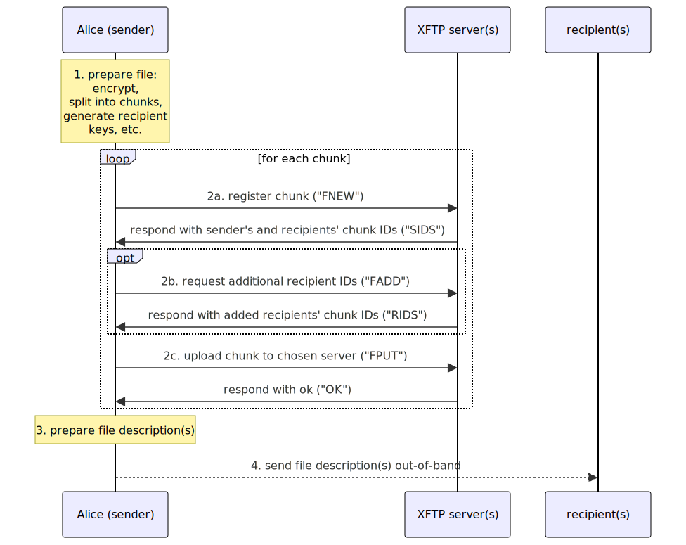
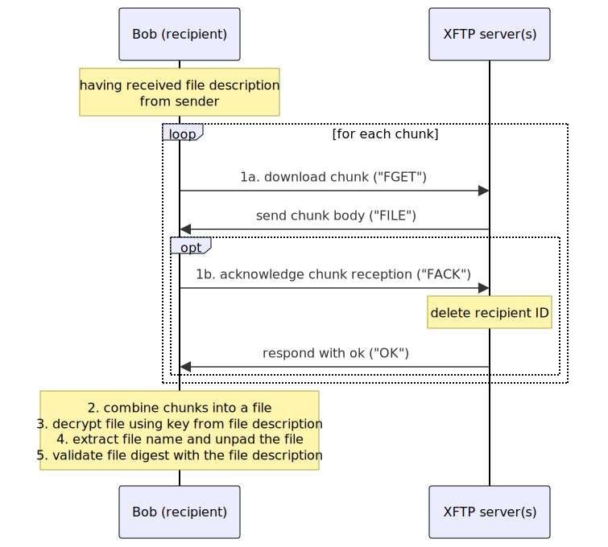

Version 3, 2025-01-24

# SimpleX File Transfer Protocol

## Table of contents

- [Abstract](#abstract)
- [Introduction](#introduction)
- [XFTP Model](#xftp-model)
- [Persistence model](#persistence-model)
- [XFTP procedure](#xftp-procedure)
- [File description](#file-description)
- [URIs syntax](#uris-syntax)
  - [XFTP router URI](#xftp-router-uri)
  - [File description URI](#file-description-URI)
- [XFTP qualities and features](#xftp-qualities-and-features)
- [Cryptographic algorithms](#cryptographic-algorithms)
- [Data packet IDs](#data-packet-ids)
- [Router security requirements](#router-security-requirements)
- [Transport protocol](#transport-protocol)
  - [TLS ALPN](#tls-alpn)
  - [Connection handshake](#connection-handshake)
  - [Requests and responses](#requests-and-responses)
- [XFTP commands](#xftp-commands)
  - [Correlating responses with commands](#correlating-responses-with-commands)
  - [Command authentication](#command-authentication)
  - [Keep-alive command](#keep-alive-command)
  - [File sender commands](#file-sender-commands)
    - [Register new data packet](#register-new-data-packet)
    - [Add data packet recipients](#add-data-packet-recipients)
    - [Upload data packet](#upload-data-packet)
    - [Delete data packet](#delete-data-packet)
  - [File recipient commands](#file-recipient-commands)
    - [Download data packet](#download-data-packet)
    - [Acknowledge data packet download](#acknowledge-data-packet-download)
  - [Error responses](#error-responses)
- [Threat model](#threat-model)

## Abstract

SimpleX File Transfer Protocol is a client-server protocol for asynchronous unidirectional file transmission.

It's designed with the focus on communication security, integrity and meta-data privacy, under the assumption that any part of the message transmission network can be compromised.

It is designed as a application level protocol to solve the problem of secure and private file transmission, making [MITM attacks][1] very difficult at any part of the file transmission system, and preserving meta-data privacy of the sent files.

## Introduction

The objective of SimpleX File Transfer Protocol (XFTP) is to facilitate the secure and private unidirectional transfer of files from senders to recipients via persistent data packets stored by the xftp router.

XFTP is implemented as an application level protocol on top of HTTP2 and TLS.

This document describes XFTP protocol version 3. The version history:

- v1: initial version
- v2: authenticated commands - added basic auth support for commands
- v3: blocked files - added BLOCKED error type for policy violations

The protocol describes the set of commands that senders and recipients can send to XFTP routers to create, upload, download and delete data packets of several pre-defined sizes. XFTP routers SHOULD support packets of 4 sizes: 64KB, 256KB, 1MB and 4MB (1KB = 1024 bytes, 1MB = 1024KB).

The protocol is designed with the focus on meta-data privacy and security. While using TLS, the protocol does not rely on TLS security by using additional encryption to achieve that there are no identifiers or ciphertext in common in received and sent router traffic, frustrating traffic correlation even if TLS is compromised.

XFTP does not use any form of participants' identities. It relies on out-of-band passing of "file description" - a human-readable YAML document with the list of data packet locations, hashes and necessary cryptographic keys.

> **Note:** While this protocol was originally designed for file transfer, it handles generic addressed data packets. File-specific semantics (splitting files into packets, assembly, naming) are application-level concerns defined in the [agent protocol](./agent-protocol.md).

## XFTP Model

The XFTP model has three communication participants: the recipient, the XFTP router that is chosen and, possibly, controlled by the sender, and the sender.

XFTP router allows uploading fixed size data packets, with or without basic authentication. The same party that can be the sender of one data packet can be the recipient of another, without exposing it to the router.

Each data packet allows multiple recipients, each recipient can download the same packet multiple times. It allows depending on the threat model use the same recipient credentials for multiple parties, thus reducing router ability to understand the number of intended recipients (but router can still track IP addresses to determine it), or use one unique set of credentials for each recipient, frustrating traffic correlation on the assumption of compromised TLS. In the latter case, senders can create a larger number of recipient credentials to hide the actual number of intended recipients from the routers (which is what SimpleX clients do).

```
           Sender                      Internet                XFTP relays             Internet         Recipient
----------------------------   |   -----------------   |   -------------------   |   ------------   |   ---------- 
                               |                       |                         |                  |
                               |                       |   (can be self-hosted)  |                  |
                               |                       |        +---------+      |                  |
                  packet 1     ----- HTTP2 over TLS ------       |  XFTP   |     ---- HTTP2 / TLS -----   packet 1
                |---> SimpleX File Transfer Protocol (XFTP) --> |  Relay  | --->        XFTP         ------------->|
                |             ---------------------------       +---------+     ----------------------             |
                |              |                       |                         |                  |              | 
                |              |                       |                         |                  |              v
          +----------+         |                       |        +---------+      |                  |        +-------------+
          | Sending  | ch. 2  ------- HTTP2 / TLS -------       |  XFTP   |     ---- HTTP2 / TLS ----  ch. 2 |  Receiving  |
file ---> |   XFTP   | ------>           XFTP            ---->  |  Relay  | --->        XFTP         ------> |     XFTP    | ---> file
          |  Client  |        ---------------------------       +---------+     ----------------------       |    Client   |
          +----------+         |                       |                         |                  |        +-------------+
                |              |                       |                         |                  |              ^
                |              |                       |        +---------+      |                  |              |
                |             ------- HTTP2 / TLS -------       |  XFTP   |     ---- HTTP2 / TLS ----              |
                |------------->           XFTP           ---->  |  Relay  | --->        XFTP         ------------->|
                   packet N    ---------------------------       +---------+     ---------------------    packet N
                               |                       |   (store data packets)   |                  |
                               |                       |                         |                  |
                               |                       |                         |                  |
```

When sender client uploads a data packet, it has to register it first with one sender ID and multiple recipient IDs, and one random unique key per ID to authenticate sender and recipients, and also provide its size and hash that will be validated when packet is uploaded.

To send the actual file, the sender client MUST pad it and encrypt it with a random symmetric key and distribute packets of fixed sized across multiple XFTP routers. Information about packet locations, keys, hashes and required keys is passed to the recipients as "[file description](#file-description)" out-of-band.

Creating, uploading, downloading and deleting data packets requires sending commands to the XFTP router - they are described in detail in [XFTP commands](#xftp-commands) section.

## Persistence model

Router stores data packet records in memory, with optional adding to append-only log, to allow restoring them on router restart. Data packet bodies can be stored as files or as objects in any object store (e.g. S3).

## XFTP procedure

1. Sending the file.

To send the file, the sender will:

1) Prepare file
  - compute its SHA512 digest.
  - prepend header with the name and pad the file to match the whole number of packets in size. It is RECOMMENDED to use 2 of 4 allowed packet sizes, to balance upload size and metadata privacy.
  - encrypt it with a randomly chosen symmetric key and IV (e.g., using NaCL secret_box).
  - split into allowed size packets.
  - generate per-recipient keys. It is recommended that the sending client generates more per-recipient keys than the actual number of recipients, rounding up to a power of 2, to conceal the actual number of intended recipients.

2) Upload data packets
  - register each packet record with randomly chosen one or more (for redundancy) XFTP router(s).
  - optionally request additional recipient IDs, if required number of recipient keys didn't fit into register request.
  - upload each packet to chosen router(s).

3) Prepare file descriptions, one per recipient.

The sending client combines addresses of all packets and other information into "file description", different for each file recipient, that will include:

- an encryption key used to encrypt/decrypt the full file (the same for all recipients).
- file SHA512 digest to validate download.
- list of packet descriptions; information for each packet:
  - private Ed25519 key to sign commands for file transfer router.
  - packet address (router host and packet ID).
  - packet sha256 digest.

To reduce the size of file description, packets are grouped by the router host.

4) Send file description(s) to the recipient(s) out-of-band, via pre-existing secure and authenticated channel. E.g., SimpleX clients send it as messages via SMP protocol, but it can be done via any other channel.



2. Receiving the file.

Having received the description, the recipient will:

1) Download all packets.

The receiving client can fall back to secondary routers, if necessary:
- if the router is not available.
- if the packet is not present on the router (ERR AUTH response).
- if the hash of the downloaded data packet does not match the description.

Optionally recipient can acknowledge data packet reception to delete file ID from router for this recipient.

2) Combine the packets into a file.

3) Decrypt the file using the key in file description.

4) Extract file name and unpad the file.

5) Validate file digest with the file description.



## File description

"File description" is a human-readable YAML document that is sent via secure and authenticated channel.

It includes these fields:
- `party` - "sender" or "recipient". Sender's file description is required to delete the file.
- `size` - padded file size equal to total size of all packets, see `fileSize` syntax below.
- `digest` - SHA512 hash of encrypted file, base64url encoded string.
- `key` - symmetric encryption key to decrypt the file, base64url encoded string.
- `nonce` - nonce to decrypt the file, base64url encoded string.
- `chunkSize` - default packet size, see `fileSize` syntax below.
- `replicas` - the array of data packet replicas descriptions.
- `redirect` - optional property for redirect information indicating that the file is itself a description to another file, allowing to use file description as a short URI.

Each replica description is an object with 2 fields:

- `chunks` - an array of packet replica descriptions stored on one server.
- `server` - [router address](#xftp-router-uri) where the packets can be downloaded from.

Each router replica description is a string with this syntax:

```abnf
packetReplica = packetNo ":" replicaId ":" replicaKey [":" packetDigest [":" packetSize]]
packetNo = 1*DIGIT
  ; a sequential 1-based packet number in the original file.
replicaId = base64url
  ; router-assigned random packet replica ID.
replicaKey = base64url
  ; sender-generated random key to receive (or to delete, in case of sender's file description) the packet replica.
packetDigest = base64url
  ; packet digest that MUST be specified for the first replica of each packet,
  ; and SHOULD be omitted (or be the same) on the subsequent replicas
packetSize = fileSize
fileSize = sizeInBytes / sizeInUnits
  ; packet size SHOULD only be specified on the first replica and only if it is different from default packet size
sizeInBytes = 1*DIGIT
sizeInUnits = 1*DIGIT sizeUnit
sizeUnit = %s"kb" / %s"mb" / %s"gb"
base64url = <base64url encoded binary> ; RFC4648, section 5
```

Optional redirect information has two fields:
- `size` - the size of the original encrypted file to which file description downloaded via the current file description will lead to, see `fileSize` syntax below.
- `digest` - SHA512 hash of the original file, base64url encoded string.

## URIs syntax

### XFTP router URI

The XFTP router address is a URI with the following syntax:

```abnf
xftpRouterURI = %s"xftp://" xftpRouter
xftpRouter = routerIdentity [":" basicAuth] "@" srvHost [":" port]
srvHost = <hostname> ; RFC1123, RFC5891
port = 1*DIGIT
routerIdentity = base64url
basicAuth = base64url
```

### File description URI

This file description URI can be generated by the client application to share a small file description as a QR code or as a link. Practically, to be able to scan a QR code it should be under 1000 characters, so only file descriptions with 1-2 packets can be used in this case. This is supported with `redirect` property when file description leads to a file which in itself is a larger file description to another file - akin to URL shortener.

File description URI syntax:

```abnf
fileDescriptionURI = serviceScheme "/file"  "#/?desc=" description [ "&data=" userData ]
serviceScheme = (%s"https://" clientAppServer) / %s"simplex:"
clientAppServer = hostname [ ":" port ]
; client app server, e.g. simplex.chat
description = <URI-escaped YAML file description>
userData = <any URI-compatible string>
```

clientAppServer is not a server the client connects to - it is a server that shows the instruction on how to download the client app that will connect using this connection request. This server can also host a mobile or desktop app manifest so that this link is opened directly in the app if it is installed on the device.

"simplex" URI scheme in serviceScheme can be used instead of client app server. Client apps MUST support this URI scheme.

## XFTP qualities and features

XFTP stands for SimpleX File Transfer Protocol. Its design is based on the same ideas and has some of the qualities of SimpleX Messaging Protocol:

- recipient cannot see sender's IP address, as the file fragments (packets) are temporarily stored on multiple XFTP relays.
- file can be sent asynchronously, without requiring the sender to be online for file to be received.
- there is no network of peers that can observe this transfer - sender chooses which XFTP relays to use, and can self-host their own.
- XFTP relays do not have any file metadata - they only see individual packets, with access to each packet authorized with anonymous credentials (using Edwards curve cryptographic signature) that are random per packet.
- packets have one of the sizes allowed by the routers - 64KB, 256KB, 1MB and 4MB packets, so sending a large file looks indistinguishable from sending many small files to XFTP router. If the same transport connection is reused, router would only know that packets are sent by the same user.
- each packet can be downloaded by multiple recipients, but each recipient uses their own key and packet ID to authorize access, and the packet is encrypted by a different key agreed via ephemeral DH keys (NaCl crypto_box (SalsaX20Poly1305 authenticated encryption scheme ) with shared secret derived from Curve25519 key exchange) on the way from the router to each recipient. XFTP protocol as a result has the same quality as SMP protocol - there are no identifiers and ciphertext in common between sent and received traffic inside TLS connection, so even if TLS is compromised, it complicates traffic correlation attacks.
- XFTP protocol supports redundancy - each data packet can be sent via multiple relays, and the recipient can choose the one that is available. Current implementation of XFTP protocol in SimpleX Chat does not support redundancy though.
- the file as a whole is encrypted with a random symmetric key using NaCl secret_box.

## Cryptographic algorithms

Clients must cryptographically authorize XFTP commands, see [Command authentication](#command-authentication).

To authorize/verify transmissions clients and routers MUST use either signature algorithm Ed25519 algorithm defined in RFC8709 or using deniable authentication scheme based on NaCL crypto_box (see Simplex Messaging Protocol).

To encrypt/decrypt data packet bodies delivered to the recipients, routers/clients MUST use NaCL crypto_box.

Clients MUST encrypt data packet bodies sent via XFTP routers using use NaCL crypto_box.

## Data packet IDs

XFTP routers MUST generate a separate new set of IDs for each new packet - for the sender (that uploads the packet) and for each intended recipient. It is REQUIRED that:

- These IDs are different and unique within the router.
- Based on random bytes generated with cryptographically strong pseudo-random number generator.

## Router security requirements

XFTP router implementations MUST NOT create, store or send to any other routers:

- Logs of the client commands and transport connections in the production environment.

- History of retrieved files.

- Snapshots of the database they use to store data packets (instead clients can manage redundancy by creating packet replicas using more than one XFTP router). In-memory persistence is recommended for data packets records.

- Any other information that may compromise privacy or [forward secrecy][4] of communication between clients using XFTP routers.

## Transport protocol

- binary-encoded commands sent as fixed-size padded block in the body of HTTP2 POST request, similar to SMP and notifications router protocol transmission encodings.
- HTTP2 POST with a fixed size padded block body for file upload and download.

Block size - 16384 bytes (it would fit ~350 Ed25519 recipient keys).

The reasons to use HTTP2:

- avoid the need to have two hostnames (or two different ports) for commands and file uploads.
- compatibility with the existing HTTP2 client libraries.

The reason not to use JSON bodies:

- bigger request size, so fewer recipient keys would fit in a single request
- signature over command has to be outside of JSON anyway.

The reason not to use URI segments / HTTP verbs / REST semantics is to have consistent request size.

### ALPN to agree handshake version

Client and router use [ALPN extension][18] of TLS to agree handshake version.

Router SHOULD send `xftp/1` protocol name and the client should confirm this name in order to use the current protocol version. This is added to allow support of older clients without breaking backward compatibility and to extend or modify handshake syntax.

If the client does not confirm this protocol name, the router would fall back to v1 of XFTP protocol.

### Transport handshake

When a client and a router agree on handshake version using ALPN extension, they should proceed with XFTP handshake.

As with SMP, a client doesn't reveal its version range to avoid version fingerprinting. Unlike SMP, XFTP runs a HTTP2 protocol over TLS and the router can't just send its handshake right away. So a session handshake is driven by client-sent requests:

1. To pass initiative to the router, the client sends a request with empty body.
2. Router responds with its `paddedRouterHello` block.
3. Clients sends a request containing `paddedClientHello` block,
4. Router sends an empty response, finalizing the handshake.

Once TLS handshake is complete, client and router will exchange blocks of fixed size (16384 bytes).

```abnf
paddedRouterHello = <padded(routerHello, 16384)>
routerHello = xftpVersionRange sessionIdentifier routerCerts signedRouterKey ignoredPart
xftpVersionRange = minXftpVersion maxXftpVersion
minXftpVersion = xftpVersion
maxXftpVersion = xftpVersion
sessionIdentifier = shortString
; unique session identifier derived from transport connection handshake
routerCerts = length 1*routerCert ; NonEmpty list of certificates in chain
routerCert = originalLength <x509encoded>
signedRouterKey = originalLength <x509encoded> ; signed by router certificate

paddedClientHello = <padded(clientHello, 16384)>
clientHello = xftpVersion keyHash ignoredPart
; chosen XFTP protocol version - must be the maximum supported version
; within the range offered by the router

xftpVersion = 2*2OCTET ; Word16 version number
keyHash = shortString
shortString = length length*OCTET
length = 1*1OCTET
originalLength = 2*2OCTET
ignoredPart = *OCTET
```

In XFTP v2 the handshake is only used for version negotiation, but `routerCert` and `signedRouterKey` must be validated by the client.

`keyHash` is the CA fingerprint used by client to validate TLS certificate chain and is checked by a router against its own key.

`ignoredPart` in handshake allows to add additional parameters in handshake without changing protocol version - the client and routers must ignore any extra bytes within the original block length.

For TLS transport client should assert that `sessionIdentifier` is equal to `tls-unique` channel binding defined in [RFC 5929][14] (TLS Finished message struct); we pass it in `routerHello` block to allow communication over some other transport protocol (possibly, with another channel binding).

### Requests and responses

- File sender:
  - create data packet record.
    - Parameters:
      - Ed25519 key for subsequent sender commands and Ed25519 keys for commands of each recipient.
      - packet size.
    - Response:
      - packet ID for the sender and different IDs for all recipients.
  - add recipients to data packet
    - Parameters:
      - sender's packet ID
      - Ed25519 keys for commands of each recipient.
    - Response:
      - packet IDs for new recipients.
  - upload data packet.
  - delete data packet (invalidates all recipient IDs).
- File recipient:
  - download data packet:
    - packet ID
    - DH key for additional encryption of the packet.
    - command should be signed with the key passed by the sender when creating packet record.
  - delete data packet ID (only for one recipient): signed with the same key.

## XFTP commands

Commands syntax below is provided using ABNF with case-sensitive strings extension.

```abnf
xftpCommand = ping / senderCommand / recipientCmd / routerMsg
senderCommand = register / add / put / delete
recipientCmd = get / ack
routerMsg = pong / sndIds / rcvIds / ok / file / error
```

The syntax of specific commands and responses is defined below.

### Correlating responses with commands

Commands are made via HTTP2 requests, responses to commands are correlated as HTTP2 responses.

### Command authentication

XFTP routers must authenticate all transmissions (excluding `ping`) by verifying the client signatures. Command signature should be generated by applying the algorithm specified for the file to the `signed` block of the transmission, using the key associated with the data packet ID (recipient's or sender's depending on which data packet ID is used).

### Keep-alive command

To keep the transport connection alive and to generate noise traffic the clients should use `ping` command to which the router responds with `pong` response. This command should be sent unsigned and without data packet ID.

```abnf
ping = %s"PING"
```

This command is always sent unsigned.

```abnf
pong = %s"PONG"
```

### File sender commands

Sending any of the commands in this section (other than `register`, that is sent without data packet ID) is only allowed with sender's ID.

#### Register new data packet

This command is sent by the sender to the XFTP router to register a new data packet.

Routers SHOULD support basic auth with this command, to allow only router owners and trusted users to create data packets on the routers.

The syntax is:

```abnf
register = %s"FNEW " fileInfo rcvPublicAuthKeys basicAuth
fileInfo = sndKey size digest
sndKey = length x509encoded
size = 4*4 OCTET ; Word32 big-endian
digest = length *OCTET
rcvPublicAuthKeys = length 1*rcvPublicAuthKey
rcvPublicAuthKey = length x509encoded
basicAuth = "0" / "1" length *OCTET

x509encoded = <binary X509 key encoding>

length = 1*1 OCTET
```

If the data packet is registered successfully, the router must send `sndIds` response with the sender's and recipients' data packet IDs:

```abnf
sndIds = %s"SIDS " senderId recipientIds
senderId = length *OCTET
recipientIds = length 1*recipientId
recipientId = length *OCTET
```

#### Add data packet recipients

This command is sent by the sender to the XFTP router to add additional recipient keys to the data packet record, in case number of keys requested by client didn't fit into `register` command. The syntax is:

```abnf
add = %s"FADD " rcvPublicAuthKeys
rcvPublicAuthKeys = length 1*rcvPublicAuthKey
rcvPublicAuthKey = length x509encoded
```

If additional keys were added successfully, the router must send `rcvIds` response with the added recipients' data packet IDs:

```abnf
rcvIds = %s"RIDS " recipientIds
recipientIds = length 1*recipientId
recipientId = length *OCTET
```

#### Upload data packet

This command is sent by the sender to the XFTP router to upload data packet body to router. The syntax is:

```abnf
put = %s"FPUT"
```

Packet body is streamed via HTTP2 request.

If data packet body was successfully received, the router must send `ok` response.

```abnf
ok = %s"OK"
```

#### Delete data packet

This command is sent by the sender to the XFTP router to delete data packet from the router. The syntax is:

```abnf
delete = %s"FDEL"
```

Router should delete data packet record, invalidating all recipient IDs, and delete file body from file storage. If data packet was successfully deleted, the router must send `ok` response.

### File recipient commands

Sending any of the commands in this section is only allowed with recipient's ID.

#### Download data packet

This command is sent by the recipient to the XFTP router to download data packet body from the router. The syntax is:

```abnf
get = %s"FGET " rDhKey
rDhKey = length x509encoded
```

If requested file is successfully located, the router must send `file` response. Data packet body is sent as HTTP2 response body.

```abnf
file = %s"FILE " sDhKey cbNonce
sDhKey = length x509encoded
cbNonce = 24*24 OCTET ; NaCl crypto_box nonce
```

Packet is additionally encrypted on the way from the router to the recipient using a key agreed via ephemeral DH keys `rDhKey` and `sDhKey`, so there is no ciphertext in common between sent and received traffic inside TLS connection, in order to complicate traffic correlation attacks, if TLS is compromised.

#### Acknowledge data packet download

This command is sent by the recipient to the XFTP router to acknowledge file reception, deleting file ID from router for this recipient. The syntax is:

```abnf
ack = %s"FACK"
```

If file recipient ID is successfully deleted, the router must send `ok` response.

In current implementation of XFTP protocol in SimpleX Chat clients don't use FACK command. Files are automatically expired on routers after configured time interval.

### Error responses

The router responds with `ERR` followed by the error type:

```abnf
error = %s"ERR " errorType
errorType = %s"BLOCK" / %s"SESSION" / %s"HANDSHAKE" /
            %s"CMD" SP cmdError / %s"AUTH" / %s"BLOCKED" SP blockingInfo /
            %s"SIZE" / %s"QUOTA" / %s"DIGEST" / %s"CRYPTO" /
            %s"NO_FILE" / %s"HAS_FILE" / %s"FILE_IO" /
            %s"TIMEOUT" / %s"INTERNAL"
cmdError = %s"UNKNOWN" / %s"SYNTAX" / %s"PROHIBITED" / %s"NO_AUTH" / %s"HAS_AUTH" / %s"NO_ENTITY"
blockingInfo = %s"reason=" blockingReason ["," %s"notice=" jsonNotice]
blockingReason = %s"spam" / %s"content"
jsonNotice = *OCTET ; JSON-encoded notice object
```

Error types:
- `BLOCK` - incorrect block format, encoding or signature size.
- `SESSION` - incorrect session ID (TLS Finished message / tls-unique binding).
- `HANDSHAKE` - incorrect handshake command.
- `CMD` - command syntax errors (UNKNOWN, SYNTAX, PROHIBITED, NO_AUTH, HAS_AUTH, NO_ENTITY).
- `AUTH` - command authorization error - bad signature or non-existing data packet.
- `BLOCKED` - data packet was blocked due to policy violation (added in v3). Contains blocking reason and optional notice.
- `SIZE` - incorrect file size.
- `QUOTA` - storage quota exceeded.
- `DIGEST` - incorrect file digest.
- `CRYPTO` - file encryption/decryption failed.
- `NO_FILE` - no expected file body in request/response or no file on the router.
- `HAS_FILE` - unexpected file body.
- `FILE_IO` - file IO error.
- `TIMEOUT` - file sending or receiving timeout.
- `INTERNAL` - internal router error.

## Threat model

#### Global Assumptions

 - A user protects their local database and key material.
 - The user's application is authentic, and no local malware is running.
 - The cryptographic primitives in use are not broken.
 - A user's choice of routers is not directly tied to their identity or otherwise represents distinguishing information about the user.

#### A passive adversary able to monitor the traffic of one user

*can:*

 - identify that and when a user is sending files over XFTP protocol.

 - determine which routers the user sends/receives files to/from.

 - observe how much traffic is being sent, and make guesses as to its purpose.

*cannot:*

 - see who sends files to the user and who the user sends the files to.

#### A passive adversary able to monitor a set of file senders and recipients

 *can:*

 - learn which XFTP routers are used to send and receive files for which users.

 - learn when files are sent and received.

 - perform traffic correlation attacks against senders and recipients and correlate senders and recipients within the monitored set, frustrated by the number of users on the routers.

 - observe how much traffic is being sent, and make guesses as to its purpose.

 - in case of a compromised transport protocol, correlate file senders and receivers.

*cannot, in case of a non-compromised transport protocol:*

 - perform traffic correlation attacks.

#### XFTP router

*can:*

- learn when file senders and recipients are online.

- know how many data packets and packet sizes are sent via the router.

- perform the correlation of the data packets as belonging to one file via either a re-used transport connection, user's IP address, or connection timing regularities.

- learn file senders' and recipients' IP addresses, and infer information (e.g. employer) based on the IP addresses, as long as Tor is not used.

- delete data packets, preventing file delivery, as long as redundant delivery is not used.

- lie about the state of a data packet to the recipient and/or to the sender  (e.g. deleted when it is not).

- refuse deleting the file when instructed by the sender.

*cannot:*

- undetectably corrupt data packets.

- learn the contents, name or the exact size of sent files.

- learn approximate size of sent files, as long as more than one router is used to send data packets.

- compromise the users' end-to-end encryption of files with an active attack.

#### An attacker who obtained Alice's (decrypted) chat database

*can:*

- see the history of all files exchanged by Alice with her communication partners, as long as files were not deleted from the database.

- receive all files sent and received by Alice that did not expire yet, as long as information about these files was not removed from the database.

- prevent Alice's contacts from receiving the files she sent by deleting all or some of the data packets from XFTP routers.

#### A user's contact

*can:*

- spam the user with files.

- forever retain files from the user.

*cannot:*

- cryptographically prove to a third-party that a file came from a user (assuming the user's device is not seized).

- prove that two contacts they have is the same user.

- cannot collaborate with another of the user's contacts to confirm they are communicating with the same user, even if they receive the same file.

#### An attacker with Internet access

*can:*

- Denial of Service XFTP routers.

*cannot:*

- send files to a user who they are not connected with.

- enumerate data packets on an XFTP router.
