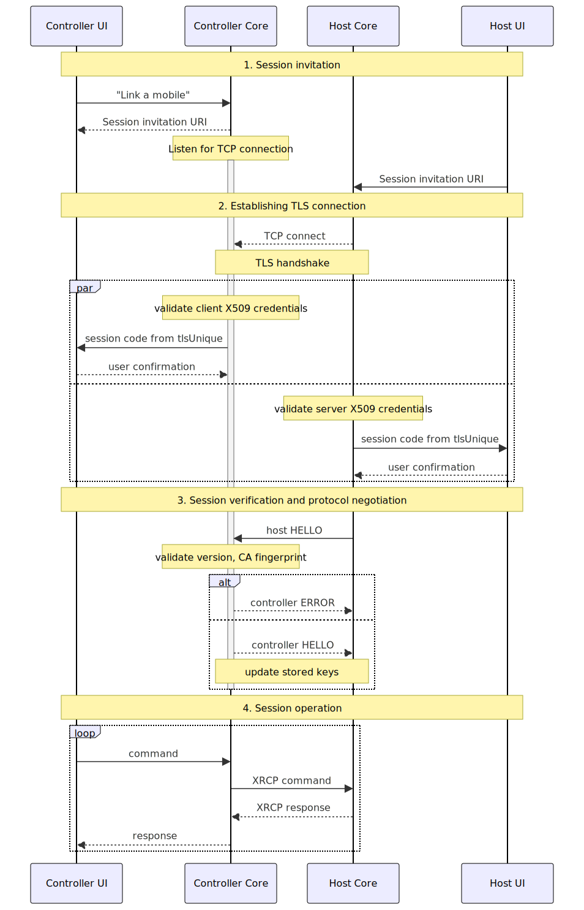

Version 1, 2024-06-22

# SimpleX Remote Control Protocol

## Table of contents

- [Abstract](#abstract)
- [XRCP model](#xrcp-model)
- [Transport protocol](#transport-protocol)
  - [Session invitation](#session-invitation)
  - [Establishing TLS connection](#establishing-tls-connection)
  - [Session verification and protocol negotiation](#session-verification-and-protocol-negotiation)
  - [Controller/host session operation](#сontrollerhost-session-operation)
- [Key agreement for announcement packet and for session](#key-agreement-for-announcement-packet-and-for-session)
- [Threat model](#threat-model)

## Abstract

The SimpleX Remote Control Protocol is a client-server protocol designed to transform application UIs into thin clients, enabling remote control from another device. This approach allows users to remotely access and utilize chat profiles without the complexities of master-master replication for end-to-end encryption states.

Like SMP and XFTP, XRCP leverages out-of-band invitations to mitigate MITM attacks and employs multiple cryptographic layers to safeguard application data.

## XRCP model

XRCP assumes two application roles: host (that contain the application data) and controller that gains limited access to host data.
Applications are also split into two components: UI and core.

When an XRCP session is established a host UI is locked out and a controller UI uses its core to proxy commands to the host core, getting back responses and events.

```

          +------+              +------+     xrcp     +------+     +------+
          | Ctrl |   commands   | Ctrl |   commands   | Host |     | Host |
user ---> |  UI  | -----------> | Core | -----------> | Core |     |  UI  |
          +------+              +------+              +------+     +------+
              ^     responses     |  ^  xrcp responses  |  ^
              |<------------------|  |<-----------------|  |      +-------------+
              |      events       |                        |      | Application |-+
              |<------------------|                        |----> |   protocol  | |
                                                                  |   servers   | |
                                                                  +-------------+ |
                                                                   +--------------+
```

## Transport protocol

Protocol consists of four phases:
- controller session invitation
- establishing session TLS connection
- session verification and protocol negotiation
- session operation



### Session invitation

The invitation to the first session between host and controller pair MUST be shared out-of-band, to establish a long term identity keys/certificates of the controller to host device.

The subsequent sessions can be announced via an application-defined site-local multicast group, e.g. `224.0.0.251` (also used in mDNS/bonjour) and an application-defined port (SimpleX Chat uses 5227).

The session invitation contains this data:
- supported version range for remote control protocol.
- application-specific information, e.g. device name, application name and supported version range, settings, etc.
- session start time in seconds since epoch.
- if multicast is used, counter of announce packets sent by controller.
- network address (ipv4 address and port) of the controller.
- CA TLS certificate fingerprint of the controller - this is part of long term identity of the controller established during the first session, and repeated in the subsequent session announcements.
- Session Ed25519 public key used to verify the announcement and commands - this mitigates the compromise of the long term signature key, as the controller will have to sign each command with this key first.
- Long-term Ed25519 public key used to verify the announcement and commands - this is part of the long term controller identity.
- Session X25519 DH key to agree session encryption (both for multicast announcement and for commands and responses in TLS), as described in https://datatracker.ietf.org/doc/draft-josefsson-ntruprime-hybrid/. The new keys are used for each session, and if client key is already available (from the previous session), the computed shared secret will be used to encrypt the announcement multicast packet. The out-of-band invitation is unencrypted. DH public key and KEM encapsulation key are sent unencrypted. NaCL crypto_box is used for encryption.

Host application decrypts (except the first session) and validates the invitation:
- Session signature is valid.
- Timestamp is within some window from the current time.
- Long-term key signature is valid.
- Long-term CA and signature key are the same as in the first session.
- Some version in the offered range is supported.

OOB session invitation is a URI with this syntax:

```abnf
sessionAddressUri = "xrcp:/" encodedCAFingerprint "@" host ":" port "#/?" qsParams
encodedCAFingerprint = base64url
host = <ipv4 or ipv6 address> ; in textual form, RFC4001
port = 1*DIGIT ; uint16
qsParams = param *("&" param)
param = versionRangeParam / appInfoParam / sessionTsParam /
        sessPubKeyParam / idPubKeyParam / dhPubKeyParam /
        sessSignatureParam / idSignatureParam
versionRangeParam = "v=" (versionParam / (versionParam "-" versionParam))
versionParam = 1*DIGIT
appInfoParam = "app=" escapedJSON
sessionTsParam = "ts=" 1*DIGIT
sessPubKeyParam = "skey=" base64url
idPubKeyParam = "idkey=" base64url
dhPubKeyParam = "dh=" base64url
sessSignatureParam = "ssig=" base64url ; signs the URI with this and idSignatureParam param removed
idSignatureParam = "idsig=" base64url ; signs the URI with this param removed
base64url = <base64url encoded binary> ; RFC4648, section 5
```

Multicast session announcement is a binary encoded packet with this syntax:

```abnf
sessionAddressPacket = dhPubKey nonce encrypted(unpaddedSize sessionAddress packetPad)
dhPubKey = length x509encoded ; same as announced
nonce = length *OCTET
sessionAddress = largeLength sessionAddressUri ; as above
length = 1*1 OCTET ; for binary data up to 255 bytes
largeLength = 2*2 OCTET ; for binary data up to 65535 bytes
packetPad = <pad packet size to 1450 bytes> ; possibly, we may need to move KEM agreement one step later,
; with encapsulation key in HELLO block and KEM ciphertext in reply to HELLO.
```

### Establishing TLS connection

Both controller and host use 2-element certificate chains with unique self-signed CA root representing long-term identities. Leaf certificates aren't stored and instead generated on each session start.

A controller runs a TCP server to avoid opening listening socket on a host, which might create an attack vector. A controller keeps no sensitive data to be exposed this way.

During TLS handshake, parties validate certificate chains against previously known (from invitation or storage) CA fingerprints. The fingerprints MUST be the same as in the invitation and in the subsequent connections.

### Session verification and protocol negotiation

Once TLS session is established, both the host and controller devices present a "session security code" to the user who must match them (e.g., visually or via QR code scan) and confirm on the host device. The session security code must be a digest of tlsunique channel binding. As it is computed as a digest of the TLS handshake for both the controller and the host, it will validate that the same TLS certificates are used on both sides, and that the same TLS session is established, mitigating the possibility of MITM attack in the connection.

Once the session is confirmed by the user, the host sends HELLO block to the controller.

XRCP blocks inside TLS are padded to 16384 bytes.

Host HELLO block must contain:
- new session DH key - used to compute new shared secret with the controller keys from the announcement.
- encrypted part of HELLO block (JSON object), containing:
  - chosen protocol version.
  - host CA TLS certificate fingerprint - part of host long term identity - must match the one presented in TLS handshake and the previous sessions, otherwise the connection is terminated.
  - KEM encapsulation key - used to compute new shared secret for the session.
  - additional application specific parameters, e.g host device name, application version, host settings or JSON encoding format.

Host HELLO block syntax:

```abnf
hostHello = %s"HELLO " dhPubKey nonce encrypted(unpaddedSize hostHelloJSON helloPad) pad
unpaddedSize = largeLength
dhPubKey = length x509encoded
pad = <pad block size to 16384 bytes>
helloPad = <pad hello size to 12888 bytes>
largeLength = 2*2 OCTET
```

The controller decrypts (including the first session) and validates the received HELLO block:
- Chosen versions are supported (must be within offered ranges).
- CA fingerprint matches the one presented in TLS handshake and the previous sessions - in subsequent sessions TLS connection should be rejected if the fingerprint is different.

[JTD schema](https://www.rfc-editor.org/rfc/rfc8927) for the encrypted part of host HELLO block `hostHelloJSON`:

```json
{
  "definitions": {
    "version": {
      "type": "string",
      "metadata": {
        "format": "[0-9]+"
      }
    },
    "base64url": {
      "type": "string",
      "metadata": {
        "format": "base64url"
      }
    }
  },
  "properties": {
    "v": {"ref": "version"},
    "ca": {"ref": "base64url"},
    "kem": {"ref": "base64url"}
  },
  "optionalProperties": {
    "app": {"properties": {}, "additionalProperties": true}
  },
  "additionalProperties": true
}
```

The controller should reply with with `ctrlHello` or `ctrlError` response:

```abnf
ctrlHello = %s"HELLO " kemCiphertext encrypted(unpaddedSize ctrlHelloJSON helloPad) pad
; ctrlHelloJSON is encrypted with the hybrid secret,
; including both previously agreed DH secret and KEM secret from kemCiphertext
unpaddedSize = largeLength
kemCiphertext = largeLength *OCTET
pad = <pad block size to 16384 bytes>
helloPad = <pad hello size to 12888 bytes>
largeLength = 2*2 OCTET

ctrlError = %s"ERROR " nonce encrypted(unpaddedSize ctrlErrorMessage helloPad) pad
ctrlErrorMessage = <utf-8 encoded text>; encrypted using previously agreed DH secret.
```

JTD schema for the encrypted part of controller HELLO block `ctrlHelloJSON`:

```json
{
  "properties": {},
  "additionalProperties": true
}
```

Controller `hello` block and all subsequent protocol messages are encrypted with the chain keys derived from the hybrid key (see key exchange below) - that is why conntroller hello block does not include nonce. That provides forward secrecy within the XRCP session. Receiving this `hello` block allows host to compute the same hybrid keys and to derive the same chain keys.

Once the controller replies HELLO to the valid host HELLO block, it should stop accepting new TCP connections.

### Controller/host session operation

The protocol for communication during the session is out of scope of this protocol.

SimpleX Chat uses HTTP2 encoding, where host device acts as a server and controller acts as a client (these roles are reversed compared with TLS connection, restoring client-server semantics in HTTP).

Payloads in the protocol must be encrypted using NaCL secret_box using the hybrid shared secret agreed during session establishment.

Commands of the controller must be signed after the encryption using the controller's session and long term Ed25519 keys.

tlsunique channel binding from TLS session MUST be included in commands (included in the signed body).

The syntax for encrypted command and response body encoding:

```abnf
commandBody = counter encBody sessSignature idSignature [attachment]
responseBody = counter encBody [attachment] ; counter must match command
; counter is placed outside of encrypted body to allow correlating encryption keys
; with the chain keys (each command and response are encrypted by different keys)
encBody = encLength32 encrypted(tlsunique body)
attachment = %x01 encLength32 encrypted(attachment)
noAttachment = %x00
tlsunique = length 1*OCTET
counter = 8*8 OCTET ; int64
encLength32 = 4*4 OCTET ; uint32, includes authTag
```

If the command or response includes attachment, its hash must be included in command/response and validated.

## Key agreement for announcement packet and for session

Initial announcement is shared out-of-band (URI with xrcp scheme), and it is not encrypted.

This announcement contains only DH keys, as KEM key is too large to include in QR code, which are used to agree encryption key for host HELLO block. The host HELLO block will contain DH key in plaintext part and KEM encapsulation (public) key in encrypted part, that will be used to determine the shared secret (using SHA3-256 over concatenated DH shared secret and KEM encapsulated secret) to derive keys for controller HELLO response (that contains KEM ciphertext in plaintext part) and subsequent session commands and responses.

During the next session the announcement is sent via encrypted multicast block. The shared key for this announcement and for host HELLO block is determined using the KEM shared secret from the previous session and DH shared secret computed using the host DH key from the previous session and the new controller DH key from the announcement.

For the session, the shared secret is computed again using the KEM shared secret encapsulated by the controller using the new KEM key from the host HELLO block and DH shared secret computed using the host DH key from HELLO block and the new controller DH key from the announcement.

In pseudo-code:

```
// session 1
hostHelloSecret(1) = dhSecret(1)
sessionSecret(1) = sha3-256(dhSecret(1) || kemSecret(1)) // to encrypt session 1 data, incl. controller hello
dhSecret(1) = dh(hostHelloDhKey(1), controllerInvitationDhKey(1))
kemCiphertext(1) = enc(kemSecret(1), kemEncKey(1))
// kemEncKey is included in host HELLO, kemCiphertext - in controller HELLO
kemSecret(1) = dec(kemCiphertext(1), kemDecKey(1))

// multicast announcement for session n
announcementSecret(n) = sha256(dhSecret(n'))
dhSecret(n') = dh(hostHelloDhKey(n - 1), controllerDhKey(n))

// session n
hostHelloSecret(n) = dhSecret(n)
sessionSecret(n) = sha3-256(dhSecret(n) || kemSecret(n)) // to encrypt session n data, incl. controller hello
dhSecret(n) = dh(hostHelloDhKey(n), controllerDhKey(n))
// controllerDhKey(n) is either from invitation or from multicast announcement
kemCiphertext(n) = enc(kemSecret(n), kemEncKey(n))
kemSecret(n) = dec(kemCiphertext(n), kemDecKey(n))
```

If controller fails to store the new host DH key after receiving HELLO block, the encryption will become out of sync and the host won't be able to decrypt the next announcement. To mitigate it, the host should keep the last session DH key and also previous session DH key to try to decrypt the next announcement computing shared secret using both keys (first the new one, and in case it fails - the previous).

To decrypt a multicast announcement, the host should try to decrypt it using the keys of all known (paired) remote controllers.

Once kemSecret is agreed for the session, it is used to derive two chain keys, to receive and to send messages:

```
host: sndKey, rcvKey = HKDF(kemSecret, "SimpleXSbChainInit", 64)
controller: rcvKey, sndKey  = HKDF(kemSecret, "SimpleXSbChainInit", 64)
```

where HKDF is based on SHA512, with empty salt.

Actual keys and nonces to encrypt and decrypt messages are derived from these chain keys:

```
to send: (sndKey', sk, nonce) = HKDF(sndKey, "SimpleXSbChain", 88)
to receive: (rcvKey', sk, nonce) = HKDF(rcvKey, "SimpleXSbChain", 88)
```

## Threat model

#### A passive network adversary able to monitor the site-local traffic:

*can:*
- observe session times, duration and volume of the transmitted data between host and controller.

*cannot:*
- observe the content of the transmitted data.
- substitute the transmitted commands or responses.
- replay transmitted commands or events from the hosts.

#### An active network adversary able to intercept and substitute the site-local traffic:

*can:*
- prevent host and controller devices from establishing the session

*cannot:*
- same as passive adversary, provided that user visually verified session code out-of-band.

#### An active adversary with the access to the network:

*can:*
- spam controller device.

*cannot:*
- compromise host or controller devices.

#### An active adversary with the access to the network who also observed OOB announcement:

*can:*
- connect to controller instead of the host.
- present incorrect data to the controller.

*cannot:*
- connect to the host or make host connect to itself.

#### Compromised controller device:

*can:*
- observe the content of the transmitted data.
- access any data of the controlled host application, within the capabilities of the provided API.

*cannot:*
- access other data on the host device.
- compromise host device.

#### Compromised host device:

*can:*
- present incorrect data to the controller.
- incorrectly interpret controller commands.

*cannot:*
- access controller data, even related to this host device.
