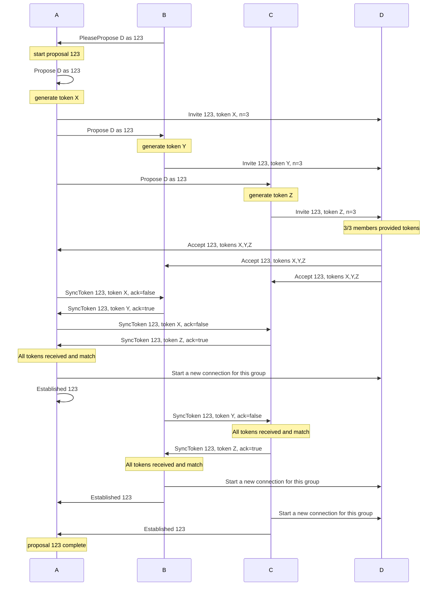

# Private Groups

An alternate groups approach that preserves more privacy properties.
These groups can only be formed if all members already have direct connections to all other members.
This eliminates the need for implicit introductions, which offer vectors for MITM attacks.
Critically, we can ensure that we don't reveal any information about a user's network, other than what they opt into sharing for adjusting membership.
Lastly, we require no modification to the underlying protocol.
Standard duplex communication is sufficient.
Agents need new behavior in soliciting proposals for membership changes, and for responding to them.

This group protocol both captures the ethos of the SimpleX message protocol privacy, and increases trust in connections.
Notably, this protocol can serve to _out_ an imposter rather than enable them, should at least one member of the group know the real identity.
Say Alice, Bob, and Carol are in a group and want to add Dave.
Only Alice actually knows Dave, but Mallory has scammed Bob and Carol into believing that she is Dave.
This protocol will not let Dave or Mallory be admitted to the group, since neither can prove that they know all parties.
Alice, Bob, and Carol have increased hopes of identifying Mallory as an imposter once they realize it is impossible to add Dave.

## The Protocol

### Additions

A formal specification of the protocol is defined in TLA+ and can be defined [here](./2022-06-11-private-groups/groups.tla).

The protocol has four roles:

  1. The proposer, a group member who wants to add a new user
  1. The invitee, the user the proposer wants to add to the group
  1. The leader, the user who originally established the group and who orchestrates all proposals on behalf of proposers
  1. The approvers, all current group members who are neither proposing or leading

A centralized leader is not a drawback in for this algorithm, because in order to validate that all current members have direct connections with the invitee, all members must actively participate.
The leader allows for a simpler centralized approach, without compromising availability.

#### Proposer

The proposer generates a random invitation identifier and a token.
The proposer sends an Propose message to the leader that includes the invitation identifier and an informal description of the invitee (such as their contact name).
The proposer also sends an Invite message to the invitee that includes the token and the current membership count of the group.

#### Leader and Acceptors (phase 1)

Upon receipt of a Propose message, the user is prompted to see if they want to add the invitee to the group.
Since the description of the invitee is informal, they may also have to manually select which of their contacts match the description.
It is possible that the user does not know the invitee.
It is also possible that the user _thinks_ they know the invitee, but have mistaken them for someone else.
In the case of misidentification, the protocol is still safe and preserves privacy.

If they do not want to add the invitee (possibly because they have no direct connection), it is sufficient to simply ignore the message.
However an explicit rejection message provides a speed up to the inevitable failure to add the contact.

If the Propose recipient wants to add the contact to the group they:
  1. Generate a token.
  1. Store the invitation identifier, proposer's token, and their token.
  1. The Leader: Rebroadcasts the Propose message to all Approvers.
  1. Approvers: Send an Invite message to the invitee that includes the invitation identifier, their token, and the count of current members.

The choice to accept or reject and the generated token should be locally committed before sending messages so conflicting messages are not sent.

#### Invitee

The invitee collects all Invite messages.
While they cannot predict who they are waiting for, each invite includes the number of members in the group.
Upon receipt of Invites from that number that all have the same invitation identifier, the proposer now knows the full membership of the group and the user should be prompted as to whether or not to accept membership.
If they decline, it is sufficient to ignore the messages, but more efficient to send a messages as such.

To accept, the invitee responds to all contacts with an Accept message that includes the invitation identifier and all tokens.

In the case of contact confusion between members, it is impossible for anyone outside of the group to send an Accept message as they never collect the correct number of tokens.

#### Approvers (phase 2)

Once a member has an Accept message from the invitee, they begin syncing their tokens with other members via a SyncToken message.
A SyncToken message can both send a token and ack receipt of a token from another member, based on the `ack` flag within the message.

Once a member has all other members' tokens, assuming they all match the Accept message, then the member knows that all parties have agreed to extend membership.
The member locally commits this result and establishes a new connection with the invitee specifically for group communication.

Each Approver notifies the Leader that they have established a connection with the invitee.
This both lets the Leader know that it need not continue to send reminder Propose messages, and it ensures that the Approver does not get kicked in a cancellation (see below).

#### Failures

If an approver does not want to invite the invitee, the proposal is doomed, and they will not be invited.
By notifying the Leader, they can simply mark the proposal as completed.

However, it is not possible to tell the difference between a misidentified invitee and members or the invitee simply needing more time.
In the case of a misidentified invitee, the proposal can never be resolved, as no invitee will ever receive all tokens, meaning the Leader will never receive an Accept message.
Since it's only safe to manage one proposal at a time, we must be able to cancel the proposal in order to make progress.

To cancel, the Leader will face one of two scenarios:

##### Cancellation - None Established

If the leader has not received any notice of established connections, it can assume that all Approvers are operating normally, and that the invite _probably_ won't work.
Since it is uncertain about the latter, it resolves the current proposal but immediately begins the process to Kick the invitee.
If there was confusion about the invitee, then the Kick will resolve immediately, as there's no work to do except record the invitation identifier as being permanently kicked.
In the case that there was a race between establishing a connection and giving up, then those who established a connection will Kick the invitee and ensure that all group members have same perception of membership.

##### Cancellation - Some Established

If the Leader has received an Established message back from any member, then it knows that there was no confusion over the invitee, and they can be brought into the group.
However, it is possible that some previous members are unable to complete the invitation process (such as a lost/destroyed device).
To ensure that the group can complete proposals, the Leader may then Kick any user that has not established a connection (except the Leader).

TODO: Ideally, kicked members (or invitees that established connections with kicked members, who think they are part of the group) eventually learn that they are not in the group after all.

#### Properties

Model checking our formal specification we can demonstrate three key properties:
  1. Users outside of the group only learn about the networks of members who agree to share such information with them.
  1. It is not possible to accidentally establish a group connection with anyone other than the invitee, even if users misidentify the invitee.
  1. If a proposal is complete, then all members (according to the leader) agree on who is a member.
  1. Proposals always complete (successfully or otherwise), assuming the Leader is fair (other members don't need to participate).
  1. Only the Leader need "drive" the process, and can retry by simply sending more Propose messages.  All other parties simply react to requests as they see them.  This offers a simple implementation that avoids livelock.
  1. No members will connect with the invitee unless all members correctly identify them.
  1. Under sufficiently good conditions (no confusion, a patient leader, all users remain active, no members leave) an invite will eventually succeed.

### Specific Examples

#### Typical Success

We consider a group of three (A, B, and C), trying to add an additional member (D) and succeeding.
In this case, all members have a connection to the proposed user and no one confuses them for someone else.
In this group, A is the leader, and B starts the initial proposal.

##### Sequence Diagram



##### CLI Interactions

```bash
# User B's terminal
> /add #g @D
```

```bash
# User A and C's terminals
> @B wants to add @D to #g, accept? (y/n/change invitee)
> y
```

```bash
# User D's terminal
> @A, @B, and @C would like to invite you to a group, accept? (y/n)
> y
> What would you like to name this group?
> g
```

```bash
# User A, B, and C's terminals
> @D successfully added to group #g!
```

```bash
# User D's terminals
> You have successfully been added to group #g with @A, @B, and @C!
```

#### Success with Identity Resolution

A minor variant of the success case involves a resolvable difference in names.
Proposed member names are just that, names, they don't necessarily uniquely define the potential member.
As such, it's possible that two members see a different contact name for the same identity, which must be resolved.

Consider the same scenario as above, but user C knows user D by the contact name Dee.
The sequence diagram is identical, because the resolution occurs via direct user interactions.

Since C receives a Propose message for D, C has a different CLI interaction:

```bash
# User C's terminal
> @B wants to add @D to #g.  Do you know this contact by a different name? (y/n)
> y
> Please enter contact name:
> @Dee
> Would you like to add @Dee to group #g? (y/n)
> y
```

#### Success with Identity Conflict

A minor variant of the success case involves a resolvable conflict in names.
Proposed member names are just that, names, they don't necessarily uniquely define the potential member.
As such, it's possible that two members see a different contact name for the same identity, one of whom uses the contact name for someone else.

Consider the same scenario as above, but user C knows user D as D2, as they know another distinct contact named D.
However, user C knows that A and B only know D2, not D.
This means that user C can infer from context that B is trying to add D2 to the group, not D.
The sequence diagram is identical, because the resolution occurs via direct user interactions.

Since C receives a Propose message for D, C has a different CLI interaction:

```bash
# User C's terminal
> @B wants to add @D to #g, accept? (y/n/change invitee)
> change invitee
> Who do you think @B is trying to invite?
> @D2
> Would you like to add @D2 to group #g? (y/n)
> y
```

## Variations Not Pursued

### Centralized Tokens

It may seem odd that a Leader is leveraged for the management of proposals, but a more peer-to-peer style token synchronization step is also involved later.
Message counts could be reduced if the leader was also responsible for validating tokens.
However, this puts increased trust on the leader.
The peer-to-peer style token synchronization ensures that a compromised leader has limited impacts to the group as a whole.
