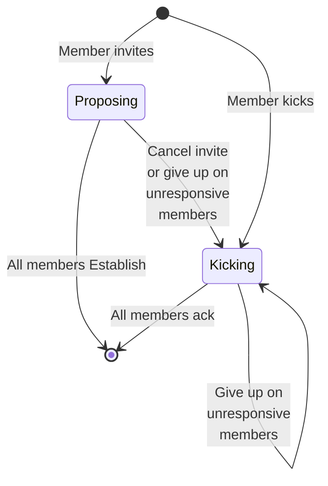
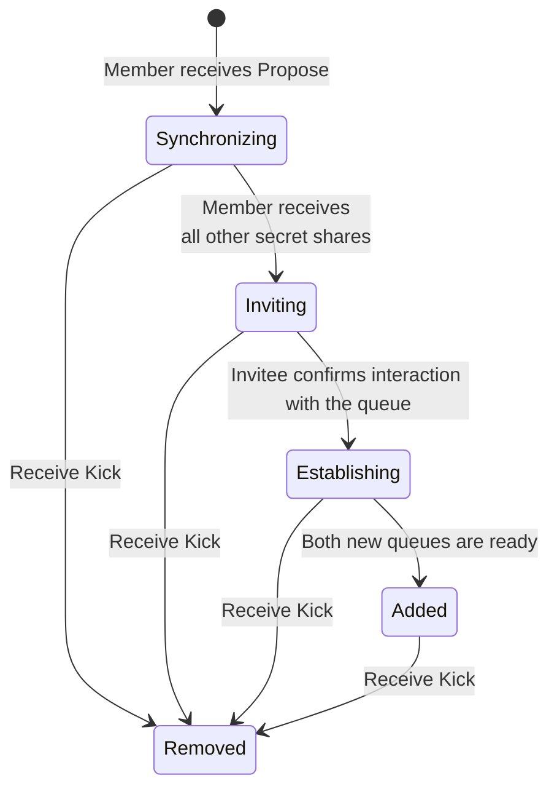
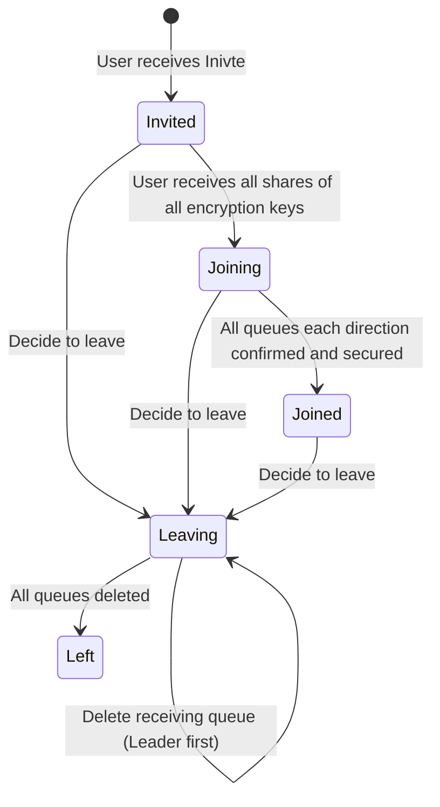
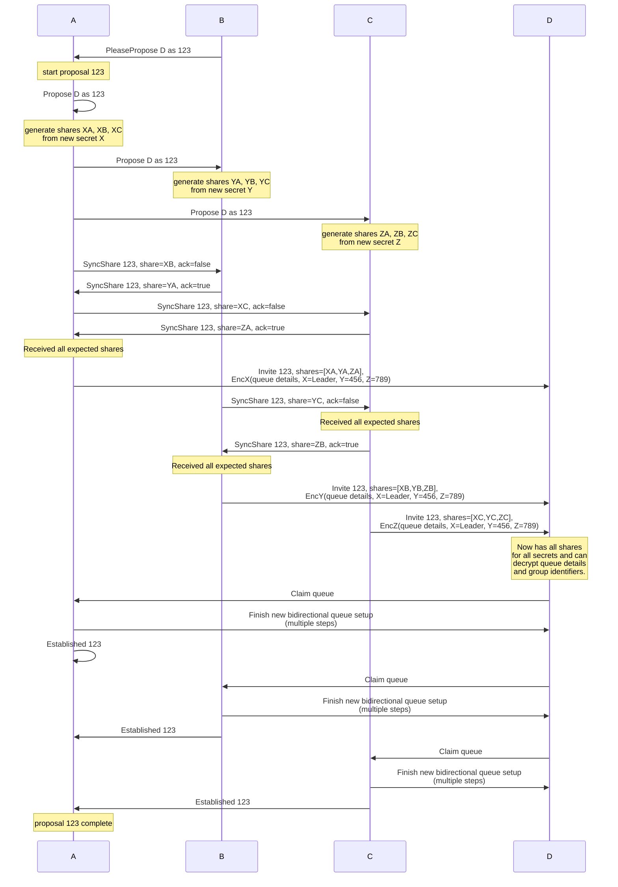
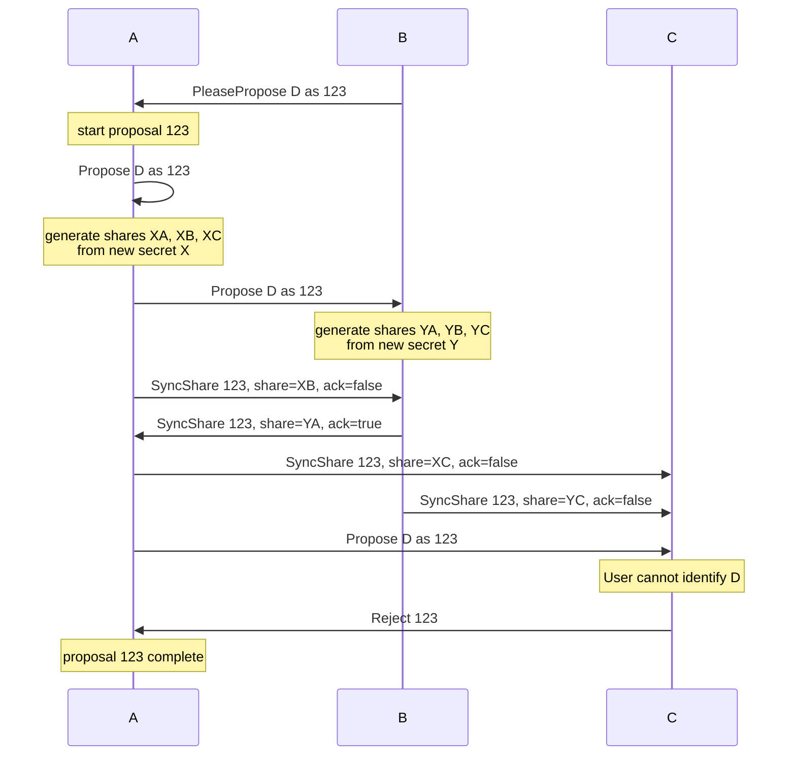
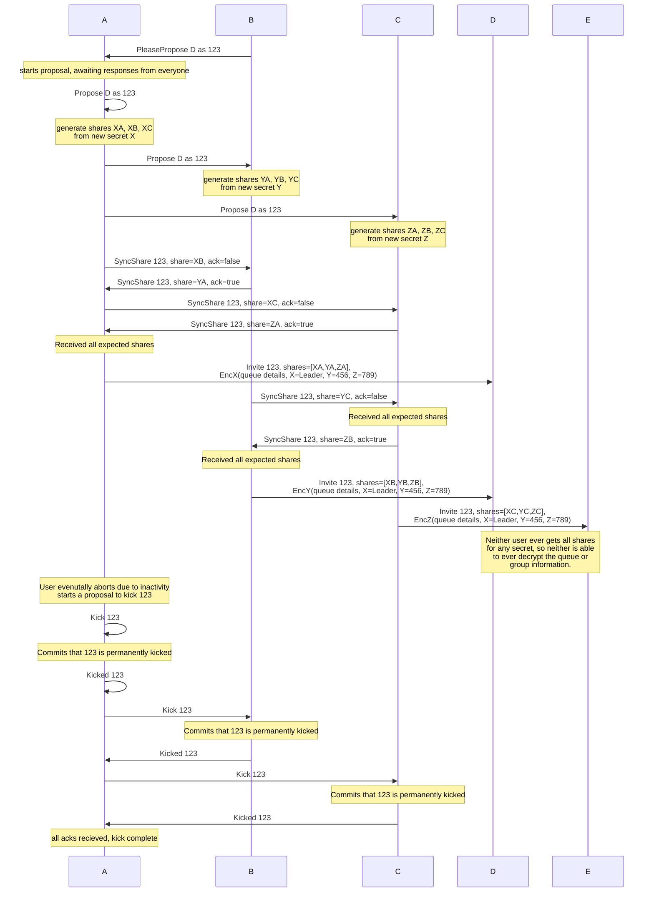
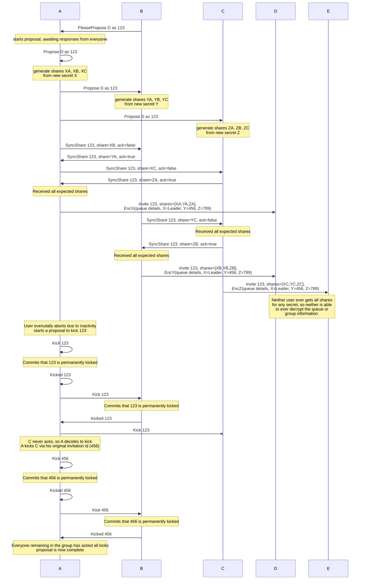
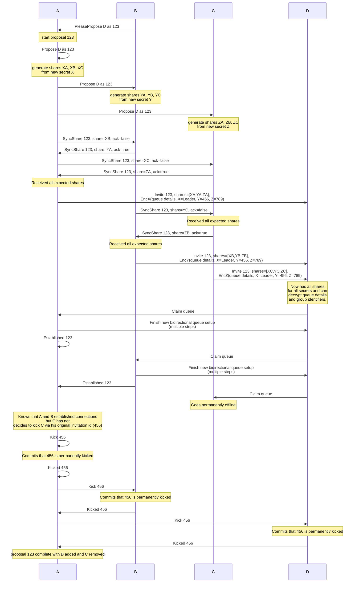

# Private Groups

An alternate groups approach that preserves more privacy properties.
These groups can only be formed if all members already have direct connections to all other members.
This eliminates the need for implicit introductions, which offer vectors for MITM attacks.
Critically, we can ensure that we don't reveal any information about a user's network, other than what they opt into sharing for adjusting membership.
Lastly, we require no modification to the underlying protocol.
Standard duplex communication is sufficient.
Agents need new behavior in soliciting proposals for membership changes, and for responding to them.

This group protocol both captures the ethos of the SimpleX message protocol privacy, and increases trust in connections.
Due to the secret splitting strategy, the security of a new member's connections take on the properties of the _most secure_ pathway (direct or indirect) to existing members.
This means that a new and existing member will have a secure group connection if they have a secure direct connection, or if they both have a secure connection to _any_ other existing member.

Also notable, this protocol can serve to _out_ an imposter rather than enable them, should at least one member of the group know the real identity.
Say Alice, Bob, and Carol are in a group and want to add Dave.
Only Alice actually knows Dave, but Mallory has scammed Bob and Carol into believing that she is Dave.
This protocol will not let Dave or Mallory be admitted to the group, since neither can prove that they know all parties.
Alice, Bob, and Carol have increased hopes of identifying Mallory as an imposter once they realize it is impossible to add Dave.

## The Protocol

### Additions

A formal specification of the protocol is defined in TLA+ and can be defined [here](./2022-06-11-private-groups/groups.tla).
A crash course in TLA+ and the key abstractions used in the spec is [here](./2022-06-11-private-groups/README.md).

The protocol has four roles:

  1. The proposer, a group member who wants to add a new user
  1. The invitee, the user the proposer wants to add to the group
  1. The leader, the user who originally established the group and who orchestrates all proposals on behalf of proposers
  1. The approvers, all current group members (including the Proposer and Leader)

A centralized leader is not a drawback in for this algorithm, because in order to validate that all current members have direct connections with the invitee, all members must actively participate.
The leader allows for a simpler centralized approach, without compromising availability.

#### Proposer (phase 1)

The proposer generates a random invitation identifier.
The proposer sends an PleasePropose message to the leader that includes the invitation identifier and an informal description of the invitee (such as their contact name).

#### Leader (phase 2)

The Leader receives the PleasePropose message, and if no there is no other active proposal, it will start the requested proposal.
The Leader broadcasts Propose messages that echo the original PleasePropose values.
The Leader continues sending Propose messages as reminders until the proposal is complete or abandoned.

#### Acceptors Sync (phase 3)

Upon receipt of a Propose message, the user is prompted to see if they want to add the invitee to the group.
Since the description of the invitee is informal, they may also have to manually select which of their contacts match the description.
It is possible that the user does not know the invitee.
It is also possible that the user _thinks_ they know the invitee, but have mistaken them for someone else.
In the case of misidentification, the protocol is still safe and preserves privacy.

If they do not want to add the invitee (possibly because they have no direct connection), it is sufficient to simply ignore the message.
However an explicit rejection message provides a speed up to the inevitable failure to add the contact.

If the Propose recipient wants to add the contact to the group they:
  1. Generate a symmetric encryption key
  1. Split the encryption key into shares for each member (including itself)
  1. Store the invitation identifier, the key, and all shares
  1. Send the corresponding share to all other members (using the ack flag to specify if they would like a share in response)

The choice to accept or reject and the generated token should be locally committed before sending messages so conflicting messages are not sent.

Since we want the encryption key only to be recoverable by _all_ shares, XOR based secret splitting is sufficient (vs something like Shamir Secret Sharing, which can more efficiently handle k of n schemes).

#### Acceptors Invite (phase 4)

Upon receipt of all shares Acceptors send invites to their perceived invitee.
This step is much like setting up a new contact, where a new queue is created specifically for receiving messages from this new member and the current direct connection is used as the out-of-band channel.
However, in this case the queue details are encrypted, so the invitee can only connect to the queue if they have all secret shares.

The acceptor must:
  1. Create a new queue with the SimpleX server
  1. Send the perceived invitee an Invite message with the following:
    1. The invitation identifier
    1. The HMAC of each share expected
    1. The HMAC of the encryption key
    1. The encrypted queue data
    1. The encrypted mapping of hashed shares members who received them (identified by the invitation identifier they joined under)

Encryption must be authenticated with associated data (AEAD) to prevent tampering.
The encryption key hash and the invitation id should be covered by the authentication.
TODO: Hash of the queue too, for message commitment?

#### Invitee (phase 5)

The invitee collects all Invite messages.
While they cannot predict _who_ they are waiting for, each Invite message includes a HMAC of all other secret shares expected, so they know how many invitations to expect.
Upon receipt of Invites from that number that all have the same invitation identifier, the invitee can check their validity against the hashes received.
If valid, the Invitee now knows the full membership of the group and the user should be prompted as to whether or not to accept membership.
If they decline, it is sufficient to ignore the messages, but more efficient to send a message as such.

To accept, the invitee should:
  1. Reconstruct all symmetric encryption keys
  1. Decrypt all payloads (checking associated authenticated data)
  1. Double check that all member identifiers are consistent from each members Invite message
  1. Locally commit all details of the group and that they have joined
  1. Send confirmation that they are the intended recipient of each queue for each user (in the typical way)

In the case of contact confusion between members, it is impossible for anyone outside of the group to use ever claim the queue, as they will never receive all secret shares required to decrypt the queue invitation details.

#### Approvers Establish and Inform Leader (phase 6)

Once the invitee has confirmed receipt of the queue invitation, the approver secures the queue for them.
The approver establishes a new queue in a typical fashion, using the previous as the out-of-band channel (this new queue is preferred to the direction connection, as it is _at least_ if not more as secure).

Each Approver notifies the Leader that they have established a connection with the invitee.
This both lets the Leader know that it need not continue to send reminder Propose messages, and it ensures that the Approver does not get kicked in a cancellation (see below).

#### Failures

If an approver does not want to invite the invitee, the proposal is doomed, and they will not be invited.
By notifying the Leader, they can simply mark the proposal as completed.

However, it is not possible to tell the difference between a misidentified invitee and members or the invitee simply needing more time.
In the case of a misidentified invitee, the proposal can never be resolved, as no invitee will ever receive all tokens, meaning the Leader will never receive an Accept message.
Since it's only safe to manage one proposal at a time, we must be able to cancel the proposal in order to make progress.

To cancel, the Leader will face one of two scenarios:

##### Cancellation - None Established

If the leader has not received any notice of established connections, it can assume that all Approvers are operating normally, and that the invite _probably_ won't work.
Since it is uncertain about the latter, it resolves the current proposal but immediately begins the process to Kick the invitee.
If there was confusion about the invitee, then the Kick will resolve immediately, as there's no work to do except record the invitation identifier as being permanently kicked.
In the case that there was a race between establishing a connection and giving up, then those who established a connection will Kick the invitee and ensure that all group members have same perception of membership.

##### Cancellation - Some Established

If the Leader has received an Established message back from any member, then it knows that there was no confusion over the invitee, and they can be brought into the group.
However, it is possible that some previous members are unable to complete the invitation process (such as a lost/destroyed device).
To ensure that the group can complete proposals, the Leader may then Kick any user that has not established a connection (except the Leader).

TODO: Ideally, kicked members (or invitees that established connections with kicked members, who think they are part of the group) eventually learn that they are not in the group after all.

#### Properties

Model checking our formal specification we can demonstrate three key properties:
  1. Users outside of the group only learn about the networks of members who agree to share such information with them.
  1. It is not possible to accidentally establish a group connection with anyone other than the invitee, even if users misidentify the invitee.
  1. Eventually all proposals complete and everyone that the Leader believes is part of the group agrees on membership.
  1. Proposals always complete (successfully or otherwise), assuming the Leader is fair (other members don't need to participate).
  1. Only the Leader need "drive" the process, and can retry by simply sending more Propose messages.  All other parties simply react to requests as they see them.  This offers a simple implementation that avoids livelock.
  1. Leaving a group requires only deleting a receiving queue to the leader; the group will correct itself after.
  1. No members will connect with the invitee unless all members correctly identify them.
  1. Under sufficiently good conditions (no confusion, a patient leader, all users remain active, no members leave) an invite will eventually succeed.
  1. Activity eventually settles, no user can arrive to a state where they infinitely send doomed messages expecting a reply.

### State Diagrams

#### Leader Specific States

Once this process activates, it _must_ terminate before it can start again.
There cannot be simultaneous invitations.



#### Approver Specific States

The approver process is unique per invitation identifier, so an approver tracks many such state transitions simultaneously.
The Removed state is terminal, there is no way to restore an invitation identifier to the Added state.
However, a kicked user can be added back to any group with a _new_ invitation identifier.



#### Invitee Specific States

The invitee process is unique per invitation identifier, so an user tracks many such states simultaneously.



### Specific Examples

#### Typical Success

We consider a group of three (A, B, and C), trying to add an additional member (D) and succeeding.
In this case, all members have a connection to the proposed user and no one confuses them for someone else.
In this group, A is the leader, and B starts the initial proposal.

##### Sequence Diagram



##### CLI Interactions

```bash
# User B's terminal
> /add #g @D
```

```bash
# User A and C's terminals
> @B wants to add @D to #g, accept? (y/n/change invitee)
> y
```

```bash
# User D's terminal
> @A, @B, and @C would like to invite you to a group, accept? (y/n)
> y
> What would you like to name this group?
> g
```

```bash
# User A, B, and C's terminals
> @D successfully added to group #g!
```

```bash
# User D's terminals
> You have successfully been added to group #g with @A, @B, and @C!
```

#### Success with Identity Resolution

A minor variant of the success case involves a resolvable difference in names.
Proposed member names are just that, names, they don't necessarily uniquely define the potential member.
As such, it's possible that two members see a different contact name for the same identity, which must be resolved.

Consider the same scenario as above, but user C knows user D by the contact name Dee.
The sequence diagram is identical, because the resolution occurs via direct user interactions.

Since C receives a Propose message for D, C has a different CLI interaction:

```bash
# User C's terminal
> @B wants to add @D to #g.  Do you know this contact by a different name? (y/n)
> y
> Please enter contact name:
> @Dee
> Would you like to add @Dee to group #g? (y/n)
> y
```

#### Success with Identity Conflict

A minor variant of the success case involves a resolvable conflict in names.
Proposed member names are just that, names, they don't necessarily uniquely define the potential member.
As such, it's possible that two members see a different contact name for the same identity, one of whom uses the contact name for someone else.

Consider the same scenario as above, but user C knows user D as D2, as they know another distinct contact named D.
However, user C knows that A and B only know D2, not D.
This means that user C can infer from context that B is trying to add D2 to the group, not D.
The sequence diagram is identical, because the resolution occurs via direct user interactions.

Since C receives a Propose message for D, C has a different CLI interaction:

```bash
# User C's terminal
> @B wants to add @D to #g, accept? (y/n/change invitee)
> change invitee
> Who do you think @B is trying to invite?
> @D2
> Would you like to add @D2 to group #g? (y/n)
> y
```

#### Typical Leave

Existing members need only delete their queues to leave a group.
They should always start with deleting the Leader's queue first.
When a leader detects that a member has left and no other proposal is active, the Leader simply kicks that user.

During a proposal, a multitude of things can go wrong, all of which are self-corrected and are explored below.
These cases cover when a user leaves mid-proposal.

Consider the scenario where group g lead by A also has members B and C.
C, who originally joined under invitation identifier 456, decides to leave.

##### Sequence Diagram

```
sequenceDiagram
    participant A
    participant B
    participant C
    note over C: Commit to Leaving the group
    C->>C: Delete receiving queue for A
    C->>C: Delete receiving queue for B
    note over C: Commit having Left the group
    note over A: A discovers (in trying to send<br>a message) that C deleted<br>its queue.  No other proposal is in<br>in flight. Start kicking C.
    A->>A: Kick 456
    note over A: Commits that 456 is permanently kicked
    A->>A: Kicked 456
    A->>B: Kick 456
    note over B: Commits that 456 is permanently kicked
    B->>A: Kicked 456
    note over A: Everyone remaining in the group has acked all kicks<br>proposal is now complete
```

#### Failure Due to Unacquainted Contacts

New members can only be added if they are already known to all current members.
This means that a proposal will fail if any user doesn't recognize the contact proposed.

Consider A, B, and C are in a group.
B would like to add D, who is known to A but not to C.

##### Sequence Diagram



##### CLI Example

The notable deviations from the standard flow are when user C is prompted by the Propose message:

```bash
# User C's terminal
> @B wants to add @D to #g.  Do you know this contact by a different name? (y/n)
> n
> Invite rejected.
```

And when user A (the Leader) receives notice that the proposal was rejected:

```bash
# User A's terminal
> @C rejected @B's request to add @D to group #g
```

#### Failure Due to Confusion

In the event that two members agree to add an invitee, but one of the members mistakes the intended invitee for someone else, the Leader must eventually cancel the proposal.
The Leader can't actually tell based on the protocol whether the invitee was confused or one of the parties is inactive, but cancelling remains the only option.
No other changes to membership can occur until the pending proposal is completed.

Consider A, B, and C are in a group, #g.
B would like to add D.
However, C does not know the real D, they instead know E and they know them by the name D.
If this is confusing, it's because that's exactly what is happening.
C has confused E for D.
This means that the protocol will (purposefully) stall to ensure that groups don't add a member that not everyone knows.

##### Sequence Diagram



##### CLI Example

The leader can handle the cancellation directly:

```bash
> /pending #g
> Member @B is trying to add @D.  No user have established.  Cancel? (y/n)
> y
```

Or the leader may discover the issue when attempting a (blocked) membership change:

```bash
> Member @B wants to add @X to #g, but there is a pending invite to @D (only one at a time is allowed), cancel invite to @D? (y/n)
> y
```

#### Failure Due to Pre-Establish Permanent Inactivity

It's possible that an invitation is started before members realize that one member has gone long term or permanently offline.

Consider group #g with users A, B, and C.
Member B wants to add D.
However, member C's phone has just fallen in the ocean, and his ability to use his connections are permanently lost.

The result is starts similarly to failure due to confusion, without all members sending their tokens, the invite can never succeed.
However, since we can't be sure that an invite wasn't sent, we must Kick the new member.
The new device will not ever ack the Kick message, which prevents the group from completing the kick, meaning now other membership changes can be made.

However, the Leader can eventually complete the process by kicking any user that hasn't acknowledged the previous request.

This process of kicking members not responding to kicks can happen repeatedly until only active members remain.

##### Sequence Diagram



##### CLI Example

The leader cancels the invite (in this example, directly):

```bash
> /pending #g
> Member @B is trying to add @D.  No user have established.  Cancel? (y/n)
> y
```

And then may directly kick C for inactivity:

```bash
> /pending #g
> Cancelling invite, still waiting on @C.  Would you like to kick @C? (y/n)
> y
```

Or they may notice that C is not responding when trying to change membership:

```bash
> Member @B wants to add @X to #g, but @C is not responding to the previous cancellation (cancellations must complete).  Would you like to kick @C? (y/n)
> y
```

#### Failure Due to Post-Establish Permanent Inactivity

It's possible that an invite gets quite far along before a member goes long-term or permanently offline.
In this case, the Leader is presented with two options, they may cancel the invite or they may kick anyone not established with the new member.
The former looks just like the previous example, so we will detail the latter here.

Consider a group #g with member A, B, and C.
Member B would like to add D.
Just as about the invite is about to succeed, C drops their phone in the ocean and cannot recover their connections.

The Leader can decide to cancel the cancel the invite or just cut to the chase can kick out C (and accept D), which we show here.

##### Sequence Diagram



##### CLI Interactions

The leader can handle the cancellation directly:

```bash
> /pending #g
> Member @B is trying to add @D.  You and @B have added @D, waiting on @C.  You may wait, cancel the invite, or kick @C: (wait/cancel/kick)
> kick
```

Or the leader may discover the issue when attempting a (blocked) membership change:

```bash
> Member @B wants to add @X to #g, but there is a pending invite to @D (only one at a time is allowed). You and @B have added @D, waiting on @C.  You may wait, cancel the invite, or kick @C: (wait/cancel/kick)
> y
```

## Variations Not Pursued

### Leave via Kicks

The issue with leaving by simply issuing a PleaseKick self message is that it's hard to guarantee that it is acted on.
This means that the user must stick around in the group and politely ensure that the message is delivered.
If we have lower expectations of what clients can and will do in practice, then we get better results.
