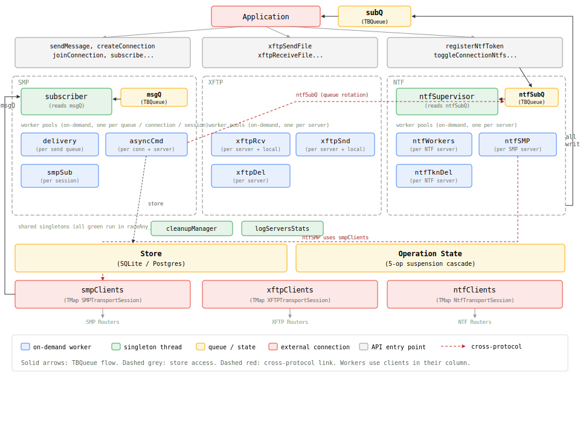
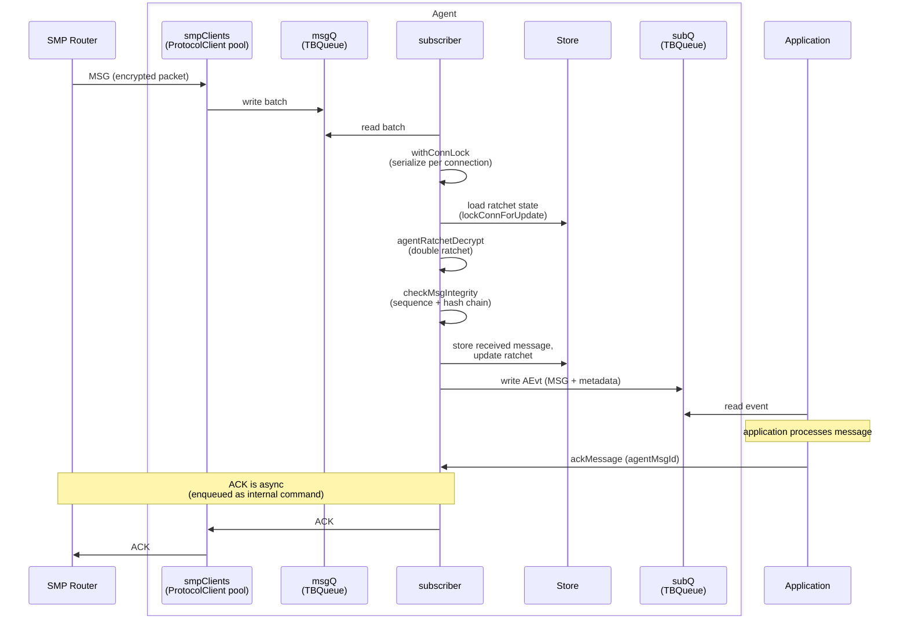
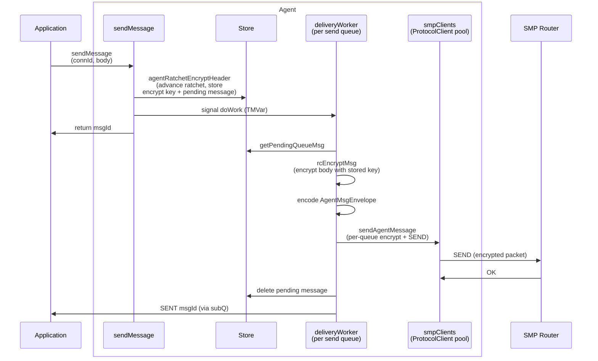
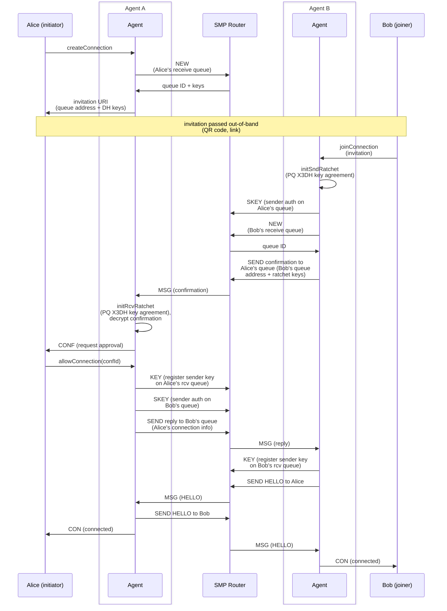
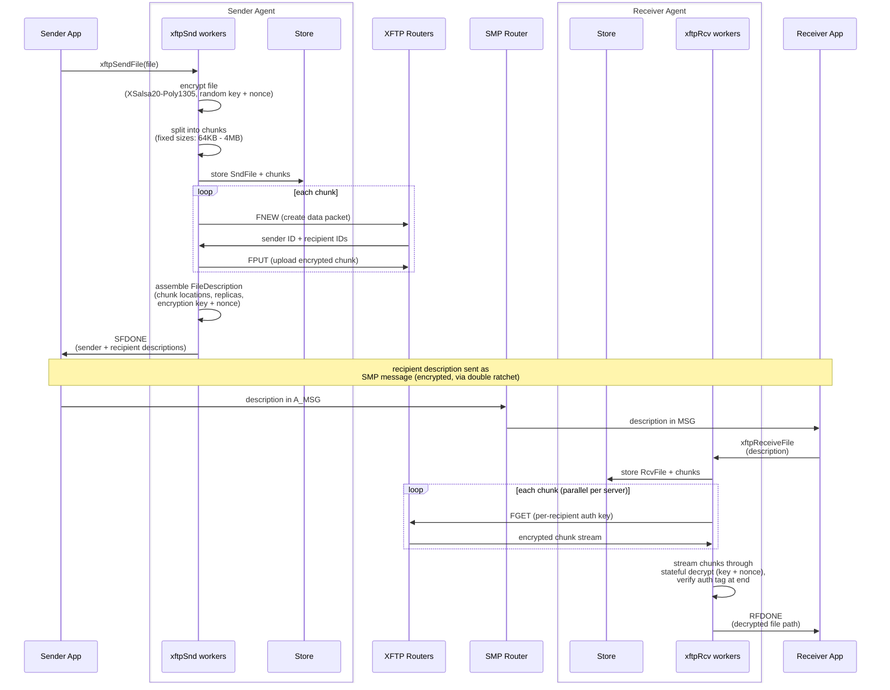

# Agent Architecture

The SimpleX Agent is the Layer 3 connection manager. It builds duplex encrypted connections on top of Layer 2 client libraries. This document shows its internal architecture: component topology and message processing flows.

For usage and API overview, see [docs/AGENT.md](../docs/AGENT.md). For protocol specifications, see [Agent Protocol](../protocol/agent-protocol.md), [PQDR](../protocol/pqdr.md).

**Split-phase encryption**: Message sending separates ratchet advancement (API thread, serialized) from body encryption (delivery worker, parallel). This prevents ratchet lock contention across queues while maintaining correct message ordering. See [infrastructure.md](agent/infrastructure.md#message-delivery).

**Worker taxonomy**: Three worker families handle background operations - delivery workers (per send queue), async command workers (per connection), and NTF workers (per server). All use the same create-or-reuse pattern with restart rate limiting. See [infrastructure.md](agent/infrastructure.md#worker-framework).

**Suspension cascade**: Operations drain in dependency order: `AORcvNetwork` → `AOMsgDelivery` → `AOSndNetwork` → `AODatabase`. Suspending receive processing cascades through to database access, ensuring clean shutdown. See [infrastructure.md](agent/infrastructure.md#operation-suspension-cascade).

---

**Module specs**: [Agent](modules/Simplex/Messaging/Agent.md) · [Agent Client](modules/Simplex/Messaging/Agent/Client.md) · [Agent Protocol](modules/Simplex/Messaging/Agent/Protocol.md) · [Store Interface](modules/Simplex/Messaging/Agent/Store/Interface.md) · [NtfSubSupervisor](modules/Simplex/Messaging/Agent/NtfSubSupervisor.md) · [XFTP Agent](modules/Simplex/FileTransfer/Agent.md) · [Ratchet](modules/Simplex/Messaging/Crypto/Ratchet.md)

### Agent components

### Message receive flow

### Message send flow

### Connection establishment flow

### File delivery flow (XFTP)

