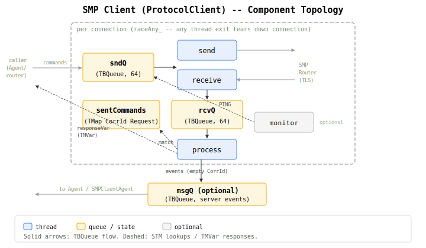
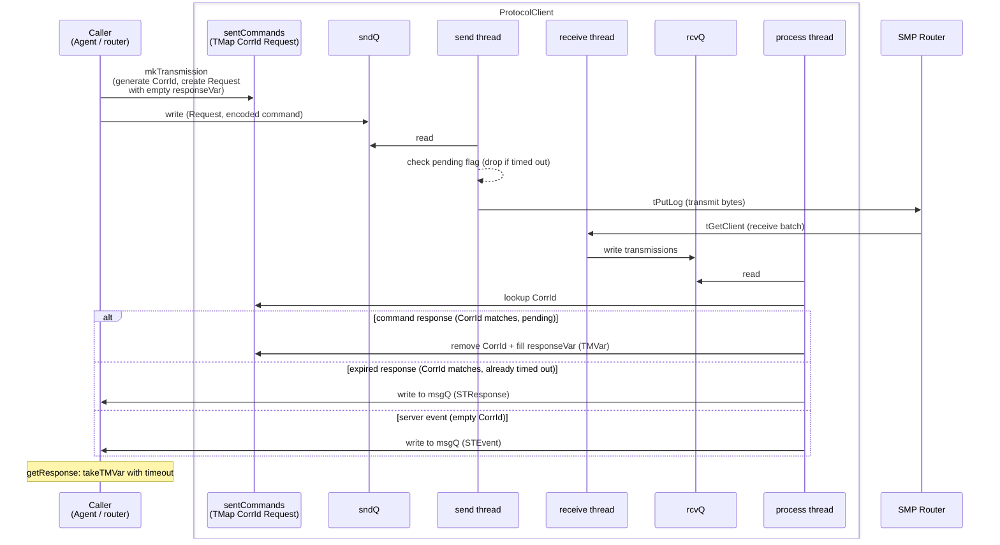
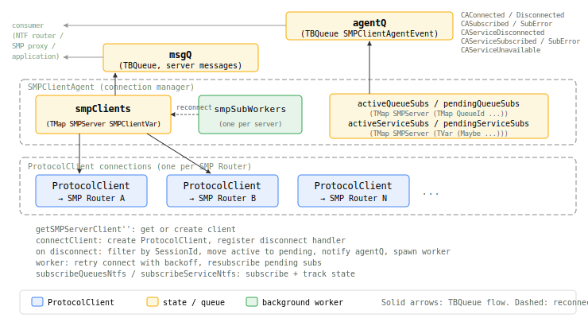
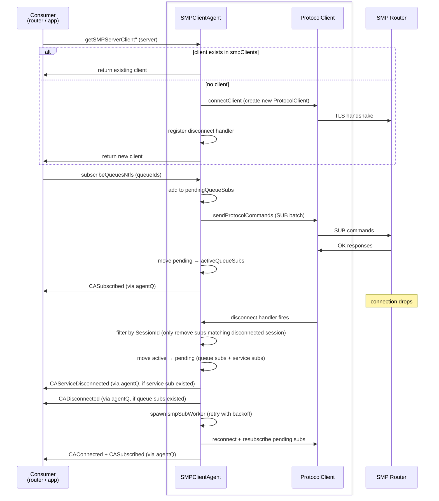
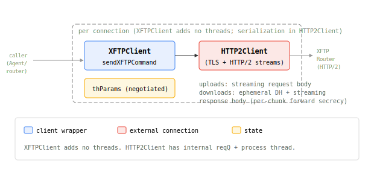
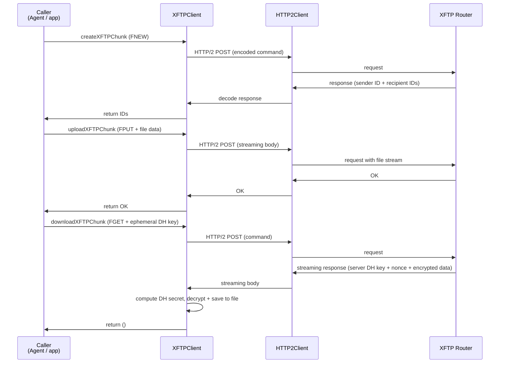

# Client Architecture

SimpleX clients are the Layer 2 libraries that connect to routers. This document shows their internal architecture: component topology and command processing flows.

For deployment and usage, see [docs/CLIENT.md](../docs/CLIENT.md). For protocol specifications, see [SMP](../protocol/simplex-messaging.md), [XFTP](../protocol/xftp.md), [Push Notifications](../protocol/push-notifications.md).

---

## SMP Client (ProtocolClient)

**Four threads**: Send and receive threads are separate to allow backpressure - a slow receiver doesn't block sending. The process thread decouples parsing from delivery, preventing a slow consumer from stalling the receive loop. The monitor thread provides application-level keepalive beyond TCP - detecting protocol-level stalls. See [transport.md](topics/transport.md#connection-management).

**Correlation ID lifecycle**: IDs are generated before send and removed on response OR timeout. Removal on timeout prevents unbounded growth of `sentCommands` when the router is unresponsive.

**Module specs**: [Client](modules/Simplex/Messaging/Client.md) · [Protocol](modules/Simplex/Messaging/Protocol.md) · [Transport](modules/Simplex/Messaging/Transport.md) · [Crypto](modules/Simplex/Messaging/Crypto.md)

Generic protocol client used for both SMP and NTF connections. Manages a single TLS connection with multiplexed command/response matching via correlation IDs.

### SMP Client components



### Command/result flow



---

## SMPClientAgent

**Dual consumers**: Used by both SMP router (for proxy connections to relays) and NTF router (for NSUB subscriptions to SMP routers). Same connection pooling and reconnection logic, different command sets.

**Session ID gating**: Subscription responses are validated against the current TLS session ID. A response from a stale session (connection dropped and reconnected between send and receive) is discarded rather than corrupting state. See [infrastructure.md](agent/infrastructure.md#subscription-tracking).

**Module specs**: [Client Agent](modules/Simplex/Messaging/Client/Agent.md)

Connection manager that multiplexes multiple ProtocolClient connections. Tracks subscriptions, handles reconnection with backoff, and forwards server messages and connection events upward. Used by SMP router (proxying) and NTF router (subscriptions).

### SMPClientAgent components



### Connection lifecycle



---

## XFTP Client

**No subscriptions**: File operations complete independently - no persistent server-side state to track. This allows XFTPClient to be a thin wrapper with no threads of its own.

**Module specs**: [Client](modules/Simplex/FileTransfer/Client.md) · [Protocol](modules/Simplex/FileTransfer/Protocol.md) · [HTTP/2 Client](modules/Simplex/Messaging/Transport/HTTP2/Client.md)

Stateless wrapper around HTTP2Client. XFTPClient adds no threads of its own. Serialization and multiplexing happen inside HTTP2Client's internal request queue and process thread.

### XFTP Client components



### Packet delivery flow



---

## NTF Client

**Module specs**: [Client](modules/Simplex/Messaging/Notifications/Client.md) · [Protocol](modules/Simplex/Messaging/Notifications/Protocol.md)

Type alias for ProtocolClient - same architecture as SMP Client:

```haskell
type NtfClient = ProtocolClient NTFVersion ErrorType NtfResponse
```

Same threads (send, receive, process, monitor), same queues (sndQ, rcvQ, sentCommands, msgQ), same command/response flow. Different command types: TNEW, TVFY, TCHK, TRPL, TDEL, TCRN, SNEW, SCHK, SDEL, PING.
