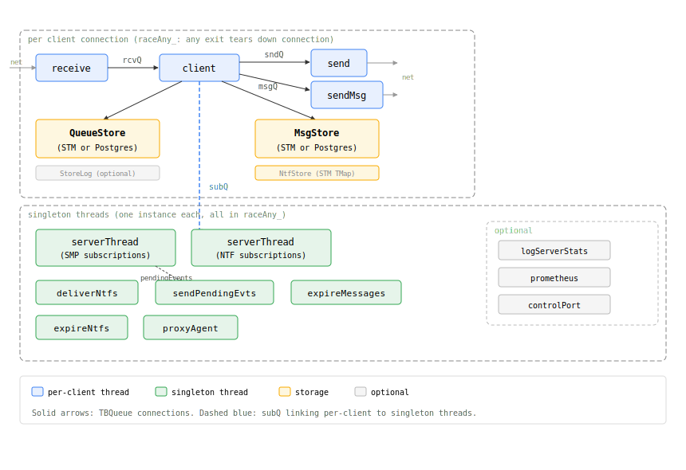
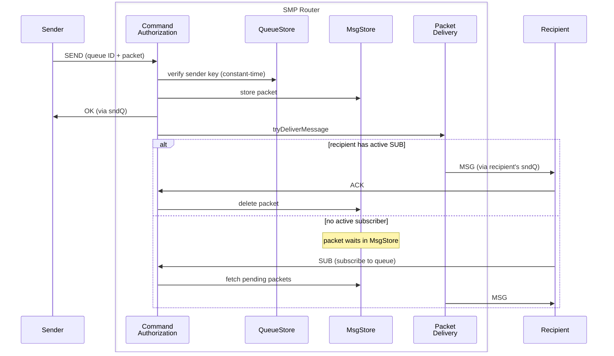
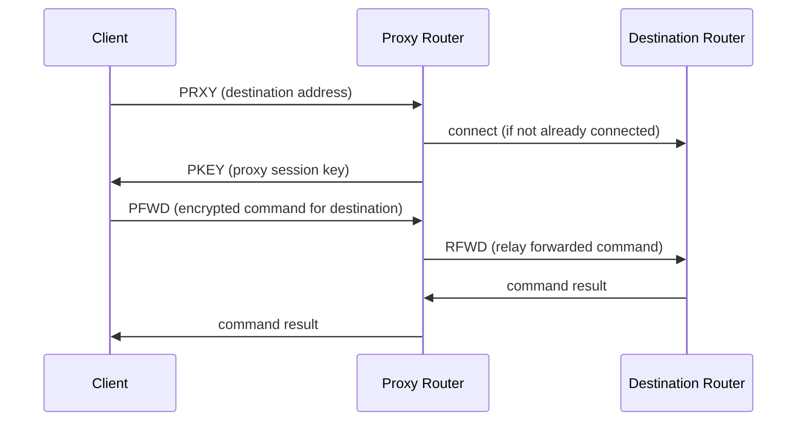
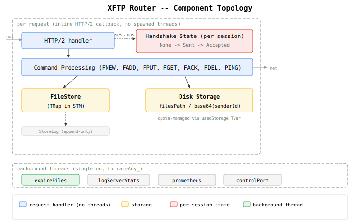
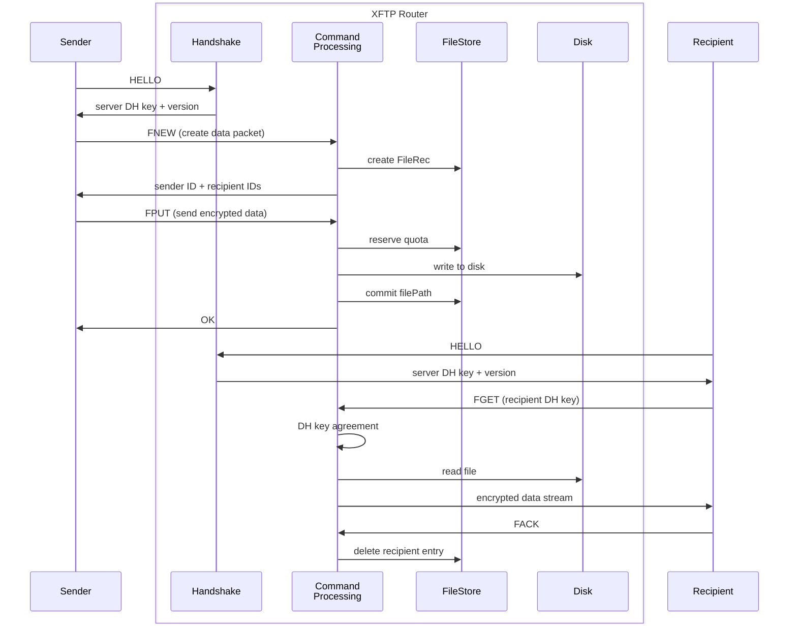
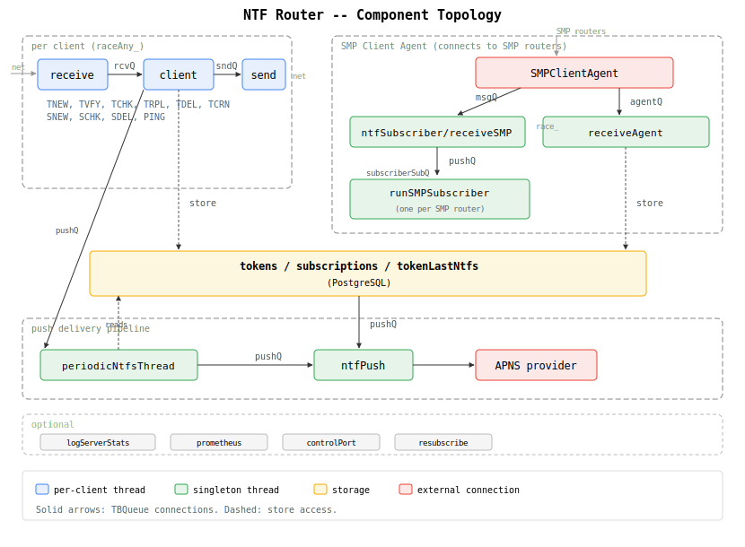
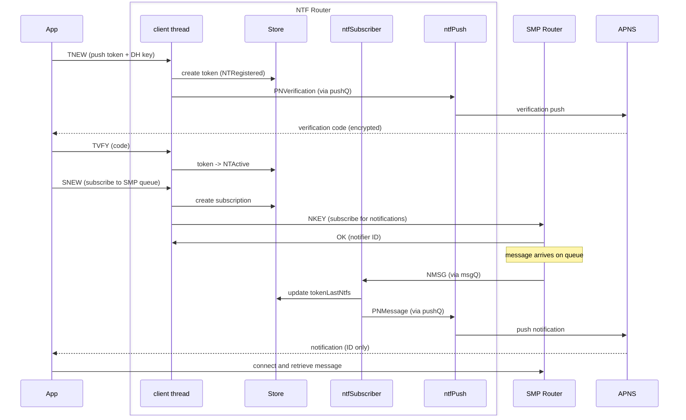

# Router Architecture

SimpleX routers are the Layer 1 network infrastructure. This document shows their internal architecture: component topology and command processing flows.

For deployment and configuration, see [docs/ROUTERS.md](../docs/ROUTERS.md). For protocol specifications, see [SMP](../protocol/simplex-messaging.md), [XFTP](../protocol/xftp.md), [Push Notifications](../protocol/push-notifications.md).

---

## SMP Router

**Thread model**: Client handler threads process commands synchronously, but subscription registration goes through a separate `serverThread` via `subQ`. This split-STM pattern reduces contention - client handlers don't block on the shared `SubscribedClients` map. See [subscriptions.md](topics/subscriptions.md) for details.

**Store separation**: `QueueStore` holds queue metadata and auth keys; `MsgStore` holds message bodies. Different durability tradeoffs - queue metadata needs consistency (Postgres option), message bodies optimize for throughput (STM/Journal options).

**Proxy architecture**: The proxy router maintains an `SMPClientAgent` that pools connections to destination relays - one connection per relay server, shared across all proxy sessions to that relay. Each proxy session gets its own `SessionId` (from the relay's TLS session) and DH keys, but the underlying TCP connection is reused. The proxy is stateless for command forwarding - it doesn't subscribe to queues or maintain transaction state, just relays encrypted commands and responses.

**Module specs**: [Server](modules/Simplex/Messaging/Server.md) · [Main](modules/Simplex/Messaging/Server/Main.md) · [QueueStore](modules/Simplex/Messaging/Server/QueueStore.md) · [QueueStore Postgres](modules/Simplex/Messaging/Server/QueueStore/Postgres.md) · [MsgStore](modules/Simplex/Messaging/Server/MsgStore.md) · [StoreLog](modules/Simplex/Messaging/Server/StoreLog.md) · [Control](modules/Simplex/Messaging/Server/Control.md) · [Prometheus](modules/Simplex/Messaging/Server/Prometheus.md) · [Stats](modules/Simplex/Messaging/Server/Stats.md)

### SMP Router components

### Packet delivery flow

### Proxy forwarding flow

---

## XFTP Router

**Stateless operations**: Unlike SMP, XFTP has no subscriptions or delivery threads. Each command completes independently. This simplifies scaling - no subscription state to synchronize across instances.

**Quota reservation**: File size is reserved atomically on FNEW (before upload), released on deletion or expiration. This prevents overcommit - a client cannot upload more than they reserved.

**Module specs**: [Server](modules/Simplex/FileTransfer/Server.md) · [Main](modules/Simplex/FileTransfer/Server/Main.md) · [Store](modules/Simplex/FileTransfer/Server/Store.md) · [StoreLog](modules/Simplex/FileTransfer/Server/StoreLog.md) · [Stats](modules/Simplex/FileTransfer/Server/Stats.md) · [Transport](modules/Simplex/FileTransfer/Transport.md)

### XFTP Router components

### Data packet delivery flow

---

## NTF Router

**Inverted role**: The NTF router is itself an SMP *client* - it maintains NSUB subscriptions to SMP routers, receiving NMSG events when messages arrive. It doesn't serve queues; it subscribes to them.

**Token batching**: `tokenLastNtfs` aggregates notifications per token before push. Multiple queue notifications for the same device are combined into a single APNs payload, reducing push overhead.

**Module specs**: [Server](modules/Simplex/Messaging/Notifications/Server.md) · [Main](modules/Simplex/Messaging/Notifications/Server/Main.md) · [Store Postgres](modules/Simplex/Messaging/Notifications/Server/Store/Postgres.md) · [APNS](modules/Simplex/Messaging/Notifications/Server/Push/APNS.md) · [Control](modules/Simplex/Messaging/Notifications/Server/Control.md) · [Client](modules/Simplex/Messaging/Notifications/Client.md) · [Protocol](modules/Simplex/Messaging/Notifications/Protocol.md)

### NTF Router components

### Token registration and notification delivery

